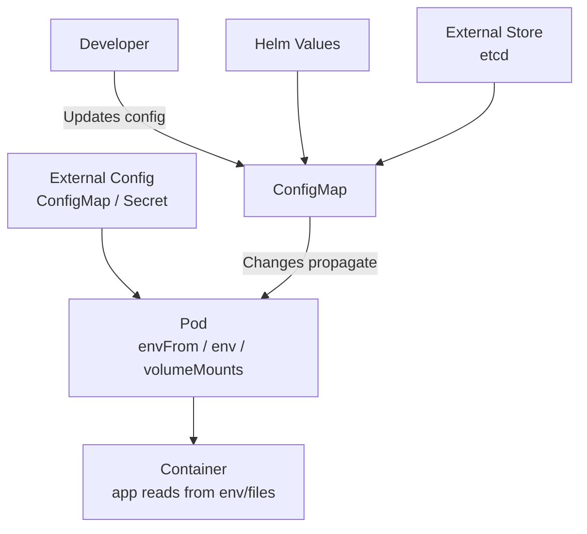

# ConfigMap

> **Category:** Core Concept / Configuration
> **Also known as:** Kubernetes ConfigMap, K8s ConfigMap

## What It Is

A **ConfigMap** is a Kubernetes API object used to **store non-confidential data** in a decoupled way. ConfigMaps allow you to **decouple environment-specific configuration** (like config files, command-line arguments, and environment variables) from container images.

## Why It Exists

Hardcoding configuration in container images is a bad practice:
- Images must be rebuilt and re-pushed for every config change
- No separation of config between environments (dev/staging/prod)
- Config changes trigger new deployments
- Secrets and config mixed in images

ConfigMaps solve this by letting you **manage configuration externally**.

## Architecture



## Creating ConfigMaps

### 1. From Literal Values

```bash
kubectl create configmap game-config --from-literal=GAME_PORT=3000 --from-literal=MAX_PLAYERS=100
```

```yaml
# Resulting YAML
apiVersion: v1
kind: ConfigMap
metadata:
  name: game-config
  namespace: default
data:
  GAME_PORT: "3000"
  MAX_PLAYERS: "100"
```

### 2. From a File

```bash
# Create a config map from a file with --from-file
kubectl create configmap app-config --from-file=./game-constants.txt
```

```yaml
apiVersion: v1
kind: ConfigMap
metadata:
  name: app-config
data:
  game-constants.txt: |-
    enemies=aliens
    lives=3
    enemies=spaceships
```

### 3. From a Directory (key = filename)

```bash
kubectl create configmap app-config --from-file=./config-dir/
```

### 4. From .env Files

```bash
kubectl create configmap app-config --from-env-file=.env
```

## Consuming ConfigMaps

ConfigMaps can be consumed **four ways**:

1. **As environment variables** (single or as `envFrom`)
2. **As command-line arguments** (using `$(VAR)`)
3. **As files in a volume** (mounted as a directory)
4. **Used by the kubelet** (e.g., configuration for kube-proxy)

### As Environment Variables

```yaml
apiVersion: v1
kind: Pod
metadata:
  name: configmap-pod
spec:
  containers:
  - name: app
    image: myapp
    envFrom:
    - configMapRef:
        name: game-config       # All ConfigMap keys become env vars
    env:
    - name: DATABASE_HOST      # Single value
      valueFrom:
        configMapKeyRef:
          name: app-config
          key: DATABASE_HOST
    - name: TIMEOUT
      value: "$(GAME_PORT)"     # Reference other env vars
```

### As Command-Line Args

```yaml
spec:
  containers:
  - name: app
    image: myapp
    command: ["myapp"]
    args: ["--port", "$(GAME_PORT)", "--max-clients", "$(MAX_PLAYERS)"]
```

### As Files (Volume Mount)

```yaml
apiVersion: v1
kind: Pod
metadata:
  name: configmap-volume
spec:
  containers:
  - name: app
    image: myapp
    volumeMounts:
    - name: config-volume
      mountPath: /etc/config
  volumes:
  - name: config-volume
    configMap:
      name: game-config        # Files: /etc/config/GAME_PORT, /etc/config/MAX_PLAYERS
```

### Selective Volume Mounts

```yaml
spec:
  containers:
  - name: app
    volumeMounts:
    - name: config-volume
      mountPath: /etc/game-port
      subPath: GAME_PORT       # Mount only the GAME_PORT key as a file
  volumes:
  - name: config-volume
    configMap:
      name: game-config
      items:
      - key: GAME_PORT          # Only mount this key
        path: game_port.cfg
```

## ConfigMap with Binary Data

```yaml
apiVersion: v1
kind: ConfigMap
metadata:
  name: binary-config
data:
  config.json: |
    { "key": "value" }        # Text data
binaryData:
  logo.png: <base64-encoded>  # Binary data (base64)
```

## Size Limits

| Property | Default Limit |
|----------|---------------|
| Total cluster size | 1 MiB per ConfigMap (default etcd limit) |
| Individual value | No hard limit per-value, but constrained by 1 MiB total |
| Namespace count | 5,000 per namespace (soft limit) |

## Commands

```bash
# Create
kubectl create configmap my-config --from-literal=KEY=VALUE
kubectl create -f configmap.yaml

# Get
kubectl get configmap
kubectl get cm
kubectl get cm my-config -o yaml
kubectl get cm my-config -o jsonpath='{.data}'

# Describe (shows keys and consumers)
kubectl describe cm my-config

# Edit
kubectl edit cm my-config
kubectl patch cm my-config -p '{"data":{"KEY":"new-value"}}'

# Delete
kubectl delete cm my-config
```

## Immutable ConfigMaps (Kubernetes 1.21+)

Immutable configs improve performance (no watch overhead) and prevent accidental changes:

```yaml
apiVersion: v1
kind: ConfigMap
metadata:
  name: immutable-config
data:
  LOG_LEVEL: "debug"
immutable: true      # Once set, CANNOT be changed
```

```bash
# Cannot update an immutable ConfigMap (must delete and recreate)
kubectl get cm immutable-config -o yaml
# immutable: true
# Any patch will fail: "field is immutable"
```

## Configuration Anti-Patterns

### ❌ Hardcoded values in Deployment YAML
```yaml
env:
- name: API_URL        # Bad: hardcoded, not reusable
  value: "https://api.example.com"
```

### ✅ Use ConfigMap
```yaml
env:
- name: API_URL
  valueFrom:
    configMapKeyRef:
      name: app-config
      key: API_URL
```

## Common Issues & Solutions

### ConfigMap not updating in pods

ConfigMaps are **copied into the pod at startup**, not dynamically mounted:

```bash
# To update, you must restart the pod
kubectl rollout restart deploy/<name>
# OR delete and let controller recreate
kubectl delete pod -l app=my-app
```

> **Exception**: When mounted as files, ConfigMaps refresh every ~10 minutes (`refreshCache` for `kubelet`), but your app must poll for changes.

```bash
# Check when a ConfigMap volume was last updated
kubectl get pod <name> -o jsonpath='{.metadata.annotations}'
```

### Wrong data type (numbers vs strings)

```yaml
# ConfigMap stores ALL values as strings
data:
  PORT: "8080"    # ✅ String
  ENABLED: "true" # ✅ String
```

```yaml
# Use stringData for convenience (auto-converted)
stringData:
  PORT: 8080          # ✅ Auto-converted to "8080"
  ENABLED: true       # ✅ Auto-converted to "true"
```

### ConfigMap not mounted as expected

```bash
# Check the mounted path
kubectl exec -it <pod> -- ls /etc/config
# Verify ConfigMap keys vs. files
kubectl get cm <name> -o yaml
```

## Helm & ConfigMap

In Helm, ConfigMaps are great for templating values:

```yaml
# values.yaml
database:
  host: postgres.example.com
  port: 5432
```

```yaml
# templates/configmap.yaml
apiVersion: v1
kind: ConfigMap
metadata:
  name: {{ .Release.Name }}-app-config
data:
  DATABASE_HOST: {{ .Values.database.host | quote }}
  DATABASE_PORT: "{{ .Values.database.port }}"
```

## Best Practices

1. **Use ConfigMaps for non-sensitive config** — strings only, not secrets
2. **Group related config** into a single ConfigMap
3. **Use `envFrom`** when most keys should be environment variables
4. **Refresh configs** by restarting pods (no hot reload)
5. **Watch for size** — keep under 1 MiB
6. **Use immutable** when possible — prevents accidental changes
7. **Version config** with your application (GitOps / Helm values)
8. **Use environment-specific ConfigMaps** — separate per environment (dev/prod)

## Interview Questions

**Q: When should you use a ConfigMap vs Secret?**
A: ConfigMap for non-sensitive data (config), Secret for sensitive data (passwords, tokens). Secrets are base64-encoded and can be stored encrypted at rest in etcd.

**Q: How do containers consume ConfigMap data?**
A: Three ways: (1) Environment variables via `env`/`envFrom`, (2) command-line args with `$(VAR)`, (3) mounted as files in a volume.

**Q: Do ConfigMap changes propagate immediately to running Pods?**
A: No — when consumed as env vars, changes require pod restart. When mounted as files, kubelet updates them within ~10 minutes, but the application must detect and reload.

**Q: How do you mount a ConfigMap as a file?**
A: Define a `volume` of type `configMap` referencing the ConfigMap name, and mount it with `volumeMounts` in the container.

**Q: What is an immutable ConfigMap?**
A: A ConfigMap marked `immutable: true` prevents updates to its data — improves performance, avoids watch overhead. You must delete and recreate to change it.

## Related Resources

- [Secret](secrets.md)
- [Environment Variables](pods.md)
- [Helm](../10-package-management/helm.md)
- [kubectl Cheatsheet](../cheat-sheets/kubectl.md)
