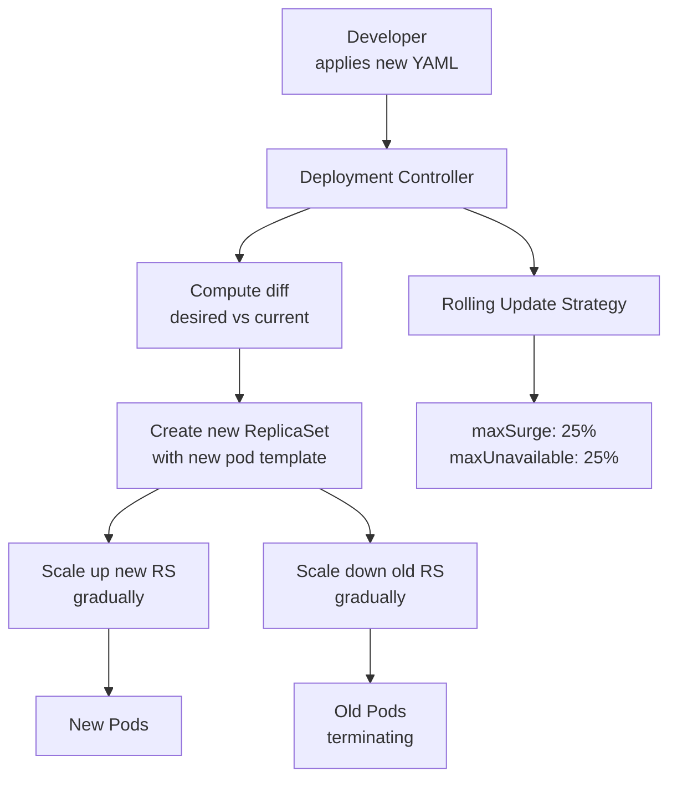

# Deployment

> **Category:** Core Concept / Workload
> **Also known as:** Kubernetes Deployment, Rollout

## What It Is

A **Deployment** is a Kubernetes controller that provides **declarative updates** for Pods and ReplicaSets. You describe the desired state in a Deployment, and the controller changes the actual state to the desired state at a controlled rate.

## Why It Exists

Running Pods directly is risky:
- If a pod dies, nobody restarts it
- Rolling updates cause downtime
- You can't scale easily
- There's no rollback mechanism

Deployments solve this: They manage ReplicaSets, handle rolling updates, enable rollbacks, and provide declarative management.

## Architecture



## Deployment Strategies

| Strategy | Description | Downtime | Use Case |
|----------|-------------|----------|----------|
| **RollingUpdate (default)** | Replace pods one by one | Zero | Standard rolling updates |
| **Recreate** | Delete all old pods, then create new | Yes (brief) | App incompatible with multiple versions |
| **Blue/Green** | Switch traffic between two versions | Zero | Zero-downtime, instant rollback |
| **Canary** | Route small % of traffic to new version | Zero | Gradual rollout, feature flags |

## Key Fields

```yaml
apiVersion: apps/v1
kind: Deployment
metadata:
  name: web-app
spec:
  replicas: 3                    # Number of desired pods
  strategy:
    type: RollingUpdate          # or Recreate
    rollingUpdate:
      maxSurge: 1                # Extra pods during update
      maxUnavailable: 0           # Pods down during update
  selector:
    matchLabels:
      app: web-app               # Must match template labels
  template:                       # Pod template
    metadata:
      labels:
        app: web-app
        version: v1.2
    spec:
      containers:
      - name: web
        image: nginx:1.25
        ports:
        - containerPort: 80
        resources:
          requests:
            memory: "64Mi"
            cpu: "250m"
          limits:
            memory: "128Mi"
            cpu: "500m"
```

## Rolling Update Parameters

| Parameter | Description | Default | Example |
|-----------|-------------|---------|---------|
| **maxSurge** | Max pods above desired count | 25% | `1` (create one extra before killing) |
| **maxUnavailable** | Max pods unavailable during update | 25% | `0` (all old pods stay, new added first) |

### Surge Behavior Examples

| maxSurge | maxUnavailable | Behavior |
|----------|----------------|----------|
| 25% | 25% | Default. Replace 25% at a time. |
| 1 | 0 | Create 1 new pod before killing old (zero-downtime) |
| 0 | 1 | Kill 1 old pod before creating new (brief gap) |
| 100% | 0 | All new pods created before killing old (double capacity temporarily) |

## Deployment Commands

### Basic Operations

```bash
# Create from file
kubectl apply -f deployment.yaml

# Get
kubectl get deployment
kubectl get deploy -o wide
kubectl get deploy -o yaml
kubectl get deploy -o jsonpath='{.items[*].metadata.name}'

# Describe (troubleshooting)
kubectl describe deploy <name>

# Check rollout status
kubectl rollout status deploy/<name>

# Check rollout history
kubectl rollout history deploy/<name>

# Scale
kubectl scale deploy/<name> --replicas=5

# Delete
kubectl delete deploy/<name>

# Export (download as YAML without status)
kubectl get deploy <name> -o yaml --export > my-deploy.yaml
```

### Update & Rollback

```bash
# Update image (imperative)
kubectl set image deploy/<name> <container>=<new-image>

# Patch
kubectl patch deploy <name> -p '{"spec":{"replicas":5}}'

# Rollback
kubectl rollout undo deploy/<name>
kubectl rollout undo deploy/<name> --to-revision=2

# Pause / Resume
kubectl rollout pause deploy/<name>
# edit the deployment
kubectl rollout resume deploy/<name>

# Restart (rolling restart)
kubectl rollout restart deploy/<name>

# Cancel rollout
kubectl rollout undo deploy/<name> --to-revision=<prev-revision>
```

## Deployment YAML Examples

### Recreate Strategy (for breaking changes)

```yaml
spec:
  strategy:
    type: Recreate
  replicas: 3
```

### Zero-Downtime Rolling Update

```yaml
spec:
  strategy:
    type: RollingUpdate
    rollingUpdate:
      maxSurge: 1
      maxUnavailable: 0
```

### Deployment with Health Checks

```yaml
spec:
  template:
    spec:
      containers:
      - name: web
        image: nginx:1.25
        readinessProbe:
          httpGet:
            path: /ready
            port: 8080
          initialDelaySeconds: 5
          periodSeconds: 10
        livenessProbe:
          httpGet:
            path: /health
            port: 8080
          initialDelaySeconds: 30
          periodSeconds: 30
```

### Using `kubectl apply` for Updates

```bash
# The recommended way to update deployments
# 1. Edit the YAML file
kubectl apply -f deployment.yaml  # applies diff, rolling update
kubectl rollout status deploy/<name>  # watch rollout
kubectl rollout history deploy/<name>  # see revisions
```

## Common Issues & Solutions

### Pods stuck in "pending" state
```bash
kubectl get pods -o wide
kubectl describe pod <pending-pod>
# Check: enough resources, node selectors match, taints/tolerations
```

### CrashLoopBackOff
```bash
kubectl describe pod <name>
kubectl logs <name>
kubectl logs --previous <name>  # previous container logs
```

### ImagePullBackOff
```bash
kubectl describe pod <name>  # check Events section
# Ensure image exists and is accessible
# For private registries: create docker-registry secret
kubectl create secret docker-registry regcred \
  --docker-server=https://index.docker.io/v1/ \
  --docker-username=<username> \
  --docker-password=<password>
# Reference in pod spec:
# imagePullSecrets:
# - name: regcred
```

### Stuck rollout
```bash
kubectl rollout status deploy/<name>  # check status
kubectl rollout undo deploy/<name>  # rollback
kubectl describe deploy/<name>  # check for errors
```

### Rollback to previous revision
```bash
kubectl rollout history deploy/<name>
kubectl rollout undo deploy/<name> --to-revision=<revision-number>
```

## When to Use Deployments

| Scenario | Use Deployment |
|----------|----------------|
| Stateless web apps | ✅ |
| API backends | ✅ |
| Frontend SPAs | ✅ |
| Stateful apps (DBs) | ❌ Use StatefulSet |
| Node-level agents | ❌ Use DaemonSet |
| One-off batch jobs | ❌ Use Job/CronJob |
| Breaking version changes | Use `recreate` strategy |

## Best Practices

1. **Use RollingUpdate** — default strategy, zero downtime
2. **Set maxSurge/maxUnavailable** — use `maxSurge: 1, maxUnavailable: 0` for critical services
3. **Resource limits** — always set CPU/memory requests and limits
4. **Health checks** — configure liveness and readiness probes
5. **Avoid `latest` tag** — always use explicit tags for predictability
6. **Use labels and selectors** — make resources discoverable
7. **Namespace-scoped** — deployments are created within namespaces
8. **Set revision history limit** — to limit old ReplicaSets stored

```yaml
spec:
  revisionHistoryLimit: 10  # Keep last 10 ReplicaSets
  progressDeadlineSeconds: 600  # 10 min before progress deadline
```

9. **Use Deployment hooks** — lifecycle hooks for pre/post deployment tasks

## Difference: Deployment vs ReplicaSet vs Pod

| Resource | Manages | Updates | Use Case |
|----------|---------|---------|----------|
| **Pod** | Single instance | Manual | One-off tasks, debugging |
| **ReplicaSet** | Multiple pod copies | No | Usually managed by Deployment |
| **Deployment** | ReplicaSets (and pods) | Rolling update | Production stateless apps |

## Interview Questions

**Q: What is the difference between a ReplicaSet and a Deployment?**
A: A Deployment manages ReplicaSets (creating, scaling, updating, deleting them), while a ReplicaSet directly ensures a specified number of pod replicas. Deployments add rollouts, rollbacks, and update strategies on top.

**Q: How do you perform a rolling update?**
A: Update the pod template in the Deployment; the Deployment controller rolls out the change with zero downtime using maxSurge and maxUnavailable.

**Q: How do you rollback a deployment?**
A: Use `kubectl rollout undo deployment/<name>`. You can target a specific revision with `--to-revision`.

**Q: What are Deployment strategies?**
A: RollingUpdate (default, zero-downtime) and Recreate (brief downtime, needed for breaking schema changes).

## Related Resources

- [ReplicaSet](replicasets.md)
- [StatefulSet](../03-workloads/statefulsets.md)
- [Deployment Strategies](../03-workloads/deployment-strategies.md)
- [kubectl Cheatsheet](../cheat-sheets/kubectl.md)
- [Pod](pods.md)
