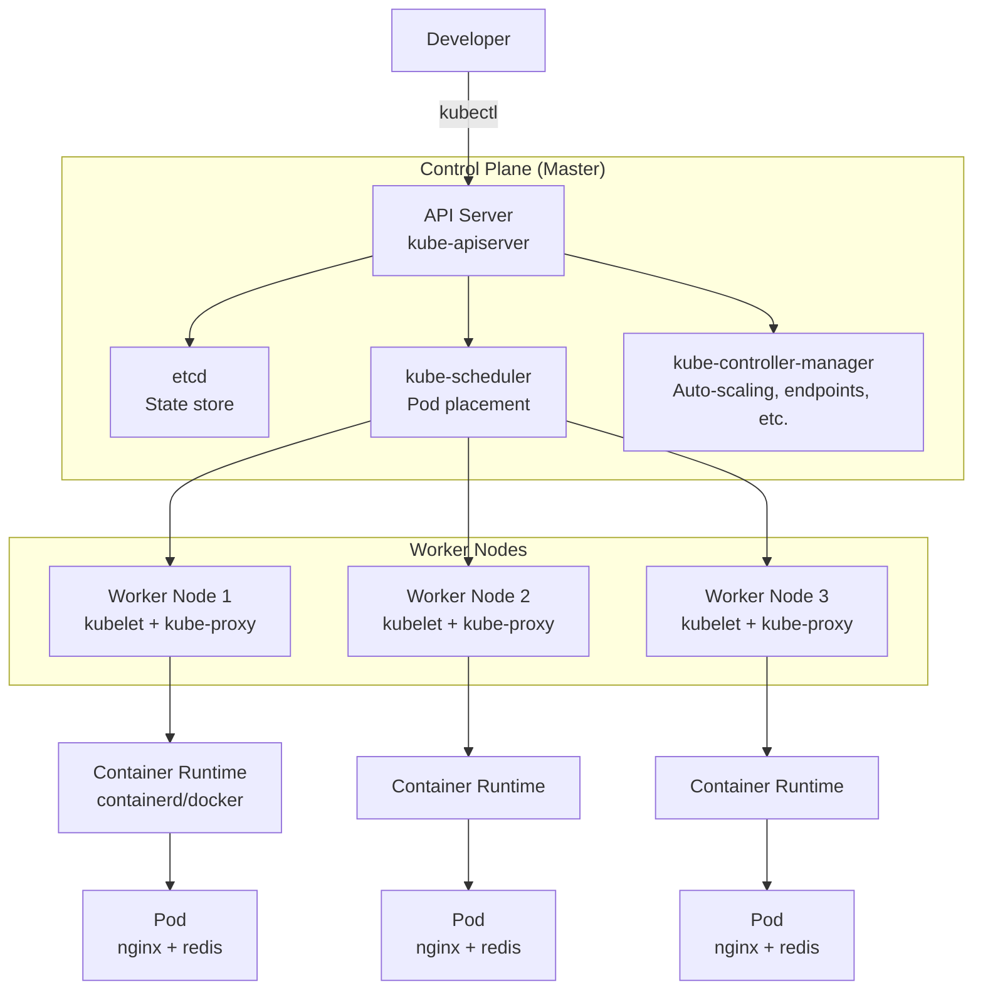

# Kubernetes

> **Category:** Core Concept
> **Also known as:** K8s, Container Orchestration Platform

## What It Is

**Kubernetes** (Greek for "helmsman" or "pilot", abbreviated as **K8s**) is an open-source **platform for automating deployment, scaling, and operations of containerized applications** across a cluster of hosts. It was originally designed by Google and is now maintained by the Cloud Native Computing Foundation (CNCF).

## Why It Exists

Before Kubernetes, running containers in production required manually managing:
- **Container placement** across machines
- **Failover** when machines died
- **Scaling** up/down based on traffic
- **Rolling updates** without downtime
- **Service discovery** between microservices
- **Networking** and **storage** for each container

Kubernetes abstracts all this complexity into a declarative API where you describe **what** you want (the desired state), and the system makes the actual state match.

## Architecture Overview



## Key Concepts

### Declarative vs Imperative

| Approach | Mode | Example |
|----------|------|---------|
| **Declarative** | Desired state | `kubectl apply -f app.yaml` |
| **Imperative** | Instructions | `kubectl run nginx --image=nginx` |

### Core Abstractions

| Abstraction | Description |
|-------------|-------------|
| **Cluster** | Pool of machines running containerized workloads |
| **Node** | A single VM or physical machine |
| **Pod** | Smallest deployable unit (one or more containers) |
| **Service** | Stable network endpoint for a set of pods |
| **Namespace** | Virtual cluster for isolation |
| **Deployment** | Declarative workload for stateless apps |
| **StatefulSet** | Workload for stateful apps (databases, queues) |

## Why Kubernetes Works

1. **Self-healing** — failed pods are restarted or rescheduled
2. **Auto-scaling** — pods scale based on CPU/memory/custom metrics
3. **Load balancing** — traffic distributed across healthy pods
4. **Rollouts & rollbacks** — update strategies with zero downtime
5. **Service discovery & networking** — DNS-based discovery
6. **Storage orchestration** — mount local, cloud, or distributed storage
7. **Multi-cloud** — portable across on-premises, AWS, GCP, Azure
8. **Extensibility** — CRDs and Operators for custom resources

## Kubernetes API (kubectl)

Every Kubernetes object is created via the Kubernetes API server.
You can interact with this API in three ways:

| Method | Example |
|--------|---------|
| **kubectl** | `kubectl get pods` |
| **REST API** | `curl http://api-server:6443/api/v1/pods` |
| **Client libraries** | `import client-go; client.CoreV1().Pods(...)` |

## Code Example

### Deploying Your First App

```yaml
# nginx-deployment.yaml
apiVersion: apps/v1
kind: Deployment
metadata:
  name: nginx-deployment
  labels:
    app: nginx
spec:
  replicas: 3
  selector:
    matchLabels:
      app: nginx
  template:
    metadata:
      labels:
        app: nginx
    spec:
      containers:
      - name: nginx
        image: nginx:1.25
        ports:
        - containerPort: 80
```

```yaml
# nginx-service.yaml
apiVersion: v1
kind: Service
metadata:
  name: nginx-service
spec:
  selector:
    app: nginx
  ports:
  - port: 80
    targetPort: 80
  type: LoadBalancer
```

```bash
# Deploy
kubectl apply -f nginx-deployment.yaml
kubectl apply -f nginx-service.yaml

# Verify
kubectl get pods            # See the pods
kubectl get deployment      # See the deployment
kubectl get service         # Get service details and external IP

# Scale
kubectl scale deployment/nginx-deployment --replicas=5

# Cleanup
kubectl delete -f nginx-deployment.yaml
kubectl delete -f nginx-service.yaml
```

## Kubernetes Release Cycle

| Milestone | Frequency |
|-----------|-----------|
| New minor release (e.g., v1.31) | Every ~14 weeks |
| Patch releases (e.g., v1.31.1) | Every few weeks |
| Kubernetes version support | ~14 months (3 release cycles) |

## Best Practices

### 1. Start Small
- Begin with a single-namespace cluster
- Add services gradually
- Monitor and iterate

### 2. Use Declarative YAML
- Version-control all manifests
- Use `kubectl apply` for idempotency
- Separate configuration from code (Helm/Kustomize)

### 3. Resource Management
- Always set CPU/memory requests and limits
- Use namespaces for multi-tenant isolation
- Use resource quotas and limit ranges

### 4. Security
- Enable RBAC
- Run containers as non-root
- Use network policies
- Encrypt secrets at rest

### 5. Observability
- Deploy Prometheus + Grafana
- Centralize logging (EFK/Loki)
- Set up health checks (liveness/readiness)

## Common Mistakes

| Mistake | Solution |
|---------|----------|
| No resource limits | Set requests and limits |
| Running as root | Set `securityContext.runAsNonRoot: true` |
| No health checks | Configure liveness/readiness probes |
| No namespace isolation | Create namespaces with policies |
| Hardcoding config | Use ConfigMaps and Secrets |

## Related Concepts

- [Pod](pods.md)
- [Architecture](../02-architecture/architecture.md)
- [kubectl](../cheat-sheets/kubectl.md)
- [Workloads](../03-workloads/)
- [Security](../06-security/)
- [Kubernetes Architecture](../02-architecture/architecture.md)

## Further Reading

- [Official Kubernetes Documentation](https://kubernetes.io/docs/home/)
- [Kubernetes GitHub](https://github.com/kubernetes/kubernetes)
- [CNCF](https://www.cncf.io/)
- [Kubernetes Best Practices](../15-advanced-patterns/gitops.md)
