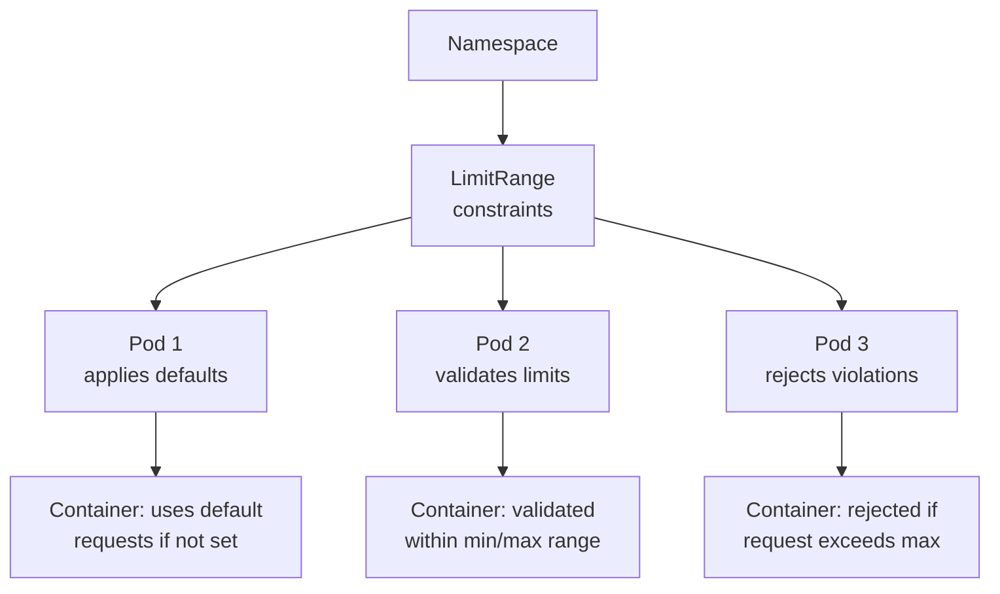

# LimitRange

> **Category:** Core Concept / Resource Management

## What It is

A **LimitRange** defines **default and limit** resource consumption for **objects in a namespace**. It enforces constraints on CPU, memory, and storage that individual containers can request and use — preventing containers from requesting too few or too many resources.

## Why It Exists

When pods are created without explicit resource settings:
- Containers can consume unlimited resources (starving others / crashing node)
- Pods get evicted due to OOM or CPU throttling
- No defaults = inconsistent resource usage across teams

LimitRanges provide:
- Default resource requests/limits (for containers without explicit settings)
- Minimum/maximum enforced bounds (for containers that do set requests)
- Protection against "fat-finger" configs

## Architecture



## LimitRange Spec

```yaml
apiVersion: v1
kind: LimitRange
metadata:
  name: resource-limits
  namespace: development
spec:
  limits:
  - type: Container                # Container-level limits
    defaultRequest:                # Applied if not set in Pod
      cpu: "100m"
      memory: "128Mi"
    default:                       # Applied if not set in Pod
      cpu: "250m"
      memory: "256Mi"
    max:                           # Maximum allowed
      cpu: "2"
      memory: "2Gi"
    min:                           # Minimum allowed
      cpu: "50m"
      memory: "64Mi"
    maxLimitRequestRatio:          # Limit/Request ratio (max limit / max request)
      cpu: "4"
      memory: "4"
  - type: PersistentVolumeClaim
    max:
      storage: 100Gi
    min:
      storage: 1Gi
  - type: Pod                      # Pod-level totals
    max:
      containers: "10"
      requests.cpu: "4"
      requests.memory: 4Gi
    min:
      requests.cpu: "50m"
      requests.memory: 64Mi
  - type: Service
    max:
      services.loadbalancers: "2"
```

## LimitRange Types

| Type | Description | Example Limits |
|------|-------------|----------------|
| **Container** | Individual container resource limits | CPU: 100m-2, memory: 128Mi-2Gi |
| **Pod** | Aggregate across all containers in a pod | Total CPU limit, container count |
| **PersistentVolumeClaim** | Storage request limits | Min: 1Gi, max: 100Gi |
| **Service** | LoadBalancer/NodePort counts | Max 2 LB services |
| **Pod** | Max containers in a pod | max.containers: 10 |

## How Defaults Work

When a container is created **without** `resources.requests` or `resources.limits`:

1. If a LimitRange has `defaultRequest`: fills in `requests` — **not** `limits`
2. If a LimitRange has `default`: fills in `limits`

```yaml
# Your Pod (no resources set)
spec:
  containers:
  - name: app
    image: nginx
    # no resources: ... block here!

# LimitRange applies:
#   requests: cpu=100m, memory=128Mi  ← from defaultRequest
#   limits: cpu=250m, memory=256Mi    ← from default
```

## Commands

```bash
# Create
kubectl create limitrange limits \
  --limits=cpu=100m,memory=128Mi \
  --messages="Resource limits exceeded" \
  --namespace=development

kubectl apply -f limitrange.yaml

# Get
kubectl get limitrange
kubectl get limitrange -n development -o yaml
kubectl describe limitrange limits -n development

# Delete
kubectl delete limitrange limits -n development
```

## Common Issues & Solutions

### Pod uses default limits unexpectedly
```bash
# Check LimitRange
kubectl describe limitrange <name> -n <ns>
# View resolved resources (with defaults applied)
kubectl get pod <name> -n <ns> -o yaml | grep -A 6 resources:
```

### Pod rejected due to max
```bash
kubectl describe pod <name> -n <ns>
# Look for "exceeded limit range" in events
# Solution: reduce the resource request, or increase the max in LimitRange
kubectl edit limitrange <name> -n <ns>
```

### Container has no resource requests
```bash
# If LimitRange has defaultRequest, a QoS of "Burstable" is applied
# If no LimitRange, container is "BestEffort" (least resilient)
kubectl get pod <name> -o jsonpath='{.status.qosClass}'
```

### PVC rejected by LimitRange
```bash
kubectl describe quota <name>    # also check for PVCP LimitRange
# If PVC storage exceeds LimitRange max, it's rejected
```

## Example: Production Namespace Limits

```yaml
apiVersion: v1
kind: LimitRange
metadata:
  name: prod-limits
  namespace: production
spec:
  limits:
  # Default resources for containers without explicit settings
  - type: Container
    defaultRequest:
      cpu: "100m"
      memory: "128Mi"
    default:
      cpu: "500m"
      memory: "512Mi"
    max:
      cpu: "8"
      memory: "8Gi"
    min:
      cpu: "50m"
      memory: "64Mi"
  # Limit pods per container count
  - type: Pod
    max:
      containers: "20"
      requests.cpu: "16"
      requests.memory: 32Gi
  # Limit PVC size
  - type: PersistentVolumeClaim
    max:
      storage: 500Gi
    min:
      storage: 1Gi
```

## Best Practices

1. **Set `defaultRequest` for every namespace** — so containers get Burstable QoS, not BestEffort
2. **Set reasonable `max` values** — prevents "fat" containers from breaking the cluster
3. **Use `min` limits** — prevents accidentally under-requesting resources
4. **Limit PVC storage** — cap at realistic values
5. **Don't over-constrain** — set limits that match your cluster capacity
6. **Review limits regularly** — adjust based on actual usage
7. **Use `defaultLimitRequestRatio`** — control overcommit ratio

## Difference: LimitRange vs ResourceQuota

| Feature | LimitRange | ResourceQuota |
|---------|------------|---------------|
| **Scope** | Per-container, per-object | Per-namespace aggregate |
| **Enforced on** | Each resource request | Total namespace usage |
| **Default values** | ✅ Yes (`defaultRequest`, `default`) | ❌ No |
| **Max bounds per request** | ✅ Yes (`max`, `min`) | ❌ No (only total) |
| **Object counts** | ✅ Some (`max.containers` per pod) | ✅ Full count support |

## Interview Questions

**Q: What does a LimitRange do?**
A: A LimitRange sets default resource requests/limits and enforces minimum/maximum resource consumption bounds for containers in a namespace.

**Q: If a Pod doesn't specify `resources`, but a LimitRange exists, what QoS class is it?**
A: **Burstable** — because the LimitRange provides default requests. (Without LimitRange, it would be **BestEffort**.)

**Q: What are the three QoS classes, and how are they determined?**
A: **Guaranteed** (all requests==limits), **Burstable** (some request != limit), **BestEffort** (no requests/limits). QoS determines eviction order.

**Q: How does LimitRange differ from ResourceQuota?**
A: LimitRange constrains **individual resources** (per-container/per-Pod), while ResourceQuota constrains **aggregate namespace usage** (total CPUs, total pods).

## Related Resources

- [ResourceQuota](resource-quotas.md)
- [Resource Requests & Limits](resource-quotas.md)
- [Namespace](namespaces.md)
- [Pod](pods.md)
- [kubectl Cheatsheet](../cheat-sheets/kubectl.md)
