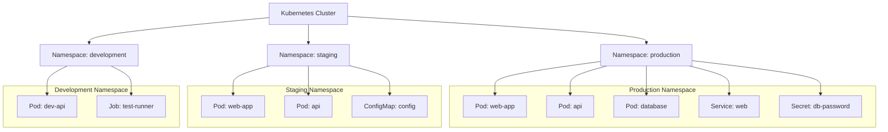

# Namespace

> **Category:** Core Concept / Isolation
> **Interview Focus:** Core Concepts

## What It Is

A **Namespace** is a logical partition of a Kubernetes cluster, used to **isolate resources** among users, teams, environments, or projects within the same physical cluster. All objects (except certain cluster-scoped resources like Nodes and Namespaces themselves) are namespaced.

## Why It Exists

Without namespaces:
- All teams share the same resource pool with no isolation
- Resource consumption is unbounded
- RBAC rules apply cluster-wide with no scoping
- Naming conflicts across teams
- NetworkPolicies and ResourceQuotas are hard to scope

Namespaces provide **soft multi-tenancy** — you can logically separate teams and control resource consumption.

## Architecture Diagram



## What's Namespaced vs Cluster-Scoped

| Resource | Scope | Notes |
|----------|-------|-------|
| Pods | Namespaced | Must be in a namespace |
| Services | Namespaced | — |
| ConfigMaps | Namespaced | — |
| Secrets | Namespaced | — |
| Deployments, StatefulSets, DaemonSets | Namespaced | — |
| Jobs, CronJobs | Namespaced | — |
| Namespaces | **Cluster-scoped** | Namespace itself |
| Nodes | **Cluster-scoped** | Node objects |
| PersistentVolumes | **Cluster-scoped** | PV is cluster-wide |
| StorageClasses | **Cluster-scoped** | — |
| ClusterRoles, ClusterRoleBindings | **Cluster-scoped** | Apply to all namespaces |
| ResourceQuotas | Namespaced | Per-namespace limits |
| NetworkPolicies | Namespaced | Per-namespace rules |
| ServiceAccounts | Namespaced | — |
| CustomResourceDefinitions | **Cluster-scoped** | Defines new cluster-wide types |

## Creating Namespaces

### Declarative (YAML)

```yaml
apiVersion: v1
kind: Namespace
metadata:
  name: production
  labels:
    environment: production
    team: backend
  annotations:
    owner: "team-backend"
```

```bash
kubectl apply -f namespace.yaml
```

### Imperative

```bash
kubectl create namespace production
```

### With Labels for Multi-Tenancy

```yaml
apiVersion: v1
kind: Namespace
metadata:
  name: team-a-dev
  labels:
    kubernetes.io/metadata.name: team-a-dev
    environment: development
    owner: team-a
```

## Namespace-based Features

### Resource Quotas

Limit resources consumed by a namespace:

```yaml
apiVersion: v1
kind: ResourceQuota
metadata:
  name: compute-quota
  namespace: development
spec:
  hard:
    requests.cpu: "1"      # 1 CPU core minimum requested
    requests.memory: 1Gi
    limits.cpu: "2"        # 2 CPU cores max limit
    limits.memory: 2Gi
    pods: "10"
    services.loadbalancers: "1"
    persistentvolumeclaims: "4"
```

### Limit Ranges

Set default resource requests/limits for objects without them:

```yaml
apiVersion: v1
kind: LimitRange
metadata:
  name: resource-limits
  namespace: development
spec:
  limits:
  - type: Container
    defaultRequest:
      cpu: 100m
      memory: 128Mi
    default:
      cpu: 250m
      memory: 256Mi
```

### Network Policies (per namespace)

```yaml
apiVersion: networking.k8s.io/v1
kind: NetworkPolicy
metadata:
  name: deny-all-egress
  namespace: production
spec:
  podSelector: {}       # Apply to all pods in namespace
  policyTypes:
  - Egress             # Block all egress traffic
```

## Working with Namespaces

### Commands

```bash
# List namespaces
kubectl get namespaces
kubectl get ns

# Create
kubectl create namespace team-a-production
kubectl create namespace -f namespace.yaml

# Set namespace for all commands (current context)
kubectl config set-context --current --namespace=production
kubectl config view --minify  # verify current namespace

# Describe a namespace
kubectl describe ns production

# Delete a namespace
kubectl delete ns production

# Get resources in a namespace
kubectl get pods --namespace=production
kubectl get deploy -n production -o wide  # -n is shorthand

# Get resources across all namespaces
kubectl get pods --all-namespaces
kubectl get all -A  # -A is shorthand for --all-namespaces
```

### Switching Context

```bash
# Create a context bound to a namespace
kubectl config set-context dev --namespace=development \
  --cluster=my-cluster --user=my-user

# Switch to the context
kubectl config use-context dev

# Verify the active namespace
kubectl config view --minify | grep namespace
# OR
kubectl config view --minify -o jsonpath='{..namespace}'
```

## Default Namespace

The default namespace is used when no namespace is specified:

```bash
kubectl get pods  # Uses default namespace
kubectl get pods -n default  # Explicitly select default
```

## Kubernetes System Namespaces

| Namespace | Purpose |
|-----------|---------|
| `kube-system` | Core system pods (kube-apiserver, etcd, kube-controller-manager, CoreDNS, kube-proxy) |
| `kube-public` | Publicly readable resources (e.g., `cluster-info`) |
| `kube-node-lease` | Node heartbeat leases (K8s 1.13+) |
| `default` | Default namespace for user-created objects |

```bash
kubectl get pods -n kube-system     # View control-plane components
kubectl get ns                      # List all namespaces
```

## Namespace-based RBAC

Namespaces limit the scope of RBAC:

```yaml
# Role (namespaced) — only applies within a namespace
apiVersion: rbac.authorization.k8s.io/v1
kind: Role
metadata:
  namespace: production    # Scoped to production namespace
  name: pod-reader
rules:
- apiGroups: [""]
  resources: ["pods"]
  verbs: ["get", "watch", "list"]
```

```yaml
# RoleBinding (namespaced) — binds Role within the namespace
apiVersion: rbac.authorization.k8s.io/v1
kind: RoleBinding
metadata:
  name: read-pods
  namespace: production    # Applies to production
subjects:
- kind: User
  name: jane              # Bind to user jane in production only
  apiGroup: rbac.authorization.k8s.io
roleRef:
  kind: Role              # This is a Role, not a ClusterRole
  name: pod-reader
  apiGroup: rbac.authorization.k8s.io
```

## Pod Isolation by Namespace

Services resolve within their namespace by default:

```
# A pod in the "backend" namespace can reach a service named "database" in the same namespace:
postgres.backend.svc.cluster.local
```

For cross-namespace access:

```
postgres.production.svc.cluster.local
```

## Common Issues & Solutions

### Pods can't find each other (across namespaces)
```bash
# If a pod in "team-a" needs a service in "team-b":
kubectl get svc -n team-b
# Use full DNS name:
# <service>.<namespace>.svc.cluster.local
```

### ResourceQuota exhausted
```bash
kubectl describe quota -n development
# If at limit, delete unused resources or request quota increase
kubectl delete pod <old-pod>
kubectl edit quota <quota-name> -n development
```

### Namespace stuck in "Terminating"
```bash
# Caused by finalizers on resources
kubectl get namespace <name> -o json
# Manually remove finalizers:
kubectl patch namespace <name> -p '{"metadata":{"finalizers":[]}}' --type=merge
```

### User can't see resources in namespace
```bash
kubectl auth can-i get pods --as=jane -n production
# Returns yes/no
# If "no", check Role/RoleBinding
kubectl get role role-name -n production -o yaml
kubectl get rolebinding rolebinding-name -n production -o yaml
```

### No resources found across all namespaces
```bash
kubectl get all -A   # Use -A flag
# OR
kubectl get pods --all-namespaces
```

## Best Practices

1. **Use namespaces for isolation** — separate teams, environments, or projects
2. **Always specify a namespace** — set context default or use `-n`
3. **Apply ResourceQuotas** — prevent one namespace from consuming all resources
4. **Use LimitRanges** — set defaults so namespaces don't accidentally over-consume
5. **Enforce NetworkPolicies** — isolate traffic per namespace
6. **RBAC per namespace** — use Roles (not ClusterRoles) unless you need cluster-wide access
7. **DNS resolution works within and across namespaces** — use FQDN for cross-namespace

## Interview Questions

**Q: What is a namespace used for?**
A: A namespace provides logical isolation within a shared cluster, allowing you to isolate teams, environments (dev/staging/prod), and apply resource quotas and RBAC scoped to that namespace.

**Q: What is the default namespace?**
A: The `default` namespace is used when no namespace is specified. All objects created without a namespace go to `default`.

**Q: What resources are NOT namespaced?**
A: Nodes, PersistentVolumes, StorageClasses, Namespaces themselves, ClusterRoles, ClusterRoleBindings, and CustomResourceDefinitions are cluster-scoped (not namespaced).

**Q: How do you switch namespaces for all subsequent commands?**
A: `kubectl config set-context --current --namespace=production`

**Q: Do namespaces provide network isolation by default?**
A: No. Namespaces provide **logical** isolation for resource management and RBAC, but **not** network isolation. You need NetworkPolicies for that.

## Related Resources

- [Resource Quotas](resource-quotas.md)
- [Limit Ranges](limit-ranges.md)
- [Network Policies](../04-networking/network-policies.md)
- [RBAC](../06-security/rbac.md)
- [kubectl Cheatsheet](../cheat-sheets/kubectl.md)
