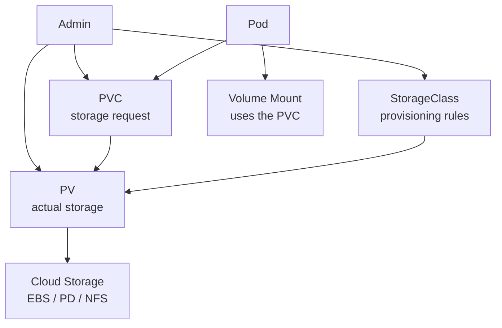
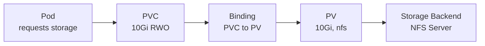

# PersistentVolume (PV) & PersistentVolumeClaim (PVC)

> **Category:** Core Concept / Storage
> **Also known as:** PV, PVC, Storage

## What It Is

**PersistentVolume (PV)** and **PersistentVolumeClaim (PVC)** are Kubernetes abstractions for **persistent storage** that decouples storage provisioning from pods.

- **PV**: A piece of storage (network storage like NFS, AWS EBS, GCP PD) provisioned by an administrator or dynamically by a StorageClass.
- **PVC**: A *request* for storage by a user — describes the size, access mode, and storage class needed.

## Why It Exists

Directly managing cloud storage in Pods is brittle:
- Pod YAML is tightly coupled to specific storage endpoints
- Cannot reuse storage across Pods easily
- No abstraction for dynamic provisioning
- Access control and lifecycle hard to manage

PVs and PVCs provide a **clean abstraction layer** for storage, similar to how Pods abstract containers and Services abstract pod network endpoints.

## Architecture



## How PV & PVC Work



## Access Modes

| Mode | Description | Read | Write |
|------|-------------|------|-------|
| **RWO (ReadWriteOnce)** | Can be mounted as read-write by a **single node** | ✅ | ✅ |
| **ROX (ReadOnlyMany)** | Can be read as **read-only by many nodes** | ✅ | ❌ |
| **RWX (ReadWriteMany)** | Can be **read-write by many nodes** | ✅ | ✅ |
| **RWOP (ReadWriteOncePod)** | Can be mounted read-write by **a single pod** (K8s 1.22+) | ✅ | ✅ |

## Volume Binding Modes

| Mode | Description |
|------|-------------|
| **Immediate** (default) | PV is bound as soon as matching PVC is created |
| **WaitForConsumer** | PV does not bind until a pod actually uses the PVC (allows topology constraints) |

## StorageClass (Dynamic Provisioning)

StorageClasses allow dynamic volume provisioning — you define the "class" of storage, and Kubernetes creates PVs on-demand.

```yaml
apiVersion: storage.k8s.io/v1
kind: StorageClass
metadata:
  name: premium-rwo
provisioner: kubernetes.io/aws-ebs    # ebs.csi.aws.com for newer CSI
volumeBindingMode: WaitForConsumer    # Immediate | WaitForConsumer
parameters:
  type: gp3
  fsType: ext4
  iops: "3000"
allowVolumeExpansion: true            # Allow PVC expansion later
```

### Common Provisioners

| Provisioner | Storage | Access Modes |
|-------------|---------|--------------|
| `kubernetes.io/aws-ebs` | AWS EBS | RWO, ROX |
| `ebs.csi.aws.com` | AWS EBS (CSI) | RWO, ROX |
| `kubernetes.io/gce-pd` | GCP PD | RWO |
| `pd.csi.google.com` | GCP PD (CSI) | RWO |
| `kubernetes.io/azure-disk` | Azure Disk | RWO |
| `kubernetes.io/azurefile` | Azure Files | RWX |
| `kubernetes.io/no-provisioner` | Static (no dynamic) | All |
| `jenkins.io/azurefile` | Azure Files | RWX |
| `efs.csi.aws.com` | AWS EFS | RWX |
| `filestore.csi.google.com` | GCP Filestore | RWX |
| `cephfs.csi.ceph.com` | CephFS | RWX |
| `snapshot.storage.k8s.io` | CSI Snapshots | All |
| `rancher.io/local-path` | Node-local | RWO |

## PV Spec

```yaml
apiVersion: v1
kind: PersistentVolume
metadata:
  name: mysql-pv
  labels:
    type: local
spec:
  capacity:
    storage: 20Gi              # Size
  volumeMode: Filesystem      # Filesystem | Block
  accessModes:
  - ReadWriteOnce
  persistentVolumeReclaimPolicy: Retain  # Retain | Delete | Recycle (deprecated)
  storageClassName: local-storage
  claimRef:                     # Static binding to a PVC
    name: mysql-pvc
    namespace: default
  csi:                          # Most modern storage backends
    driver: ebs.csi.aws.com
    volumeHandle: vol-1234567890abcdef0
    fsType: ext4
  awsElasticBlockStore:         # Legacy EBS
    fsType: ext4
    volumeID: aws://us-east-1a/vol-1234567890abcdef0
```

### Reclaim Policies

| Policy | Behavior |
|--------|----------|
| **Retain** | Keep the storage (manual cleanup needed) |
| **Delete** | Delete the storage backend (e.g., cloud disk) when PVC is deleted |
| **Recycle** | (Deprecated) Run a pod that reads/wipes the volume, then makes available |

## PVC Spec

```yaml
apiVersion: v1
kind: PersistentVolumeClaim
metadata:
  name: mysql-pvc
spec:
  accessModes:
  - ReadWriteOnce
  storageClassName: "premium-rwo"
  volumeMode: Filesystem
  resources:
    requests:
      storage: 10Gi             # Request 10 GiB of storage
  selector:
    matchLabels:
      type: ssd                 # Only match PVs with matching labels
```

## Using PVC in a Pod

```yaml
apiVersion: v1
kind: Pod
metadata:
  name: mysql-pod
spec:
  containers:
  - name: mysql
    image: mysql:8
    volumeMounts:
    - name: storage
      mountPath: /var/lib/mysql
  volumes:
  - name: storage
    persistentVolumeClaim:
      claimName: mysql-pvc
```

## Dynamic Provisioning

### Default StorageClass

```bash
# Check default StorageClass
kubectl get sc
# NAME            PROVISIONER             RECLAIMAGE  VOLUMEEXPANSION  VOLUMEBINDING
#*    gp2     ebs.csi.aws.com   Delete      true           Immediate   (default)

# Set a new default (annotation)
kubectl patch sc my-sc -p '{"metadata":{"annotations":{"storageclass.kubernetes.io/is-default-class":"true"}}}'
```

### PVC Expansion

```yaml
# Enable in StorageClass
allowVolumeExpansion: true
```

```bash
# Expand PVC
kubectl patch pvc mysql-pvc -p '{"spec":{"resources":{"requests":{"storage":"20Gi"}}}}'

# Check resize conditions
kubectl get pvc mysql-pvc -o jsonpath='{.status.conditions}'
```

## Filesystem Resize

After PVC expansion, **restart the pod** to trigger filesystem resize. Some CSI drivers support online resizing.

## ReadWriteOncePod (K8s 1.30+)

When the `ReadWriteOncePod` access mode is stable (1.30+), only **one pod** can have a ReadWriteOnce claim — even across multiple pods in the same node.

```bash
# Check if RWO→ROWP migration is enabled on your cluster
kubectl get csidrivers -o wide
```

## Commands

```bash
# Get
kubectl get pv                     # All PVs
kubectl get pvc                      # All PVCs (in current namespace)
kubectl get pvc -A                  # All PVCs across namespaces
kubectl get pvc -o wide
kubectl get pv <name> -o yaml
kubectl get sc                      # StorageClasses

# Describe
kubectl describe pv <name>
kubectl describe pvc <name>
kubectl describe sc <name>

# Create
kubectl create -f pvc.yaml
kubectl apply -f pv.yaml

# Watch binding
kubectl get pvc <name> -w   # watch for "Bound" status

# Check reclaim policy and status
kubectl get pv -o=custom-columns=NAME:.metadata.name,CAPACITY:.spec.capacity,ACCESS_MODES:.spec.accessModes,RECLAIM_POLICY:.spec.persistentVolumeReclaimPolicy,STATUS:.status.phase,NODE:.metadata.labels.kubernetes.io/hostname
```

## Common Issues & Solutions

### PVC stuck in "Pending"
```bash
kubectl describe pvc <name>
# Look at "Events" — reasons:
# - no storage class found
# - insufficient storage
# - access mode mismatch
# - no matching storage class for selector
```

### No default StorageClass
```bash
kubectl get sc
# If none marked (default), PVC won't bind
# Set a default:
kubectl patch sc <name> -p '{"metadata":{"annotations":{"storageclass.kubernetes.io/is-default-class":"true"}}}'
```

### PVC fails with wrong access mode
```bash
# RWO can only mount on one node — if two pods in same PVC are on different nodes, one will fail
# Use RWX storage (e.g., EFS/NFS) for cross-node access
```

### Volume stuck "Released / Terminating"
```bash
kubectl describe pv <name>
# If reclaim policy is "Retain", PV stays even after PVC deletion
# Manually clean up: set reclaimPolicy to Delete, or remove the PV
kubectl patch pvc <name> -p '{"spec":{"resources":{"requests":{"storage":"100Gi"}}}}'
kubectl patch sc <name> -p='{"allowVolumeExpansion":true}' --type=merge
```

### Filesystem mismatch on mount

```bash
# Check filesystem type
kubectl exec <pod> -- df -h
# If the PVC uses a different FS than expected, reformat or create a new PV
```

## Static vs Dynamic Provisioning

| Feature | Static (Manual) | Dynamic |
|---------|----------------|---------|
| PV creation | Admin creates PV | Automatic via StorageClass |
| Discovery | Admin finds and binds PVC to PV | PVC is created and automatically bound |
| Flexibility | Less automated | More automated |
| Use case | Legacy systems, specific disks | Cloud-native, ephemeral |
| Complexity | Higher upfront setup | Lower |
| Cost control | Precise (know each disk) | Less control |

## Best Practices

1. **Use dynamic provisioning** — let StorageClasses handle PV creation
2. **Set a default StorageClass** — prevents "no storage class" errors
3. **Match access modes** — RWO for single-node, RWX for multi-node
4. **Set resource requests** — PVCs request a size; actual disk is allocated
5. **Monitor capacity** — PV `capacity` vs actual usage
6. **Backup strategy** — snapshots (VolumeSnapshot) or external tools (Velero)
7. **Label PVs** — for selection via `selector` in PVC
8. **Enable volume expansion** — to grow PVCs without recreation

## Interview Questions

**Q: What is the difference between a PV and a PVC?**
A: A PersistentVolume is a global piece of storage provisioned by an admin. A PersistentVolumeClaim is a user's request for storage — Kubernetes binds (connects) a PVC to a suitable PV.

**Q: What are the access modes?**
A: ReadWriteOnce (RWO) — one node read/write, ReadOnlyMany (ROX) — many nodes read-only, ReadWriteMany (RWX) — many nodes read/write, ReadWriteOncePod (RWOP) — one pod read/write.

**Q: How does a PVC get bound to a PV?**
A: For static provisioning, the user creates a PV and PVC — Kubernetes binds them if the access mode, size, and labels match. For dynamic provisioning, a StorageClass creates a PV automatically.

**Q: What happens when you delete a PVC?**
A: The PV's `persistentVolumeReclaimPolicy` determines what happens: `Retain` (keep storage, manual cleanup), `Delete` (destroy storage backend), or `Recycle` (deprecated).

**Q: Can you expand a PVC?**
A: Yes, if the StorageClass has `allowVolumeExpansion: true`. The PVC is patched with a larger size, and the underlying volume is expanded.

## Related Resources

- [Volume](volumes.md)
- [StorageClass](../05-storage/storage-classes.md)
- [VolumeSnapshot](../05-storage/volume-snapshots.md)
- [NFS Volumes](../05-storage/persistent-volumes.md)
- [kubectl Cheatsheet](../cheat-sheets/kubectl.md)
