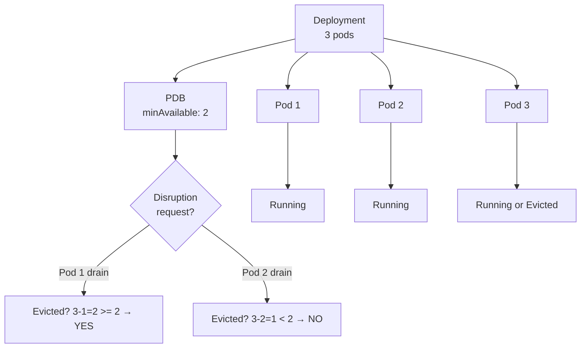
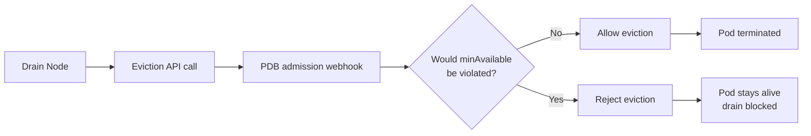

# Pod Disruption Budget

> **Category:** Core Concept / Availability
> **Also known as:** PDB (Pod Disruption Budget)

## What It Is

A **Pod Disruption Budget (PDB)** specifies the **minimum number or percentage of pods** from a set that must remain **available** during **planned** disruptions like node upgrades, scaling events, or cluster maintenance.

## Why It Exists

When Kubernetes performs maintenance (upgrades, drains, autoscaling):
- Without PDB, all pods from an app may be taken down at once
- This causes **downtime** (even for HA setups)
- Users see errors during what should be graceful maintenance

PDB ensures **a minimum number of pods stay up** — so applications don't go fully offline during voluntary disruptions.

## Architecture



## PDB Spec

```yaml
apiVersion: policy/v1
kind: PodDisruptionBudget
metadata:
  name: nginx-pdb
  namespace: default
spec:
  # Choose ONE of these:
  minAvailable: 1            # At least 1 pod must be available
  # OR
  minAvailable: "30%"        # At least 30% of pods must stay up
  # OR
  maxUnavailable: 0           # NO pods may be unavailable (strictest)
  # OR
  maxUnavailable: "25%"        # At most 25% pods can be down
  #
  # minAvailable + maxUnavailable are mutually exclusive — pick one
  #
  selector:                    # Which pods this PDB applies to
    matchLabels:
      app: nginx
```

## minAvailable vs maxUnavailable

| Option | Behavior | Use Case |
|--------|----------|----------|
| `minAvailable: 1` | At least 1 pod always running | Small deployments (1-3 replicas) |
| `minAvailable: N` | At least N pods running | Fixed-size critical services |
| `minAvailable: "50%"` | At least 50% of pods running | Large pools (can't count exact number) |
| `maxUnavailable: 0` | Zero disruption allowed | Mission-critical (strict HA) |
| `maxUnavailable: 1` | At most 1 pod down at a time | One-at-a-time rolling updates |
| `maxUnavailable: "10%"` | 10% of pods may go down | Graceful during upgrades |

## How PDB Works



## PDB with Deployments

```yaml
# A PDB for a Deployment
apiVersion: policy/v1
kind: PodDisruptionBudget
metadata:
  name: web-app-pdb
spec:
  minAvailable: 2             # For a deployment with 5 replicas
  selector:
    matchLabels:
      app: web-app
---
apiVersion: apps/v1
kind: Deployment
metadata:
  name: web-app
spec:
  replicas: 5
  selector:
    matchLabels:
      app: web-app
  template:
    metadata:
      labels:
        app: web-app
```

## PDB with StatefulSets

```yaml
# PDB for a 3-replica StatefulSet
apiVersion: policy/v1
kind: PodDisruptionBudget
metadata:
  name: database-pdb
spec:
  minAvailable: 2              # 3 replicas, allow 1 disruption
  selector:
    matchLabels:
      app: database
```

For a StatefulSet with 3 replicas and `minAvailable: 2`:
- `kubectl drain node1` → evicts pods **except** the 3rd one (maintains minAvailable)

## PDB for Stateless Apps

```yaml
# Allow up to 1/3 of replicas down
apiVersion: policy/v1
kind: PodDisruptionBudget
metadata:
  name: stateless-pdb
spec:
  maxUnavailable: "33%"
  selector:
    matchLabels:
      app: api
```

## Commands

```bash
# Get
kubectl get pdb
kubectl get pdb <name>
kubectl get pdb <name> -o yaml
kubectl get pdb <name> -o jsonpath='{.status}'

# Describe (shows status)
kubectl describe pdb <name>

# Create (imperative)
kubectl create pdb my-pdb --min-available=2 --selector=app=nginx
kubectl create pdb my-pdb --min-available=50% --selector=app=nginx

# Create from file
kubectl apply -f pdb.yaml

# Evict a pod (test PDB)
kubectl delete pod <name>        # Normal delete bypasses PDB
kubectl drain <node>             # Drain triggers PDB admission

# Delete
kubectl delete pdb <name>
```

## PDB Status Fields

| Field | Description |
|-------|-------------|
| `disruptedPods` | Map of pods currently being disrupted |
| `pdbOccurrences` | Metrics: allowed, disallowed, etc. |
| `conditions` | Current PDB status |
| `disruptionsAllowed` | Number of pods that can be disrupted |
| `minAllowed` | Minimum pods that must stay up |
| `current` | Current healthy pods |
| `desired` | Desired healthy pods |
| `expectedPods` | Total pods matching selector |

```bash
kubectl get pdb <name> -o wide
# NAME        MIN-AVAILABLE   MAX-DISRUPTIONS   AVAILABLE   READY   AGE
# nginx-pdb   2               1                 3           3       1m
```

## Common Issues & Solutions

### PDB is too strict (can't drain nodes)

```bash
# If maxUnavailable: 0 and minAvailable: 5 for a 3-pod deployment
kubectl describe poddisruptionbudget <name>
# Check expected vs available
# Solution: reduce minAvailable or increase replicas
kubectl edit pdb <name>
kubectl scale deploy <name> --replicas=4
```

### PDB blocks all disruptions

```bash
# If minAvailable <= desiredReplicas
kubectl get pdb <name> -o wide
# If "AVAILABLE" == "MIN-AVAILABLE", draining is blocked
# Wait for new pods or adjust the budget
```

### PDB doesn't apply to my pods

```bash
# PDB selector doesn't match pod labels
kubectl get pods -l app=nginx
kubectl describe pdb <name>
# Check selector match
kubectl get pod <name> -o jsonpath='{.metadata.labels}'
```

### PDB blocks voluntary, but not involuntary (node failure)

PDBs only protect against **voluntary** disruptions (drain, `kubectl delete`). **Involuntary** (node crash) still triggers pod loss.

## Best Practices

1. **Set minAvailable** appropriately — don't set it higher than `replicas` (causes permanent block)
2. **Use percentages** for large pools (`minAvailable: "50%"`) — scales better
3. **Test draining** — `kubectl drain` in a test namespace to validate
4. **Match Deployment replicas** — `replicas >= minAvailable + N` for safe rolling updates
5. **Avoid maxUnavailable: 0** with small replica counts — can block all maintenance
6. **Set PDBs for critical apps** — databases, user-facing services
7. **Monitor PDB status** — alert when `disruptionsAllowed == 0`
8. **Consider cluster size** — PDB for one namespace can block cluster-wide drains

## Relationship with Deployment Rolling Updates

During a `RollingUpdate`:
- `maxUnavailable` (in deployment strategy) — how many pods can be **unavailable**
- `minAvailable` (in PDB) — minimum pods that must stay available

These interact! If Deployment has `maxUnavailable: 1` but PDB has `minAvailable: 5` and the Deployment has 3 replicas, **updates will fail**.

```yaml
# Example: Compatible settings
replicas: 6
pdb.minAvailable: 4
deployment.strategy.rollingUpdate.maxUnavailable: 1
deployment.strategy.rollingUpdate.maxSurge: 1
```

## Interview Questions

**Q: What is a PodDisruptionBudget and why is it important?**
A: A PDB sets the minimum number (or maximum) of pods that must stay available during voluntary disruptions (like node drains). It prevents full outage during maintenance.

**Q: Does a PDB protect against node failures?**
A: No. PDB only protects against **voluntary** disruptions (e.g., `kubectl drain`, `kubectl delete`). Node crashes are involuntary — pods will still be lost.

**Q: What's the difference between minAvailable and maxUnavailable?**
A: `minAvailable` specifies the minimum pods that **must** be running. `maxUnavailable` specifies the maximum pods that **can** be down. You must choose one per PDB.

**Q: What happens if minAvailable > number of replicas?**
A: The PDB blocks all voluntary disruptions — no pods can ever be evicted. This causes drains to hang.

**Q: How does PDB interact with cluster autoscaler?**
A: The cluster autoscaler **respects PDB** — it won't delete nodes if it would cause PDB violations. However, PDBs can prevent node scale-down.

## Related Resources

- [Deployment Strategies](../03-workloads/deployment-strategies.md)
- [Cluster Autoscaler](../03-workloads/cluster-autoscaler.md)
- [DaemonSet](../03-workloads/daemonsets.md)
- [StatefulSet](../03-workloads/statefulsets.md)
- [kubectl Cheatsheet](../cheat-sheets/kubectl.md)
