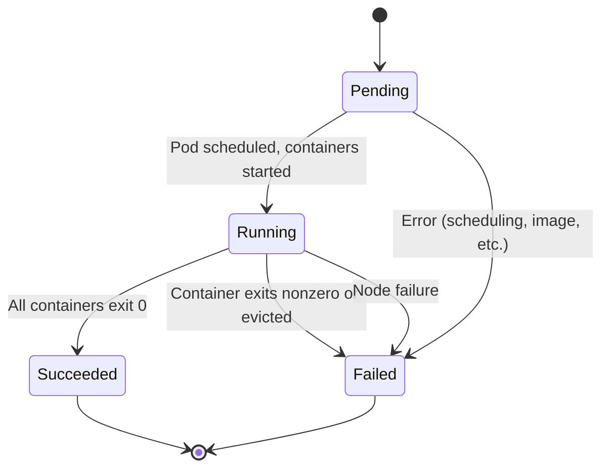
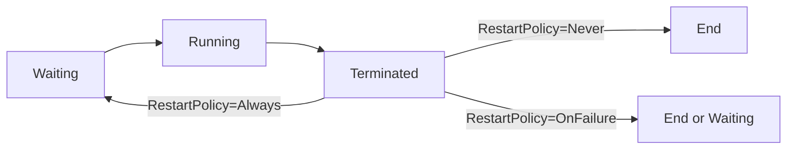
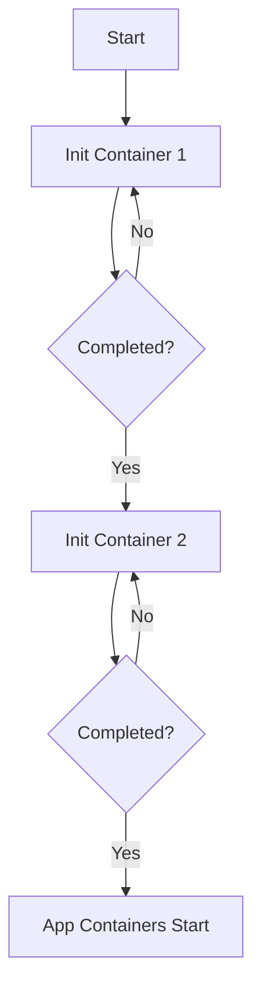
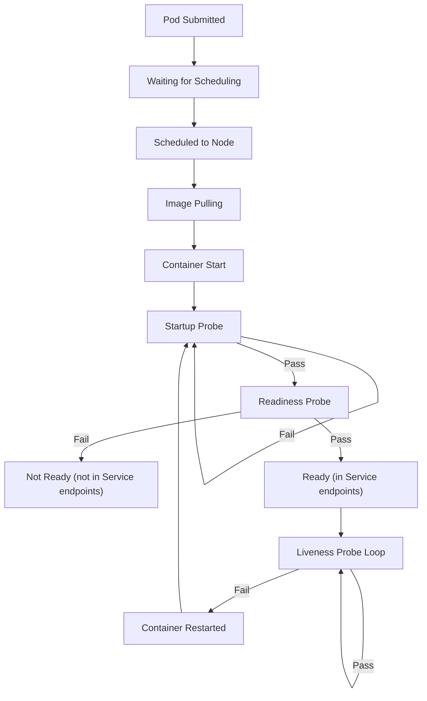
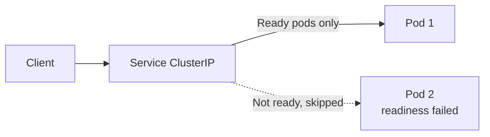

# Pod Lifecycle

> **Category:** Core Concept
> **Related:** Pods, Deployments, Health Checks

## What It Is

The **Pod Lifecycle** defines the various **phases and states** that a pod goes through from creation to termination. Understanding these states is essential for debugging, implementing health checks, and writing resilient applications.

## Why It Exists

Pods don't just "start and run forever." They pass through distinct phases:
- They may **wait for scheduling**
- **Initialization containers** must complete first
- **Readiness** determines service traffic eligibility
- **Graceful shutdown** requires pre-stop hooks and grace periods

## Pod Phases



| Phase | Description | Common Causes |
|-------|-------------|---------------|
| **Pending** | Accepted by API, containers not yet started | Scheduling failures, pulling images |
| **Running** | At least one container still running | Normal running state |
| **Succeeded** | All containers exited with code 0 | Batch jobs completing |
| **Failed** | All containers exited; at least one failed | Application error, OOM killed |
| **Unknown** | Lost communication with node | Network partition, node failure |

```bash
kubectl get pods  # shows phase in STATUS column
```

## Container States

Each container in a pod has a state from this lifecycle:



| State | Description |
|-------|-------------|
| **Waiting** | Container is being prepared (downloading image, creating) |
| **Running** | Container is executing |
| **Terminated** | Container stopped (with exit code) |

### Exit Codes

| Code | Signal | Meaning |
|------|--------|---------|
| 0 | — | Success |
| 1 | — | Application error |
| 2 | — | Application error |
| 130 | SIGINT (2) | Graceful termination via Ctrl+C |
| 134 | SIGABRT (6) | Abnormal termination (assert/crash) |
| 137 | SIGKILL (9) | Force killed (often OOM) |
| 143 | SIGTERM (15) | Terminated (Kubernetes drain, scale down) |

## Init Containers

Init containers run **before** the main containers and must complete **successfully** before the next one starts.

```yaml
spec:
  initContainers:
  - name: wait-for-service
    image: busybox:1.36
    command: ['sh', '-c', 'until nslookup my-service; do echo waiting; sleep 2; done']
  - name: fetch-data
    image: busybox:1.36
    command: ['/bin/sh', '-c', 'wget -O /work/index.html http://nginx.org/']
  containers:
  - name: main
    image: nginx
    volumeMounts:
    - name: work
      mountPath: /usr/share/nginx/html
  volumes:
  - name: work
    emptyDir: {}
```

### Init Container Execution Flow



If an init container **fails**, the pod stays in the **Pending** state and Kubernetes retries (subject to `backoffLimit`).

## Pod Startup Flow



## Init, PostStart, PreStop Hooks

| Hook | When | Purpose |
|------|------|---------|
| **postStart** | Container starts (after process starts) | Warm-up tasks |
| **preStop** | Container stops (before SIGTERM) | Graceful shutdown, cleanup |
| **startupProbe** | During startup (before liveness) | Give slow-starting apps time |

```yaml
spec:
  containers:
  - name: app
    image: myapp:1.0
    lifecycle:
      postStart:
        exec:
          command: ["/bin/sh", "-c", "echo started > /tmp/started"]
      preStop:
        exec:
          command: ["/bin/sh", "-c", "sleep 10 && echo stopping"]
    startupProbe:
      httpGet:
        path: /ready
        port: 8080
      failureThreshold: 30    # Wait up to 5 minutes
      periodSeconds: 10
```

## Graceful Deletion

When a pod is deleted:
1. **SIGTERM** sent to containers
2. **Grace period** starts (default: 30 seconds)
3. **preStop hooks** run
4. Containers receive **SIGTERM**
5. If grace period expires → **SIGKILL**

```yaml
spec:
  terminationGracePeriodSeconds: 30   # Time to wait before SIGKILL
  activeDeadlineSeconds: 3600         # Max runtime
```

## Readiness vs Liveness

| Probe | Purpose | What happens if it fails |
|-------|---------|--------------------------|
| **readinessProbe** | Traffic routing | Pod removed from Service endpoints |
| **livenessProbe** | Health check | Container restarted |
| **startupProbe** | Slow startup detection | Delays other probes until success |

### Traffic Flow with Readiness



## Common Probe Configurations

```yaml
# HTTP GET probe
livenessProbe:
  httpGet:
    path: /healthz
    port: 8080
  initialDelaySeconds: 30    # Wait 30s after container starts
  periodSeconds: 10          # Check every 10s
  timeoutSeconds: 5          # 5s timeout
  failureThreshold: 3        # 3 consecutive failures = restart
  successThreshold: 1        # Need 1 success to be ready

# TCP Socket probe
readinessProbe:
  tcpSocket:
    port: 5432
  initialDelaySeconds: 10
  periodSeconds: 5

# Exec probe
startupProbe:
  exec:
    command: ["/bin/sh", "-c", "ls /tmp/ready"]
  failureThreshold: 30
  periodSeconds: 10
```

## Debugging Lifecycle Commands

```bash
# Get pods with details
kubectl get pods -o wide
kubectl get pod <name> -o yaml   # full YAML including status

# Check status and events
kubectl describe pod <name>

# Check probe results
kubectl get pod <name> -o jsonpath='{.status.conditions}'

# See container state details
kubectl get pod <name> -o jsonpath='{.status.containerStatuses}'

# Check recent events
kubectl get events --sort-by=.lastTimestamp --field-selector involvedObject.name=<pod-name>

# Follow logs (including startup failures)
kubectl logs -f <name>
kubectl logs --previous <name>   # previous container instance
```

## Common Issues

### Pod stuck in "ContainerCreating"
```bash
# Usually means image is downloading or volume mounting
kubectl describe pod <name>
# Check: image pull, volume mount permissions
```

### Pod stuck in "ErrImagePull" or "ImagePullBackOff"
```bash
kubectl describe pod <name>
# Fix: correct image name, credentials for private repos
kubectl create secret docker-registry regcred --docker-server=... --docker-username=... --docker-password=...
```

### CrashLoopBackOff
```bash
kubectl describe pod <name>
kubectl logs <name>
kubectl logs --previous <name>   # check previous run
# Fix: check application code, config, missing deps
```

### Pending
```bash
kubectl describe pod <name>   # shows scheduling failure
# Check: node resources, taints/tolerations, nodeSelector
```

### OOMKilled (137)
```bash
kubectl describe pod <name>   # shows OOMKilled
# Fix: increase memory limit, fix memory leak
```

## Configuration Options

| Field | Description | Default |
|-------|-------------|---------|
| `terminationGracePeriodSeconds` | Time to wait (graceful shutdown) | 30 |
| `activeDeadlineSeconds` | Max runtime (any state) | — |
| `dnsPolicy` | DNS policy (ClusterFirst, Default, etc.) | ClusterFirst |
| `restartPolicy` | Always, OnFailure, Never | Always |
| `nodeSelector` | Hard constraint to node labels | — |

## Interview Questions

**Q: What is the difference between liveness and readiness probes?**
A: Liveness determines whether to restart the container; readiness determines whether to send traffic to the pod.

**Q: Why use a startupProbe?**
A: To delay liveness and readiness checks for slow-starting containers, preventing premature restarts.

**Q: What happens when a preStop hook is defined?**
A: Kubernetes sends a SIGTERM, runs the preStop hook, waits up to the grace period, then sends SIGKILL if still running.

**Q: What are init containers and why are they useful?**
A: Init containers run to completion before app containers. Useful for waiting on dependencies, fetching configs, or running migrations.

## Related Resources

- [Pod](pods.md)
- [Health Checks](../08-cluster-operations/kubelet.md)
- [Deployment](deployments.md)
- [DaemonSet](../03-workloads/daemonsets.md)
- [Troubleshooting Guide](../14-troubleshooting/troubleshooting-patterns.md)
