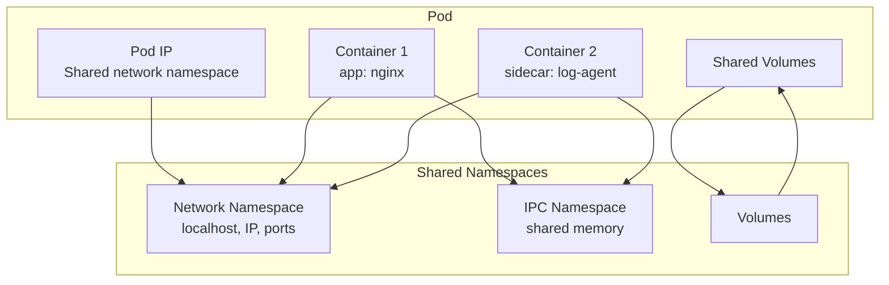
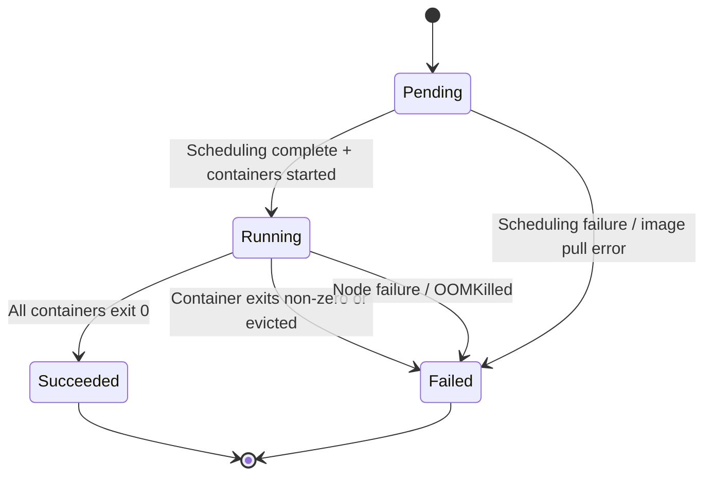

# Pod

> **Category:** Core Concept / Workload
> **Also known as:** Kubernetes Pod

## What It Is

A **Pod** is the smallest deployable unit in Kubernetes. It represents a single running process (or application instance) and can contain one or more closely related containers that share storage, network, and a runtime.

## Why It Exists

Containers need grouping for common concerns:
- Sharing network namespace (localhost communication)
- Sharing volumes for data access
- Defining lifecycle (restart, termination) and scheduling constraints
- Running sidecar (logging, monitoring) and init containers

## Architecture



## Pod Spec Anatomy

```yaml
apiVersion: v1
kind: Pod
metadata:
  name: my-app
  namespace: default
  labels:
    app: my-app
  annotations:
    checksum/config: abc123
spec:
  containers:
  - name: main
    image: nginx:1.25
    imagePullPolicy: IfNotPresent  # Always | Never | IfNotPresent
    ports:
    - containerPort: 80
      name: http
      protocol: TCP
    resources:
      requests:
        cpu: "100m"
        memory: "64Mi"
      limits:
        cpu: "250m"
        memory: "128Mi"
    env:
    - name: ENV
      value: production
    - name: LOG_LEVEL
      valueFrom:
        configMapKeyRef:
          name: app-config
          key: log_level
    volumeMounts:
    - name: data
      mountPath: /var/data
    livenessProbe:
      httpGet:
        path: /healthz
        port: 8080
      initialDelaySeconds: 15
      periodSeconds: 20
    readinessProbe:
      httpGet:
        path: /ready
        port: 8080
      initialDelaySeconds: 5
      periodSeconds: 10
    lifecycle:
      postStart:
        exec:
          command: ["/bin/sh", "-c", "echo 'container started'"]
      preStop:
        exec:
          command: ["/bin/sh", "-c", "sleep 30"]
  initContainers:
  - name: wait-db
    image: busybox
    command: ['sh', '-c', 'until nslookup db; do echo waiting; sleep 2; done']
  volumes:
  - name: data
    emptyDir: {}
  restartPolicy: Always  # Always | OnFailure | Never
  nodeSelector:
    disktype: ssd
  tolerations:
  - key: "dedicated"
    operator: "Equal"
    value: "gpu"
    effect: "NoSchedule"
  securityContext:
    runAsUser: 1000
    runAsGroup: 3000
    fsGroup: 2000
```

## Container Types

### Init Containers
Run to completion **before** app containers. Used for:
- Waiting for dependencies (databases, services)
- Copying configuration files
- Running setup scripts

```yaml
spec:
  initContainers:
  - name: setup
    image: busybox
    command: ['sh', '-c', 'echo init done > /work/ready']
    volumeMounts:
    - name: work-volume
      mountPath: /work
  containers:
  - name: main
    image: nginx
  volumes:
  - name: work-volume
    emptyDir: {}
```

### Sidecar Containers
Run alongside the main application:
- Log shipping (Fluentd, Filebeat)
- Proxy (Istio Envoy)
- Monitoring agents

### Ephemeral Containers
Added **at runtime** for debugging:

```bash
kubectl debug -it <pod> --image=busybox --target=main
```

## Pod Lifecycle



### Pod Phases

| Phase | Meaning |
|-------|---------|
| **Pending** | Accepted, containers not yet created |
| **Running** | At least one container still running |
| **Succeeded** | All containers terminated with exit code 0 |
| **Failed** | All containers terminated; at least one failed |
| **Unknown** | Lost contact with the node |

```bash
kubectl get pods  # Shows phase in STATUS column
```

### Container States (within a phase)

| State | exitCode | Meaning |
|-------|----------|---------|
| **Waiting** | N/A | Container not running yet (pulling, creating) |
| **Running** | N/A | Container executing |
| **Terminated** | 0 | Completed successfully |
| **Terminated** | 1 | App error |
| **Terminated** | 130 | Interrupted (SIGINT, 128+2) |
| **Terminated** | 137 | Killed (SIGKILL, 128+9) — often OOM |
| **Terminated** | 143 | Terminated (SIGTERM, 128+15) |

## QoS (Quality of Service) Classes

Determined by requests and limits:

| Class | Conditions | Eviction Priority |
|-------|-----------|-------------------|
| **Guaranteed** | All containers: request == limit | Last evicted |
| **Burstable** | Some requests < limits | Medium priority |
| **BestEffort** | No requests or limits set | First evicted |

```yaml
# Guaranteed
resources:
  requests:
    memory: "128Mi"
    cpu: "250m"
  limits:
    memory: "128Mi"
    cpu: "250m"
```

## Multi-Container Pods

Pods that share:
- **Network namespace** — same IP, `localhost` communication
- **IPC namespace** — shared memory via `/dev/shm`
- **Storage volumes** — shared file access

### Same Port Conflict

```yaml
# This FAILS - two containers cannot bind the same port
spec:
  containers:
  - name: web1       # ❌
    ports:
    - containerPort: 8080
  - name: web2       # ❌ Conflict
    ports:
    - containerPort: 8080
```

## Common Commands

```bash
# Create (from file)
kubectl apply -f pod.yaml

# Get
kubectl get pods
kubectl get pods -n kube-system
kubectl get pods -o wide           # Show nodes
kubectl get pods -o wide -l app=nginx  # Filter by label

# Inspect
kubectl describe pod <name>          # Detailed info + events
kubectl logs <name>                 # Logs
kubectl logs -f <name>             # Stream logs (follow)
kubectl logs --previous <name>     # Previous container
kubectl logs -c <container> <pod>  # Specific container
kubectl logs -l app=nginx          # Logs from all matching pods
kubectl exec -it <name> -- /bin/sh  # Interactive shell
kubectl exec -c <container> -it <name> -- /bin/bash
kubectl port-forward pod/<name> 8080:80   # Port forward
kubectl top pod <name>           # Resource usage
```

## Common Issues & Solutions

### ImagePullBackOff
```bash
kubectl describe pod <name>   # check Events
# Fix: correct image name, create pull secret for private registries
kubectl create secret docker-registry regcred \
  --docker-server=https://index.docker.io/v1/ \
  --docker-username=<username> \
  --docker-password=<password>
```

### CrashLoopBackOff
```bash
kubectl describe pod <name>
kubectl logs <name>
kubectl logs --previous <name>   # logs when it was running
# Fix: check app logs, config, missing deps
```

### Pending
```bash
kubectl describe pod <name>   # shows scheduling failure reason
# Causes: no resources, no matching node selector, taints, image not found
```

### OOMKilled (exit code 137)
```bash
kubectl describe pod <name>   # shows OOMKilled in state
# Fix: increase memory limit, find memory leak in app
```

### ErrImageNeverValid / ErrImagePull
```bash
kubectl describe pod <name>
# Fix: correct image tag, check registry access
```

## When to Use Pods Directly

| Scenario | Recommendation |
|----------|----------------|
| Production workloads | Use Deployment/StatefulSet (they manage pods) |
| One-off tasks | Pod with `restartPolicy: Never` |
| Debugging existing pods | Ephemeral containers or `kubectl debug` |
| Simple single-container apps | Pod + Service acceptable for small deployments |

## Best Practices

1. **Always use controllers** in production — never manage bare Pods
2. **Set resource requests and limits** — for QoS and scheduling
3. **Configure health probes** — liveness and readiness
4. **Use meaningful names** — DNS-compliant (lowercase, dashes)
5. **Use namespaces** — for resource isolation
6. **Set `imagePullPolicy`** — `IfNotPresent` for stable images, `Always` for `:latest`
7. **Multi-container pods** — only for tightly coupled containers
8. **Init containers** — for pre-start setup
9. **Security context** — run as non-root user

```yaml
spec:
  securityContext:
    runAsNonRoot: true
    runAsUser: 1000
    fsGroup: 2000
```

## Interview Questions

**Q: What is the smallest deployable unit in Kubernetes?**
A: A Pod.

**Q: How do containers in a pod communicate?**
A: They share the same network namespace — they communicate via `localhost`.

**Q: Can a pod survive a node failure?**
A: No. If a worker node dies, the pods on it are terminated (after a grace period). A controller like a Deployment will create replacement pods on healthy nodes.

**Q: Why should you not use `nginx:latest`?**
A: The `latest` tag is mutable; it can change over time, making deployments unpredictable. Always pin versions.

## Related Resources

- [Kubernetes](kubernetes.md)
- [Pod Lifecycle](pod-lifecycle.md)
- [Deployment](deployments.md)
- [Multi-Container Pods](../15-advanced-patterns/pod-patterns.md)
- [kubectl Cheatsheet](../cheat-sheets/kubectl.md)
