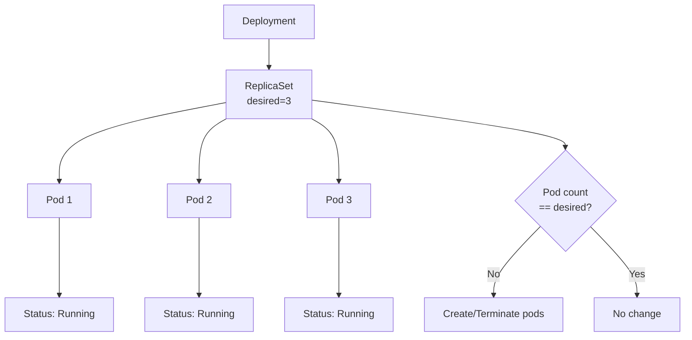
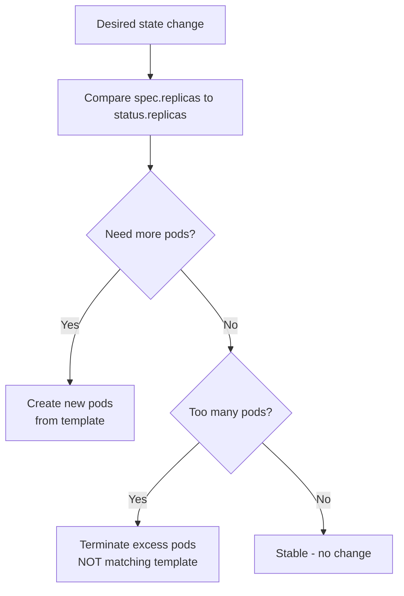

# ReplicaSet

> **Category:** Core Concept / Workload Controller

## What It Is

A **ReplicaSet** is a Kubernetes controller that ensures a specified number of **identical pod replicas** are running at any given time. It is primarily used by Deployments but can also be used directly.

## Why It Exists

You need guarantees about:
- **Availability** — how many copies of your app are running?
- **Resilience** — if a pod dies, how many need to be restarted?
- **Load distribution** — spread load across multiple instances

ReplicaSets continuously monitor pod health and **launch or terminate pods** to match the desired `.spec.replicas` count.

## Architecture



## Spec Fields

```yaml
apiVersion: apps/v1
kind: ReplicaSet
metadata:
  name: nginx-rs
  labels:
    app: nginx
spec:
  replicas: 3                  # Desired number of pods
  selector:
    matchLabels:
      app: nginx            # Pods managed by this RS (MUST match template)
  template:                    # Pod template
    metadata:
      labels:
        app: nginx
    spec:
      containers:
      - name: nginx
        image: nginx:1.25
        ports:
        - containerPort: 80
```

## How ReplicaSet Selects Pods

ReplicaSet uses **label selectors** to identify pods under its control.

| Component | Must Match? |
|-----------|-------------|
| `spec.selector.matchLabels` | **Yes** — RS only manages pods whose labels match |
| `spec.template.metadata.labels` | **Yes** — template labels must also match selector |

```yaml
# ❌ INVALID — selector doesn't match template
spec:
  selector:
    matchLabels:
      app: nginx-v2           # Does NOT match template
  template:
    metadata:
      labels:
        app: nginx            # RS will never manage these pods
```

## Commands

### Creating

```bash
# Declarative (recommended)
kubectl apply -f replicaset.yaml

# Imperative (not recommended for production)
kubectl create -f replicaset.yaml
kubectl create deployment web --image=nginx  # This creates a Deployment (which creates an RS)
```

### Inspecting

```bash
# Get
kubectl get rs                              # All ReplicaSets
kubectl get rs -o wide                      # Show node assignment
kubectl get rs -o yaml                      # Full YAML with status
kubectl get rs <name> -o jsonpath='{.spec.replicas}'

# Check if pods match selector
kubectl get rs <name> -o jsonpath='{.status.readyReplicas}'

# Describe (shows managed pods and events)
kubectl describe rs <name>

# Get pods managed by this RS
kubectl get pods --selector=<label>=<value>
kubectl get rs <name> -o jsonpath='{.spec.template.metadata.labels}'
# Then: kubectl get pods -l app=nginx
```

### Scaling

```bash
# Imperative scale
kubectl scale rs/<name> --replicas=5

# Declarative (edit YAML)
kubectl apply -f replicaset.yaml   # with spec.replicas: 5
# OR edit inline:
kubectl edit rs <name>   # change spec.replicas, save, RS scales immediately
```

### Deleting

```bash
kubectl delete rs <name>

# If pods should survive (orphan), use --cascade=orphan
kubectl delete rs <name> --cascade=orphan
```

## ReplicaSet Status

| Status Field | Description |
|--------------|-------------|
| `replicas` | Total number of pods the RS is aware of |
| `fullyLabeledReplicas` | Pods with matching labels |
| `readyReplicas` | Pods that are ready (passed readiness probe) |
| `availableReplicas` | Pods ready AND available (for at least minReadySeconds) |
| `observedGeneration` | Last generation observed by the RS |

```bash
# Watch ReplicaSet status
kubectl get rs <name> -w
```

## ReplicaSet vs Deployment

| | ReplicaSet | Deployment |
|---|---|---|
| **Update strategy** | None (manual) | Rolling updates (automated) |
| **Rollback** | Manual | `kubectl rollout undo` |
| **Revision history** | No | Yes (stores ReplicaSets) |
| **Pause/Resume** | No | Yes |
| **Recommended for** | Rarely used directly | Production workloads |

> **Deployment creates and manages ReplicaSets.** For almost all use cases, you should use a Deployment rather than a ReplicaSet directly.

## When ReplicaSet Manages Pods



## Common Issues

### Pods show fewer than desired replicas
```bash
kubectl get rs <name> -o yaml
# Check .status.replicas vs spec.replicas
# Possible causes: resource constraints, node failures, image pull errors
kubectl describe rs <name>     # see Events
kubectl describe pod <pod>   # check for errors
```

### Pods not matching selector
```bash
# Ensure selector matchExpression matches template labels
kubectl get pod -l app=nginx
# Ensure template metadata.labels match selector
```

### ReplicaSet doesn't scale up
```bash
# Check cluster resources
kubectl describe rs <name>
kubectl describe node
kubectl describe quota
```

### Pods being recreated when they should be reused
```yaml
# Check if the pod template hash matches
kubectl get rs -o wide
# Pods owned by old ReplicaSets won't belong to new RS
```

## Interview Questions

**Q: What is the difference between a ReplicaSet and a Deployment?**
A: A Deployment is a higher-level controller that manages ReplicaSets. Deployments provide declarative updates, rollbacks, and revision history, while ReplicaSets just ensure a certain number of pod replicas exist.

**Q: Can you use a ReplicaSet directly?**
A: Yes, but it is not recommended. ReplicaSets lack update strategies and revision management that Deployments provide.

**Q: How does ReplicaSet know which pods to manage?**
A: Using label selectors defined in `.spec.selector.matchLabels`. Only pods with matching labels are managed.

**Q: What happens if you change a label on a running pod?**
A: If the pod now matches a different ReplicaSet's selector, it will be "adopted" by that ReplicaSet. If it no longer matches its current ReplicaSet, that RS will create a replacement pod.

## Related Resources

- [Deployment](deployments.md)
- [StatefulSet](../03-workloads/statefulsets.md)
- [DaemonSet](../03-workloads/daemonsets.md)
- [kubectl Cheatsheet](../cheat-sheets/kubectl.md)
