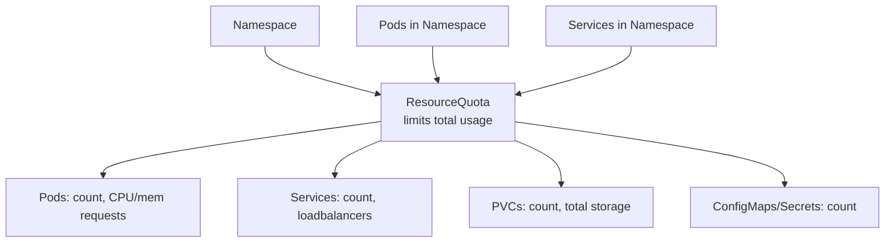

# ResourceQuota

> **Category:** Core Concept / Resource Management

## What It Is

A **ResourceQuota** sets **aggregate limits** on resources that can be consumed within a **Namespace**. It constrains the total number of objects by **kind** and the total amount of **compute resources** (CPU, memory) that can be requested or limited across all objects in the namespace.

## Why It Exists

In multi-tenant clusters:
- Teams can accidentally or maliciously exhaust all cluster resources
- No isolation between dev/staging/prod
- Cost control and budget limits are needed
- Preventing runaway workloads

ResourceQuotas help enforce governance and ensure fair sharing of the cluster across teams and namespaces.

## Architecture



## ResourceQuota Spec

```yaml
apiVersion: v1
kind: ResourceQuota
metadata:
  name: compute-resources
  namespace: development
spec:
  hard:
    # Compute resources
    requests.cpu: "1"          # 1 CPU core total requests
    requests.memory: 1Gi       # 1 GiB total memory requests
    limits.cpu: "2"            # 2 CPU cores total limits
    limits.memory: 2Gi         # 2 GiB total memory limits
    # Object counts
    pods: "20"                 # Max 20 pods
    persistentvolumeclaims: "4" # Max 4 PVCs
    services: "10"             # Max 10 services
    services.loadbalancers: "2" # Max 2 LB services
    services.nodeports: "0"   # NO node port services
    replicationcontrollers: "20"
    replicasets.apps: "20"
    deployments.apps: "20"
    jobs.batch: "10"
    cronjobs.batch: "5"
    # Storage
    requests.storage: 50Gi     # Total storage requested
    # Extended resources (e.g., GPUs)
    requests.nvidia.com/gpu: "4"
```

## Quota Enforcement

When a quota is **not met**:
- **Pod creation fails** with `"exceeded quota"` in events
- The quota controller evaluates each new resource against the quota

## Commands

```bash
# Create
kubectl create quota compute-resources \
  --hard=cpu=2,memory=2Gi,pods=10 \
  --namespace=development

kubectl apply -f quota.yaml

# Get
kubectl get quota
kubectl get quota -o wide
kubectl get quota compute-resources -n development -o yaml

# Describe
kubectl describe quota compute-resources -n development

# Delete
kubectl delete quota compute-resources -n development
```

### Checking Quota Usage

```bash
# View usage vs limit
kubectl get quota
# NAME                    STATUS  AGE
# compute-resources       6/40    1m

# Detailed view
kubectl describe quota compute-resources
# Includes current usage like:
# requests.cpu  100m / 1
# requests.memory  256Mi / 1Gi
# pods  3 / 20
```

## Scope-Based Quotas

ResourceQuotas can be filtered by **scope** — only track resources of a certain type. This helps enforce fine-grained limits.

| Scope | Description |
|-------|-------------|
| `Terminating` | Pods with `spec.activeDeadlineSeconds < ∞` (batch jobs) |
| `NotTerminating` | Pods with `spec.activeDeadlineSeconds` unset (long-running) |
| `BestEffort` | Pods with no resource requests or limits |
| `NotBestEffort` | Pods with resource requests or limits |
| `CrossNamespace` | (K8s 1.32+) Pods that reference objects in other namespaces |

```yaml
spec:
  hard:
    requests.cpu: "2"
    requests.memory: 2Gi
  scopes:
  - NotTerminating  # Only count non-terminating (long-running) pods
```

## Namespace-Level Resource Limits

| Resource | Quota Key | Type | Example |
|----------|-----------|------|---------|
| CPU requests (total) | `requests.cpu` | quantity | `"2"` |
| Memory requests (total) | `requests.memory` | quantity | `2Gi` |
| CPU limits (total) | `limits.cpu` | quantity | `"4"` |
| Memory limits (total) | `limits.memory` | quantity | `4Gi` |
| Ephemeral storage requests | `requests.storage.ephemeral` | quantity | `5Gi` |
| Ephemeral storage limits | `limits.storage.ephemeral` | quantity | `10Gi` |
| Number of pods | `pods` | integer | `"50"` |
| Number of PVCs | `persistentvolumeclaims` | integer | `"10"` |
| Total PVC storage | `requests.storage` | quantity | `100Gi` |
| Services | `services` | integer | `"30"` |
| LoadBalancer services | `services.loadbalancers` | integer | `"5"` |
| NodePort services | `services.nodeports` | integer | `"0"` (disable) |
| ConfigMaps | `configmaps` | integer | `"50"` |
| Secrets | `secrets` | integer | `"30"` |
| Services & ServiceAttachments | `services` | integer | `"30"` |
| ReplicationControllers | `replicationcontrollers` | integer | `"30"` |
| ReplicaSets (apps) | `replicasets.apps` | integer | `"30"` |
| Deployments (apps) | `deployments.apps` | integer | `"30"` |
| Deployments (extensions) | `deployments.extensions` | integer | `"30"` |
| Jobs (batch) | `jobs.batch` | integer | `"20"` |
| CronJobs (batch) | `cronjobs.batch` | integer | `"10"` |

## Common Issues & Solutions

### Quota exceeded error

```bash
kubectl apply -f pod.yaml
# Error from server: error when creating "pod.yaml":
# pods "web" is forbidden: exceeded quota: compute-resources,
# requested: requests.cpu=1, used: requests.cpu=2, limited: requests.cpu=2
#
# Solution:
# 1. Check quota: kubectl describe quota compute-resources -n <ns>
# 2. Delete unused resources, or increase the quota limit
kubectl delete pod <old-pod> -n <ns>
kubectl patch quota compute-resources -n <ns> -p '{"hard":{"requests.cpu":"3"}}'
```

### Pods stuck in Pending due to Quota
```bash
kubectl describe pod <pending-pod>
# Check "Events" — if it says "exceeded quota"
# Increase quota or reduce existing usage
```

### Namespace has no quota but resources fail
```bash
# Maybe LimitRange is too low for the request
kubectl get limitrange -n <ns>
kubectl describe limitrange <name> -n <ns>
```

### Quota does not apply to existing resources
```bash
# Quota only affects NEW resources. Existing resources are grandfathered.
# To enforce immediately, update existing resources' resource requests
```

## Multi-Quota Example

```yaml
# quota.yaml
apiVersion: v1
kind: ResourceQuota
metadata:
  name: compute-resources
  namespace: production
spec:
  hard:
    requests.cpu: "8"
    requests.memory: 16Gi
    limits.cpu: "16"
    limits.memory: 32Gi
    pods: "50"

---
apiVersion: v1
kind: ResourceQuota
metadata:
  name: storage-quota
  namespace: production
spec:
  hard:
    requests.storage: 200Gi
    persistentvolumeclaims: "20"

---
apiVersion: v1
kind: ResourceQuota
metadata:
  name: object-counts
  namespace: production
spec:
  hard:
    services: "15"
    services.loadbalancers: "5"
    services.nodeports: "0"
    configmaps: "100"
    secrets: "50"
```

## Best Practices

1. **Set quotas for every namespace** — especially in multi-tenant clusters
2. **Disable NodePort services** — set `services.nodeports: "0"` to enforce LoadBalancer/Ingress only
3. **Set both requests and limits** — `requests.cpu`, `limits.cpu`, etc.
4. **Separate object count from compute quota** — makes troubleshooting easier
5. **Use scopes** — to track specific workloads (e.g., `NotTerminating` for prod pods)
6. **Monitor quota usage** — alert when >85% of any quota is consumed
7. **Set storage quotas** — `requests.storage` prevents runaway volume claims
8. **Review regularly** — adjust based on actual team needs

## Interview Questions

**Q: What is a ResourceQuota and why is it useful?**
A: A ResourceQuota limits the total aggregate usage (CPU, memory, object counts) within a namespace — it prevents teams from over-consuming cluster resources in multi-tenant environments.

**Q: Does a ResourceQuota affect existing resources?**
A: No — ResourceQuotas only apply to NEW resources being created. Existing resources are grandfathered in.

**Q: How do you prevent a namespace from creating too many LoadBalancer services?**
A: Use `services.loadbalancers: "2"` in the ResourceQuota to cap it.

**Q: What happens if a Pod's request exceeds the namespace's remaining quota?**
A: The Pod is rejected with a "quota exceeded" error in Kubernetes events. It stays in a Pending state but the scheduling failure is due to quota, not resources.

## Related Resources

- [LimitRange](limit-ranges.md)
- [Namespace](namespaces.md)
- [Resource Requests & Limits](../07-scheduling-autoscaling/resources.md)
- [kubectl Cheatsheet](../cheat-sheets/kubectl.md)
