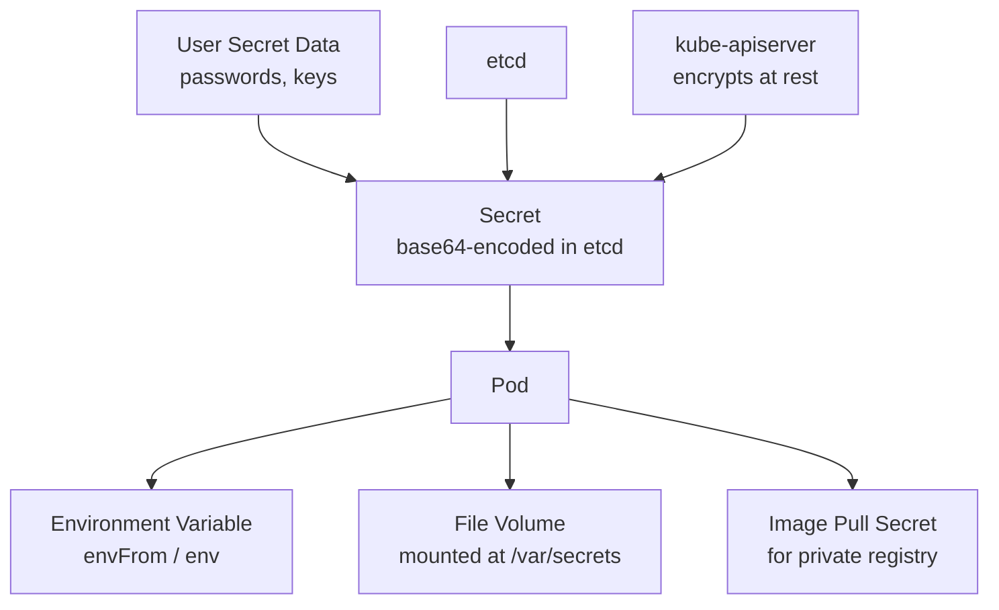

# Secret

> **Category:** Core Concept / Security
> **Also known as:** Kubernetes Secret, K8s Secret

## What It Is

A **Secret** is a Kubernetes object used to **store sensitive data** such as passwords, OAuth tokens, Docker registry credentials, and TLS certificates. Secrets decouple sensitive configuration from container images.

## Why It Exists

Storing secrets in config files or hardcoding them in images exposes credentials:
- Container images are publicly accessible (if registry isn't private)
- Configs change between environments
- Auditing and rotation become difficult

Secrets provide a secure way to manage sensitive data separately from application code.

## Architecture



## Secret Data

Secrets store data as base64-encoded strings. Each value can be up to 1 MiB.

```yaml
apiVersion: v1
kind: Secret
metadata:
  name: my-secret
type: Opaque                    # Default type; arbitrary key-value pairs
data:
  password: cGFzc3dvcmQxMjM=   # base64 of "password123"
```

```bash
# Encode
echo -n "password123" | base64    # cGFzc3dvcmQxMjM=

# Decode
echo "cGFzc3dvcmQxMjM=" | base64 -d  # password123
```

### stringData (Convenience)

```yaml
# stringData: auto-converts to base64
stringData:
  password: password123      # Kubernetes encodes this to base64
  session: my-session-token
```

## Secret Types

| Type | Description |
|------|-------------|
| **Opaque** (default) | Arbitrary key-value pairs |
| **kubernetes.io/dockerconfigjson** | Docker registry credentials (`.dockerconfigjson` key) |
| **kubernetes.io/tls** | TLS certificates (`tls.crt`, `tls.key`) |
| **kubernetes.io/basic-auth** | Basic auth (`username`, `password`) |
| **kubernetes.io/service-account** | Service account tokens (automated) |
| **bootstrap.token** | Cluster bootstrap tokens |

## Creating Secrets

### 1. From Literal Values

```bash
kubectl create secret generic my-secret \
  --from-literal=username=admin \
  --from-literal=password=secret123
```

### 2. From a File

```bash
kubectl create secret generic my-secret \
  --from-file=ssh-private-key=./private_key \
  --from-file=ca.crt=./ca_certificate
```

### 3. Docker Registry Secret

```bash
kubectl create secret docker-registry my-regcred \
  --docker-server=https://index.docker.io/v1/ \
  --docker-username=<username> \
  --docker-password=<password> \
  --docker-email=<email>
```

### 4. TLS Secret

```bash
kubectl create secret tls tls-secret \
  --cert=./tls.crt \
  --key=./tls.key
```

### 5. From YAML

```bash
echo -n "admin" | base64   # Output: YWRtaW4=
echo -n "secret123" | base64  # Output: c2VjcmV0MTIz
```

```yaml
apiVersion: v1
kind: Secret
metadata:
  name: my-secret
type: Opaque
data:
  username: YWRtaW4=
  password: c2VjcmV0MTIz
```

## Consuming Secrets

Secrets can be consumed like ConfigMaps (env vars, command args, or volume mounts).

### As Environment Variables

```yaml
apiVersion: v1
kind: Pod
metadata:
  name: secret-pod
spec:
  containers:
  - name: app
    image: myapp
    envFrom:                          # All secrets become env vars
    - secretRef:
        name: my-secret
    env:
    - name: DB_PASSWORD               # Single value
      valueFrom:
        secretKeyRef:
          name: my-secret
          key: password
    imagePullSecrets:                 # For private registries
    - name: my-regcred
```

### As Files (Volume Mount)

```yaml
apiVersion: v1
kind: Pod
metadata:
  name: pod-with-vol
spec:
  containers:
  - name: app
    image: myapp
    volumeMounts:
    - name: secret-vol
      mountPath: "/etc/secrets"
      readOnly: true                  # Recommended: mount read-only
  volumes:
  - name: secret-vol
    secret:
      secretName: my-secret
```

### Docker Registry Secret for Pulling Images

```yaml
apiVersion: v1
kind: Pod
metadata:
  name: app
spec:
  containers:
  - name: app
    image: my-registry/myapp:1.0    # Pull from private registry
  imagePullSecrets:
  - name: my-regcred               # Uses the docker-registry secret
```

## Secret Encryption at Rest

By default, secrets are base64-encoded (NOT encrypted).

### Enabling Encryption

Configure encryption on the API server using a KMS provider:

```yaml
# EncryptionConfiguration
apiVersion: apiserver.config.k8s.io/v1
kind: EncryptionConfiguration
resources:
- resources:
  - secrets
  providers:
  - identity: {}
  - kms:
      name: kms-provider
      endpoint: unix:///tmp/socket
      cachesize: 100
```

### Check Encryption Status

```bash
kubectl get secret my-secret -o jsonpath='{.data.password}'
# If encrypted: shows garbled ciphertext
# If not encrypted: shows base64
```

## Commands

```bash
# Get (values show as base64)
kubectl get secret
kubectl get secret my-secret -o yaml
kubectl get secret my-secret -o jsonpath='{.data.password}' | base64 -d

# Describe (metadata only, not values)
kubectl describe secret my-secret

# Create
kubectl create secret generic my-secret --from-literal=key=value

# Delete
kubectl delete secret my-secret

# Patch
kubectl patch secret my-secret -p '{"data":{"password": "bmV3cGFzcw=="}}'
```

## Access Control (RBAC)

Secrets are namespace-scoped and subject to RBAC:

```yaml
# Restrict who can read secrets
apiVersion: rbac.authorization.k8s.io/v1
kind: Role
metadata:
  namespace: production
  name: secret-reader
rules:
- apiGroups: [""]
  resources: ["secrets"]
  verbs: ["get", "list", "watch"]         # Read only
  # verbs: ["get","list","watch","create","update","patch","delete"] — admin access

---
apiVersion: rbac.authorization.k8s.io/v1
kind: RoleBinding
metadata:
  name: read-secret
  namespace: production
subjects:
- kind: User
  name: alice
  apiGroup: rbac.authorization.k8s.io
roleRef:
  kind: Role
  name: secret-reader
  apiGroup: rbac.authorization.k8s.io
```

## Common Issues & Solutions

### Secret values not decoded in env vars

```bash
# Secrets are decoded automatically for env vars
kubectl exec <pod> -- printenv DB_PASSWORD
# If it shows base64, the secret was mounted as file not env var
```

### Can't pull image (imagepullsecret)

```bash
# Create docker registry secret
kubectl create secret docker-registry my-regcred \
  --docker-server=https://index.docker.io/v1/ \
  --docker-username=<username> \
  --docker-password=<password>

# Reference it in the service account
kubectl patch serviceaccount default -p '{"imagePullSecrets": [{"name": "my-regcred"}]}'
```

### Secret too large (>1 MiB)

```bash
# Use an external secret store:
# - HashiCorp Vault
# - AWS Secrets Manager (via External Secrets operator)
# - Sealed Secrets
```

### Secrets exposed in etcd

```bash
# Enable encryption at rest (see above)
# Or use external secret stores like:
# kubectl create secret generic my-vault-secret --from-literal=...
```

## External Secrets

For enterprise-grade secret management, integrate with external stores:

| Tool | Secret Store |
|------|-------------|
| **External Secrets** | AWS Secrets Manager, HashiCorp Vault, GCP Secret Manager |
| **Sealed Secrets** | Encrypted secrets stored in Git |
| **HashiCorp Vault + CSI Driver** | Vault secrets as K8s secrets |

```yaml
# External Secret example
apiVersion: external-secrets.io/v1beta1
kind: ExternalSecret
metadata:
  name: my-secret
spec:
  secretStoreRef:
    name: aws-secrets-manager
    kind: ClusterSecretStore
  target:
    name: my-secret
  dataFrom:
  - extract:
      key: my-app-config
```

## Best Practices

1. **Enable encryption at rest** — for secrets in etcd
2. **Use RBAC to restrict secret access** — principle of least privilege
3. **Rotate secrets regularly** — automate certificate and password rotation
4. **Use external secret stores** (Vault, AWS Secrets Manager) — better audit trails
5. **Limit secret size** (< 1 MiB per Secret) — use external stores for large secrets
6. **Use `readOnly: true`** for volume mounts
7. **Prefer ServiceAccounts over static tokens** — Kubernetes auto-manages tokens
8. **Audit secret access** — enable audit logging on the API server

## Interview Questions

**Q: Are Kubernetes Secrets a secure way to store passwords?**
A: No — they are base64-encoded by default, which is encoding, not encryption. Without encryption at rest enabled, secrets are readable from etcd. For true security, use external secret stores like HashiCorp Vault.

**Q: How do you give a Pod access to pull from a private Docker registry?**
A: Create a `docker-registry` type Secret (`imagePullSecrets`) and reference it in the Pod spec or the ServiceAccount's `imagePullSecrets`.

**Q: Can you update a Secret that's mounted as an environment variable in a running Pod?**
A: No. Environment variables are set at container start. You must restart the Pod to pick up Secret changes.

**Q: Do Secrets mounted as files update automatically?**
A: Yes, but asynchronously. Kubelet updates mounted secret files within `refreshCache` (~10 minutes). Your application must watch for file changes.

**Q: What is the default Secret type?**
A: `Opaque`. Other types include `kubernetes.io/tls`, `kubernetes.io/dockerconfigjson`, `kubernetes.io/service-account`.

## Related Resources

- [RBAC](../06-security/rbac.md)
- [ConfigMap](configmaps.md)
- [Image Scanning](../06-security/secrets.md)
- [TLS Certificates](../06-security/certificates.md)
- [kubectl Cheatsheet](../cheat-sheets/kubectl.md)
