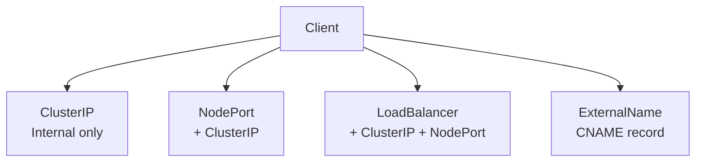
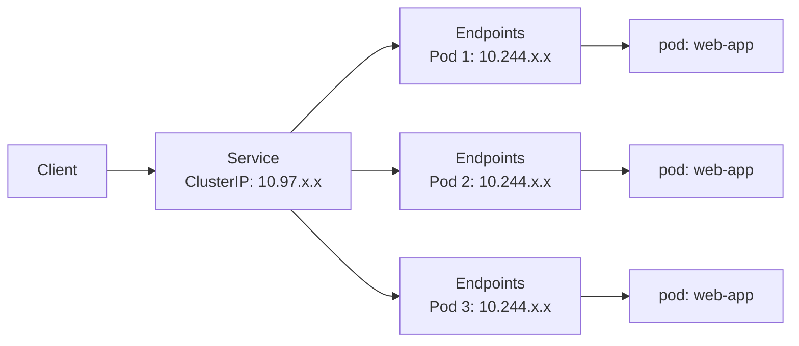

# Service

> **Category:** Core Concept / Networking
> **Interview Focus:** Networking, Services

## What It Is

A **Service** is an abstraction over a set of Pods that defines a **logical set of Pods** (by label) and a **policy by which to access them**. Services provide **stable networking endpoints** even when underlying Pods come and go.

## Why It Exists

Pods come and go — they get rescheduled, restarted, scaled. Their IPs change constantly. A Service provides:
- A **stable virtual IP (ClusterIP)** that load-balances to pods
- **DNS name** resolution (`my-service.my-namespace.svc.cluster.local`)
- **Port mapping** from a single port to a targetPort on pods

## Service Types



| Type | Description | Use Case |
|------|-------------|----------|
| **ClusterIP** | Internal virtual IP | Internal service-to-service traffic |
| **NodePort** | Exposes pods on node IPs | Quick dev/test access |
| **LoadBalancer** | Cloud provider load balancer | Production external traffic |
| **ExternalName** | Maps to an external DNS name | External SaaS services |

## Service Spec

```yaml
apiVersion: v1
kind: Service
metadata:
  name: web-app-service
  namespace: default
  labels:
    app: web-app
spec:
  type: ClusterIP           # ClusterIP (default), NodePort, LoadBalancer, ExternalName
  selector:                 # Which pods to route to (by labels)
    app: web-app
    tier: backend
  ports:                    # Port definitions
  - name: http              # Port name (DNS port name: _http._tcp.web-app-service)
    port: 80                # Port exposed by the Service
    targetPort: 8080        # Port on the pod (container) to forward traffic
    protocol: TCP           # TCP (default), UDP, SCTP
  sessionAffinity: None     # ClientIP, None          # Session stickiness
  publishNotReadyAddresses: false
  externalTrafficPolicy: Cluster  # Cluster | Local (preserve source IP)
  internalTrafficPolicy: Cluster  # Cluster | Local (internal-only)
```

## Service IP Allocation

Services get IPs from a **service CIDR**, separate from pod IPs.

```bash
# Check service CIDR
kubectl cluster-info
kubectl get svc -A -o wide  # shows ClusterIPs
```

### IP Ranges (Default)

| Resource | Default CIDR | Configurable? |
|----------|-------------|---------------|
| Pod IPs | `10.244.0.0/16` (or similar) | Yes (kubelet `--cluster-cidr`) |
| Service IPs | `10.96.0.0/12` | Yes (kube-apiserver `--service-cluster-ip-range`) |

## Service Discovery

Services are discoverable through the internal DNS. The format is:
`<service-name>.<namespace>.svc.cluster.local`

| Lookup Method | Format |
|---------------|--------|
| **FQDN** | `web-app.default.svc.cluster.local` |
| **Short name** | `web-app` (within same namespace) |
| **Cross-namespace** | `web-app.production.svc.cluster.local` |
| **Headless** | `web-app.default.svc.cluster.local` (resolves to pod IPs) |

## Service Types in Detail

### 1. ClusterIP (default)

```yaml
apiVersion: v1
kind: Service
metadata:
  name: backend-api
spec:
  type: ClusterIP            # Default — only reachable within cluster
  selector:
    app: api
  ports:
  - port: 80
    targetPort: 8080
```

### 2. NodePort

```yaml
apiVersion: v1
kind: Service
metadata:
  name: web-nodeport
spec:
  type: NodePort
  selector:
    app: web
  ports:
  - port: 80
    targetPort: 80
    nodePort: 30080        # Optional; defaults to 30000-32767
```

```bash
# Access from outside: http://<node-ip>:30080
kubectl get svc <name>  # Shows the NodePort
```

### 3. LoadBalancer

```yaml
apiVersion: v1
kind: Service
metadata:
  name: web-loadbalancer
  annotations:
    service.beta.kubernetes.io/aws-load-balancer-type: "nlb"
spec:
  type: LoadBalancer
  externalTrafficPolicy: Local   # Preserve client IP (GKE/AWS)
  selector:
    app: web
  ports:
  - port: 80
    targetPort: 80
```

### 4. ExternalName

```yaml
apiVersion: v1
kind: Service
metadata:
  name: api-external
spec:
  type: ExternalName
  externalName: api.example.com   # Returns a CNAME
```

### 5. Headless Service (no ClusterIP)

```yaml
apiVersion: v1
kind: Service
metadata:
  name: web-headless
spec:
  clusterIP: None                 # Returns pod IPs directly (DNS A records)
  selector:
    app: web
  ports:
  - port: 80
```

For a headless Service, DNS returns individual pod IPs:
`web-0.web-headless.default.svc.cluster.local` → pod IP

## Service Commands

```bash
# Get
kubectl get svc
kubectl get svc -n kube-system
kubectl get svc -o wide
kubectl get svc <name> -o yaml
kubectl get svc <name> -o jsonpath='{.status.loadBalancer.ingress}'

# Describe (shows endpoints, ports, events)
kubectl describe svc <name>

# View endpoints (which pods are registered)
kubectl get endpoints <name>
kubectl describe endpoints <name>

# Create (imperative)
kubectl expose deploy web-app --port=80 --target-port=80 --type=LoadBalancer
kubectl expose rs my-rs --port=8080

# Delete
kubectl delete svc <name>
```

## How Services Route Traffic



## Services Without Selectors

A Service can route to resources that don't have labels — useful for external services or manual endpoint management:

```yaml
# External database as a Service
apiVersion: v1
kind: Service
metadata:
  name: external-db
spec:
  type: ClusterIP
  # NO selector — endpoints must be created manually
  ports:
  - port: 5432
    targetPort: 5432
```

```bash
# Manually create endpoints
kubectl patch svc external-db -p '{"subsets":[{"addresses":[{"ip":"1.2.3.4"}],"ports":[{"port":5432}]]}'
```

## External Load Balancer (Annotations)

| Cloud | Annotation |
|-------|-----------|
| AWS | `service.beta.kubernetes.io/aws-load-balancer-type: "nlb"` |
| GCP | `cloud.google.com/load-balancer-type: "Internal"` |
| Azure | `service.beta.kubernetes.io/azure-load-balancer-internal: "true"` |

```yaml
metadata:
  annotations:
    service.beta.kubernetes.io/aws-load-balancer-type: "nlb"
    service.beta.kubernetes.io/aws-load-balancer-internal: "true"
```

## Common Issues & Solutions

### Service has no endpoints (0/0)
```bash
kubectl get svc <name> -o wide
kubectl get ep <name>           # Empty endpoints = selector mismatch
# Check: does the selector match the pod's labels?
kubectl get pods -l app=web-app
```

### Service routes to wrong pods
```bash
# Selector might be too broad
kubectl describe svc <name>  # Check selector in spec
kubectl get pods --show-labels  # Verify pod labels
```

### External IP is `<pending>`
```bash
# Cloud provider not configured or slow
kubectl describe svc <name>  # Check events for errors
# Usually resolves in a few minutes for public cloud
```

### Can't connect to LoadBalancer
```bash
# Check if pods are ready
kubectl get pods -l app=web
# Check if service has endpoints
kubectl get ep <name>
# Check node security groups/firewall rules
```

### Connection refused / timeout
```bash
# Test connectivity from within cluster
kubectl run debug --image=busybox --rm -it -- sh
wget -q -O- http://web-service:80/

# Check readiness — non-ready pods won't receive traffic
kubectl get pods -l app=web -o wide
kubectl get ep <name>  # endpoints show ready IPs
```

## Best Practices

1. **Always use a Service** to access pods — don't rely on pod IPs directly
2. **Set resource limits** — prevents resource exhaustion
3. **Use readiness probes** — so traffic only goes to healthy pods
4. **Use health check endpoints** — e.g., `/healthz` on port 8080
5. **Avoid `hostPort` for production** — use proper port mapping
6. **Set `externalTrafficPolicy: Local`** when you need client source IP (e.g., for logs/geo-blocking)
7. **Headless Services** — for StatefulSets and direct pod-to-pod communication
8. **Don't use port 80 inside containers unnecessarily** — pick any port, map externally

## Interview Questions

**Q: What happens if you delete a Service?**
A: The cluster IP is released. Any `kubectl expose`-created services lose their endpoints. Pods continue running, but traffic routing stops until a new Service is created.

**Q: How does a Service know which pods to route to?**
A: Using label selectors in `spec.selector`. The endpoints controller monitors pods and updates the Service's endpoints (which pods are ready).

**Q: What is ClusterIP?**
A: An internal virtual IP assigned to the Service, used as a stable address for internal traffic within the cluster. It is not routable from outside the cluster.

**Q: What's the difference between NodePort and LoadBalancer?**
A: NodePort opens a static port on every node's IP. LoadBalancer requests a cloud load balancer that routes to the service. LoadBalancer usually implies NodePort.

**Q: What is a headless Service?**
A: A Service with `clusterIP: None`. DNS returns pod IPs directly instead of a single virtual IP. Used for StatefulSets (e.g., `mysql-0.mysql.default.svc.cluster.local`).

## Related Resources

- [Networking](../04-networking/networking.md)
- [Ingress](../04-networking/ingress.md)
- [Network Policies](../04-networking/network-policies.md)
- [DNS/CoreDNS](../04-networking/coredns.md)
- [kubectl Cheatsheet](../cheat-sheets/kubectl.md)
