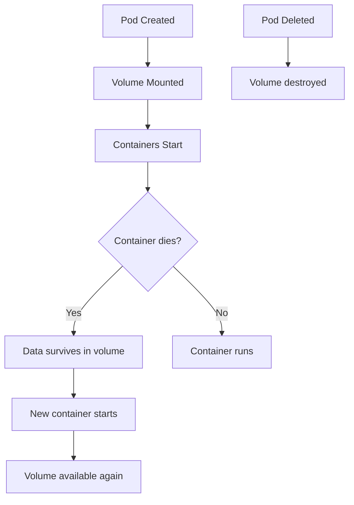

# Volume

> **Category:** Core Concept / Storage
> **Also known as:** Kubernetes Volume, Pod Volume

## What It Is

A **Volume** is a directory containing data that is accessible to containers in a Pod. Volumes outlive the lifecycle of individual containers — they persist even if the containers crash or are restarted. Volumes are backed by a variety of storage backends (local disk, cloud storage, network file systems).

## Why It Exists

Container file systems are ephemeral:
- If a container dies, its filesystem is destroyed
- Containers in the same pod cannot easily share data
- No persistence across container restarts within a pod

Volumes solve this by providing **persistent, shared storage** that survives container lifecycle events.

## Architecture

```mermaid
graph TD
    A[Pod] --> B[Volume<br/>Shared directory]
    A --> C[Container 1<br/>mounts volume at /data]
    A --> D[Container 2<br/>mounts volume at /shared]
    B --> E[Storage Backend<br/>emptyDir | hostPath | NFS | PV]
    C --> B
    D --> B
    E --> B
```

## Volume Types

| Volume Type | Persistent? | Shared? | Backing Store | Use Case |
|-------------|-------------|---------|---------------|----------|
| `emptyDir` | No | Yes (within pod) | Node local disk | Temporary data, cache |
| `hostPath` | Yes (on host) | Limited | Node filesystem | Node-local data |
| `persistentVolumeClaim` | Yes | Yes (cluster-wide) | PV | Persistent storage |
| `configMap` | No | Yes | ConfigMap data | Injecting config |
| `secret` | No | Yes | Secret data | Injecting secrets |
| `nfs` | Yes | Yes | Network FS | Cross-pod sharing |
| `awsElasticBlockStore` | Yes | No | AWS EBS | AWS block storage |
| `azureDisk` | Yes | No | Azure Disk | Azure block storage |
| `gcePersistentDisk` | Yes | Yes (read-only) | GCP PD | GCP block storage |

## Volume Lifecycle



## Volume vs HostPath vs PVC

| Feature | Volume (emptyDir) | HostPath | PVC (PV) |
|---------|-------------------|----------|----------|
| Storage Backend | Node local disk | Node filesystem | Network/Cloud storage |
| Persistence on Pod delete | ❌ Destroyed | ✅ Survives | ✅ Survives |
| Shared across Pods | ❌ Pod-scoped | ⚠️ Node-scoped | ✅ Shared |
| Access by multiple containers | ✅ Yes | ✅ Yes (same node) | ✅ Yes (RWO/RWX) |
| Portable across nodes | ✅ | ❌ | ✅ |
| Backup/Restore | ❌ Manual | ❌ | ✅ |

## Volume Configuration

### emptyDir

```yaml
apiVersion: v1
kind: Pod
metadata:
  name: emptydir-pod
spec:
  containers:
  - name: app
    image: nginx
    volumeMounts:
    - name: cache-volume
      mountPath: /usr/share/nginx/html
  volumes:
  - name: cache-volume
    emptyDir: {}                          # Node local storage
```

### emptyDir with `medium: Memory` (tmpfs)

```yaml
  volumes:
  - name: cache-volume
    emptyDir:
      medium: Memory                       # Uses /dev/shm (RAM-backed)
      sizeLimit: 500Mi                     # Limit size (default: half of available)
```

### hostPath

```yaml
  volumes:
  - name: host-data
    hostPath:
      path: /var/data                     # Path on the host node
      type: DirectoryOrCreate             # DirectoryOrCreate | FileOrCreate | Directory | File | Socket | CharDevice | BlockDevice
```

### NFS

```yaml
  volumes:
  - name: nfs-volume
    nfs:
      server: nfs-server.example.com
      path: /shared/data
      readOnly: false
```

### Persistent Volume Claim (PVC)

```yaml
  volumes:
  - name: storage
    persistentVolumeClaim:
      claimName: my-pvc
```

## subPath (Mounting a Single File)

```yaml
volumeMounts:
- name: config-volume
  mountPath: /etc/nginx/nginx.conf
  subPath: nginx.conf          # Mount a single file instead of the whole directory
  readOnly: true
```

## Read-Only Volumes

```yaml
spec:
  containers:
  - name: app
    volumeMounts:
    - name: data
      mountPath: /data
      readOnly: true            # Container cannot modify the volume
```

## Checking Volumes

```bash
# List volumes in a pod
kubectl get pod <name> -o jsonpath='{.spec.volumes}'

# Check volume mounts
kubectl get pod <name> -o jsonpath='{.spec.containers[*].volumeMounts}'

# Describe shows volume info
kubectl describe pod <name>
```

## Common Issues

### Mount conflicts
```bash
# Check which pods share the volume
kubectl get pods -o json | jq '.items[].spec.volumes'

# If two pods try to mount an RWO volume, the second fails
kubectl describe pod <pending-pod>  # look for mount conflicts
```

### Read-only file system
```bash
# If a container can't write to a mount point
kubectl describe pod <name>
# Ensure the volume isn't mounted as read-only, OR
# ensure the application has the right permissions
```

### Volume permissions (SELinux/AppArmor)

```yaml
# If SELinux blocks access
spec:
  containers:
  - securityContext:
      privileged: true         # Sometimes needed for hostPath
      seLinuxOptions:
        level: "s0:c123,c456"
```

## Best Practices

1. **Use PVCs for persistence** — not hostPath (hostPath is tied to a node)
2. **EmptyDir for temp data** — cache, scratch space
3. **Set subPath** — to mount a single file from a ConfigMap
4. **Mount read-only** — for config/secrets to prevent accidental writes
5. **Avoid `:latest` tags** — for predictable behavior
6. **Use volume Mount propagation cautiously** — `hostToContainer`, `rslave`
7. **Check volume size** — PVC storage requests need to match SC capacity
8. **Use `mountPropagation`** — when containers need to see mounts made by other containers

## Interview Questions

**Q: What is the difference between a Volume and a PersistentVolume?**
A: A Volume is defined inline in a Pod spec and is tied to the pod's lifecycle. A PersistentVolume is a cluster-scoped resource decoupled from any individual pod — pods reference it via a PersistentVolumeClaim.

**Q: What happens to an emptyDir volume when a Pod is deleted?**
A: The emptyDir volume is destroyed along with the Pod — it does not survive pod deletion.

**Q: Can two pods share an emptyDir volume?**
A: No. emptyDir is scoped to a single Pod — only containers within the same pod can share it.

**Q: How do you share a file from a ConfigMap without mounting the whole directory?**
A: Use `subPath` in the volumeMount to mount a single key as a file:
```yaml
volumeMounts:
- name: config
  mountPath: /etc/app.conf
  subPath: app.conf
```

## Related Resources

- [PersistentVolume](persistent-volumes.md)
- [StorageClass](../05-storage/storage-classes.md)
- [ConfigMap](configmaps.md)
- [Secret](secrets.md)
- [kubectl Cheatsheet](../cheat-sheets/kubectl.md)
