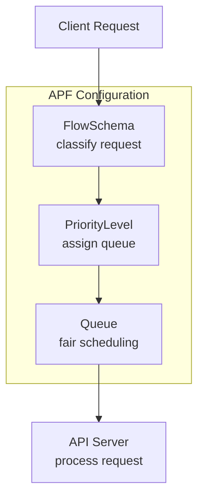

# API Priority and Fairness (APF)

> **Category:** Architecture / API Server

## What It Is

**API Priority and Fairness (APF)** is a flow-control mechanism for the Kubernetes API server. It replaces the simple QPS/burst rate limiter with a sophisticated system that prevents thundering herd problems while ensuring fair access across clients.

## Why It Exists

| Problem | Without APF | With APF |
|---------|-------------|----------|
| Thundering herd | All requests hit API server simultaneously | Requests queued by priority |
| Starvation | High-volume clients consume all capacity | Fair queuing across FlowSchemas |
| No prioritization | All requests equal | System-critical requests get higher priority |
| Cascading failure | API server overload → all clients fail | Controlled shedding by priority |

## Architecture



## Key Concepts

| Concept | Description |
|---------|-------------|
| **FlowSchema** | Classifies incoming requests into flows (by user, verb, resource, etc.) |
| **PriorityLevel** | Assigns requests to a priority level with queuing |
| **Queue** | Buffers requests within a priority level |
| **Concurrency shares** | How much API server capacity each priority level gets |

## Default FlowSchemas

| FlowSchema | Priority Level | Matches |
|------------|---------------|---------|
| `system-high-priority` | system-top-priority | System-critical (kubelet, kube-apiserver) |
| `system-critical-priority` | system-critical | kube-system, kube-public ServiceAccounts |
| `leader-election` | leader-election | Controller leader election |
| `workload-high-priority` | workload-high | High-priority workloads |
| `workload-low-priority` | workload-low | Default for most workloads |
| `global-default` | global-default | Unmatched requests |
| `catch-all` | catch-all | Safety net (should rarely match) |

## Example: Custom FlowSchema

```yaml
apiVersion: flowcontrol.apiserver.k8s.io/v1
kind: FlowSchema
metadata:
  name: my-app-schema
spec:
  matchingPrecedence: 1000  # Lower = higher priority match
  priorityLevelConfiguration:
    name: my-app-priority
  rules:
  - subjects:
    - kind: ServiceAccount
      serviceAccount:
        name: my-app
        namespace: production
    resourceRules:
    - verbs: ["get", "list", "watch"]
      apiGroups: ["*"]
      resources: ["*"]
      namespaces: ["*"]
```

## Example: Custom PriorityLevelConfiguration

```yaml
apiVersion: flowcontrol.apiserver.k8s.io/v1
kind: PriorityLevelConfiguration
metadata:
  name: my-app-priority
spec:
  type: Limited
  limited:
    nominalConcurrencyShares: 30  # Share of API server capacity
    limitResponse:
      type: Queue
      queuing:
        queues: 16
        handSize: 6
        queueLengthLimit: 50
```

## Priority Level Allocation

| Level | Share | Use Case |
|-------|-------|----------|
| system-top-priority | 0 | Reserved for system |
| system-critical | 30 | kube-system components |
| leader-election | 10 | Controller leader election |
| workload-high | 40 | Critical workloads |
| workload-low | 20 | Default workloads |
| global-default | 5 | Unmatched requests |

## Commands

```bash
# List FlowSchemas
kubectl get flowschemas

# Describe a FlowSchema
kubectl describe flowschema my-app-schema

# List PriorityLevelConfigurations
kubectl get prioritylevelconfigurations

# Check APF metrics
kubectl get --raw /metrics | grep apiserver_flowcontrol

# Watch FlowSchema changes
kubectl get flowschemas -w
```

## Metrics

| Metric | Description |
|--------|-------------|
| `apiserver_flowcontrol_dispatched_requests_total` | Requests dispatched |
| `apiserver_flowcontrol_current_inqueue_requests` | Requests in queue |
| `apiserver_flowcontrol_rejected_requests_total` | Requests rejected (queue full) |
| `apiserver_flowcontrol_request_wait_duration_seconds` | Time requests wait in queue |

## Best Practices

1. **Don't disable APF** — it protects the API server from overload
2. **Monitor queue depth** — high queue depth = potential bottleneck
3. **Use custom FlowSchemas** for critical workloads
4. **Tune concurrency shares** based on workload importance
5. **Set queue limits** to prevent memory exhaustion

## Common Issues

| Symptom | Cause | Fix |
|---------|-------|-----|
| Requests timing out | Queue full or priority too low | Increase queue size or priority |
| High latency | Low concurrency shares | Increase nominalConcurrencyShares |
| Rejected requests | Queue limit exceeded | Increase queueLengthLimit or add FlowSchema |
| kubelet errors | APF misconfigured | Check system-high-priority FlowSchema |

## Related

- [kube-apiserver](kube-apiserver.md)
- [RBAC](../06-security/rbac.md)
- [Architecture](architecture.md)
