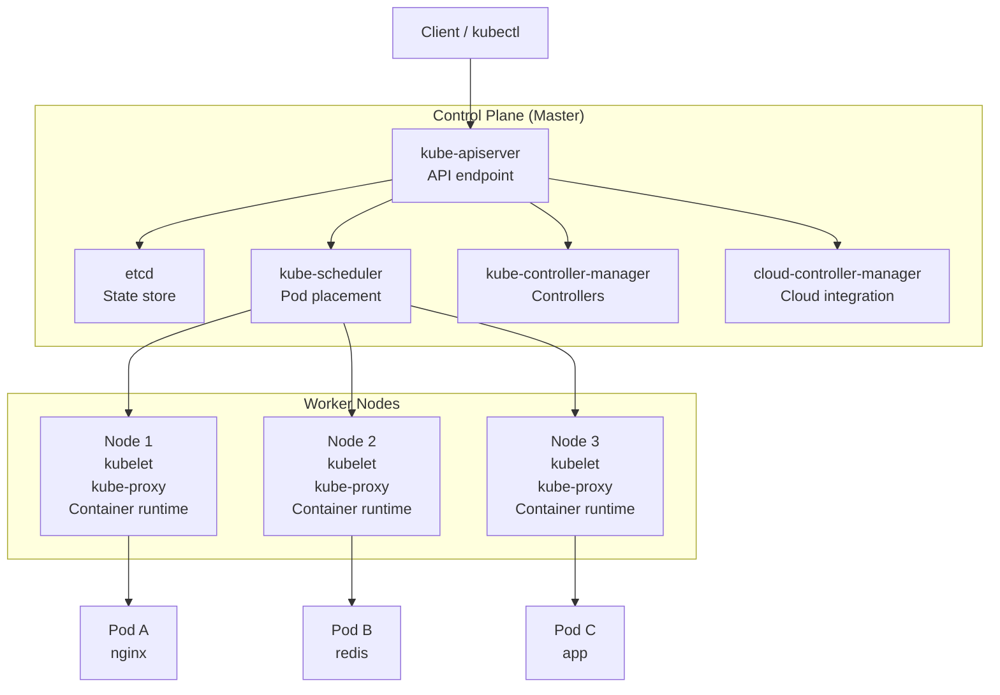
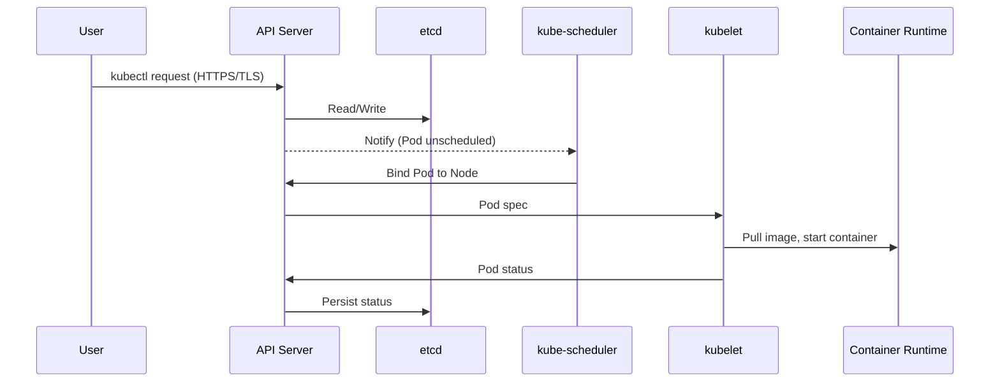

# Kubernetes Architecture

> **Category:** Architecture

## What It Is

The Kubernetes architecture follows a **control plane + worker nodes** model. The control plane makes global decisions (scheduling, scaling, updates), while worker nodes run containers and report back.

## Why It Exists

A distributed system needs a clear separation between:
- **Control Plane** — global cluster state and decisions
- **Worker Nodes** — running actual workloads

This separation provides centralized management of cluster state and decentralized execution.

## Architecture Diagram



## Control Plane Components

### kube-apiserver
- Entry point for all requests (kubectl, UI, controllers)
- Validates and processes REST requests
- Authenticates and authorizes all operations
- Stores/retrieves state from etcd

### etcd
- Distributed, reliable key-value store (Raft consensus)
- Stores the **entire cluster state**
- Backed up regularly for disaster recovery

### kube-scheduler
- Watches newly-created **unscheduled Pods**
- Selects the best Node via filtering + scoring
- Pluggable (can add custom schedulers)

### kube-controller-manager
Runs the built-in controllers (node, replication, endpoints, service-account/token, etc.) — 15+ controllers.

### cloud-controller-manager
- Links Kubernetes to a cloud provider
- Manages cloud-specific resources (LBs, volumes, routes)
- Pluggable (vendor-specific)

## Worker Node Components

| Component | Purpose |
|-----------|---------|
| **kubelet** | Node agent — ensures containers run, reports status |
| **kube-proxy** | Network proxy — implements Services (IPVS/IPTables) |
| **Container Runtime** | Pulls images, runs containers |

## Self-Hosted Control Plane (kubeadm)

On kubeadm clusters, core components run as **static pods** in `/etc/kubernetes/manifests/`.

| Component | Static Pod Path |
|-----------|-----------------|
| kube-apiserver | /etc/kubernetes/manifests/kube-apiserver.yaml |
| etcd | /etc/kubernetes/manifests/etcd.yaml |
| kube-scheduler | /etc/kubernetes/manifests/kube-scheduler.yaml |
| kube-controller-manager | /etc/kubernetes/manifests/kube-controller-manager.yaml |

## High Availability (HA)

- 3/5/7 member etcd cluster (quorum = `(N-1)/2` failures tolerated)
- Multiple kube-apiserver instances behind a load balancer (port 6443)
- kube-scheduler and kube-controller-manager via leader election (or stacked)

## Communication Flow



## Network Architecture

| Layer | Component | CIDR (typ.) | Purpose |
|-------|-----------|-------------|---------|
| Service Network | kube-apiserver | 10.96.0.0/12 | ClusterIP virtual IPs |
| Pod Network | CNI plugin | 10.244.0.0/16 | Pod-to-Pod IP routing |
| Node Network | OS | Node IPs | Host-level networking |

## Cluster vs Node Responsibilities

| Task | Handled By |
|------|-----------|
| Scheduling decisions | kube-scheduler (control plane) |
| Container lifecycle | kubelet (worker nodes) |
| Service virtual IPs | kube-proxy (worker nodes) |
| Authentication/authorization | kube-apiserver |
| Pod-to-Pod networking | CNI (on workers) |
| Storage provisioning | CSI driver (on nodes) |

## Code Example: Inspecting Architecture

```bash
# Control plane components (static pods)
kubectl get pods -n kube-system | grep -E 'kube-apiserver|etcd|scheduler|controller'

# Worker node components
kubectl get nodes -o wide  # shows kubelet version on each node
kubectl get --raw=/api/v1/nodes/<node-name>/proxy/stats/summary  # node metrics

# etcd backup
kubectl -n kube-system exec etcd-master -- sh -c "etcdctl snapshot save /var/lib/etcd/snapshot.db"
```

## Related Components

- [kube-apiserver](kube-apiserver.md)
- [etcd](etcd.md)
- [kube-scheduler](kube-scheduler.md)
- [kube-controller-manager](kube-controller-manager.md)
- [kubelet](kubelet.md)
- [kube-proxy](kube-proxy.md)
- [Container Runtimes](container-runtimes.md)
