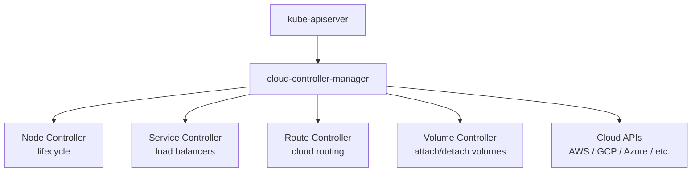
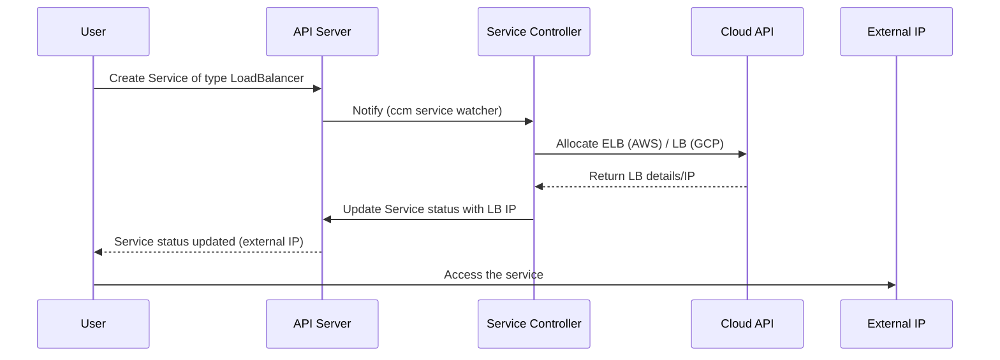

# cloud-controller-manager

> **Category:** Architecture / Control Plane
> **Also known as:** CCM (Cloud Controller Manager)

## What It Is

The **cloud-controller-manager** (CCM) is a Kubernetes control plane component that **embeds cloud-specific control logic**. It runs and links the Kubernetes control plane to various cloud providers' API(s), while decoupling cloud-specific code from the core Kubernetes codebase.

## Why It Exists

Before the CCM, Kubernetes had **cloud provider code hardcoded** into:
- kube-apiserver (authentication with cloud IAM)
- kube-controller-manager (node lifecycle, routes, load balancers)
- kubelet (volume attachment, cloud routes)

This coupling made it difficult to:
- Run Kubernetes on **non-cloud** (on-prem, bare metal) without cloud code
- **Swap cloud providers** without rebuilding components
- **Upgrade Kubernetes** without touching provider logic
- Apply **security patches** to just the provider code

The CCM solves this by making cloud integration **pluggable**.

## Architecture



## Cloud Controller Plugins

The CCM uses **cloud provider plugins**. Each implements:
- Initialization of the cloud driver
- Node lifecycle (routes, IPs, load balancers)
- Volume attachment (CSI/legacy)
- Service load balancers
- Routes (networking)
- Zone/region information

### Supported Cloud Providers

| Provider | Maintainer | Plugin Name |
|----------|-----------|-------------|
| **AWS** | Amazon + Kubernetes SIG Cloud Provider | `aws` |
| **GCP** | Google + Kubernetes SIG | `gce` |
| **Azure** | Microsoft + Kubernetes SIG | `azure` |
| **vSphere** | VMware + Kubernetes SIG | `vsphere` |
| **DigitalOcean** | DigitalOcean | `digitalocean` |
| **OpenStack** | OpenStack Foundation | `openstack` |
| **Hetzner** | Community | `hcloud` |
| **Scaleway** | Community | `scaleway` |
| **Oracle Cloud** | Oracle | `oci` |
| **Alibaba Cloud** | Alibaba | `alibaba` |

## CCM Components (Controllers)

| Controller | Responsibility |
|------------|----------------|
| **Node Controller** | Updates the node object with cloud-specific info (labels, addresses, provider ID) |
| **Service Controller** | Provisions/removes cloud load balancers for Services of type `LoadBalancer` |
| **Route Controller** | Creates/manages cloud routes/networking rules |
| **Volume (PV) Controller** | Attaches/detaches cloud storage to nodes (for in-tree volume plugins) |
| **CSR (Storage) Controller** | Approve node storage CSI driver certificates |

## Running the CCM

### In-tree (Legacy) vs Out-of-Tree (Modern)

| | In-tree cloud providers | Cloud Controller Manager (CCM) |
|---|---|---|
| Introduced | Kubernetes 1.0 | Kubernetes 1.6 |
| Cloud code location | Inside kube-controller-manager | Separate process |
| Enable flag | `--cloud-provider=<name>` on controller-manager | Separate deployment |
| Deprecation | Being phased out | ✅ Recommended (default from 1.21+) |

### CCM Deployment (Helm or manifest)

```yaml
# cloud-controller-manager.yaml (Deployment)
apiVersion: apps/v1
kind: Deployment
metadata:
  name: cloud-controller-manager
  namespace: kube-system
spec:
  replicas: 1
  selector:
    matchLabels:
      component: cloud-controller-manager
  template:
    metadata:
      labels:
        component: cloud-controller-manager
    spec:
      containers:
      - name: cloud-controller-manager
        image: docker.io/k8sccbr/cloud-controller-manager:v1.1.0
        command:
        - /usr/local/bin/cloud-controller-manager
        - --cloud-provider=aws
        - --cloud-config=/etc/kubernetes/cloud-config
        - --leader-elect=true
        - --kubeconfig=/etc/kubernetes/ccm.kubeconfig
        env:
        - name: AWS_ACCESS_KEY_ID
          valueFrom:
            secretKeyRef:
              name: ccm-credentials
              key: access-key
        volumeMounts:
        - mountPath: /etc/kubernetes
          name: config
          readOnly: true
        securityContext:
          privileged: true
      hostNetwork: false
      nodeSelector:
        node-role.kubernetes.io/master: ""
      tolerations:
      - key: node-role.kubernetes.io/control-plane
        effect: NoSchedule
        operator: Exists
      volumes:
      - hostPath:
          path: /etc/kubernetes
          type: DirectoryOrCreate
        name: config
```

## How CCM Integrates with Kubernetes



## Node Lifecycle with CCM

The CCM also updates the **node object** with cloud-specific metadata:

| Source | Populated Field |
|--------|----------------|
| Cloud VM labels | `spec.labels` (`topology.kubernetes.io/zone`, etc.) |
| Cloud provider | `spec.providerID` (`aws:///us-east-1a/i-...`) |
| Cloud metadata | `status.addresses` (ExternalIP, InternalIP, etc.) |

## Common Issues

### CCM not running
```bash
kubectl get ds -n kube-system -l component=cloud-controller-manager
# Should show one pod per cloud provider component
kubectl logs -n kube-system -l component=cloud-controller-manager
```

### Service type LoadBalancer stuck in pending
```bash
kubectl describe svc my-service
# In Events: "service controller didn't find load balancer"
# Check CCM logs for cloud API errors
kubectl logs -n kube-system -l component=cloud-controller-manager
```

### Node not getting cloud labels
```bash
kubectl describe node <node>
# Check for cloud labels (topology.kubernetes.io/zone, etc.)
# Verify providerID is populated:
kubectl get node <node> -o jsonpath='{.spec.providerID}'
# If empty, CCM node controller is not running
```

### Cloud credentials invalid
```bash
# CCM cannot reach cloud APIs
kubectl logs -n kube-system -l component=cloud-controller-manager
# Look for "access denied", "authentication failed"
```

## Removing the CCM (On-Prem / Bare Metal)

For clusters not on a cloud provider, the CCM simply doesn't run:

```bash
# On kubeadm, the CCM is not installed by default for non-cloud
# Or, for in-tree providers, set --cloud-provider=external

# kubeadm config:
apiServer:
  extraArgs:
    cloud-provider: "external"
controllerManager:
  extraArgs:
    cloud-provider: "external"
```

Then the cloud-provider cloud-controller-manager is run separately (if needed).

## Related Resources

- [Architecture](architecture.md)
- [kube-controller-manager](kube-controller-manager.md)
- [Cloud Integrations](../companies-using-kubernetes.md)
- [kubectl Cheatsheet](../cheat-sheets/kubectl.md)