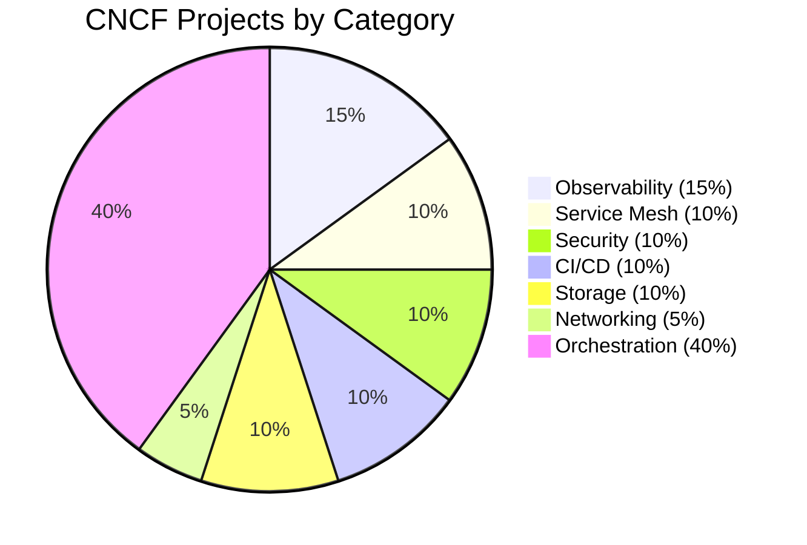

# CNCF Landscape

> **Category:** Architecture / Ecosystem

## What It Is

The **CNCF (Cloud Native Computing Foundation) Landscape** is a map of the open-source projects and companies in the cloud native ecosystem. Kubernetes sits at the center, with projects spanning the entire stack: service mesh, security, CI/CD, monitoring, storage, and more.

## Why It Exists

The Kubernetes ecosystem is vast — the CNCF Landscape helps you navigate:
- **Which tools** are production-ready (Graduated, Incubating)
- **Where each tool fits** in the stack
- **Avoiding overlap** and duplicate functionality
- Understanding the **interoperability layer** (Kubernetes API)

## How to Read the Landscape

Each project on the landscape is color-coded by **graduation status**:

| Color | Status | Maturity | Notes |
|-------|--------|----------|-------|
| 🔘 **Graduated** | GA/Stable | Production | E.g., Prometheus, Istio |
| ◻️ **-incubating** | Beta | Production candidates | E.g., Linkerd (was), Falco |
| ⬚ **Sandbox** | Alpha | Experimental | New projects under incubation |
| ⬜️ **Uncategorized** | — | — | Not yet reviewed |

## Landscape Categories

```mermaid
graph TD
    A[Kubernetes\nCore orchestrator] --> B[Runtime]
    A --> C[Service Mesh]
    A --> D[Service Discovery & Mesh Management]
    A --> E[Network]
    A --> F[Storage]
    A --> G[Container Registry]
    A --> H[CI/CD]
    A --> I[Security & Compliance]
    A --> J[Observability & Analysis]

    B --> B1[containerd]
    B --> B2[CRI-O]
    B --> B3[runc]

    C --> C1[Istio\nGraduated]
    C --> C2[Linkerd\nIncubating]
    C --> C3[Consul\nGraduated]

    D --> D1[Consul\nDNS]
    D --> D2[etcd\nGraduated]

    E --> E1[Calico\nGraduated]
    E --> E2[Cilium\nGraduated]
    E --> E3[Flannel\nIncubating]
    E --> E4[Kube-OVN]

    F --> F1[Rook\nStorage orchestration]
    F --> F2[Cassandra]
    F --> F3[MinIO\nS3-compatible]

    G --> G1[Harbor\nGraduated]
    G --> G2[JFrog Artifactory]

    H --> H1[Argo CD\nGraduated]
    H --> H2[Flux\nGraduated]
    H --> H3[Tekton\nIncubating]
    H --> H4[Jenkins X]

    I --> I1[Prometheus\nGraduated]
    I --> I2[OpenTelemetry\nGraduated]
    I --> I3[OPA\nGraduated]
    I --> I4[Kyverno\nIncubating]
    I --> I5[Falco\nIncubating]
    I --> I6[Vault\nGraduated]

    J --> J1[Grafana\nGraduated]
    J --> J2[Jaeger\nGraduated]
    J --> J3[Loki\nIncubating]
    J --> J4[Thanos\nIncubating]
```

## Project Maturity Levels

### Graduated (GA)
These projects are **production-grade** and have graduated through the CNCF maturity levels. They are widely adopted and well-maintained.

| Project | Category | Maintainer |
|--------|----------|-----------|
| Kubernetes | Orchestration | CNCF |
| Prometheus | Observability | CNCF |
| Envoy Proxy | Networking | CNCF |
| etcd | Storage | CNCF |
| Helm | Package Mgmt | CNCF |
| Fluentd | Logging | CNCF |
| Jaeger | Tracing | CNCF |
| Istio | Service Mesh | Google + others |

### Incubating
These are **widely used** but still undergoing the final maturity process.

| Project | Category | Maintainer |
|---------|----------|-----------|
| Linkerd | Service Mesh | CNCF |
| Grafana | Observability | Grafana Labs |
| Thanos | Observability | CNCF |
| OpenTelemetry | Tracing | CNCF |
| Cilium | Networking | Isovalent |
| Falco | Runtime Security | Sysdig |

### Sandbox
Early-stage projects, experimental — not recommended for production without extensive validation.

| Project | Category | Maintainer |
|---------|----------|-----------|
| SpiceDB | Auth | Authzed |
| Caddy | Proxy | Caddy |
| Zed | Streaming | Materialize |

## Tool Categories by Function

### Application Definition & Image Build

| Project | Status | Purpose |
|---------|--------|---------|
| BuildKit | Graduated | Container image building |
| Kaniko | Incubating | K8s-native image builds |
| Ko | Sandboxed | Containerize Go code |
| Packer | Graduated | Machine image building |

### Continuous Integration & Delivery (CI/CD)

| Project | Status | Purpose |
|---------|--------|---------|
| Argo CD | Graduated | GitOps continuous delivery |
| Argo Workflows | Incubating | Container-native workflows |
| Flux | Graduated | GitOps toolkit |
| Tekton | Incubating | CI/CD framework |
| Jenkins X | Sandboxed | CI/CD for cloud native |
| Spinnaker | Sandboxed | Multi-cloud deployment |

### Orchestration & Management

| Project | Status | Purpose |
|---------|--------|---------|
| Kubernetes | Graduated | Container orchestration |
| Karmada | Incubating | Multi-cloud & multi-cluster |
| KubeFed | Sandboxed | Federation |
| KubeEdge | Incubating | Edge computing |
| OpenYurt | Incubating | Edge/IoT |

### Networking & CNI

| Project | Status | Purpose |
|---------|--------|---------|
| Calico | Graduated | Network policy, CNI |
| Cilium | Graduated | eBPF-based CNI |
| Cilium CNI | Graduated | — |
| Flannel | Incubating | Overlay CNI |
| Kube-OVN | Incubating | SDN CNI |
| Multus | Sandboxed | Multi-interface CNI |
| Weave Net | Sandboxed | Cross-cluster networking |

### Service Mesh

| Project | Status | Purpose |
|---------|--------|---------|
| Istio | Graduated | Feature-rich service mesh |
| Linkerd | Incubating | Lightweight service mesh |
| Consul | Graduated | Service mesh + service discovery |
| Kuma | Incubating | Multi-zone service mesh |
| OpenServiceMesh | Incubating | CNCF service mesh |

### Storage

| Project | Status | Purpose |
|---------|--------|---------|
| Rook | Incubating | Storage orchestration (Ceph, Cassandra) |
| Longhorn | Incubating | Distributed block storage |
| OpenEBS | Incubating | Containerized storage |
| MinIO | Graduated | S3-compatible object storage |
| Velero | Incubating | Backup/restore |

### Security & Compliance

| Project | Status | Purpose |
|---------|--------|---------|
| OPA (Open Policy Agent) | Graduated | Policy engine |
| Kyverno | Incubating | Policy management |
| Falco | Incubating | Runtime threat detection |
| Trivy | Incubating | Vulnerability scanner |
| Notary / TUF | Graduated | Signing & verification |
| SPIFFE/SPIRE | Incubating | Identity & SPIFFE |
| Vault | Graduated | Secrets management |

### Observability & Analysis

| Project | Status | Purpose |
|---------|--------|---------|
| Prometheus | Graduated | Metrics collection |
| Grafana | Graduated | Visualization |
| OpenTelemetry | Graduated | Observability framework |
| Jaeger | Graduated | Distributed tracing |
| Loki | Incubating | Log aggregation |
| Thanos | Incubating | Prometheus HA/higher retention |
| Cortex | Incubating | Prometheus-as-a-Service |
| Tempo | Incubating | Tracing backend |
| Elastic | Graduated | Logging (ELK) |
| Fluent Bit | Graduated | Log processor |
| Vector | Incubating | Log & metric pipeline |

## Kubernetes in the Stack

## How to Use the Landscape

1. **Pick graduated projects** — they're production-ready (Prometheus, Istio, Helm)
2. **Evaluate incubating projects** — widely adopted (Linkerd, Grafana, OpenTelemetry)
3. **Sandbox** — use for experimentation
4. **Consider interoperability** — does the tool speak K8s API or standard protocols?

## Related Resources

- [Interactive Landscape](https://landscape.cncf.io/)
- [CNCF Website](https://www.cncf.io/)
- [Architecture](architecture.md)
- [Cloud Integrations](../companies-using-kubernetes.md)
EOF
echo "cncf-landscape.md written"