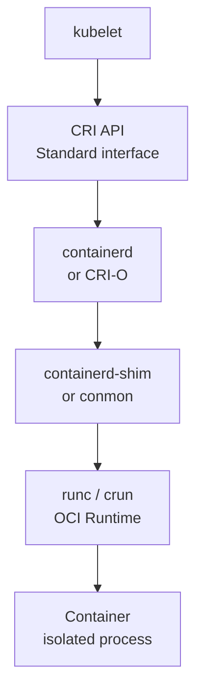
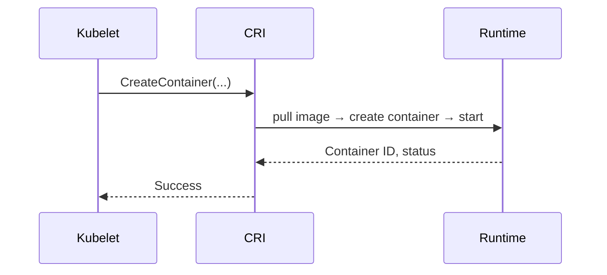

# Container Runtimes

> **Category:** Architecture / Worker Node
> **Also known as:** Container Runtime Interface (CRI), CRI-O, containerd, Docker

## What It Is

A **container runtime** is software that **runs and manages container images** (Docker images) on a node. Kubernetes interacts with runtimes through the **Container Runtime Interface (CRI)** — a standard plugin API. The three major runtimes are **containerd**, **CRI-O**, and the (now removed) Docker.

## Why It Exists

Kubernetes needs an abstraction layer between the orchestration engine and the container runtime:
- Decouples Kubernetes from specific runtimes
- Enables swapping runtimes without reconfiguring clusters
- Standardizes how containers are created, started, stopped, and inspected

## Container Runtime Architecture



## The Three Runtimes

### 1. containerd (Default)

| Feature | containerd |
|---------|------------|
| **Default in** | EKS, GKE, AKS, kubeadm |
| **Backed by** | Docker/dockerd (original project) |
| **Runtime** | runc (default; supports any OCI runtime) |
| **CRI plugin** | Built-in (since containerd 1.1) |
| **Maturity** | High — battle-tested |
| **Use case** | General purpose, broad support |

### 2. CRI-O

| Feature | CRI-O |
|---------|-------|
| **Built for** | Kubernetes only |
| **Runtime** | runc or crun |
| **Image format** | OCI / Docker |
| **Registry auth** | Built-in, Kubernetes secrets |
| **Maturity** | Stable — RH, Fedora ecosystems |
| **Use case** | OpenShift, Fedora CoreOS |

### 3. Docker (Deprecated)

| Feature | Docker |
|---------|--------|
| **Status** | ❌ **Removed** in K8s 1.24+ |
| **Reason** | Docker never implemented CRI natively |
| **Legacy mode** | dockershim (removed in 1.27) |
| **Use if...** | Never (use containerd directly instead) |

## CRI (Container Runtime Interface)

The **Container Runtime Interface (CRI)** defines the interface between kubelet and the container runtime:



| CRI RPC | Purpose |
|---------|---------|
| `RunPodSandbox` | Create pod sandbox (pause container) |
| `CreateContainer` | Create a container |
| `StartContainer` | Start a container |
| `StopContainer` | Stop a container |
| `RemoveContainer` | Remove a container |
| `Status` | Container status |
| `ListContainerStatuses` | List statuses |
| `Exec` | Execute a process |
| `Attach` | Attach to a container |
| `PortForward` | Port forwarding |

## OCI Runtime

The OCI (Open Container Initiative) runtime executes container processes:

| OCI Runtime | Features | Used By |
|-------------|----------|---------|
| **runc** | Default, Linux namespaces + cgroups | containerd, CRI-O |
| **crun** | Written in C (lighter), Rust support | CRI-O, containerd (optional) |
| **gvisor** | User-space kernel, stronger isolation | GKE (gVisor sandboxes) |
| **kata-runtime** | VM-based isolation | Kata Containers |

## Runtime Selection

| Scenario | Runtime |
|----------|---------|
| General-purpose clusters | **containerd** |
| High-security / isolation | **CRI-O + crun** or **gVisor** |
| OpenShift | **CRI-O** |
| Lightweight / embedded | **containerd**, k3s |

## Configuring CRI in Kubernetes

### containerd (default)

```toml
# /etc/containerd/config.toml
version = 2
[plugins]
  [plugins."io.containerd.grpc.v1.cri"]
    # Use a specific sandbox image
    sandbox_image = "registry.k8s.io/pause:3.9"
    # Set containerd as the CRI runtime
    containerd_runtimes:
      [plugins."io.containerd.grpc.v1.cri".containerd.runtimes.runc]
        runtime_type = "io.containerd.runc.v2"
        [plugins."io.containerd.grpc.v1.cri".containerd.runtimes.runc.options]
          BinaryName = ""
          # Use systemd cgroup driver
          SystemdCgroup = true
  # Configure registries (optional)
  [plugins."io.containerd.grpc.v1.cri".registry]
    [plugins."io.containerd.grpc.v1.cri".registry.mirrors]
      [plugins."io.containerd.grpc.v1.cri".registry.mirrors."docker.io"]
        endpoint = ["https://registry-1.docker.io"]
```

```bash
# kubelet flag to point to containerd socket
--container-runtime-endpoint=unix:///var/run/containerd/containerd.sock
```

### CRI-O

```ini
# /etc/crio/crio.conf
[crio.runtime]
runtime = "runc"
conmon_cgroup = "cgroupfs"
cgroup_manager = "systemd"
# Set pause image
pause_image = "registry.k8s.io/pause:3.9"
# Default capabilities
default_capabilities = [
  "CHOWN", "DAC_OVERRIDE", "FSETID", "FOWNER",
  "NET_RAW", "KILL", "MKNOD", "SETFCAP",
  "SETGID", "SETUID", "SETFCAP"
]
```

## Checking Your Runtime

```bash
# On the worker node
ps -ef | grep -E 'containerd|crio|docker'
systemctl status containerd
systemctl status crio

# From kubectl
kubectl get --raw=/api/v1/nodes/<node-name>/proxy/stats/summary | jq -r '.node.runtime.name'

# Or check the CRI socket
ls /var/run/containerd/containerd.sock
ls /var/run/crio/crio.sock
```

## Commands by Runtime

### containerd

```bash
# List images
ctr images ls

# List containers
ctr containers ls

# Using nerdctl (modern CLI for containerd)
nerdctl images
nerdctl ps
nerdctl exec -it <container> sh

# Run a container directly (no K8s)
ctr i pull docker.io/library/nginx:latest
ctr c create docker.io/library/nginx:latest test-nginx

# Stop a container
ctr c stop <container-id>
```

### CRI-O

```bash
# List images
crictl images

# List containers (with CRI)
crictl ps

# Exec into container
crictl exec -it <container-id> /bin/sh

# View container logs
crictl logs <container-id>

# List pods (CRI-level)
crictl pods

# Stop a pod sandbox
crictl stop <pod-id>
```

### Docker (legacy)

```bash
# If still somehow in use
docker ps
docker images
docker rmi <image>
```

## Runtime Comparison

| Feature | containerd | CRI-O | Docker (dockershim) |
|---------|------------|-------|---------------------|
| **Default in kubeadm** | ✅ Yes (since 1.24) | No | ❌ Removed |
| **OpenShift** | No (uses CRI-O) | ✅ Yes | ❌ |
| **EKS** | ✅ Yes | Optional | ❌ |
| **Memory overhead** | Moderate | Low | Higher |
| **Rootless support** | ✅ Yes | ✅ Yes | Limited |
| **OCI compatible** | ✅ Yes | ✅ Yes | ❌ |
| **Rootless containers** | ✅ (via slirp4netns) | ✅ | ❌ |
| **Image signing** | ✅ (cosign) | ✅ | ❌ |
| **Security scanning** | ✅ | ✅ | ❌ |
| **Complexity** | Low | Lower than containerd | Higher |
| **Image management** | `ctr`, `nerdctl` | `crictl`, `podman` | `docker` CLI |

## Security Features

| Feature | containerd | CRI-O |
|---------|------------|-------|
| **Rootless mode** | With `rootlesskit` | Native support |
| **Signature verification** | `cosign`, Notary | Built-in (docker manifest |
| **Seccomp** | ✅ | ✅ |
| **SELinux** | ✅ | ✅ |
| **AppArmor** | ✅ | ✅ |
| **Image signing** | `cosign` integration | Built-in `sigstore` |

## Migration from Docker to containerd

If migrating from a Docker-based cluster (K8s < 1.24):

```bash
# Install containerd
sudo apt-get install containerd

# Configure containerd to use systemd cgroup
cat <<EOF | sudo tee /etc/containerd/config.toml
version = 2
[plugins."io.containerd.grpc.v1.cri".containerd.runtimes.runc.options]
  SystemdCgroup = true
EOF

sudo systemctl restart containerd

# Update kubelet to use containerd socket
# /etc/default/kubelet or kubelet-config.yaml
KUBELET_EXTRA_ARGS=--container-runtime-endpoint=unix:///var/run/containerd/containerd.sock

sudo systemctl restart kubelet
```

### Verifying the Migration

```bash
# Ensure the node is Ready
kubectl get nodes
kubectl describe node <node>

# Check the runtime
kubectl get node <node> -o jsonpath='{.status.nodeInfo.containerRuntimeVersion}'
# Should show: containerd://1.x.x
```

## Best Practices

1. **Use containerd as the default** — unless you're specifically using OpenShift (CRI-O)
2. **Set cgroups to `systemd`** — use `SystemdCgroup = true`
3. **Use `crictl` for debugging** — `crictl ps`, `crictl logs`, `crictl exec`
4. **Pin containerd/CRI-O versions** — to avoid runtime upgrades that break pods
5. **Monitor disk usage** — image garbage collection (`--image-gc-high-threshold`)
6. **Secure the CRI socket** — restrict access; kubelet authenticates via TLS
7. **Enable rootless mode** — where possible (for non-root users)
8. **Keep runc/selinux updated** — for CVEs

## Troubleshooting

### "container runtime is down"
```bash
# On the node
systemctl status containerd  # or crio
journalctl -u containerd -f  # check logs
crictl ps                     # can kubelet talk to the runtime?
```

### Image pull failures
```bash
sudo crictl pull nginx:1.25
# If fails: check registry access, auth, network
crictl auths    # list configured auths
```

### CRI socket not found
```bash
# Check kubelet flags
ps aux | grep kubelet
# Ensure --container-runtime-endpoint points to the correct socket
```

## Related Resources

- [kubelet](kubelet.md)
- [Architecture](architecture.md)
- [Container Security](../06-security/secrets.md)
- [kubectl Cheatsheet](../cheat-sheets/kubectl.md)
EOF
echo "container-runtimes.md written"