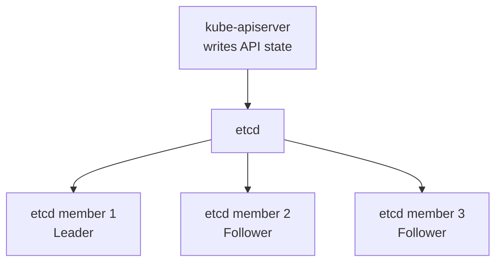

# etcd

> **Category:** Architecture / Storage

## What It Is

**etcd** is a consistent, distributed **key-value store** that serves as the backing store for all **cluster data** in Kubernetes. It stores the entire state of the cluster including nodes, pods, configs, secrets, service accounts, and more.

## Why It Exists

The Kubernetes control plane needs:
- A **single source of truth** for all cluster state
- **Strong consistency** (all reads see the latest write)
- **High availability** (cluster keeps running if one etcd dies)
- **Durability** (state persists across reboots)

etcd provides all of this via the **Raft consensus algorithm**.

## Architecture



## etcd Data Structure

etcd stores data in a hierarchical key-value structure. Kubernetes namespaces keys by API group:

| Path Prefix | Contents |
|-------------|----------|
| /registry/pods/ | All pods |
| /registry/services/ | All Services |
| /registry/configmaps/ | ConfigMaps |
| /registry/secrets/ | Secrets |
| /registry/deployments/ | Deployments |

## Raft Consensus

etcd uses Raft for consensus. A write is committed once a quorum (N/2 + 1) of members acknowledges it.

## High Availability

| Members | Failure Tolerance | Quorum |
|---------|-------------------|--------|
| 3 | 1 failure | 2 of 3 |
| 5 | 2 failures | 3 of 5 |
| 7 | 3 failures | 4 of 7 |

Always use an odd number of etcd members to avoid split-brain.

## etcd Operations

```bash
# Check version
ETCDCTL_API=3 etcdctl version

# Check health
sudo ETCDCTL_API=3 etcdctl endpoint health \
  --cacert=/etc/kubernetes/pki/etcd/ca.crt \
  --cert=/etc/kubernetes/pki/etcd/server.crt \
  --key=/etc/kubernetes/pki/etcd/server.key

# Take a snapshot
sudo ETCDCTL_API=3 etcdctl snapshot save /tmp/snapshot.db \
  --endpoints=https://127.0.0.1:2379 \
  --cacert=/etc/kubernetes/pki/etcd/ca.crt \
  --cert=/etc/kubernetes/pki/etcd/server.crt \
  --key=/etc/kubernetes/pki/etcd/server.key

# Verify snapshot
sudo ETCDCTL_API=3 etcdctl snapshot status /tmp/snapshot.db

# Restore from snapshot
sudo ETCDCTL_API=3 etcdctl snapshot restore /tmp/snapshot.db \
  --data-dir=/var/lib/etcd \
  --name=master \
  --initial-cluster-token=etcd-cluster-1 \
  --initial-advertise-peer-urls=https://<ip>:2380
```

## etcd Backup (CronJob)

```yaml
apiVersion: batch/v1
kind: CronJob
metadata:
  name: etcd-backup
  namespace: kube-system
spec:
  schedule: "0 2 * * *"
  jobTemplate:
    spec:
      template:
        spec:
          containers:
          - name: etcd-backup
            image: bitnami/etcd:latest
            command:
            - "/bin/sh"
            - "-c"
            - "ETCDCTL_API=3 etcdctl snapshot save /backup/snapshot.db"
            volumeMounts:
            - name: backup-storage
              mountPath: /backup
            - name: etcd-certificates
              mountPath: /etc/kubernetes/pki/etcd
          volumes:
          - name: backup-storage
            hostPath:
              path: /var/backups/etcd
          - name: etcd-certificates
            hostPath:
              path: /etc/kubernetes/pki/etcd
```

## Monitoring etcd

| Metric | Threshold | Issue |
|--------|-----------|-------|
| etcd_disk_backend_commit_duration_seconds | > 0.15s | Disk I/O too slow |
| etcd_disk_wal_fsync_duration_seconds | > 0.015s | WAL sync slow |
| etcd_mvcc_db_total_size_in_bytes | Near disk capacity | Database too large |
| etcd_server_has_leader | < 1 | No leader elected |
| etcd_cluster_is_follower | == 1 | Unexpected failover |

## Encryption at Rest

etcd stores secrets base64-encoded (not encrypted). Enable encryption:

```yaml
apiVersion: apiserver.config.k8s.io/v1
kind: EncryptionConfiguration
resources:
- resources:
  - secrets
  providers:
  - aescbc:
      keys:
      - name: key1
        secret: <base64-encoded-encryption-key>
  - identity: {}
```

## Common Issues

### etcd out of disk space
```bash
sudo ETCDCTL_API=3 etcdctl compact <revision>
sudo ETCDCTL_API=3 etcdctl defrag
```

### etcd member lost
```bash
sudo ETCDCTL_API=3 etcdctl member list
sudo ETCDCTL_API=3 etcdctl member remove <id>
sudo ETCDCTL_API=3 etcdctl member add <name> --peer-urls=https://<new-node>:2380
```

### etcd data corruption
```bash
sudo systemctl stop etcd
rm -rf /var/lib/etcd/*
sudo ETCDCTL_API=3 etcdctl snapshot restore /path/to/snapshot.db \
  --data-dir=/var/lib/etcd
sudo systemctl start etcd
```

## Best Practices

1. **Monitor disk I/O** — etcd needs fast disks (SSD recommended)
2. **Backup regularly** — automate snapshots
3. **Encrypt secrets at rest** — enable EncryptionConfiguration
4. **Use dedicated etcd nodes** — separate from workloads
5. **Use odd number of members** (3, 5, 7)
6. **Compact regularly** — remove old revisions
7. **Use TLS** — encrypt all etcd traffic

## Related Resources

- [kube-apiserver](kube-apiserver.md)
- [etcd Issues](../14-troubleshooting/troubleshooting-patterns.md)
- [Velero Backup](../08-cluster-operations/backup-restore.md)