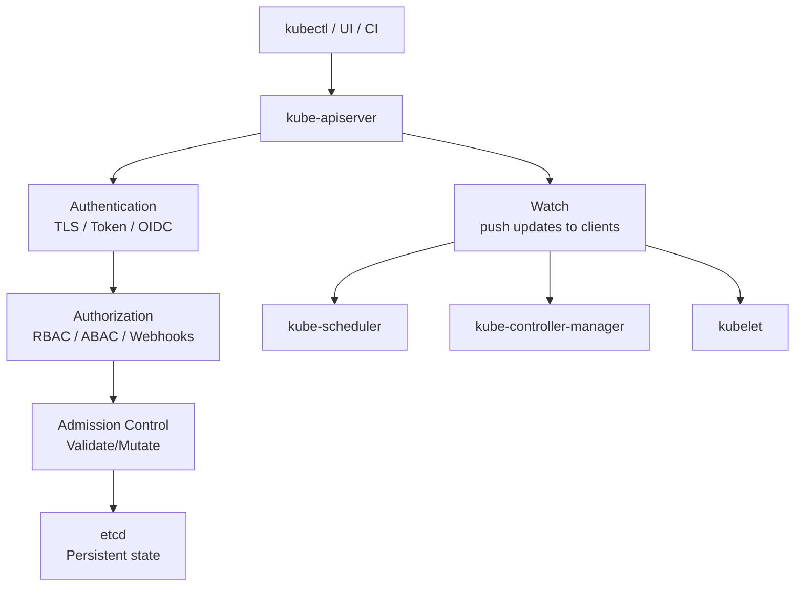
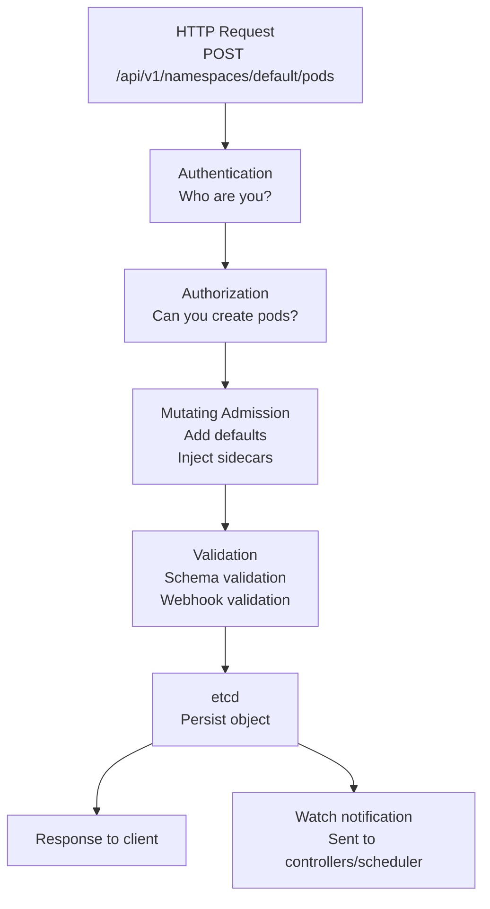

# kube-apiserver

> **Category:** Architecture
> **Also known as:** Kubernetes API Server

## What It Is

The **kube-apiserver** is the **front-facing component** of the Kubernetes control plane. It's the gateway through which all API requests (from kubectl, UI, controllers, nodes, and other clients) are routed.

## Why It Exists

You need a single entry point for:
- **Authentication** — verifying who is calling
- **Authorization** — checking if they can do what they want
- **Validation** — ensuring submitted resources meet the schema
- **Persistence** — storing state changes in etcd
- **Distribution** — pushing updates to clients via watch

The API server is the **single source of truth** — every other component talks to it.

## Architecture



## API Server Components

| Layer | Responsibility |
|-------|----------------|
| **Authentication** | Who are you? (TLS cert, bearer token) |
| **Authorization** | What can you do? (RBAC, ABAC, Webhook) |
| **Admission Controllers** | Is this change valid / should it be mutated? |
| **Mutating Webhook** | Mutate request before saving |
| **Validating Webhook** | Reject request if invalid |
| **API Server Handler** | Route request to correct resource handler |
| **Storage Interface** | Read/write to etcd |

## Authentication Methods

| Method | Description |
|--------|-------------|
| **X.509 Client Certs** | Certificates signed by cluster CA |
| **Bearer Tokens** | Static tokens (deprecated) or ServiceAccount tokens |
| **OIDC Token** | External ID provider (Google, GitHub, etc.) |
| **Anonymous** | Untrusted requests |
| **Webhook Mode** | Custom auth via webhook |
| **Proxy Auth** | Authenticate via a proxy |

```bash
# Check the API server's serving cert
kubectl get csr  # Certificate Signing Requests
```

## Authorization Modes

| Mode | Description |
|------|-------------|
| **RBAC** | Role/ClusterRole-based (default) |
| **ABAC** | Attribute-Based Access Control (legacy) |
| **Node** | Special mode for kubelet self-access |
| **Webhook** | External authorization |

```bash
# Check authorization for a user
kubectl auth can-i get pods --as=alice
kubectl auth can-i create pods --as=system:serviceaccount:default:my-sa
```

## Admission Controllers

Admission controllers are pieces of code that **intercept requests** to the API server for resources:

| Category | Controllers |
|----------|-------------|
| **Mutating** | `MutatingAdmissionWebhook`, `ServiceAccount`, `PodSecurityPolicy` |
| **Validating** | `ValidationAdmissionWebhook`, `PodSecurity`, `PodSecurityPolicy` |

### Common Admission Controllers

| Controller | Purpose |
|------------|---------|
| **PodSecurityPolicy** | Validate pod security context (deprecated in 1.25) |
| **PodSecurity** | Pod Security Standards (Replacement for PSP) |
| **ServiceAccount** | Auto-mount ServiceAccount tokens |
| **NodeRestriction** | Limit kubelet API access |
| **EventRateLimit** | Rate-limit event creation |
| **PodTolerationNode** | Tolerate node-related taints |
| **MutatingAdmissionWebhook** | Call external webhooks |

## API Groups & Versions

```bash
# List all enabled API versions
kubectl api-versions

# Core group (no group name): /api/v1
kubectl get pods

# Named groups: /apis/$GROUP_NAME/$VERSION
kubectl get ingresses.networking.k8s.io
kubectl get certificaterequests.cert-manager.io
```

### Versioning

| Status | Suffix | Notes |
|--------|--------|-------|
| Alpha | `v1alpha1` | May be dropped/changed at any time |
| Beta | `v1beta1` | Stable but may change |
| GA (Stable) | `v1` | Guaranteed for 3+ years |

## API Server Request Flow



## Commands

```bash
# View API server logs (on the control-plane node)
sudo journalctl -u kube-apiserver

# Check secure port (default: 6443)
kubectl get --raw=/healthz
kubectl get --raw=/version
kubectl get --raw=/metrics

# Check the CA
kubectl config view  # shows certificate-authority-data

# Audit logs
kubectl get --as=system:admin /api/v1  # admin access
kubectl logs -n kube-system -l component=kube-apiserver --master
```

## Audit Logging

Audit logs capture every request to the API server:

```yaml
# audit-policy.yaml
apiVersion: audit.k8s.io/v1
kind: Policy
rules:
- level: RequestResponse
  resources:
  - group: ""
    resources: ["pods", "services"]
- level: Metadata
  resources:
  - group: ""
    resources: ["secrets", "configmaps"]
```

## High Availability

The API server is **stateless** — it can be scaled behind a load balancer:

```bash
# Multiple API server instances (via kubeadm HA)
# lb.example.com:6443 -> api-server-1, api-server-2, api-server-3
```

## Common Issues

### API server is down
```bash
# Check static pod
kubectl get pods -n kube-system -l component=kube-apiserver
# Or from control-plane node:
sudo docker ps | grep kube-apiserver
```

### Authentication failures
```bash
kubectl get pods  # 403 Forbidden: check RBAC + token/CA
kubectl config view
kubectl config current-context
```

### API rate limiting (throttling)
```bash
kubectl get pods --limit=500  # increase if hitting limit
```

The API server rate-limits clients (default: 5 qps, burst 10). Increase QPS via kubeconfig if needed.

## Related Resources

- [etcd](etcd.md)
- [RBAC](../06-security/rbac.md)
- [kube-controller-manager](kube-controller-manager.md)
- [kube-scheduler](kube-scheduler.md)
- [kubectl Cheatsheet](../cheat-sheets/kubectl.md)
