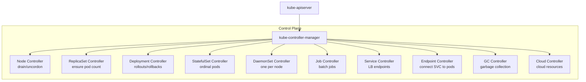
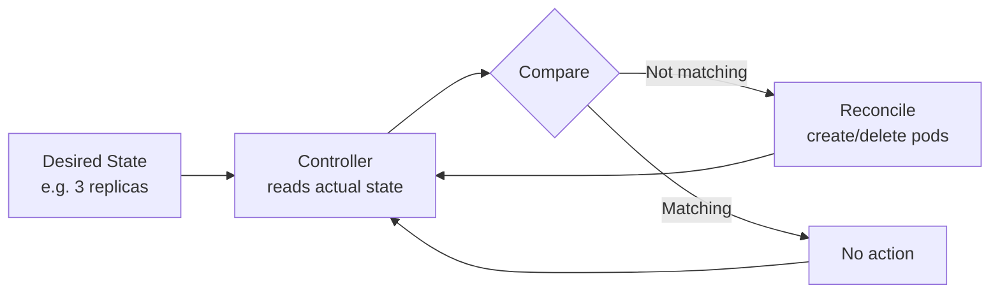

# kube-controller-manager

> **Category:** Architecture / Control Plane

## What It Is

The **kube-controller-manager** is a Kubernetes control plane component that **runs all the built-in controllers** that regulate cluster state. These include the node controller, job controller, daemonset controller, deployment controller, and 10+ others.

## Why It Exists

Kubernetes is built on **control loops** — a pattern where a controller observes the current state, compares it to the desired state, and takes action to reconcile. The kube-controller-manager aggregates all these controllers into a single process.

## Architecture



## Built-in Controllers

| Controller | Purpose | Watches |
|------------|---------|---------|
| **Node Controller** | Node lifecycle (Ready/NotReady), cordon/drain | Nodes, Pods |
| **ReplicaSet Controller** | Ensure the correct number of pod replicas | ReplicaSets |
| **Deployment Controller** | Manage rollout of updates | Deployments, ReplicaSets |
| **StatefulSet Controller** | Manage stateful workloads (ordered, unique) | StatefulSets |
| **DaemonSet Controller** | Run pods on all/matching nodes | DaemonSets |
| **Job Controller** | Run jobs to completion | Jobs, CronJobs, Pods |
| **Endpoint Controller** | Link Services to backend pods | Services, Endpoints, Pods |
| **Service Controller** | Manage cloud load balancers | Services, cloud resources |
| **Namespace Controller** | Namespace lifecycle | Namespaces |
| **ServiceAccount Controller** | Manage API tokens | ServiceAccounts |
| **Token Controller** | Issue and rotate tokens | ServiceAccounts |
| **Garbage Collector** | Clean up orphaned objects | All resources |
| **ServiceMonitor Controller** | (Prometheus Operator) | ServiceMonitors |
| **TTL Controller** | Delete finished resources after TTL | Jobs, Namespaces |
| **CronJob Controller** | Schedule periodic jobs | CronJobs |
| **PersistentVolume Controller** | Handle claims, binding, cleanup | PVs, PVCs |
| **PodGC Controller** | Garbage-collect orphaned pods | Pods |
| **ReplicationManager** | (legacy) | ReplicationControllers |

## Control Loop Pattern



## kube-controller-manager Configuration

```bash
# Flags for kube-controller-manager
kube-controller-manager \
  --allocate-node-cidrs=true \
  --cluster-cidr=10.244.0.0/16 \
  --service-cluster-ip-range=10.96.0.0/12 \
  --cluster-name=kubernetes \
  --controller=*,bootstru,tokener,token-cleaner,garbage-collector \
  --kubeconfig=/etc/kubernetes/controller-manager.conf \
  --leader-elect=true \
  --leader-elect-lease-duration=120s \
  --leader-elect-renew-deadline=115s \
  --leader-elect-retry-period=10s \
  --node-cidrmgr-node-mon=true \
  --root-ca-file=/etc/kubernetes/certs/ca.crt \
  --service-account-private-key-file=/etc/kubernetes/certs/sa.key \
  --use-service-account-credentials=true \
  --v=2
```

### Key Flags

| Flag | Purpose |
|------|---------|
| `--leader-elect` | Enable HA (only one leader at a time) |
| `--controllers` | Comma-separated list of enabled controllers |
| `--node-cidr-manager` | Enable node CIDR allocation |

## Commands & Debugging

```bash
# Check controller manager status
kubectl get pods -n kube-system -l component=kube-controller-manager

# View logs (HA - on leader)
kubectl logs -n kube-system -l component=kube-controller-manager --tail=100

# Check leader lease
kubectl get leases -n kube-system -l component=kube-controller-manager

# View controller metrics
# kube-controller-manager exposes metrics at :10257/metrics
```

## Common Issues

### Controller lagging behind
```bash
kubectl get --raw=/metrics | grep process_start_time_seconds
# Check sync frequency via metrics endpoint
```

### Rate limiting
```bash
# The controller manager uses rate-limited workqueues.
# If too many changes, it may lag. Increase rate limit flags.
```

### Leader election errors
```bash
# In HA setups, if two controller managers think they're leaders:
kubectl get lease -n kube-system kube-controller-manager
# Only one should be "holder"
```

## High Availability

The kube-controller-manager uses **leader election** for HA:
- Multiple instances run; only one is active ("holder" of the lease)
- Others wait to take over if the leader fails

```yaml
# HA flags
--leader-elect=true
--leader-elect-lease-duration=15s
--leader-elect-renew-deadline=10s
--leader-elect-retry-period=2s
```

## Best Practices

1. **Monitor controller health** — watch for leader failover
2. **Set rate limits appropriately** — avoid overwhelming the API server
3. **Watch for controller lag** — reconcile loops falling behind
4. **Log level** — use `-v=2` in production, higher for debugging

## Related Resources

- [Architecture](architecture.md)
- [kube-scheduler](kube-scheduler.md)
- [kube-apiserver](kube-apiserver.md)
- [Troubleshooting Guide](../14-troubleshooting/troubleshooting-patterns.md)