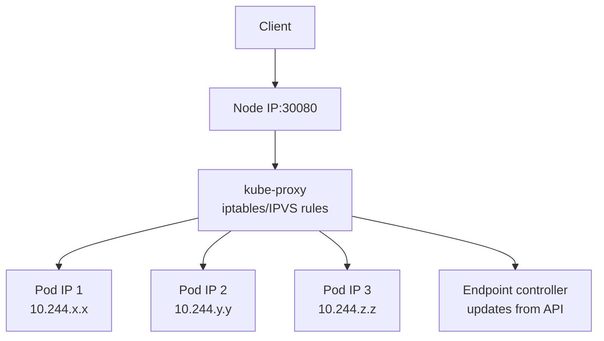

# kube-proxy

> **Category:** Architecture / Networking
> **Also known as:** Kubernetes Network Proxy

## What It Is

**kube-proxy** is a network proxy that runs on each worker node. It **maintains network rules** (using IPVS or iptables) that define how traffic is routed to Kubernetes Services. Essentially, it implements the **virtual IP routing** for Services.

## Why It Exists

Kubernetes Pods are ephemeral — their IPs change when they restart or are rescheduled. A Service needs a **stable endpoint** that always routes to the current set of backing Pods. kube-proxy provides this by:

- Watching the Kubernetes API for Services and Endpoints changes
- Configuring IPVS or iptables rules on the node to route traffic
- Load balancing across healthy pod endpoints

## Architecture



## kube-proxy Modes

| Mode | Technology | Performance | Default |
|------|-----------|-------------|---------|
| **iptables** (legacy) | iptables NAT rules | Moderate | Yes (older) |
| **IPVS** (recommended) | IP Virtual Server | High | 1.11+ |
| **userspace** | Legacy userspace (deprecated) | Low | No |

### iptables Mode

- Uses **iptables** NAT rules per Service
- Each Service creates multiple rules (for each backend pod)
- **Performance cost**: O(num_services × num_pods) rule complexity
- Scales fine for small clusters (< 100 Services)

### IPVS Mode

- Uses the **IP Virtual Server** subsystem (Linux Netfilter)
- Supports advanced load-balancing algorithms: RR, LC, WR, SH, MH, DH, SED, NQ
- **Constant time** lookups — O(1) regardless of the number of services
- Scales to thousands of Services

### Configuring kube-proxy

```yaml
# ConfigMap for kube-proxy (in kube-system namespace)
apiVersion: v1
kind: ConfigMap
metadata:
  name: kube-proxy
  namespace: kube-system
data:
  config.conf: |
    apiServerURL: https://10.97.100.10:443
    kubeletLocalhostAddress: "127.0.0.1"
    mode: ipvs          # iptables | ipvs
    ipvs:
      scheduler: rr    # rr | lc | wlc | sh | mh | dh
    iptables:
      minActions: true
    featureGates:
      ...
```

## How kube-proxy Routes Service Traffic

### ClusterIP (Internal)


When a client connects to `10.96.x.x` (ClusterIP):
1. kube-proxy's iptables/IPVS catches the packet
2. It rewrites the destination IP to one of the backend Pod IPs
3. The packet is routed to the Pod (via the CNI-provided pod network)

### kubeIP vs ServiceIP

```bash
# The Service IP is virtual — no actual listener binds it
# kube-proxy uses iptables/ipvs REDIRECT or DNAT to rewrite traffic
iptables -t nat -S  # View kube-proxy's generated rules (as root on the node)
ipvsadm -Ln        # View IPVS rules (if using ipvs mode)
```

## Commands & Debugging

```bash
# Check kube-proxy logs (DaemonSet)
kubectl logs -n kube-system -l k8s-app=kube-proxy

# Check kube-proxy mode and health
kubectl get ds -n kube-system -l k8s-app=kube-proxy -o wide

# On the node:
ipvsadm -Ln             # Show IPVS services (if mode=ipvs)
iptables -t nat -S      # Show iptables NAT rules (if mode=iptables)
iptables -t nat -n -v   # Show with counters (verbose)

# Check if a Service is routing correctly
kubectl run debug --image=busybox --rm -it -- sh -c "nc -zv <service-ip> <port>"
# Exit debug shell with Ctrl+D

# Check what endpoints the Service resolves to
kubectl get endpoints <service-name>

# Verify kube-proxy is running
kubectl get nodes
kubectl get --raw=/api/v1/nodes/<node-name>/proxy/metrics | grep -E 'rest_client|process_cpu'
```

## Troubleshooting Service Networking (kube-proxy)

### Service resolves to no endpoints
```bash
kubectl get endpoints <service>   # Empty?
kubectl describe svc <service>   # Check selector
kubectl get pods --show-labels   # Check if labels match selector
```

### iptables rules not present
```bash
# On the node, find kube-proxy's iptables rules:
iptables -t nat -S | grep -i kube-proxy
iptables -t nat -S | grep -i <service-name>

# If empty — kube-proxy may be unhealthy
kubectl logs -n kube-system -l k8s-app=kube-proxy
```

### Port conflicts on the node
```bash
# Check NodePort ranges
iptables -t nat -S | grep -E 'NodePort|0:65535' | head

# Check if a port is already in use on the node
ss -tlnp | grep :<port>
netstat -tulnp | grep :<port>
```

## kube-proxy vs Service Mesh

| Aspect | kube-proxy | Service Mesh |
|--------|------------|---------------|
| L4 / L7 | L4 (Layer 4 - transport) | L7 (Layer 7 - application) |
| Routing | IP-based, simple round-robin | Advanced routing, retries, canary |
| Sidecars | No sidecars | Sidecar proxies (Envoy) |
| Observability | Limited | Full tracing, metrics |

## Common Issues & Solutions

### IPVS mode fails to start
```bash
# Error: "can't initialize ipvs: not a single ipvs application was found"
# Solution: ensure ip_vs kernel modules are loaded
modprobe ip_vs
modprobe ip_vs_rr
modprobe ip_vs_wrr
modprobe ip_vs_sh

# Make persistent:
echo "ip_vs" >> /etc/modules-load.d/ipvs.conf
echo "ip_vs_rr" >> /etc/modules-load.d/ipvs.conf
```

### NodePort traffic not working externally
```bash
# Check the NodePort service
kubectl get svc <name> -o wide
# Verify the port falls in the NodePort range (30000-32767)
# Check firewall/security groups allow inbound on that port
```

### kubelet and kube-proxy version mismatch
```bash
# kube-proxy should match kubelet version (for iptables/ipvs compatibility)
kubectl get nodes -o jsonpath='{.items[*].status.nodeInfo.kubeletVersion}'
kubectl get ds -n kube-system kube-proxy -o jsonpath='{.spec.template.spec.containers[*].image}'
# Ensure versions match!
```

## Best Practices

1. **Use IPVS mode in production** — for better performance and scaling
2. **Monitor kube-proxy** — ensure it's healthy and running on all nodes
3. **Keep kube-proxy version aligned** — with kubelet and kube-apiserver (within skew policy)
4. **Check iptables/IPVS rules** — when debugging Service routing
5. **Use Endpoints for debugging** — `kubectl get endpoints <svc>` shows what pods are registered

## Related Resources

- [Networking](../04-networking/networking.md)
- [Services](../04-networking/services.md)
- [CNI Plugins](../04-networking/cni-plugins.md)
- [Architecture](architecture.md)
- [kubectl Cheatsheet](../cheat-sheets/kubectl.md)