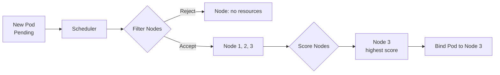

# kube-scheduler

> **Category:** Architecture / Scheduling

## What It Is

The **kube-scheduler** is a Kubernetes control plane component that **selects the best Node** to run a newly-created or unscheduled Pod.

## Why It Exists

When you create a Pod, it has no node assignment initially — it enters `Pending` state. The scheduler must find a suitable node based on resource requirements, taints/tolerations, node selectors, and affinity rules.

## Scheduling Process

The scheduler runs in two phases: **Filtering** and **Scoring**.

### Phase 1: Filtering

The scheduler filters all nodes to find ones that can potentially fit the Pod:

| Filter | Check |
|--------|-------|
| NodeUnschedulable | Node is not cordoned |
| NodeName | Matches `nodeName` if specified |
| Taints/Tolerations | Node taints are tolerated |
| NodeAffinity | Matches required node affinity |
| MatchNodeSelector | Matches `nodeSelector` labels |
| NodeResources | Has sufficient CPU/memory for requests |

### Phase 2: Scoring

Among feasible nodes, the scheduler scores them by priority:

| Scoring Function | Preference |
|------------------|-----------|
| LeastRequested | Nodes with least resource use |
| NodeAffinity | Nodes matching preferred affinity |
| ImageLocality | Nodes already having the image pulled |
| SelectorSpread | Spread across failure domains |
| InterPodAffinity | Colocate/avoid co-locating pods |

## Scheduling Flow



## Scheduling Constraints

| Constraint | Type | Applied By |
|-----------|------|-----------|
| `nodeSelector` | Hard | Scheduler |
| Node affinity | Hard + Soft | Scheduler |
| Taints/tolerations | Hard | Scheduler |
| Pod affinity/anti-affinity | Hard + Soft | Scheduler |
| `resources.requests` | Hard | Scheduler (filtering) |
| `resources.limits` | Soft (overcommit) | Scheduler ignores |
| Topology spread | Hard + Soft | Scheduler |

## Extending the Scheduler (Framework)

Since Kubernetes 1.14, the **scheduling framework** allows plugins:

| Extension Point | Purpose |
|-----------------|---------|
| PreFilter | Pre-processing |
| Filter | Feasibility check |
| Score | Prioritization |
| Bind | Assign pod to node |
| Reserve | Reserve resources |

## Scheduling Errors

### 0/3 nodes are available
```bash
kubectl describe pod <name>
# Events show: Node(pod) affinity/hostname/taint mismatch
```

### Insufficient CPU/Memory
```yaml
# Fix: reduce resource requests
resources:
  requests:
    cpu: "500m"
    memory: "256Mi"
```

### Taint/Toleration error
```yaml
# Fix: add matching toleration
tolerations:
- key: "dedicated"
  operator: "Equal"
  value: "db"
  effect: "NoSchedule"
```

## Commands

```bash
# View scheduling events
kubectl get events --sort-by=.lastTimestamp | grep -i schedul

# Check why a pod is pending
kubectl describe pod <name>  # "Events" section shows reasons

# View node resources vs requests
kubectl describe node <name>

# Check taints on nodes
kubectl get nodes -o jsonpath='{.items[*].spec.taints}'
```

## Best Practices

1. **Set resource requests** — scheduler uses requests to filter nodes
2. **Use node affinity over nodeSelector** — for complex constraints
3. **Taints for dedicated nodes** — combine with tolerations
4. **Monitor pending pods** — scheduling failures are silent
5. **Use topology spread constraints** — for HA across AZs/regions

## Related Resources

- [Scheduling](../07-scheduling-autoscaling/scheduling.md)
- [Taints & Tolerations](../07-scheduling-autoscaling/taints-tolerations.md)
- [Node Affinity](../07-scheduling-autoscaling/node-affinity.md)
- [Resources](../07-scheduling-autoscaling/resources.md)
- [Architecture](architecture.md)
