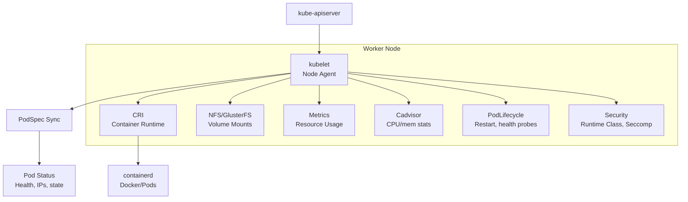

# kubelet

> **Category:** Architecture / Worker Node
> **Also known as:** Kubernetes Node Agent

## What It Is

The **kubelet** is the **primary node agent** that runs on each worker node in a Kubernetes cluster. It ensures that all **containers described in PodSpecs** (provided through the Kubernetes API or local manifests) are **healthy and running** with the correct configuration and resource allocation.

## Why It Exists

The control plane defines what should run, but **someone needs to actually run it on each node**. The kubelet:
- Reads PodSpecs from the API server
- Ensures containers stay running (restarts on failure)
- Reports status and resource usage back to the control plane
- Runs container lifecycle hooks
- Manages Pod networking, storage, and security

## Architecture



## kubelet Responsibilities

### 1. Pod Lifecycle Management
- Watches the API server for new/updated PodSpecs
- Creates, starts, and restarts containers to match the desired state
- Applies resource limits and security contexts
- Handles graceful termination (SIGTERM, grace period)

### 2. Health Monitoring
- Runs **liveness**, **readiness**, and **startup probes**
  - HTTP GET probes
  - TCP socket probes
  - exec command probes
- Reports container health back to the API server

### 3. Resource Collection
- Uses **cAdvisor** (bundled in modern kubelet) to collect per-container resource usage (CPU, memory, filesystem, network)
- Exposes a **stats summary** API (`/stats/summary`)
- Registers with Metrics Server for HPA autoscaling

### 4. Volume Management
- Mounts/unmounts volumes into containers
- Handles storage lifecycle (attach, format, mount)
- Supports CSI drivers, cloud storage, local storage

### 5. Networking
- Calls the **CNI plugin** to set up pod networking
- Ensures the pod gets its own IP
- Manages port mappings (hostPort, NodePort)

### 6. Security
- Enforces **Pod Security Standards** (restricted, baseline, privileged)
- Applies **Seccomp** profiles
- Validates against **RuntimeClass** and security contexts
- Handles **credential** providers for authenticated image pulls

## Pod Management Modes

### API-Managed (Default)
```
1. kube-apiserver stores PodSpec in etcd
2. kubelet receives Watch events for pods on its node
3. kubelet enforces PodSpec every `--sync-frequency` (default: 1 minute)
```

### Manifest-Processed (Standalone)
```
1. kubelet scans /etc/kubernetes/manifests/ for static pod manifests
2. Creates/maintains corresponding pods on the API server
3. Used by kubeadm, k3s, single-node clusters
```

## kubelet Configuration

The kubelet can be configured via command-line flags or a **KubeletConfiguration** YAML file:

```yaml
# kubelet-config.yaml (apiVersion: kubelet.config.k8s.io/v1beta1)
kind: KubeletConfiguration
apiVersion: kubelet.config.k8s.io/v1beta1
clusterDomain: "cluster.local"
clusterDNS:
  - "10.96.0.10"
containerLogMaxSize: "100Mi"
containerLogMaxFiles: 5
cpuManagerPolicy: "static"           # static, none
evictionHard:
  ephemeral-imagefs.available: "15%"
  ephemeral-nodefs.available: "10%"
  imagefs.available: "15%"
  nodefs.available: "10%"
imageGCHighThreshold: 0.85          # 85% disk usage triggers image GC
maxPods: 110                         # Max pods per node
oomScoreAdj: -999                    # OOM score adjustment for kubelet
podPidsLimit: 1000000                # Limit on process count per pod
reserved:
  cpu: 500m
  memory: 1Gi
resolvePromDefaultNames: false
rotateCertificates: true
serverTLSBootstrap: true
streamingConnectionIdleTimeout: "4h"  # Close idle streaming connections
syncFrequency: "1m"                 # Frequency of pod sync
unregisterOnExitIfNotTerminated: true
```

### Key Flags

| Flag | Purpose |
|------|---------|
| `--address=0.0.0.0` | Address to listen on |
| `--port=10250` | Kubelet API (read-only port 10255) |
| `--hostname-override` | Override the hostname reported to the API |
| `--pod-cidr` | CIDR for pods on this node |
| `--kubeconfig` | Path to kubeconfig for talking to API server |
| `--container-runtime-endpoint` | CRI socket (e.g., `unix:///var/run/containerd/containerd.sock`) |
| `--register-node` | Register the node with the API server |

## Commands & Debugging

```bash
# Check node status
kubectl get nodes
kubectl describe node <node-name>    # Resource capacity, allocatable

# Check kubelet status (from control-plane node)
sudo systemctl status kubelet

# Kubelet health
curl -k https://localhost:10250/healthz

# View kubelet metrics
curl -k https://localhost:10250/metrics
kubectl get --raw /api/v1/nodes/<name>/proxy/metrics

# View kubelet config (from API)
kubectl get node <node-name> -o jsonpath='{.status.config}'

# View kubelet logs (on the node)
sudo journalctl -u kubelet --since="1 hour ago"

# Port 10250 (read-only health without --anonymous-auth=false)
curl -k https://localhost:10250/healthz

# Pod stats from kubelet
kubectl get --raw /api/v1/nodes/<name>/proxy/stats/summary | jq .
```

## Common Issues & Solutions

### kubelet not registering the node
```bash
# Check kubelet logs
sudo journalctl -u kubelet --since="5 minutes ago"

# Check if API server is reachable
curl -k https://<api-server>:6443/version
# Check the kubeconfig used by kubelet:
cat /etc/kubernetes/kubelet.conf

# Verify container runtime is running
sudo systemctl status containerd
sudo systemctl status kubelet

# Fix: restart kubelet after fixing config
sudo systemctl stop kubelet
sudo systemctl start kubelet
```

### Pod stuck at "ContainerCreating"
```bash
kubectl describe pod <name>
# Check Events section — look for:
# - "image pull failed" → wrong image, no pull secret
# - "volume mount failed" → bad PVC/storage issue
# - "container runtime not available" → check containerd
sudo systemctl status containerd

# Check kubelet logs for errors
sudo journalctl -u kubelet --since="10 minutes ago" | grep -i error
```

### Node becomes NotReady
```bash
kubectl get nodes
kubectl describe node <name>
# Look for kubelet health status

# Check kubelet on the node
sudo systemctl status kubelet
sudo journalctl -u kubelet -f

# Common causes:
# - Kubelet process dead
# - Container runtime (containerd) crashed
# - Network issues with API server
# - Disk pressure / memory pressure
df -h /var/lib/kubelet  # check disk
free -m                # check memory
```

### Kubelet certificate issues
```bash
# If "certificate signed by unknown authority":
# kubelet uses client certs for API server auth.
# When expired, re-bootstrap:
sudo kubeadm token create --print-join-command  # on control plane
sudo systemctl stop kubelet
rm /var/lib/kubelet/pki/*                       # delete node credentials
sudo systemctl start kubelet                   # will re-register
```

### Image garbage collection
```bash
# Kubelet GC: when disk usage exceeds threshold
# Eviction thresholds in kubelet config:
evictionHard:
  imagefs.available: "10%"
  nodefs.available: "10%"

# Check disk usage
kubectl describe node <node-name> | grep -E "allocated|capacity|allocatable"
df -h /var/lib/kubelet
```

### Memory/Disk Pressure
```bash
# Check kubelet eviction
kubectl get events --field-selector involvedObject.name=<node-name>
kubectl describe node <node-name> | grep -E "MemoryPressure|DiskPressure"

# Free space
kubectl debug node/<node> -it --image=busybox -- chroot /host chroot
df -h
```

## Authentication

The kubelet exposes two ports:
- **10250** (authenticated) — read/write kubelet API (pods, exec, logs)
- **10255** (read-only, optional) — unauthenticated

The kubelet authenticates via **client certificates** issued by the cluster CA. The control plane (via the kubelet credential provider) can also issue tokens.

### Securing kubelet

```bash
# In kubeadm, kubelet config enforces authentication and authorization
# /var/lib/kubelet/config.yaml
authentication:
  anonymous:
    enabled: false
  webhook:
    enabled: true          # Use token/webhook auth
  x509:
    clientCAFile: /etc/kubernetes/pki/ca.crt
authorization:
  mode: Webhook            # Enforce RBAC for kubelet API calls
```

## kubelet Health API

```bash
# Health check
curl -k https://localhost:10250/healthz

# Readiness
curl -k https://localhost:10250/healthz

# Livez
curl -k https://localhost:10250/livez
```

## Related Resources

- [Container Runtimes](container-runtimes.md)
- [kube-proxy](kube-proxy.md)
- [Architecture](architecture.md)
- [kubectl Cheatsheet](../cheat-sheets/kubectl.md)
EOF
echo "kubelet.md written"