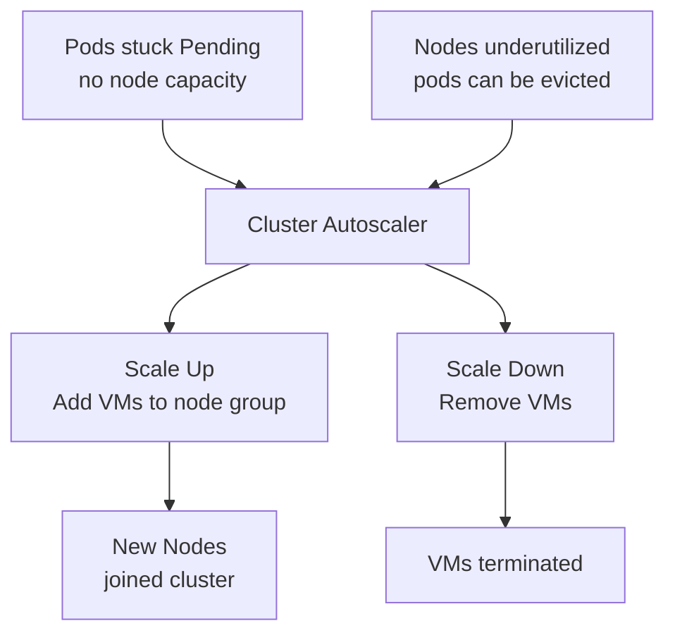
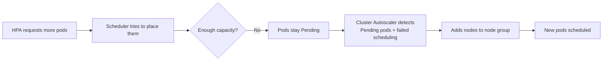
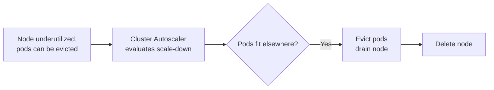

# Cluster Autoscaler

> **Category:** Workload / Cluster Autoscaling

## What It Is

The **Cluster Autoscaler (CA)** automatically adjusts the **size of the Kubernetes cluster** (number of worker nodes) when:
- **Pods are stuck in `Pending`** because there's insufficient capacity → it scales **up** (adds nodes)
- **Nodes are underutilized** and pods can be moved → it scales **down** (removes nodes)

## Why It Exists

Pods scale horizontally (HPA, VPA), but **nodes** must exist for them to run. Without CA:
- HPA scales to 10 pods, but they're all stuck `Pending` (no node capacity)
- Nodes sit idle after scale-down, wasting money
- Manual node pool management is error-prone

Cluster Autoscaler bridges the gap between **pod-level demand** and **node-level supply**.

## Architecture



## How Cluster Autoscaler Works

### Scale-Up



### Scale-Down



## Key Behaviors

| Behavior | Details |
|----------|---------|
| **Scale-up trigger** | Pods unschedulable for `podUnreachable` (default 3m) |
| **Scale-down trigger** | Node idle for 10 minutes (after `--scale-down-unneeded-time`) |
| **Scale-down delay** | 10 min idle + grace period |
| **Best limit** | Only scale down nodes where **all** pods can be rescheduled |
| **Resource type** | Uses the cloud provider's auto-scaling group (ASG), managed instance group (MIG), or self-managed pools |

## Scale-Up Conditions

The autoscaler scales up when:
1. There are **pods in `Pending`** state
2. **Scheduling fails** due to insufficient resources
3. The pod's resource requests can be met by creating a **new node**

```bash
# Check what's causing Pending
kubectl describe pod <pending-pod>
# "Warning: FailedScheduling" + "0/3 nodes are available: 3 Insufficient cpu"
```

## Scale-Down Conditions

The autoscaler scales down after a node has been **unneeded** (no pods scheduled, or all pods can be moved) for a grace period:

| Setting | Default | Purpose |
|---------|---------|---------|
| `--scale-down-unneeded-time` | 10m | How long a node must be unneeded before removal |
| `--scale-down-delay-after-add` | 10m | Time after scale-up before considering scale-down |
| `--scale-down-unneeded-time` | 10m | How long to wait |
| `--expendable-pods-priority-cutoff` | -10 | Ignore nodes with pods below this priority |

## Node Group Support

The Cluster Autoscaler works with **managed node groups** or **self-managed node groups**:

| Provider | Node Group Type | Example |
|----------|-----------------|---------|
| **AWS** | ASG (Auto Scaling Group) | `eksctl` managed node groups, Karpenter |
| **GCP** | MIG (Managed Instance Group) | GKE Managed Instance Groups |
| **Azure** | VMSS (Virtual Machine Scale Set) | AKS Virtual Machine Scale Sets |
| **kubeadm** | Self-managed | ASG/MIG with ASG per node pool |
| **k3s/On-Prem** | N/A | Manual, or no CA |

### Required: Node Group Annotations

```yaml
# The node group / ASG / MIG must be tagged or named correctly
# Example: ASG with tags auto-discover
# Tag: k8s.io/cluster-autoscaler/enable = true
# Tag: k8s.io/cluster-autoscaler/my-cluster = owned
```

## Commands

```bash
# Deploy Cluster Autoscaler (AWS example)
kubectl apply -f https://github.com/kubernetes/autoscaler/cluster-autoscaler/releases/latest/download/cluster-autoscaler-autodiscover.yaml

# Annotate the node group (AWS)
kubectl annotate node <node> cluster-autoscaler.kubernetes.io/scales-from-zero=true=true

# Check Cluster Autoscaler status
kubectl -n kube-system get deployment cluster-autoscaler
kubectl -n kube-system logs -l app=cluster-autoscaler
kubectl-n kube-system describe deployment cluster-autoscaler

# Scale the cluster up/down
# (Cluster Autoscaler does this automatically)

# Scale down a node group manually (if autoscaling is off)
aws autoscaling terminate-instance-in-auto-scaling-group --instance-id <id> --should-decrement-desired-capacity

# Check ASG size (AWS)
aws autoscaling describe-auto-scaling-groups
```

## Cluster Autoscaler Parameters (Helm or args)

| Parameter | Description | Default |
|-----------|-------------|---------|
| `--nodes=NODE_GROUP:MIN:MAX` | Define a node group to autoscale | — |
| `--scale-down-unneeded-time` | Minutes a node must be unused before removal | 10 |
| `--scale-down-utilization-threshold` | Minimum node utilization to be considered for removal | 0.5 |
| `--scale-down-delay-after-add` | Minutes after adding a node before considering removal | 10 |
| `--balance-similar-node-groups` | Balance similar node groups | false |
| `--expander=least-waste` | Strategy: least-waste, random, priority, price | least-waste |
| `--max-node-provision-time` | Max time to wait for a node to be provisioned | 15m |
| `--max-empty-progress-seconds` | Max time to wait for scale-down | 10m |

## Common Issues & Solutions

### CA doesn't scale up (pods pending)
```bash
kubectl describe pod <pod>
# Check: "scheduling failed" and resource requirements

# CA only responds to Pods that:
# 1. Have valid resource requests
# 2. Are unschedulable (0/3 nodes available)
# 3. Can fit on a new node

# Check CA logs:
kubectl -n kube-system logs -l app=cluster-autoscaler | grep -i "scale.up"
kubectl -n kube-system logs -l app=cluster-autoscaler | grep -i "cannot fit pod"
```

### CA doesn't scale down (nodes unused)
```bash
# Nodes must be **completely unused** (or below utilization threshold)
# The pod needs to be evictable (not just idle)

kubectl describe node <node>
# Check: allocated resources vs capacity

# CA won't scale down if:
# - Pods can't be rescheduled (no other node has capacity)
# - Pods have `hostPath` or `nodeSelector` pinning them
# - PDB blocks disruption
# - Pods are not evictable (DaemonSets, static pods)

# Check CA scale-down reason:
kubectl -n kube-system logs -l app=cluster-autoscaler | grep -i "scale.down"
```

### "scale-down-taint" or "scale-down-delay" on nodes
```bash
# Nodes being scaled down show taints like:
# Taints: node.cluster-autoscaler.kubernetes.io/scales-down-from-zero
# Or: node.cluster-autoscaler.kubernetes.io/unschedulable=true

# Just wait — CA handles this
# Or check CA logs for the reason
```

### Node gets stuck in "NotReady / Unknown"
```bash
# CA may mark a node as "unready" but not yet remove it
# If the node never comes back:
# CA will eventually remove it after `--scale-down-unneeded-time`

# Force-drain and remove:
kubectl drain <node> --ignore-daemonsets --delete-emptydir-data
kubectl delete node <node>
# ASG will then remove the underlying instance
```

### CA scaling wrong group
```bash
# If CA adds nodes to the wrong ASG:
# Check --nodes flag: --nodes=my-asg:min:max
# Check expander strategy
```

## Scaling Metrics

| State | CA Behavior |
|-------|-------------|
| **Nodes have excess capacity**, pods fit | No change |
| **Pods don't fit** on any node | Scale UP (add node to ASG/MIG) |
| **Nodes are >50% idle** for >10 min | Scale DOWN (if pod eviction is safe) |

## CA + Other Autoscalers

| Component | Level | Trigger |
|-----------|-------|---------|
| **HPA** | Pod replicas | Pod metrics (CPU, custom, external) |
| **VPA** | Pod resources | Historical usage |
| **CA** | Node count | Pending pods / unused nodes |

When combined:
1. HPA needs more pods → creates them
2. Scheduler can't find capacity → pods stay Pending
3. CA detects Pending pods → adds nodes
4. New pods scheduled → CA waits
5. Load decreases → HPA scales down pods
6. Nodes become underutilized → CA removes them

## Best Practices

1. **Set `resource.requests`** on all Pods — CA uses requests to find fitting nodes
2. **Set `max-node-provision-time`** appropriately (10-15 min for cloud)
3. **Use `--balance-similar-node-groups`** — for uniform node pools
4. **Avoid over-provisioning** — CA adds nodes quickly (cloud: ~3 min)
5. **Use `priorityClassName`** — to protect important pods from eviction
6. **Set reasonable min/max** — don't set `min=0` for prod pools (slow scale-up)
7. **Monitor CA events** — watch for "scale-up" blocked by limits or "scale-down" skipped
8. **Use multiple node groups** — separate by instance family/size, CA uses `expander` strategy
9. **Set PDBs** — to prevent too many pods being evicted during CA scale-down
10. **Don't use hostPort** — causes scheduling conflicts

## Interview Questions

**Q: What is the difference between Cluster Autoscaler and Horizontal Pod Autoscaler?**
A: HPA scales the number of **Pod replicas** based on metrics. Cluster Autoscaler scales the number of **Nodes** based on unschedulable Pods or unused nodes.

**Q: When does the Cluster Autoscaler scale up?**
A: When there are **Pending Pods** whose resource requests can't be satisfied by existing nodes (or any single new node).

**Q: When does the Cluster Autoscaler scale down?**
A: When a node has been **unused** (evictable pods can be moved) for at least `--scale-down-unneeded-time` (default 10 minutes).

**Q: Why set resource requests for the Cluster Autoscaler to work?**
A: The CA uses requests to determine if a Pod can fit on a node. Without requests, it cannot evaluate scheduling feasibility.

**Q: Can the Cluster Autoscaler remove a node with running Pods?**
A: Yes — if all the Pods on that node can be **safely rescheduled** elsewhere (within PDBs), the node is drained and removed.

## Related Resources

- [HPA](hpa.md)
- [VPA](vpa.md)
- [Node Affinity](../07-scheduling-autoscaling/node-affinity.md)
- [Pod Disruption Budget](../01-core-concepts/pod-disruption-budgets.md)
- [Priority Classes](../03-workloads/priority-classes.md)
EOF
echo "cluster-autoscaler.md written"