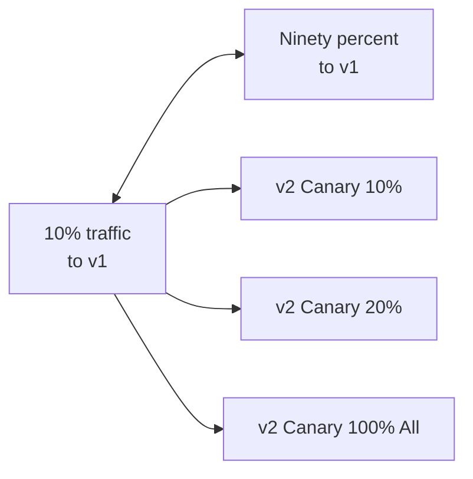

# Deployment Strategies

> **Category:** Workload / Deployment Patterns

## What It Is

Deployment **update strategies** define how a new version of an application replaces the old version. Kubernetes supports **RollingUpdate** (the default) and **Recreate** directly on Deployments. Advanced patterns like **Blue/Green** and **Canary** require additional tools (Argo Rollouts, Istio, Flagger) or manual implementation.

## Why It Exists

Updating applications carries **downtime** and **rollback risk**. Different strategies provide different tradeoffs:

| Strategy | Downtime | Complexity | Rollback Speed |
|----------|----------|------------|----------------|
| Recreate | Yes (brief) | Simple | Fast |
| RollingUpdate | Zero | Simple | Fast |
| Blue/Green | Zero | Complex | Instant |
| Canary | Zero | Complex | Gradual |

## Strategies

### 1. RollingUpdate (Default)

Replaces pods one at a time, updating the ReplicaSet incrementally.

```yaml
apiVersion: apps/v1
kind: Deployment
metadata:
  name: web-app
spec:
  replicas: 3
  strategy:
    type: RollingUpdate
    rollingUpdate:
      maxSurge: 1              # Extra pod created before killing old
      maxUnavailable: 0         # No pods down during update
  selector:
    matchLabels:
      app: web-app
  template:
    metadata:
      labels:
        app: web-app
    spec:
      containers:
      - name: web
        image: myapp:v2
```

### 2. Recreate

Deletes all old pods **before** creating new ones — useful for breaking schema changes where old/new versions aren't compatible.

```yaml
spec:
  strategy:
    type: Recreate
  template:
    spec:
      containers:
      - name: web
        image: myapp:v2   # v2 breaks DB schema — no overlap
```

### maxSurge / maxUnavailable Matrix

| maxSurge | maxUnavailable | Behavior |
|----------|----------------|----------|
| 25% | 25% (default) | Standard rolling update |
| 1 | 0 | Create 1 new, then terminate 1 old (zero downtime, doubles capacity temporarily) |
| 100% | 0 | Create all new first, then kill old (full capacity during update) |
| 0 | 1 | Terminate 1 before creating new (brief gap) |

## Blue/Green Deployment

Two identical environments (Blue = current, Green = new). Traffic is switched atomically.

```mermaid
graph TB
    A[Blue (v1)] --active--> D[Users: current]
    B[Green (v2)] --staging--> D
    subgraph "Before switch"
        A
        B
    end

    subgraph "After switch"
        C[Blue (v1)] --inactive--> Users
        B[Green (v2)] --active--> Users
    end
```

### Blue/Green with Deployments

```yaml
# deployment-blue.yaml — running version (Blue)
apiVersion: apps/v1
kind: Deployment
metadata:
  name: web-blue
spec:
  replicas: 4
  selector:
    matchLabels:
      app: web
      version: blue
  template:
    metadata:
      labels:
        app: web
        version: blue
    spec:
      containers:
      - name: web
        image: myapp:v1
---
# deployment-green.yaml — new version (Green)
apiVersion: apps/v1
kind: Deployment
metadata:
  name: web-green
spec:
  replicas: 4
  selector:
    matchLabels:
      app: web
      version: green
  template:
    metadata:
      labels:
        app: web
        version: green
    spec:
      containers:
      - name: web
        image: myapp:v2
---
# service.yaml — points to Blue
apiVersion: v1
kind: Service
metadata:
  name: web-service
spec:
  selector:
    app: web
    version: blue       # ← Switch to "green" to go live
  ports:
  - port: 80
    targetPort: 80
```

### Blue/Green CLI

```bash
# 1. Check the current (Blue) version
kubectl get deploy web-blue -o jsonpath='{.spec.template.spec.containers[0].image}'

# 2. Deploy the new (Green) version
kubectl apply -f web-green.yaml

# 3. Wait for it to be Ready
kubectl rollout status deployment/web-green

# 4. Run smoke tests against Green directly
kubectl port-forward svc/web-green-service 8080:80  # if you have a separate service to Green

# 5. Switch the Service to Green (zero-downtime)
kubectl patch svc web-service -p '{"spec":{"selector":{"version":"green"}}}'

# 6. Verify traffic
kubectl run -it --rm debug-pod --image=curlimages/curl -- \
  curl -s http://web-service.default.svc.cluster.local/health

# 7. (Optional) Keep Blue for rollback, or delete
kubectl delete deployment web-blue  # or keep for rollback
```

## Canary Deployment

Gradually roll out the new version to a **subset** of users/traffic, then ramp up.



### Canary with Labels + Weighted Services

```bash
# Version 1 (Stable)
kubectl apply -f web-v1.yaml  # 3 replicas

# Version 2 (Canary)
kubectl apply -f web-v2.yaml  # 1 replica

# Service points to BOTH (via common label: app=web)
kubectl apply -f web-service.yaml
```

```yaml
# service.yaml
apiVersion: v1
kind: Service
metadata:
  name: web-service
spec:
  selector:    # Routes to ALL versions (both have app=web)
    app: web
  ports:
  - port: 80
    targetPort: 80
```

### Canary with Istio (Traffic Split)

```yaml
apiVersion: networking.istio.io/v1alpha3
kind: VirtualService
metadata:
  name: web-canary
spec:
  hosts:
  - web-service
  http:
  - route:
    - destination:
        host: web-service
        subset: v1
      weight: 90        # 90% to stable
    - destination:
        host: web-service
        subset: v2
      weight: 10        # 10% to canary
```

### Canary with Argo Rollouts

```yaml
apiVersion: argoproj.io/v1alpha1
kind: Rollout
metadata:
  name: web-canary
spec:
  replicas: 4
  strategy:
    canary:
      steps:
      - setWeight: 20    # Send 20% to new version
      - pause: {duration: 1h}    # Wait 1 hour to monitor
      - setWeight: 50
      - pause: {duration: 30m}
      - setWeight: 100
  selector:
    matchLabels:
      app: web
  template:
    metadata:
      labels:
        app: web
    spec:
      containers:
      - name: web
        image: myapp:v2
```

### Canary with Flagger (progressive delivery)

```yaml
apiVersion: flagger.app/v1beta1
kind: Canary
metadata:
  name: web
spec:
  targetRef:
    apiVersion: apps/v1
    kind: Deployment
    name: web
  progressDeadlineSeconds: 60
  canaryWeights:
    enabled: true
    steps:
    - setWeight: 20
    - pause
    - setWeight: 50
    - pause
    - setWeight: 100
  analysis:
    interval: 1m
    threshold: 5
    metrics:
    - name: request-success-rate
      thresholdRange:
        min: 99
    - name: request-duration
      thresholdRange:
        max: 500
```

## A/B Testing (Split by Headers / Cookies)

Route traffic based on **request attributes** (headers, cookies, user-agent):

```yaml
# VirtualService for header-based routing
apiVersion: networking.istio.io/v1alpha3
kind: VirtualService
metadata:
  name: web-ab
spec:
  hosts:
  - web.example.com
  http:
  - match:
    - headers:
        x-user-type:            # Route by custom header
          exact: "beta-user"
    route:
    - destination:
        host: web-service
        subset: v2              # Beta traffic
  - route:
    - destination:
        host: web-service
        subset: v1              # Default traffic
```

## Feature Flags / Dark Launch

Deploy new code but hide it behind a **feature flag**:

```yaml
# ConfigMap with feature flags
apiVersion: v1
kind: ConfigMap
metadata:
  name: feature-flags
data:
  newCheckout: "false"    # Feature off, but deployed
  userPreferencesV2: "true"
---
# Deployment uses it:
spec:
  template:
    spec:
      containers:
      - name: web
        image: myapp:v2    # New code deployed but flag off
        env:
        - name: NEW_CHECKOUT_ENABLED
          valueFrom:
            configMapKeyRef:
              name: feature-flags
              key: newCheckout
```

## Gradual Traffic Shift (NGINX Ingress + Canary Annotations)

```yaml
# Canary deployment with NGINX Ingress
apiVersion: apps/v1
kind: Deployment
metadata:
  name: web-canary
  annotations:
    # NGINX ingress canary config
    nginx.ingress.kubernetes.io/canary: "true"
    nginx.ingress.kubernetes.io/canary-weight: "20"  # 20% of traffic
spec:
  replicas: 1
  selector:
    matchLabels:
      app: web
  template:
    metadata:
      labels:
        app: web
    spec:
      containers:
      - name: web
        image: myapp:v2   # Canary version
        ports:
        - containerPort: 80
```

## Common Deployment Strategies (Quick Comparison)

| Strategy | Tool | Rollback | Traffic Control | Complexity |
|----------|------|----------|-----------------|------------|
| RollingUpdate | Built-in (Deployment) | Fast | None (instant switch) | Low |
| Recreate | Built-in (Deployment) | Fast | None | Low |
| Blue/Green | Manual / Helm / Argo | Instant | All-at-once | Medium |
| Canary | Argo / Flagger / Istio | Gradual | Fine-grained | High |
| Dark Launch | Feature flags | Instant | Hidden toggle | Medium |
| A/B Testing | Istio / NGINX | N/A | Header/cookie routing | High |

## Commands

```bash
# Rolling update (default)
kubectl apply -f deployment.yaml
kubectl rollout status deployment/<name>
kubectl rollout undo deployment/<name>  # Rollback

# Check rollout history
kubectl rollout history deployment/<name>

# Pause/resume (edit between)
kubectl rollout pause deployment/<name>
kubectl edit deployment/<name>
kubectl rollout resume deployment/<name>

# Blue/Green — switch service selector
kubectl patch svc web-service -p='{"spec":{"selector":{"version":"green"}}}'

# Canary — adjust Istio weights (if using)
kubectl apply -f canary-20.yaml
kubectl apply -f canary-50.yaml
kubectl apply -f canary-100.yaml

# Verify
kubectl get pods -l app=web,version=v2
curl http://<service>/  # test the endpoint
```

## When to Use Which Strategy

| Scenario | Recommended Strategy |
|----------|---------------------|
| Simple app with backward-compatible changes | RollingUpdate |
| Breaking change (schema migration, etc.) | Recreate |
| Need instant rollback | Blue/Green |
| Gradual rollout with metric analysis | Canary (Argo/Flagger) |
| Routing specific users to new version | A/B Testing |
| Deploying code but hiding from users | Dark Launch (feature flags) |
| Database migrations | Blue/Green + manual cutover |
| Critical system (need safety net) | Blue/Green (keep old version running) |

## Best Practices

1. **Use RollingUpdate for 90% of deploys** — it's simple, tested, and works for most backward-compatible changes
2. **Use Blue/Green for DB migrations** — where you need instant rollback
3. **Set `maxSurge/minUnavailable` carefully** — zero-downtime requires `maxUnavailable: 0`
4. **Test rollback** — in staging before every major deploy
5. **Use probes** — liveness and readiness prevent bad pods from receiving traffic
6. **Use feature flags** — to safely deploy without enabling features
7. **Monitor metrics after deploy** — error rate, latency, saturation
8. **Automate rollback** — tools like Argo Rollouts support auto-rollback on metric regression

## Interview Questions

**Q: What are the two Deployment strategies built into Kubernetes?**
A: RollingUpdate (default) and Recreate.

**Q: How does RollingUpdate achieve zero downtime?**
A: By creating new pods before terminating old ones (controlled by `maxSurge` and `maxUnavailable` — set `maxUnavailable: 0` for true zero-downtime).

**Q: When would you use the Recreate strategy?**
A: When the new version is **not backward-compatible** with the old (e.g., incompatible DB schema migration) — you need a clean break.

**Q: How does a Canary rollout work?**
A: A Canary rollout sends a small percentage of traffic to the new version while the majority goes to the stable version. The percentage is gradually increased (and monitored) until 100%.

**Q: What's the difference between Blue/Green and Canary?**
A: In Blue/Green, you deploy a **complete separate environment** and switch traffic all at once. In Canary, you **gradually shift traffic** from the old to the new version.

## Related Resources

- [Deployment](deployments.md)
- [Argo CD](../11-ci-cd-gitops/argo-cd.md)
- [Blue/Green (CI/CD)](../11-ci-cd-gitops/ci-cd.md)
- [Canary (CI/CD)](../11-ci-cd-gitops/ci-cd.md)
- [kubectl Cheatsheet](../cheat-sheets/kubectl.md)
