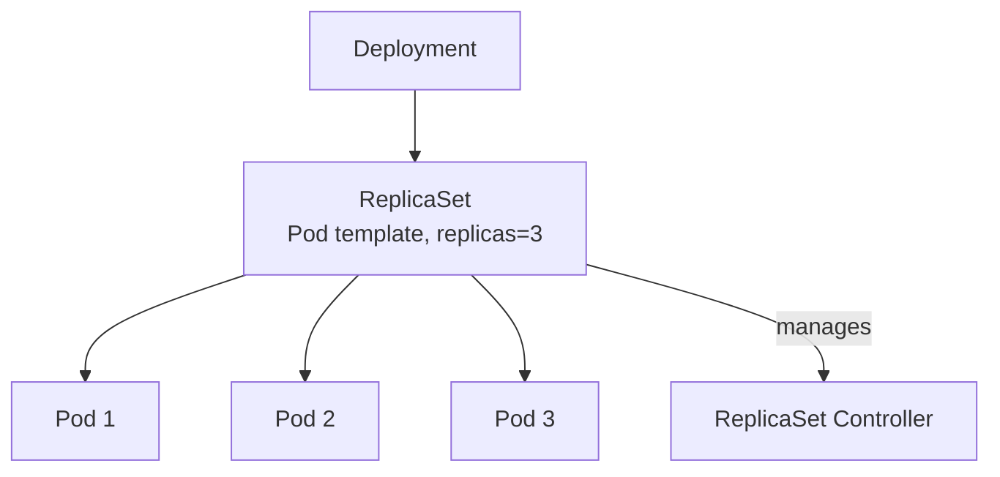

# Deployment

> **Category:** Workload / Controller

## What It Is

A **Deployment** is a Kubernetes **controller** that manages a **ReplicaSet** (and thus, a set of identical Pods). It manages the **declarative rollout** (and rollback) of a Pod template — you declare the desired state (e.g., 5 replicas of `nginx:1.25`), and the Deployment controller works to make the live state match.

It is the **recommended** way to run stateless applications. It handles:
- **Rollouts** (updates)
- **Rollbacks** (on failure)
- **Scaling** (up/down)
- **Self-healing** (re-creating failed Pods)

## Why It Exists

Pods are ephemeral — running a bare Pod gives you **zero** self-healing or update logic. A Deployment:
- Recreates Pods they die
- Updates Pods **rolling** (without downtime) or **recreate** (all at once)
- Scales Pods declaratively
- Enables **zero-downtime deployments**

## Architecture



## Deployment API

```yaml
apiVersion: apps/v1
kind: Deployment
metadata:
  name: nginx-deployment
  labels:
    app: nginx
spec:
  replicas: 3                 # Desired Pod count
  selector:                   # Must match labels below — ties Deployment to its Pods
    matchLabels:
      app: nginx
      version: "1.25"
  strategy:                   # How to update
    type: RollingUpdate       # RollingUpdate | Recreate
    rollingUpdate:
      maxSurge: 1             # Extra Pod allowed at a time (above desired)
      maxUnavailable: 0       # Max Pods down at a time (below desired)
  minReadySeconds: 5          # Wait this many seconds after a Pod becomes Ready
  revisionHistoryLimit: 10    # How many old ReplicaSets to keep (for rollback)
  paused: false               # Pause reconciliation
  progressDeadlineSeconds: 600
  template:                   # The Pod Template (replicaset inherits it)
    metadata:
      labels:
        app: nginx
        version: "1.25"       # Update this label to trigger a new rollout
    spec:
      containers:
      - name: nginx
        image: nginx:1.25
        ports:
        - containerPort: 80
        resources:
          requests:
            memory: "64Mi"
            cpu: "250m"
          limits:
            memory: "128Mi"
            cpu: "500m"
```

## Strategy Types

| Strategy | Behavior | Downtime? |
|----------|----------|-----------|
| `RollingUpdate` (default) | Gradually replace old Pods with new ones | No |
| `Recreate` | Kill all old Pods, then create all new | Yes (brief) |

### RollingUpdate Parameters

| Parameter | Description | Default |
|-----------|-------------|---------|
| `maxSurge` | How many extra Pods above the desired count can be created during an update | `25%` |
| `maxUnavailable` | How many Pods can be unavailable (down) during the update | `25%` |

#### Example: maxSurge=1, maxUnavailable=0

- 3 replicas desired
- Surge to 4 (one new Pod added)
- Then drain one old Pod (back to 3)
- Repeat until all old Pods replaced
- **Guarantees** you always have 3 Pods up (never less)

#### Example: default (25%/25%)

- 4 replicas → surge up to 5, tolerate 1 down
- Good balance of speed and safety

## Deployment vs ReplicaSet vs Pod

| Resource | Purpose | User-facing? |
|----------|---------|--------------|
| **Pod** | Single (or multi) container(s) | ❌ (too low-level) |
| **ReplicaSet** | Ensure N Pods are running | ❌ (managing Pods at scale) |
| **Deployment** | Declarative rollout of ReplicaSets | ✅ Recommended for stateless apps |

- **Deployment manages ReplicaSet** → which manages Pods
- You usually interact with the **Deployment**, not the ReplicaSet
- The `selector.matchLabels` must match the template `labels` — the Deployment uses this to "own" the ReplicaSet and the Pods

## Commands

```bash
# Create / Update
kubectl apply -f deployment.yaml

# Imperative
kubectl create deployment nginx --image=nginx --port=80
kubectl set image deployment/nginx nginx=nginx:1.25

# List
kubectl get deployment
kubectl get deployment <name> -o wide
kubectl get rs -l app=nginx          # ReplicaSets for this Deployment (old + new)

# Inspect
kubectl describe deployment <name>   # Replicas, conditions, rollout status

# Rollout
kubectl rollout status deployment/<name>      # Wait for rollout
kubectl rollout history deployment/<name>   # Show revisions
kubectl rollout undo deployment/<name>      # Rollback to previous

# Scale
kubectl scale deployment <name> --replicas=5
kubectl edit deployment <name>           # Change spec then save (triggers rollout)

# Pause/Resume
kubectl rollout pause deployment/<name>
kubectl rollout resume deployment/<name>
kubectl rollout stop -f deployment/<name>   # Stop rollout (halt new updates)

# Debugging rollout failures
kubectl rollout status deployment/<name>
kubectl describe deployment <name> | grep -i failed
kubectl rollout undo deployment/<name>
```

## Rollout & Rollback

Each Deployment update creates a new revision:

```bash
# See rollout history (revisions)
kubectl rollout history deployment/nginx-deployment

# Undo to the previous revision
kubectl rollout undo deployment/nginx-deployment

# Undo to a specific revision
kubectl rollout undo deployment/nginx-deployment --to-revision=2
```

When you run `kubectl set image`, `kubectl edit`, or `kubectl apply` with a changed image/tag, the Deployment controller:
1. Creates a new ReplicaSet (with the new template)
2. Scales it up and the old ReplicaSet down, according to the strategy
3. Waits for the new ReplicaSet to become "available"
4. Keeps the historical ReplicaSet for rollbacks (controlled by `revisionHistoryLimit`)

## Deployment Status

| Field | Meaning |
|-------|---------|
| `.status.replicas` | Total replicas targeted |
| `.status.availableReplicas` | Replicas that passed their readinessProbe |
| `.status.unavailableReplicas` | Replicas not yet available |
| `.status.observedGeneration` | Latest rollout seen by the controller |
| `.status.conditions[]` | Progressing, Available, etc. |

```bash
kubectl rollout status deployment/<name>
# "deployment "nginx" successfully rolled out"  → done
# "Waiting for deployment "nginx" rollout to finish: 2 of 3 updated pods are pending..."  → in progress
```

A rollout is "blocked" if the new Pods never become `Ready` (e.g., a bad image or a failing readiness probe) — the Deployment waits until `progressDeadlineSeconds`.

## Updating a Deployment

### 1. Via `kubectl set image` (imperative)
```bash
kubectl set image deployment/nginx nginx=nginx:1.25
```

### 2. Via file edit (declarative)
```bash
kubectl edit deployment nginx
# Change the image tag in .spec.template.spec.containers[].image
# Save — triggers a rollout
```

### 3. Via `kubectl apply` (declarative)
```bash
kubectl apply -f deployment-v2.yaml  # image tag changes
```

## Deployment Strategies

### 1. RollingUpdate (default — zero-downtime)

```yaml
strategy:
  type: RollingUpdate
  rollingUpdate:
    maxSurge: 1
    maxUnavailable: 0
```

Most common — gradually replaces old Pods with new ones with **no downtime** (as long as `maxUnavailable: 0` and the old Pods keep serving).

### 2. Recreate (downtime)

```yaml
strategy:
  type: Recreate
```

- Terminates all old Pods first, then starts all new Pods.
- Use for: one-time migrations, when the new version can't run alongside the old version (e.g., single-writer DB migration)

### 3. Blue/Green (manual, via two Deployments + Service)
```
1. Create a 2nd Deployment (green) with the new version
2. Route 0% → 100% of traffic via the Service (selector)
3. Keep blue (rollback target)
4. Delete blue after a grace period
```

### 4. Canary (via two Deployments + weighted routing, or annotations)
```
1. Deploy new version as a separate Deployment (canary), 10% replicas
2. Gradually shift traffic (via Service selector or Ingress weight)
3. Watch metrics; ramp to 100%
```

## Common Issues & Solutions

### Rollout stuck / "waiting for rollout"
```bash
kubectl rollout status deployment/<name>
# "pods stuck in progress..."
kubectl describe deployment <name>
# Check: is a new RS created? Are its Pods Running/Pending?
# Common cause: bad image (ImagePullBackOff) or failing readiness probe
```

### Stuck at `availableReplicas: 0`
```bash
kubectl get pods -l app=nginx
kubectl describe pod <new-pod>
# Check: is the new Pod failing to become Ready?
# Cause: readiness probe failing / CrashLoopBackOff / OOMKilled
kubectl logs <pod>
kubectl describe pod <pod> | grep -A3 liveness/readiness
```

### Rollback fails
```bash
kubectl rollout undo deployment/<name>
# "the object provided is too long" / "conflicting" — likely template mismatch
# Cause: the old ReplicaSet's template changed incompatibly with the current Service selector
# Fix: ensure label selector compatibility, or manually scale the old ReplicaSet
```

### "selector mismatch" error on apply
```bash
# Error: field is invalid: spec: selector is immutable; the new selector must match the old
# Fix: delete and recreate, or update the existing Deployment's selector carefully
# Always ensure .spec.selector matches .spec.template.metadata.labels
```

### ImagePullBackOff during rollout
```bash
kubectl describe pod <new-pod>
# "failed to resolve image" — wrong tag, no registry auth
# Check: kubectl get deployment nginx -o yaml | grep image
# Fix: use a correct image tag or add imagePullSecrets
```

### Deployment not scaling
```bash
kubectl describe deployment <name>
# Check: desired vs current vs available replicas
# Check: events below — OOMKilled, scheduling failures, image pull errors
```

### Pods running but Service is not serving
```bash
kubectl get endpoints <service>    # Should show Pod IPs
# If empty: Deployment Labels != Service Selector
kubectl describe svc <service> | grep Selector
kubectl get deploy -l app=nginx --show-labels
```

### Too many ReplicaSets cluttering
```bash
kubectl get rs -l app=nginx
# By default, 10 old ReplicaSets are kept — set revisionHistoryLimit: 3 in the Deployment
```

### Deployment update not triggering
```yaml
# A rollout is triggered ONLY when the Pod TEMPLATE (.spec.template) changes.
# Changing only .spec.replicas does NOT trigger a rollout.
# Changing labels/annotations inside .spec.template DOES, because the template hash changes.
```

## Commands Cheat Sheet

```bash
kubectl apply -f deploy.yaml
kubectl get deploy -o wide
kubectl describe deploy <name>
kubectl set image deploy/<name> <container>=<image>
kubectl rollout status deploy/<name>
kubectl rollout history deploy/<name>
kubectl rollout undo deploy/<name>
kubectl rollout pause deploy/<name>
kubectl rollout resume deploy/<name>
kubectl scale deploy <name> --replicas=N
kubectl rollout restart deploy/<name>   # Restart all Pods (rolling)
```

## Deployment & HPA

When you attach an HPA to a Deployment, the HPA controller manages `spec.replicas` of the Deployment:

```bash
kubectl autoscale deployment nginx --cpu-percent=50 --min=2 --max=10
kubectl get hpa                       # Shows Deployment name as the target
```

The Deployment's `spec.replicas` may be overwritten by HPA — don't manually fight it. To update, use `kubectl edit` (which scales via HPA) or disable the HPA first.

## Deployment with Service

The pairing is the most common pattern:

```yaml
# The Deployment's Pod labels MUST match the Service's selector
apiVersion: v1
kind: Service
metadata:
  name: nginx-service
spec:
  selector:
    app: nginx                 # Matches the Deployment's .spec.template.metadata.labels.app
  ports:
  - port: 80
    targetPort: 80
---
apiVersion: apps/v1
kind: Deployment
metadata:
  name: nginx-deployment
spec:
  replicas: 3
  selector:
    matchLabels:
      app: nginx
  template:
    metadata:
      labels:
        app: nginx            # This is what the Service selects
    spec:
      containers:
      - name: nginx
        image: nginx:1.25
```

## Deployment Health

```bash
# Check rollout is healthy
kubectl rollout status deployment/<name>

# Verify available replicas equal replicas
kubectl get deploy <name> -o wide

# Verify all Pods are Running
kubectl get pods -l app=<label>
```

## Best Practices

1. **Use a Deployment** for stateless apps (not bare Pods)
2. **Set resource requests/limits** on containers (for QoS + HPA)
3. **Set a readiness and a liveness probe** (so the rollout waits for readiness and recovers from hangs)
4. **Match Pod labels** to the Service selector (else Service gets no endpoints)
5. **Match the Deployment selector** to the Pod template labels (immutable after creation)
6. **Use RollingUpdate** (default) for zero-downtime deployments
7. **Set maxSurge: 1 and maxUnavailable: 0** for strict rolling (keeps full capacity)
8. **Pin image tags** (avoid `:latest`) — makes rollouts deterministic
9. **Set `minReadySeconds`** — gives Pods time to stabilize before being considered available
10. **Keep `revisionHistoryLimit`** low (e.g., 3–5) to clean up old ReplicaSets
11. **Use `progressDeadlineSeconds`** — so rollouts fail fast on broken images
12. **Test rollbacks** — `kubectl rollout undo` should be part of any release checklist

## Interview Questions

**Q: How does a Deployment perform a rolling update?**
A: The Deployment controller creates a new ReplicaSet (with the new template) and **surges** extra pods (maxSurge), then **drains** old replicas (maxUnavailable) — replacing old Pods gradually while keeping total capacity within limits. It waits for the new ReplicaSet's pods to become ready before continuing.

**Q: How do you trigger a rollout?**
A: By changing **any** field in the Pod **template** (`.spec.template`) — image, environment, labels, commands, etc. Note: changing only `.spec.replicas` (without the template) does **not** trigger a rollout.

**Q: How do you check if a rollout is healthy?**
A: `kubectl rollout status deployment/<name>` — it watches conditions until the rollout is complete or fails (progress deadline). Also inspect `.status.conditions` (Available, Progressing).

**Q: How do you roll back a failed deployment?**
A: `kubectl rollout undo deployment/<name>` (or `--to-revision=N`). It rolls back to the previous ReplicaSet's template — which is kept as a "historical" ReplicaSet for up to `revisionHistoryLimit`.

**Q: What is the difference between `maxSurge` and `maxUnavailable`?**
A: `maxSurge` — how many **extra** pods can be created above the desired count during the update. `maxUnavailable` — how many pods can be **down** at a given moment. With `maxSurge: 1, maxUnavailable: 0`, we always keep the full desired capacity.

**Q: When should you use `Recreate` strategy?**
A: When the new version **cannot coexist** with the old version — e.g., a database schema migration that's not backward-compatible, or a singleton app. It kills all old Pods first, then starts new ones (causing downtime).

## Related Resources

- [Rollouts & Deployment Strategies](deployment-strategies.md)
- [ReplicaSet](replicasets.md)
- [Pod](pods.md)
- [HPA](hpa.md)
- [Pod Disruption Budget](../01-core-concepts/pod-disruption-budgets.md)
- [kubectl Cheatsheet](../cheat-sheets/kubectl.md)
EOF
echo "deployments.md written"