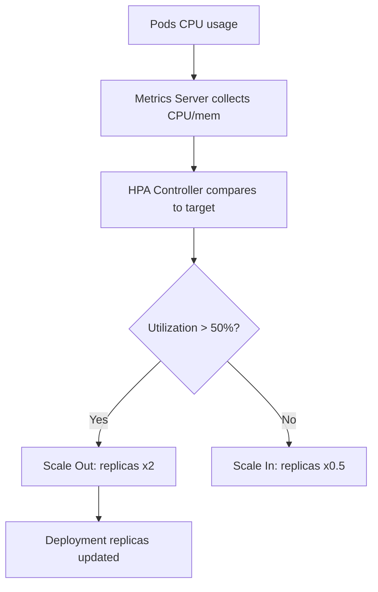
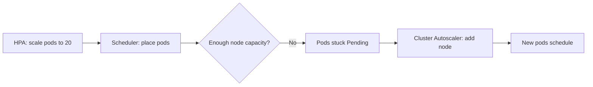

# Horizontal Pod Autoscaler (HPA)

> **Category:** Workload / Autoscaling

## What It Is

The **Horizontal Pod Autoscaler (HPA)** automatically scales the **number of Pod replicas** for a Deployment (or other scalable resource) based on **observed metrics** — typically CPU utilization, but also memory, custom, or external metrics.

It is different from **VPA** (adjusts per-pod resources) and **Cluster Autoscaler** (adjusts node count).

## Why It Exists

- **CPU-based scaling** is manual and reactive without HPA
- **Traffic spikes** (Black Friday, viral events) overwhelm fixed-size deployments
- **Under-utilized** pods waste money (over-provisioning for peak)
- Manual `kubectl scale` is slow and error-prone

HPA keeps utilization healthy: **scale out when busy, scale in when quiet**.

## Architecture



## HPA API (autoscaling/v2)

```yaml
apiVersion: autoscaling/v2        # v2 supports multiple metrics (v2beta2 deprecated)
kind: HorizontalPodAutoscaler
metadata:
  name: myapp-hpa
spec:
  scaleTargetRef:                 # The workload to scale
    apiVersion: apps/v1
    kind: Deployment
    name: myapp
  minReplicas: 2                  # Minimum Pod count
  maxReplicas: 10                 # Maximum Pod count
  metrics:
  - type: Resource                # Built-in metrics (CPU, memory)
    resource:
      name: cpu
      target:
        type: Utilization         # Utilization (%) or AverageValue, Value
        averageUtilization: 50    # Target average CPU = 50%
  - type: Resource
    resource:
      name: memory
      target:
        type: AverageValue
        averageValue: 500Mi       # Target average memory = 500MB
  - type: Pods                    # Custom metric (Prometheus Adapter)
    pods:
      metric:
        name: requests_per_second
      target:
        type: AverageValue
        averageValue: "1000"
  - type: External                 # External metric (queue depth, etc.)
    external:
      metric:
        name: sqs-messages-visible
      target:
        type: Value
        value: "1000"
```

## Behavior (HPA v2+)

Control how aggressively HPA scales up/down:

```yaml
behavior:
  scaleDown:
    stabilizationWindowSeconds: 300   # Wait 5 min before scaling down
    policies:
    - type: Percent
      value: 10                       # Max 10% drop per 60s
      periodSeconds: 60
    - type: Pods
      value: 2                        # Max 2 Pods drop per 60s
      periodSeconds: 60
  scaleUp:
    stabilizationWindowSeconds: 60
    policies:
    - type: Percent
      value: 50                       # Max 50% increase per 60s
      periodSeconds: 60
    selectPolicy: Max                 # Max | Min | Disabled
```

### Metrics Sources

| `type` | Source | Example |
|--------|--------|---------|
| `Resource` | Metrics Server (built-in) | CPU, memory |
| `Pods` | Custom metrics API (Prometheus Adapter) | `requests_per_second` |
| `Object` | Custom/Object metrics API | Queue depth on a resource |
| `External` | External metrics provider | `sqs-messages-visible`, lag |

## How HPA Calculates

**CPU example:**
- 3 Pods, each requests `500m` CPU (0.5 cores)
- Each Pod uses `750m` (1.5x its request → 150% utilization)
- HPA sees avg **150% utilization** vs target **50%**
- `desiredReplicas = ceil[3 * (150/50)] = 9`
- HPA clamps to min/maxReplicas

Formula: `desiredReplicas = ceil[currentReplicas * (observedUtilization / targetUtilization)]`

For a stable metric (queue length), use **Value** (not `Utilization`):
- `target.value = "1000"` = scale to keep the value at 1000

## Commands

```bash
kubectl get hpa
kubectl get hpa <name> -o wide     # Shows current vs desired replicas, metrics
kubectl describe hpa <name>         # See metrics, conditions, events
kubectl autoscale deployment myapp --cpu-percent=50 --min=1 --max=10
kubectl apply -f hpa.yaml
kubectl delete hpa <name>
kubectl top pods                  # See CPU/memory
kubectl top nodes
kubectl -n kube-system get pods -l k8s-app=metrics-server  # Is Metrics Server up?
```

## Metrics Server

HPA needs the **Metrics Server** for CPU/memory:

```bash
kubectl apply -f https://github.com/kubernetes-sigs/metrics-server/releases/latest/download/components.yaml
kubectl get apiservice v1beta1.metrics.k8s.io    # Status = Available
kubectl top nodes
```

## HPA with VPA

- **HPA** scales replicas; **VPA** adjusts per-pod resources
- **HPA uses requests** as the CPU % baseline — if VPA (Auto) keeps changing requests, HPA's target shifts → **fight loop**
- **Best practice:** use VPA `updateMode: Initial` with HPA (set requests once), or use **custom/externals metrics** instead of CPU%

## Common Issues

### HPA not scaling (stuck at minReplicas)
```bash
kubectl describe hpa <name>
# Check: Metrics available? Conditions?
# - "unable to get metrics": Metrics Server not running or not returning data
# - "failed to get cpu utilization": Pods have no resource.requests (CPU%)
kubectl -n kube-system get pods -l k8s-app=metrics-server
kubectl top pods   # Works? Otherwise Metrics Server issue
```

### "I don't see the metrics"
```bash
kubectl top pods
# error: metrics not available if unknown
# HPA can't scale without metrics.
```

### Scale-up but Pods don't start (Pending)
```bash
kubectl describe hpa <name>
# desiredReplicas = 9 but only 2 Pods running
# Cause: Scheduler can't place new pods (no node capacity)
# Fix: install Cluster Autoscaler, or reduce resource requests
```

### HPA oscillates (flip-flop)
```yaml
# Use stabilization to smooth:
behavior:
  scaleDown:
    stabilizationWindowSeconds: 300
```

### Pods can't scale down
```yaml
# HPA wants 1 pod but Deployment keeps 3
# Check: PodDisruptionBudget blocking eviction
# Check: Pods are not actually serving traffic (readiness gate)
```

### "metric not configurable" error
```bash
# External/custom metrics require a metrics adapter (Prometheus Adapter)
# Make sure the --rules in the adapter expose the metric name
kubectl get --raw /apis/custom.metrics.k8s.io/beta/1/namespaces/default/pods/my-pod/requests_per_second
```

## HPA Target Types

HPA can scale these resources:

| Kind | Scalable? |
|------|-----------|
| `Deployment` | Yes |
| `ReplicaSet` | Yes |
| `StatefulSet` | Yes (1.23+ for HPA v2) |
| `ReplicationController` | Yes (deprecated) |

## HPA + Cluster Autoscaler



When HPA wants more Pods than the cluster can fit, **Cluster Autoscaler** adds nodes.

## Best Practices

1. **Set `targetAverageUtilization`** — 50% is a good start (lower = more sensitive)
2. **Set sane `minReplicas`/`maxReplicas`** — 0 min for cost savings / 3-5 min for prod
3. **Always set resource requests** — HPA uses CPU% relative to requests
4. **Use stabilization windows** — to avoid scale-down/up thrash
5. **Use custom/external metrics** — queue length, request rate (better than CPU)
6. **Ensure Metrics Server is healthy** — HPA is blind without it
7. **Don't use VPA (Auto) + HPA** (CPU-based) — causes a fight loop
8. **Set Pod `readinessProbe`** — so HPA only scales healthy Pods
9. **Monitor `desiredReplicas` vs `currentReplicas`** — detect stuck scaling
10. **Combine with Cluster Autoscaler** — so HPA can actually schedule new replicas

## HPA Metrics Deep Dive

### CPU Utilization
```yaml
metrics:
- type: Resource
  resource:
    name: cpu
    target:
      type: Utilization
      averageUtilization: 50    # Target 50% CPU utilization
```
- `Utilization` = actual usage / requested CPU (as %)

### CPU Value (absolute)
```yaml
target:
  type: Value        # Scale when total CPU crosses a value
  value: "5"         # E.g., 5 cores across all pods (e.g., 500m x 10 pods)
```

### Memory (AverageValue)
```yaml
metrics:
- type: Resource
  resource:
    name: memory
    target:
      type: AverageValue  # Target average memory per pod
      averageValue: 500Mi
```
- Memory% is **harder** to predict than CPU (burstable) — use with caution

### Custom Metric (e.g., rps)
```yaml
metrics:
- type: Pods
  pods:
    metric:
      name: requests_per_second
    target:
      type: AverageValue
      averageValue: "100"
```
Requires a metrics adapter exposing `requests_per_second` (e.g., Prometheus Adapter).

## Interview Questions

**Q: What does HPA use to make scaling decisions?**
A: Observed metrics — CPU/mem from the Metrics Server; custom/external metrics from adapters (Prometheus, etc.).

**Q: What is the relationship between a Pod's CPU request and HPA's decision?**
A: HPA targets CPU **utilization** = actual CPU usage / requested CPU. If utilization > target %, HPA scales up. You must set `resources.requests.cpu` on Pods, or HPA cannot compute %.

**Q: Can HPA scale to 0?**
A: HPA itself can't set replicas to 0 (unlike KEDA). It respects `minReplicas`, so you set `minReplicas: 0`. But most apps want `minReplicas: 1` to avoid cold starts.

**Q: What happens if the Metrics Server is missing?**
A: HPA can't see metrics — it stays at the last `currentReplicas` and logs warnings ("unable to get metrics for resource cpu"). Install Metrics Server to fix.

**Q: How do you smooth out HPA fluctuation?**
A: Use `behavior.stabilizationWindowSeconds` to buffer scale-up/scale-down actions, and `policies` to limit % change per interval (e.g., max 30% per 60s).

## Related Resources

- [VPA](vpa.md)
- [Cluster Autoscaler](cluster-autoscaler.md)
- [KEDA](keda.md)
- [Metrics Server](../08-cluster-operations/README.md)
- [Deployments](deployments.md)