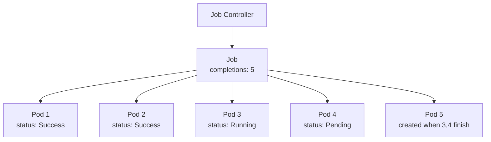
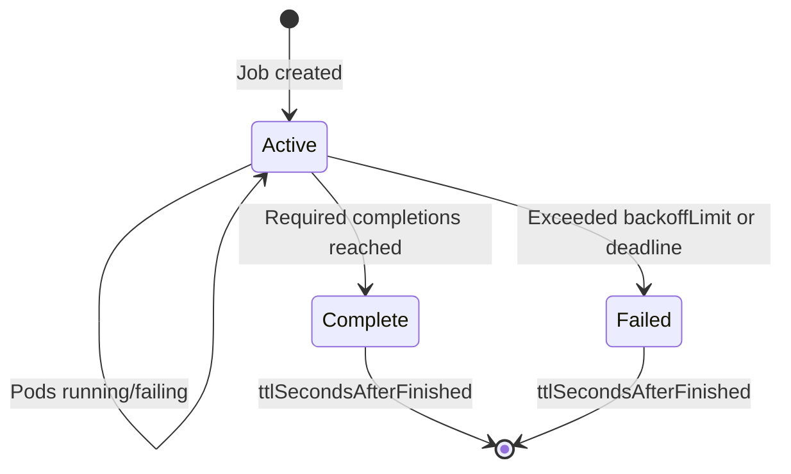

# Job

> **Category:** Workload / Batch Processing

## What It Is

A **Job** creates one or more **Pods** and ensures that **a specified number of them successfully terminate**. Jobs are used for **finite (run-once) tasks** such as batch processing, data analysis, machine learning training, reporting jobs, and any task that runs to **completion**.

## Why It Exists

Pods are designed to run **long-lived**. But many workloads are:
- **Finite** — process a queue and exit
- **One-time** — nightly backup, report generation
- **Retryable** — failed jobs should retry

Jobs provide **completion guarantees** — a job runs until `N` pods succeed, with optional retries.

## Architecture



## Job Spec

```yaml
apiVersion: batch/v1
kind: Job
metadata:
  name: pi
spec:
  completions: 6                 # Total successful pods needed
  parallelism: 3                 # Concurrent pods
  backoffLimit: 4                # Max retries before giving up (default: 6)
  activeDeadlineSeconds: 3600    # Max runtime (1 hour) before termination
  ttlSecondsAfterFinished: 86400 # Clean up after 24 hours
  completions: 1                 # Wait for 1 successful completion (one-shot)
  selector:                      # Label selector (optional, auto-generated)
    matchLabels:
      job-name: pi
  template:                      # Pod template
    metadata:
      labels:
        job-name: pi
    spec:
      restartPolicy: Never       # Must be Never or OnFailure
      containers:
      - name: pi
        image: perl:5.34
        command: ["perl", "-e", "printf('Pi approximately: %.6f', 4*atan2(1,1))"]
```

## How Jobs Work

### One-at-a-Time Job (Default)

`completions: 1`, `parallelism: 1` — wait for **one** Pod to complete successfully.

### Parallel Job

`completions: 5`, `parallelism: 3` — run up to 3 Pods **concurrently**, until 5 Pods have completed successfully.

### Work-Queue Job

`completions: -1`, `parallelism: 3` — **no completion count** set. Pods process a work queue; they're done when **all** Pods exit successfully (or the `activeDeadlineSeconds` timer expires).

## Job States



| Status | Description |
|--------|-------------|
| `Active` | Some pods are running or pending |
| `Failed` | Job failed; exceeded retries |
| `Complete` | Required successful completions reached |
| `Failed` | Active deadline exceeded OR max retries exceeded |

## Job with Backoff

When a Pod in a Job fails:
- A new Pod is created (up to `backoffLimit` total failures)
- **Exponential backoff**: 3s, 15s, 75s, ... (max 6 minutes between retries)
- After `backoffLimit` failed attempts → Job enters `Failed` status

```yaml
spec:
  completions: 1
  parallelism: 1
  backoffLimit: 3    # Max 3 retries (default: 6)
```

## Commands

```bash
# Create from a file
kubectl apply -f job.yaml

# Create imperatively (quick one-off)
kubectl run pi --image=perl:5.34 -- perl -e 'printf(4*atan2(1,1))'

# Create a Job from a command
kubectl create job my-job --image=busybox -- date

# Get
kubectl get jobs
kubectl get job <name>
kubectl get job <name> -o yaml
kubectl get pods --field-selector=job-name=<name>  # Pods for this job

# Describe (shows pods, events)
kubectl describe job <name>

# Check status
kubectl get job <name> -o jsonpath='{.status}'
# active, succeeded, failed, startTime, completionTime

# Watch progress
kubectl get job <name> -w

# Logs (specific pod)
kubectl logs -l job-name=<name>
kubectl logs job/<name>   # (kubectl 1.20+ logs the latest pod)

# Delete
kubectl delete job <name>

# Delete with pods
kubectl delete job <name> --cascade=background  # Pods continue independently
```

## Job Output & Tracking

```bash
# List pods created by job
kubectl get pods --field-selector=job-name=pi

# Get logs of the latest pod
kubectl logs job/pi
kubectl logs -l job-name=pi

# Check job output (logs from a completed job)
kubectl logs <pod-name> -c <container>

# Get Job events
kubectl describe job pi
```

## Job with Cleanup (ttlSecondsAfterFinished)

```yaml
spec:
  ttlSecondsAfterFinished: 86400  # Auto-delete finished job after 24h
```

## Job Failure Handling

### Image Pull Failures

```yaml
# Set backoffLimit to quickly fail (don't retry indefinitely)
spec:
  completions: 1
  backoffLimit: 0  # Fail on first error
  template:
    spec:
      containers:
      - name: app
        image: non-existent:latest
```

### Job with Completion Deadline

```yaml
spec:
  activeDeadlineSeconds: 300  # Job killed after 5 minutes regardless of progress
```

### Checking Job Failures

```bash
# See failed pods
kubectl get pods -l job-name=<name>
kubectl describe pod <pod-name>  # Check "Events" for the error

# Check job status
kubectl get job <name> -o json
# .status.conditions contains the failure reason:
# - FailedCreate (Pods can't be created)
# - FailedPods (Pods exited with errors)
# - BackoffLimitExceeded
# - DeadlineExceeded
```

## Common Issues & Solutions

### Job has not been started
```bash
kubectl describe job <name>
# Check events: "failed to create pod"
# Usually means: invalid Pod template, insufficient resources
```

### Pod failed (ImagePullBackOff)
```bash
# Check image name, registry access
kubectl describe pod <pod>
kubectl get events | grep <pod-name>
# Fix: correct image, add imagePullSecrets for private
```

### Job never completes
```bash
kubectl describe job <name>
# Check: parallelism, completions
# If the Pod runs but never finishes, check the app logic
kubectl logs <pod>
```

### BackoffLimitExceeded
```bash
kubectl describe job <name>
# Check the events — look for "error creating pod"
# Usually a config issue, not transient failures
```

### Job resource constraints
```bash
# A Job may fail due to insufficient resources (like regular pods)
# Scale up the cluster, or reduce the parallelism
kubectl describe node
```

### Job is stuck in "Active" state

```yaml
# Check if activeDeadlineSeconds is set
# Or if the pod is running but never completes
spec:
  activeDeadlineSeconds: 600    # Force completion
```

## Job vs Deployment vs CronJob

| Feature | Job | Deployment | CronJob |
|---------|-----|------------|---------|
| **Goal** | Run to completion | Keep running | Run on schedule |
| **Restart policy** | `Never` or `OnFailure` | `Always` | `Never` / `OnFailure` |
| **Scaling** | `parallelism` / `completions` | Horizontal Pod Autoscaler | N/A |
| **Auto-restart** | Yes (retries) | Yes (controller) | Yes (retries) |
| **Use case** | One-off batch, CI step | Long-running service | Nightly backup, report |

## Best Practices

1. **Set `ttlSecondsAfterFinished`** — auto-clean up finished jobs (default: never clean)
2. **Use `backoffLimit`** — control how many retries before failure (default: 6)
3. **Set `activeDeadlineSeconds`** — kill the job if it takes too long
4. **Set `restartPolicy: Never` or `OnFailure`** — (required for Jobs)
5. **Capture logs early** — `kubectl logs` while the job is still running (logs disappear!)
6. **Use a unique name** — to avoid conflicts with previous runs (`job-name-$(date +%s)`)
7. **Label the Job** — so you can find pods (`job-name=<name>` label)
8. **Use `--wait`** — wait for job completion: `kubectl wait --for=condition=complete job/<name>`

## Interview Questions

**Q: What is the difference between a Job and a Deployment?**
A: A Job runs to completion (or failure) — it's for finite tasks. A Deployment runs continuously (the desired replica set).

**Q: How do retries work in a Job?**
A: When a Pod fails, a new Pod is created. The number of failures before giving up is controlled by `backoffLimit` (default 6). Kubernetes uses exponential backoff between retries.

**Q: What is `parallelism` vs `completions`?**
A: `completions` is the total number of successful Pods required. `parallelism` is how many Pods run at the same time. Kubernetes creates new Pods until `completions` succeed, with at most `parallelism` running concurrently.

**Q: How do you run a job on a schedule?**
A: Create a CronJob (or a Job triggered by an external scheduler/event).

**Q: How do you clean up old jobs?**
A: Set `ttlSecondsAfterFinished` on the Job spec — Kubernetes automatically garbage collects it when the TTL expires.

## Related Resources

- [CronJob](cronjobs.md)
- [Deployment](deployments.md)
- [Jobs & Scheduling](../11-ci-cd-gitops/tekton.md)
- [kubectl Cheatsheet](../cheat-sheets/kubectl.md)
