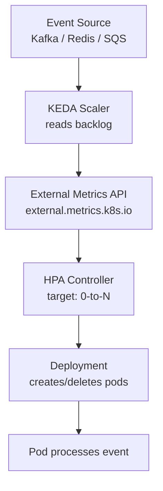

# KEDA (Kubernetes Event-Driven Autoscaling)

> **Category:** Workload / Autoscaling

## What It Is

**KEDA** (Kubernetes Event-Driven Autoscaling) is a **sandbox CNCF project** that scales Kubernetes workloads (Deployments, Jobs, etc.) based on **external or custom metrics** — even down to **zero** replicas when there is no work.

Where the **HPA** reacts to CPU/memory (min 1 replica), KEDA reacts to **real workload signals** (a queue length, a stream offset, a scheduled event). It drives a hidden HPA (or a ScaledJob's job count) so you get **event-driven, scale-to-zero** behavior.

## Why It Exists

- **HPA can't scale to zero** (always >= 1 replica) — idle services keep running
- CPU is a **lagging** indicator — it spikes *after* overload starts
- **Event sources** (Redis, Kafka, RabbitMQ) predict load far better than CPU
- Cost savings: 1 idle pod per service + CPU = expensive

KEDA brings **serverless-like** scaling to Kubernetes based on real events.

## Architecture



KEDA itself runs **two components**:
- **KEDA Operator** (Deployment) — watches `ScaledObjects`, computes metrics, runs the scalers
- **Metrics Server extension** — exposes the metrics to the HPA (on the `external.metrics.k8s.io` API)

## KEDA Objects

| Object | Purpose |
|--------|---------|
| `ScaledObject` | The main object — maps a trigger to a Deployment/StatefulSet |
| `ScaledJob` | Scales a Kubernetes **Job** (run-to-completion), not a Deployment |
| `TriggerAuthentication` | Centralized auth config for scalers (avoid per-ScaledObject creds) |
| `Connector` | Connects to external auth providers (Vault, etc.) |

## ScaledObject

```yaml
apiVersion: keda.sh/v1alpha1
kind: ScaledObject
metadata:
  name: redis-scaledobject
  namespace: default
  labels:
    app: backend
  annotations:
    scaledobject.keda.sh/transfer-hpa-disable: "true"   # Use a fresh HPA (avoid conflicts)
spec:
  scaleTargetRef:
    kind: Deployment                            # What to scale
    name: backend-deployment                    # The Deployment name
  pollingInterval: 30                          # How often to check (seconds)
  cooldownPeriod: 300                          # How long to wait before scaling to 0
  minReplicaCount: 0                           # CAN scale to zero
  maxReplicaCount: 10                          # Max pods
  activationThreshold: 10                      # Only scale when backlog > 10
  horizontalPodAutoscaler:                     # Optional HPA config
    name: redis-hpa
    behavior:
      scaleDown:
        stabilizationWindowSeconds: 300
  triggers:                                    # The event sources
  - type: redis
    metadata:
      address: "redis://my-redis.redis.svc.cluster.local:6379"
      listLength: "my-queue"
      listNames: "my-queue"
      listLength: "1"
```

## Triggers (Scalers)

KEDA ships ~**50+** scalers. Common ones:

| Trigger | Event source | Example key |
|---------|--------------|-------------|
| `redis` | Redis list length | `listLength`, `listNames` |
| `kafka` | Kafka consumer lag | `topic`, `bootstrapServers`, `consumerGroup` |
| `rabbitmq` | RabbitMQ queue depth | `host`, `queueName` |
| `aws-sqs-queue` | AWS SQS | `queueURL`, `queueLength` |
| `azure-servicebus` | Azure Service Bus | `namespace`, `queueName` |
| `gcp-pubsub-subscription` | GCP PubSub | `subscription`, `projectID` |
| `cron` | Scheduler (time-based) | `start`, `end`, `timezone` |
| `prometheus` | Any PromQL metric | `serverAddress`, `metricName`, `query` |
| `cpu` / `memory` | Built-in | — |

### Example: Kafka consumer lag

```yaml
triggers:
- type: kafka
  metadata:
    bootstrapServers: kafka-server.kafka:9092
    consumerGroup: my-group
    topic: my-topic
    lagThreshold: "100"        # Scale when lag > 100 msgs
```

### Example: Prometheus metric

```yaml
triggers:
- type: prometheus
  metadata:
    serverAddress: http://prometheus.monitoring.svc:9090
    metricName: http_request_rate
    query: sum(rate(http_requests_total[2m]))
    query-period: "120s"
    threshold: "500"
```

### Example: Cron trigger

```yaml
triggers:
- type: cron
  metadata:
    start: "30 */2 * 1-3 4-6 1-5"   # 2x/week
    end: "45 */2 * 1-3 4-6 1-5"
    timezone: "America/Los_Angeles"
```

## ScaledObject vs External Metrics HPA

| Feature | ScaledObject (KEDA) | External Metrics HPA |
|---------|---------------------|----------------------|
| Auth to source | TriggerAuthentication / per-trigger | Manual metrics adapter |
| Scale to zero | Yes | Yes (if you set min=0) |
| Config language | YAML, per-trigger | External metrics (adapter) |
| Number of scalers | 50+ built in | Adapter-specific |
| Complexity | Lower (built-in scalers) | Higher (you wire the adapter) |

## ScaledJob (for batch workloads)

For **run-to-completion** jobs (rather than always-on Deployments):

```yaml
apiVersion: keda.sh/v1alpha1
kind: ScaledJob
metadata:
  name: batch-worker-scaledjob
spec:
  jobTargetRef:               # The Job spec template
    template:
      spec:
        containers:
        - name: worker
          image: worker:latest
          args: ["process", "--message=$(QUEUE_MESSAGE)"]
          env:
          - name: QUEUE_MESSAGE
            valueFrom:
              secretKeyRef:
                name: queue-creds
                key: message
        restartPolicy: Never
  pollingInterval: 5
  maxScale: 10
  minScale: 0
  cooldownPeriod: 300
  backoffLimit: 4             # Job backoffs
  triggers:
  - type: rabbitmq
    metadata:
      host: "https://my-rabbitmq"
      queueName: "my-queue"
      mode: "QueueLength"
```

When `queue depth > 0`, KEDA creates a **Job** with active pods (up to `maxScale`); when empty, the Job is scaled down to 0.

## Installing KEDA

```bash
helm repo add kedacore https://kedacore.github.io/charts
helm repo update
helm install keda kedacore/keda --namespace keda --create-namespace

# Verify
kubectl get pods -n keda
kubectl get scaledobjects
kubectl get hpa                # KEDA creates HPAs behind the scenes
```

## TriggerAuthentication (centralized auth)

Avoid putting credentials in each ScaledObject. Define once:

```yaml
apiVersion: keda.sh/v1alpha1
kind: TriggerAuthentication
metadata:
  name: redis-auth
  namespace: default
spec:
  secretTargetRef:
  - parameter: host          # The env var the scaler expects
    name: redis-connection-strings   # A Secret
    key: host
  - parameter: password
    name: redis-connection-strings
    key: password
---
# Reference it in the ScaledObject:
spec:
  triggers:
  - type: redis
    metadata:
      address: my-redis...
    authentication:
      name: redis-auth          # Refers to the TriggerAuthentication above
      podIdentity:              # Or use Azure/AWS managed identity
        provider: azure-workload
```

## Commands

```bash
kubectl get scaledobject          # All ScaledObjects
kubectl get scaledobject <name> -o yaml
kubectl describe scaledobject <name>   # See status, triggers, conditions
kubectl get hpa                     # KEDA's generated HPAs
kubectl get scaledjob <name>
kubectl delete scaledobject <name>
kubectl -n keda logs -l app=keda-operator
```

## How KEDA Works (internals)

1. The KEDA **operator** watches `ScaledObject`s and their target Deployments.
2. For each trigger, the appropriate **scaler** polls the event source (e.g., Redis list length) and reports the metric to the **metrics server extension**.
3. KEDA **creates/updates an HPA** (named `<scaledobject-name>-keda-<n>`) targeting the Deployment's `minReplicaCount`-`maxReplicaCount`.
4. The HPA controller adjusts the Deployment's replicas (0 is allowed).
5. The metrics are exposed on the `external.metrics.k8s.io` API group.

## KEDA vs HPA vs VPA

| | KEDA | HPA | VPA |
|--|------|-----|-----|
| **Scales** | replicas | replicas | per-pod CPU/memory |
| **Metric** | external events | CPU/memory/custom | historical usage |
| **Min replicas** | 0 | 1 | N/A |
| **Scale-to-zero** | Yes | No | No |

Best combo: **KEDA** (zero scale + events) + **VPA (Initial)** (rightsize) + **Cluster Autoscaler** (nodes).

## Common Issues

### ScaledObject not scaling (stuck at 0)
```bash
kubectl describe scaledobject <name>
# Check: status.conditions — "Active", "Ready", "Paused"
kubectl get hpa <name>-keda-0    # Does the HPA exist? Is its metric coming?
kubectl get --raw /apis/external.metrics.k8s.io/v1beta1
# Check: the scaler can reach the event source (auth, network)
kubectl -n keda logs -l app=keda-operator | grep -i error
```

### "no external metrics" / HPA stuck
```bash
# KEDA's metrics server extension must be running
kubectl get apiservice v1beta1.external.metrics.k8s.io
# Should be Available
kubectl -n keda get pods -l app=keda-operator-metrics-apiserver
```

### Scale-to-zero not happening (stuck at 1)
```bash
# KEDA only scales to 0 if:
# 1. minReplicaCount: 0
# 2. The trigger reports below activationThreshold
# 3. The Deployment has no manually-managed replicas (HPA must own it)
# Check: no manual `kubectl scale` conflict, and cooldownPeriod has passed.
```

### Multiple HPAs fighting
```bash
# KEDA says "scaledobject.keda.sh/transfer-hpa-disable: true" to create a fresh HPA.
# If you have a separate HPA on the same Deployment, they conflict.
# Remove the other HPA, or use transfer-hpa-disable: false.
```

### Trigger failing (auth / network)
```bash
# Use TriggerAuthentication (not per-trigger creds)
# Check: is the event source reachable from the KEDA operator's Pod?
# Check: credentials in the Secret/PodIdentity are valid
```

## Best Practices

1. **Set a sane pollingInterval** (30s default — lower if you need fast scale-up, but more API load)
2. **Use activationThreshold** — prevents flapping / tiny scale-ups (only scale when backlog > N)
3. **Set cooldownPeriod high enough** (300s default) so it doesn't scale to 0 the instant the queue is empty
4. **Pin HPA ownership** — don't manually scale the Deployment that a ScaledObject controls
5. **Use TriggerAuthentication** — centralize credentials for scalers
6. **Test scale-to-zero** in staging (ensure the app tolerates cold starts)
7. **Prefer a single trigger** when possible (or combine with max of several)
8. **Monitor the generated HPA** (`kubectl get hpa`) — KEDA drives it
9. **Use ScaledJob for batch**, ScaledObject for long-running services
10. **Consider VPA (Initial)** alongside KEDA for right-sizing

## KEDA & Scale-to-Zero

When the queue/backlog = 0:
- KEDA sets the HPA's `desiredReplicas` to `0`
- The Deployment scale to 0
- Pods are terminated
- The Service's endpoints go empty (no backend)

This is a **cold-start** tradeoff — the first request after 0 incurs spin-up latency (image pull, container start). Mitigate via keep-warm pods (`minReplicaCount: 1`) if latency matters.

## Interview Questions

**Q: What is KEDA and what does it solve?**
A: A Kubernetes event-driven auto-scaler. It scales Deployments/Jobs based on **external events** (queues, streams, schedules) — including **to zero** when there is no work, unlike the HPA (min 1).

**Q: How is KEDA different from the HPA?**
A: HPA scales on **CPU/memory** (or custom/external metrics), min 1 replica. KEDA is a framework of **built-in scalers** (Redis, Kafka, etc.) that expose those metrics to a (hidden) HPA — and supports **scale-to-zero**.

**Q: Does KEDA require the Metrics Server?**
A: No — KEDA has its own **metrics server extension** that serves `external.metrics.k8s.io`. It does NOT use the `metrics.k8s.io` (Metrics Server) API.

**Q: What's the difference between ScaledObject and ScaledJob?**
A: A `ScaledObject` scales a **Deployment/StatefulSet** (long-running service). A `ScaledJob` scales a **Kubernetes Job** (run-to-completion work) — ideal for worker pools.

**Q: What is an activationThreshold?**
A: The queue-depth / metric value at or below which KEDA will **not** scale to 1+ — it stays at 0. Avoids flapping on tiny spikes.

**Q: How would you handle the cold-start cost of scale-to-zero?**
A: Set `minReplicaCount: 1` (always keep one warm pod), or set a lower `cooldownPeriod`, or use a warm-up probe. Or accept brief latency for cost savings.

## Related Resources

- [HPA](hpa.md)
- [VPA](vpa.md)
- [Cluster Autoscaler](cluster-autoscaler.md)
- [Deployment](deployments.md)
- [External Metrics API](../07-scheduling-autoscaling/resources.md)
