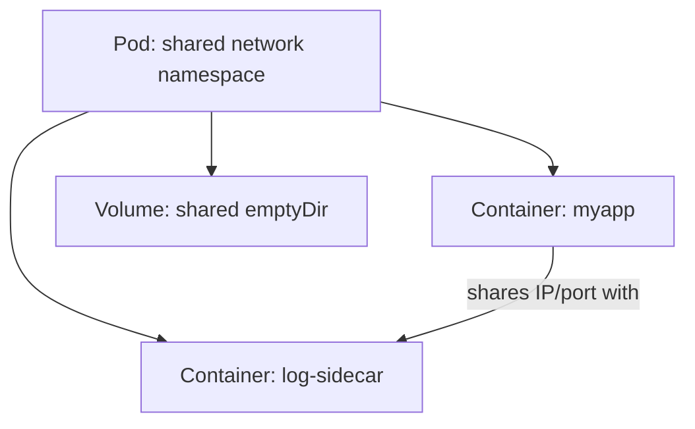

# Pod

> **Category:** Workload / Core Unit

## What It Is

A **Pod** is the smallest deployable unit in Kubernetes. It is a **logical host** for one or more **containers** that share the same **network namespace** (same IP, localhost), **storage volumes**, and some kernel namespaces (PID, IPC).

A Pod is like a "logical machine" — one main app container (+ optional sidecars, init containers).

## Why It Exists

Docker only orchestrates **single containers**. Kubernetes needs to:
- Group tightly-coupled containers (main app + logging sidecar)
- Give containers a **shared IP**
- Manage **co-scheduled, co-located, co-terminated** containers
- Enable **sidecar** and **init** patterns

Pods solve all that.

## Architecture



## Pod Spec Essentials

```yaml
apiVersion: v1
kind: Pod
metadata:
  name: myapp-pod
  labels:
    app: myapp
spec:
  containers:
  - name: myapp
    image: nginx:1.25          # Image:Tag
    imagePullPolicy: IfNotPresent  # Always | Never | IfNotPresent
    ports:
      - containerPort: 8080     # Documentation only — not enforced
    env:                        # Env vars (not secrets!)
      - name: ENVIRONMENT
        value: "production"
      - name: DB_PASSWORD
        valueFrom:
          secretKeyRef:
            name: db-secret
            key: password
    envFrom:                    # Inject all KVs from a ConfigMap/Secret
      - configMapRef:
          name: app-config
    resources:                  # Requests & limits
      requests:
        memory: "64Mi"
        cpu: "250m"
      limits:
        memory: "128Mi"
        cpu: "500m"
    volumeMounts:               # Mount volumes
      - name: data
        mountPath: /data
    livenessProbe:              # Health check to restart
      httpGet:
        path: /health
        port: 8080
    readinessProbe:             # Health check for traffic
      httpGet:
        path: /ready
        port: 8080
    startupProbe:               # Slow-start tolerance
      httpGet:
        path: /ready
        port: 8080
      failureThreshold: 30
      periodSeconds: 5
  volumes:
  - name: data
    emptyDir: {}
  restartPolicy: Always         # Always | OnFailure | Never (Pod-level)
  terminationGracePeriodSeconds: 30
  dnsPolicy: ClusterFirst
  nodeSelector:
    disktype: ssd
  affinity:
    nodeAffinity:
      requiredDuringSchedulingIgnoredDuringExecution:
        nodeSelectorTerms:
        - matchExpressions:
          - key: kubernetes.io/arch
            operator: In
            values: ["amd64"]
  tolerations:
  - key: "key1"
    operator: "Equal"
    value: "value1"
    effect: "NoSchedule"
  serviceAccountName: my-sa
```

## Multi-Container Pods (Sidecars)

Pods share the network namespace — all containers in a Pod share the same IP and `localhost`.

```yaml
spec:
  containers:
  - name: app              # Main container
    image: nginx
  - name: sidecar          # Sidecar (logs, metrics, proxy)
    image: fluentbit
```

### Patterns

| Pattern | Purpose |
|---------|---------|
| **Sidecar** | Add-on container (logs, monitoring, proxy) |
| **Ambassador** | Container acting on behalf of the Pod (e.g., a proxy) |
| **Adapter** | Exposes container data as a standard metric |
| **Init Container** | Runs to completion before app containers — for setup, migrations |

### Init Containers

```yaml
spec:
  initContainers:
  - name: wait-for-db
    image: busybox
    command: ["sh", "-c", "until nc -z db 5432; do sleep 2; done;"]
  containers:
  - name: app
    image: myapp
```

- Init containers run **sequentially** and to completion before the main containers
- If one fails, the Pod restarts (respecting restartPolicy) **from the failed init**
- Used for: fetching secrets, running DB migrations, waiting for dependencies

## Pod Lifecycle States

| State | Meaning |
|-------|---------|
| `Pending` | Accepted but not running (waiting for image / scheduling) |
| `ContainerCreating` | Pods accepted, waiting for containers to start |
| `Running` | All containers running |
| `Succeeded` | All containers exited with 0 |
| `Failed` | All containers exited, one failed |
| `Unknown` | Status can't be determined |

### Pod `status.phase`
One of: `Pending` \| `Running` \| `Succeeded` \| `Failed` \| `Unknown`

### Container States (within a Pod)
Each container has its own state:
| State | Meaning |
|-------|---------|
| `Waiting` | (pre-start) |
| `Running` | Container started |
| `Terminated` | Container exited (with a reason + exit code) |

## Restart Policy

| Policy | Behavior | Use case |
|--------|----------|----------|
| `Always` (default) | Restart on failure AND success | Long-running apps |
| `OnFailure` | Restart only on non-zero exit | Batch jobs |
| `Never` | Never restart | One-shot |

## Pod Disruption / Termination

When a Pod is deleted/stopped (evicted/drained):
1. SIGTERM is sent to the main container
2. The container has `terminationGracePeriodSeconds` (default `30`) to shut down gracefully
3. If it doesn't exit, SIGKILL is sent after the grace period

```yaml
spec:
  terminationGracePeriodSeconds: 60    # Give the Pod 60s to shut down
  lifecycle:
    preStop:
      httpGet:
        path: /shutdown
        port: 8080           # Run a "drain" hook before termination
```

## Pod Priority & Preemption

Pods can have a PriorityClass — critical pods (with a high priority) can preempt (kill) lower-priority pods if the cluster is full.

```yaml
spec:
  priorityClassName: high-priority
```

## Ephemeral Containers (Debugging)

You can attach a debugging container to a **running** Pod without restarting:

```bash
kubectl debug <pod-name> --image=busybox:1.28 --target=myapp-container -it -- sh
# Opens a shell inside an existing container's namespace (shares PID/net)
```

## Commands

```bash
# Create from file
kubectl apply -f pod.yaml

# Create imperatively
kubectl run nginx --image=nginx --port=8080

# List
kubectl get pods
kubectl get pods -o wide          # Shows Node, IP, Nominated Node
kubectl get pods -l app=myapp     # By label

# Inspect
kubectl describe pod <name>       # Events, QoS, node, containers
kubectl get pod <name> -o yaml    # Full spec (includes generated fields)

# Logs
kubectl logs <pod-name>           # Logs from one container
kubectl logs <pod-name> -c <container>   # Logs from a specific container
kubectl logs -f <pod-name>        # Follow
kubectl logs --previous <pod-name>  # Logs from a crashed container

# Execute
kubectl exec -it <pod-name> -- sh
kubectl exec -it <pod-name> -c <container> -- sh

# Scale / Delete
kubectl delete pod <name>          # Triggers restart (if Deployment)
kubectl delete pod <name> --force               # Force delete (rare)
kubectl delete pod <name> --grace-period=0      # Delete without grace period

# Port-forward
kubectl port-forward pod/<name> 8080:80

# Debug (ephemeral container)
kubectl debug <pod-name> --image=busybox --target=<container-name> -it -- sh
```

## Quality of Service (QoS)

Pods are classified into three QoS tiers based on resource requests/limits:

| QoS Tier | Condition | Eviction Priority |
|----------|-----------|-------------------|
| **Guaranteed** | Every container has identical request == limit | Lowest |
| **Burstable** | Some containers have request and not equal limit | Medium (evicted when memory pressure, below threshold) |
| **BestEffort** | No requests or limits | Highest (evicted first) |

Eviction order under resource pressure: BestEffort → Burstable → Guaranteed

## Common Issues

### Pod stuck `Pending`
```bash
kubectl describe pod <name>
# Events: "scheduling failure" — no node has enough resources
# Or: "Insufficient memory/cpu" — increase the requests or add nodes
```

### Pod stuck `ContainerCreating`
```bash
kubectl describe pod <name>
# Events: "Failed" / "BackOff" — check image, pull secret, or mount
kubectl describe pod <name> | grep -i events -A 10
```

### `ImagePullBackOff`
```bash
# Wrong image name, missing tag, or private repo without secret
# Fix 1: check name/tag: kubectl get pod <name> -o=yaml | grep image
# Fix 2: add image pull secret (for private repos):
imagePullSecrets:
- name: my-registry-secret
```

### `CrashLoopBackOff`
```bash
kubectl describe pod <name>
kubectl logs <pod-name> --previous   # Logs of the failed container
# Often: app crashes on startup / missing dependency / exit code 1
```

### `OOMKilled`
```bash
kubectl describe pod <name> | grep -i state -A5
# "OOMKickedContainer" — the container ran out of memory
# Fix: raise the memory limit (limitRange) or the request (request more memory)
```

### Liveness probe failing
```bash
kubectl describe pod <name> | grep -i liveness
# "Liveness probe failed: HTTP probe failed"
# Check app readiness (it may be running but the probe is wrong)
```

### Pod can't reach Service DNS
```bash
kubectl exec -it <pod> -- nslookup <service>
cat /etc/resolv.conf            # Is the nameserver (coredns) correct?
# Check: is CoreDNS running?
kubectl -n kube-system get pods -l k8s-app=kube-dns
```

### Pod can't mount PVC
```bash
kubectl describe pod <name> | grep -i mount
# "MountVolume.SetUpFailed" — check the PVC status.
kubectl get pvc <name>
```

## Commands

```bash
# Describe
kubectl describe pod <name>

# Logs
kubectl logs <pod-name>
kubectl logs -f <pod-name>
kubectl logs <pod-name> -c <container>
kubectl logs <pod-name> --previous

# Exec
kubectl exec -it <pod-name> -- sh
kubectl exec <pod> -c <container> -- <command>
kubectl exec <pod> -- cat /path/to/file

# Edit (careful in prod — use a new Pod)
kubectl edit pod <name>    # But edits to a Pod are lost on restart

# Port-forward
kubectl port-forward pod/<name> 8080:80
kubectl port-forward svc/<svc> 8080:80   # Or to a service

# Debug with ephemeral container (K8s 1.16+)
kubectl debug <pod-name> --image=busybox --target=<container> -it -- sh

# Get all events
kubectl describe pod <name> | grep -i events -A20   # Scroll for errors
```

## Pod Scheduling

Pods get scheduled to Nodes by the **scheduler**, based on:
1. **Resource requests** (CPU/memory)
2. **Node selectors** / **affinity** rules
3. **Taints & tolerations**
4. **Topology spread constraints**
5. **PriorityClass** (preemption)

## Interview Questions

**Q: What is the difference between a Pod and a container?**
A: A **container** is a single runtime image (Docker container). A **Pod** is a Kubernetes wrapper that groups one or more containers sharing a network namespace (same IP), storage, and some kernel resources. Most Pods have exactly one container (the app) — sometimes with sidecars.

**Q: How do containers in a Pod communicate?**
A: They share a network namespace, so it's via `localhost:<port>`. They don't need DNS or Service discovery — they just use localhost. Shared volumes enable file-based IPC.

**Q: What is the difference between a Sidecar and an Init Container?**
A: **Sidecars** run **concurrently** with the main container (e.g., logging proxy). **Init containers** run **first and to completion** (sequential) before the main container — used for boot steps (DB migration).

**Q: What does a `readinessProbe` do?**
A: It tells the kubelet **when the container is ready to serve traffic** — Kubernetes uses it to add/remove the Pod from Service endpoints (but does NOT restart on failure). A `livenessProbe` failure → restart the container.

**Q: What does `restartPolicy: Always` mean?**
A: The Pod should always be restarted. This is the default for Pods in Deployments. `OnFailure` restarts only on non-zero exit codes (jobs). `Never` never restarts.

**Q: What is the difference between `readiness` and `liveness` probes?**
A: A `liveness` failure → kill/restart the container (assumes hung). A `readiness` failure → remove from Service endpoints (stop sending traffic) but **keep it running** (the app might be busy, not broken).

**Q: What's the difference between a Pod and a Deployment?**
A: A **Pod** is a single set of containers (no self-healing, no updates). A **Deployment** is a controller that **manages Pods** — it rolls out updates, handles scaling, self-heals (re-creates failed pods), and does zero-downtime deployments.

**Q: How do you debug a Pod?**
A: `kubectl describe pod <name>` (events, state); `kubectl logs <pod>` (or `--previous`, `-c <container>`); `kubectl exec -it <pod> -- sh` (shell); `kubectl describe` (QoS class, resources).

## Pod Design Principles

### 1: 1 Process per Container
Keep containers single-purpose (one PID 1 process) — use a process manager.

### 1+: 1 Pod per Application
Pods are meant to scale as a **unit** (replicaset). Put unrelated apps in separate Pods/Deployments.

### Sidecar Pattern
Add an auxiliary container to the Pod for:
- Logging (Fluentd)
- Proxy (Istio/envoy)
- Metrics (Prometheus exporter)

### Init Container Pattern
Run setup logic in a separate, blocking container:
- DB migration
- Wait for a service
- Fetch secrets

## Pod Status Fields

| Field | Value | Meaning |
|-------|-------|---------|
| `podIP` | 10.x.x.x | The Pod IP |
| `nodeName` | node-name | The node it ran on |
| `hostIP` | 10.x.x.x | The node's IP |
| `phase` | Running/Pending | Overall phase |
| `conditions` | Ready/Initialized | Health checks |
| `nominatedNodeName` | node-name | Preemption-related |

## Related Resources

- [Deployment](deployments.md)
- [StatefulSet](statefulsets.md)
- [DaemonSet](daemonsets.md)
- [Resource Quotas](../07-scheduling-autoscaling/resource-quotas.md)
- [Labels & Selectors](../01-core-concepts/labels-selectors.md)
- [Pod Disruption Budget](../01-core-concepts/pod-disruption-budgets.md)
- [kubectl Cheatsheet](../cheat-sheets/kubectl.md)
