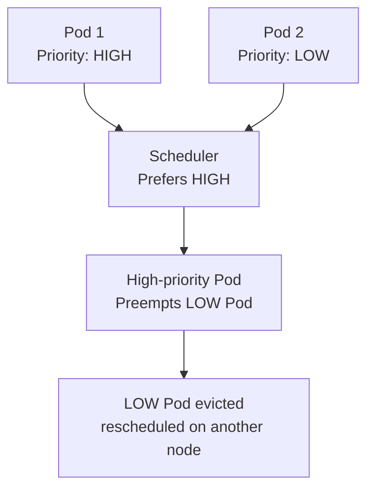

# Priority Classes

> **Category:** Workload / Scheduling

## What It Is

A **PriorityClass** assigns a **priority** to a Pod. When multiple pods compete for resources (during scheduling or preemption), higher-priority Pods get **preference** and can even **evict** (preempt) lower-priority Pods running on a node.

## Why It Exists

Without priority:
- All Pods compete equally — critical app pods can be starved
- Scheduling failures cause cascading downtime
- Emergency fixes are hard to schedule

With PriorityClass:
- Critical workloads **can schedule** even when the cluster is full
- Low-priority Pods can be **evicted** to free space for higher-priority ones
- You express **relative importance** of workloads

## Architecture



## PriorityClass Spec

```yaml
apiVersion: scheduling.k8s.io/v1
kind: PriorityClass
metadata:
  name: high-priority
value: 1000000                # Higher value = higher priority
globalDefault: false          # Should this be the default? (only one per cluster)
description: "High priority for app"
---
apiVersion: v1
kind: Pod
metadata:
  name: critical-pod
spec:
  priorityClassName: high-priority   # Apply the PriorityClass
  containers:
  - name: app
    image: myapp:v1
```

## Default PriorityClasses (K8s 1.11+)

Kubernetes ships with two default PriorityClasses:

| Name | Value | Description | Evictable? |
|------|-------|-------------|------------|
| `system-node-critical` | 2,000,000,000 | Node-critical pods (e.g., kube-proxy, CoreDNS) | ❌ Non-preemptable |
| `system-cluster-critical` | 2,000,001,000 | Cluster-critical pods (e.g., kube-scheduler, etcd) | ❌ Non-preemptable |

## Preemption (Eviction)

### When Preemption Happens

1. A **high-priority Pod** is stuck in `Pending`
2. The scheduler finds nodes that could fit it if lower-priority Pods were removed
3. The scheduler **deletes** (preempts) the **lowest-priority Pod** on that node
4. The preempted Pod's resources are freed
5. The high-priority Pod is scheduled and starts

```yaml
# Pods that are NonPreemptable will NEVER be preempted
apiVersion: scheduling.k8s.io/v1
kind: PriorityClass
metadata:
  name: non-preemptable-critical
value: 999999
globalDefault: false
preemptionPolicy: Never    # Never (default) | PreemptLowerPriority
description: "Critical, non-evictable"
```

## PriorityClass Preemption Policies

| Policy | Behavior |
|--------|----------|
| `PreemptLowerPriority` (default) | Can preempt lower-priority pods |
| `Never` | Cannot preempt any pods (will remain pending if no space) |

## Resource Quotas & Priority

Priority affects **resource preemption**, not quota limits:

| Priority | Quota Required? | Eviction Eligible? | Preemption? |
|----------|-----------------|-------------------|-------------|
| High | Yes | No | Can preempt lower |
| Medium | Yes | Yes (if over quota) | No (unless higher arrives) |
| Low | Yes | Yes | Yes |

## Commands

```bash
# List all PriorityClasses
kubectl get priorityclass

# Create
kubectl apply -f priorityclass.yaml
kubectl create priorityclass high-priority --value=1000000 --description="critical app" --global-default=false

# Describe
kubectl describe priorityclass high-priority

# Get the priority of a pod
kubectl get pod <name> -o jsonpath='{.spec.priorityClassName}'

# Annotate (for existing pods without a PriorityClass — doesn't work retroactively)
kubectl label pod <name> priorityClassName=high-priority
```

## Pod Disruption Budget + Priority

- **PDB** controls voluntary disruptions (drain, CA scale-down)
- **PriorityClass + Preemption** controls scheduling preemption
- Combine: High-priority Pods (NonPreemptable) + PDB → guaranteed availability during maintenance

## Common Issues

### Pods stuck "Pending" due to preemption
```bash
kubectl describe pod <name>
# "Warning: Preemption" in events — higher-priority pods evicted it
# Wait or check the preempted pods:
kubectl get pod <preempted-pod> -o wide
```

### High-priority Pods can't schedule
```bash
# Even with preemption, they might not fit on any node
kubectl describe pod <name>
# Check: resource requests vs node capacities
# Use cluster-autoscaler to add larger nodes
```

### Multiple default PriorityClasses
```bash
kubectl get priorityclass | grep true
# Only one should be globalDefault: true
# Set the others' globalDefault to false
kubectl patch priorityclass <bad-one> -p '{"globalDefault":false}'
```

## Preemption Flow

```mermaid
sequenceDiagram
    A[High-priority pod: Pending] -> B[Scheduler]
    B -> C{Can it fit anywhere?}
    C -> |No| D[Find node with\nlowest priority pods]
    D -> E[Preempt (delete)\nlowest priority pod]
    E -> F[High-priority pod\nschedules successfully]

```

## Interview Questions

**Q: What does PriorityClass do?**
A: It sets a **priority** value for pods — higher priority pods are scheduled first and can preempt (evict) lower-priority pods when resources are constrained.

**Q: What is preemption?**
A: When a high-priority Pod can't schedule and needs space, Kubernetes evicts the lowest-priority Pod on the best-fit node to free resources.

**Q: Can a NonPreemptable pod be evicted during preemption?**
A: No — pods with `preemptionPolicy: Never` will never be preempted. They will stay pending if no node has space.

**Q: What are the default PriorityClasses?**
A: `system-node-critical` (2B) and `system-cluster-critical` (2B+1M), both non-preemptable. Used by core K8s components.

**Q: Is a priority of 1B (billion) high?**
A: Yes — very high. The default system critical classes are 2B. A high-priority custom class typically uses values like 100000 or 1M.

## Related Resources

- [Priority Classes (Workloads)](priority-classes.md)
- [Taints & Tolerations](../07-scheduling-autoscaling/taints-tolerations.md)
- [Affinity](../07-scheduling-autoscaling/)
- [Pod Disruption Budget](../01-core-concepts/pod-disruption-budgets.md)
- [kubectl Cheatsheet](../cheat-sheets/kubectl.md)
EOF
echo "priority-classes.md written"