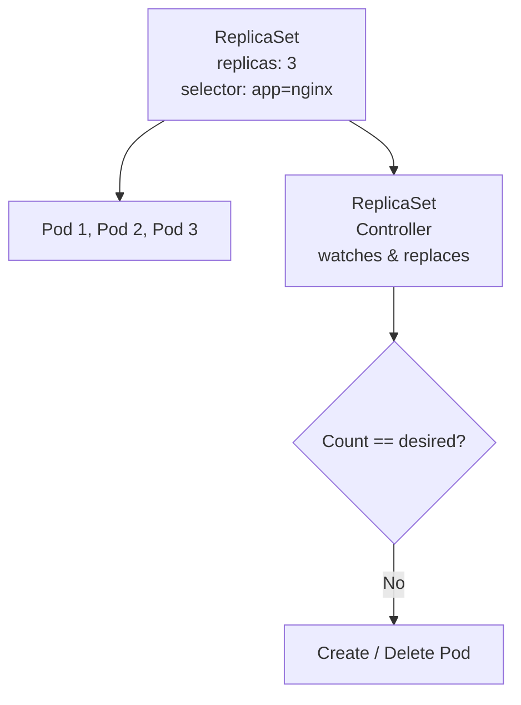
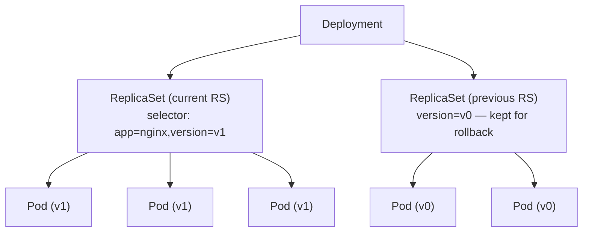

# ReplicaSet

> **Category:** Workload / Controller

## What It Is

A **ReplicaSet** is a Kubernetes **controller** that ensures a specified number of identical **Pod "replicas"** are **running** at any given time. It **owns** the Pods it creates — if a Pod dies, the ReplicaSet replaces it; if too many exist, it removes the extras.

The **Deployment** is the higher-level object that manages ReplicaSets (for rollouts); you rarely use a ReplicaSet directly.

## Why It Exists

You want guarantees like "always run 3 copies of this app":
- If a Pod crashes, it gets replaced
- If a Node dies, Pods on it get re-scheduled elsewhere
- If you scale up/down, the ReplicaSet adjusts the Pod count

ReplicaSet is the **enforcement** layer beneath Deployments.

## Architecture



## ReplicaSet API

```yaml
apiVersion: apps/v1
kind: ReplicaSet
metadata:
  name: nginx-rs
spec:
  replicas: 3               # Desired Pod count
  selector:                 # MUST match the template labels
    matchLabels:            # Selector — which Pods the RS "owns"
      app: nginx
      version: v1
  template:                 # Pod template (the same as in Deployments)
    metadata:
      labels:
        app: nginx        # MUST match the selector
        version: v1       # Mismatch here -> error
    spec:
      containers:
      - name: nginx
        image: nginx:1.25
        ports:
        - containerPort: 80
```

## ReplicaSet vs ReplicationController

| Feature | ReplicationController (legacy) | ReplicaSet (apps/v1) |
|---------|-------------------------------|----------------------|
| Label selector | Equality-based only (key=value) | **Set-based** (`In`, `NotIn`, `Exists`) |
| Pod-template | Own `spec.template` | Same |
| Status | `status` (replicas, readyReplicas) | Same |
| **Used by** | Bare RCs (deprecated) | **Deployments** (and DaemonSets indirectly) |

ReplicaSet is the **modern replacement** for RC — the richer set-based selector is the main win. Deployments create ReplicaSets, not ReplicatedControllers.

## How a ReplicaSet Selects Its Pods

The ReplicaSet uses `spec.selector.matchLabels` (or `matchExpressions`) to find — and **own** — Pods. Every Pod created from the template must have matching labels.

**Critical:** `spec.selector` MUST match `spec.template.metadata.labels`. If they differ, Kubernetes rejects the ReplicaSet (`selector mismatch`), and the controller won't manage those Pods.

## Deployment → ReplicaSet → Pods



When you update a **Deployment** (e.g., change `v1` -> `v2`):
1. A new ReplicaSet is created (`version=v2`)
2. The new RS is scaled up, the old one (`version=v1`) is scaled down — following the Deployment's `strategy`
3. The old ReplicaSet is kept for a while (`revisionHistoryLimit`) so `kubectl rollout undo` works

## ReplicaSet Status

| Field | Meaning |
|-------|---------|
| `status.replicas` | Total desired pods |
| `status.readyReplicas` | Pods that passed their readiness probe |
| `status.availableReplicas` | Ready for the minReadySeconds period |
| `status.fullyLabeledReplicas` | Pods with matching labels |
| `status.observedGeneration` | Last generation observed |
| `status.conditions` | ReplicaFailure, etc. |

## Commands

```bash
# Create / apply
kubectl apply -f rs.yaml
kubectl create -f rs.yaml

# List
kubectl get rs
kubectl get rs <name>
kubectl get pods -l app=nginx       # Pods owned by this RS

# Scale (imperative)
kubectl scale rs/nginx-rs --replicas=5

# Describe
kubectl describe rs <name>           # Shows selector, status
kubectl describe pod <pod-name>      # Shows ownerReferences (which RS owns it)

# Delete (does NOT delete the Pods — just the controller)
kubectl delete rs <name>
# To force-delete the Pods too, first scale it to 0:
kubectl scale rs <name> --replicas=0
kubectl delete rs <name>

# View owner references (which RS owns a Pod)
kubectl get pod <pod-name> -o jsonpath='{.metadata.ownerReferences}'
```

## Common Issues

### "selector does not match labels"
```bash
kubectl apply -f rs.yaml
# Error: spec.selector must match spec.template.metadata.labels
# Fix: ensure spec.selector.matchLabels == spec.template.metadata.labels
```

### Pods not being adopted by the ReplicaSet
```bash
# The Pod's labels don't match the selector
kubectl get pod <name> -l app=wrong-label    # Won't be matched
# OR: a label on the template changed, so new Pods don't match the selector
# Fix: recreate the ReplicaSet (selector is immutable)
```

### Pods get deleted when ReplicaSet is deleted? 
```
# NO — deleting a ReplicaSet does NOT delete its Pods by default.
# The ReplicaSet "releases" the Pods (clears ownerReferences) and stops managing them.
# To remove them, scale the RS to 0 first.
```

### ReplicaSet stuck at 0 replicas
```bash
kubectl describe rs <name>
# status.replicas = 0 but the RS exists
# Check: was it scaled to 0 by another process (HPA)?
kubectl get hpa -o wide
```

## How ReplicaSet Decides to Replace a Pod

- The Pod dies (crash, node loss) → ReplicaSet sees `replicas < desired` → creates a new Pod
- The Pod is not `Ready` for a long time → ReplicaSet still counts it as "existing" (not replaced yet).
  - The ReplicaSet doesn't delete a Pod that is "running" — it just adds more if below desired count.
  - (To evict unhealthy-but-running pods, rely on the kubelet's restartPolicy, or the Deployment's rolling update to replace it.)

## ReplicaSet & Self-Healing

Self-healing at the ReplicaSet level: if a Pod is deleted (e.g., by `kubectl delete pod <name>`), the ReplicaSet **immediately** creates a replacement. This is the foundation of Kubernetes' fault tolerance — combined with the kubelet restarting crashed containers and the scheduler re-placing Pods on healthy nodes.

## Interview Questions

**Q: What does a ReplicaSet do?**
A: It ensures a set number of identical Pods are running and ready. It **recreates** Pods that die and **removes** excess ones so the count matches `spec.replicas`.

**Q: How does a ReplicaSet find the Pods it manages?**
A: Via `spec.selector` matching the Pods' `metadata.labels`. Every Pod from the template must match it.

**Q: How is a ReplicaSet different from a ReplicationController?**
A: ReplicaSet uses **set-based selectors** (`In`, `NotIn`, `Exists`) instead of equality (`key=value`). Otherwise, identical behavior. ReplicaSet is what Deployments manage.

**Q: Why use a Deployment, not a ReplicaSet, directly?**
A: ReplicaSet doesn't do **rollouts or rollbacks**. A Deployment manages a ReplicaSet (creates/updates it for each rollout) and keeps old ReplicaSets around so you can roll back. The Deployment is the user-facing object; the ReplicaSet is the enforcement engine.

**Q: What happens to the Pods when you delete a Deployment (which owns a ReplicaSet)?**
A: The Deployment is deleted, which cascades: ReplicaSet(s) are deleted, which **releases** their Pods (removes ownerReferences). By default the Pods are then also deleted (cascade). The ReplicaSet itself does not delete Pods when deleted, but the Deployment's garbage collection will.

**Q: Can a ReplicaSet manage Pods from another ReplicaSet?**
A: No — it only adopts Pods whose labels match its `selector`. It can't steal from a controller that already owns them. ReplicaSets will only "adopt" Pods that have **no controller** (no `ownerReferences`).

## Related Resources

- [Deployment](deployments.md)
- [Pod](pods.md)
- [DaemonSet](daemonsets.md)
- [HPA](hpa.md)
- [ReplicaSet Controller (core concept ref)](../03-workloads/replicasets.md)
