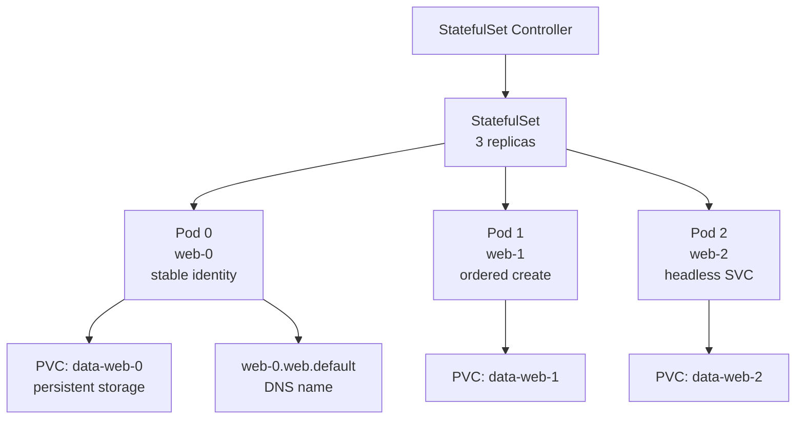
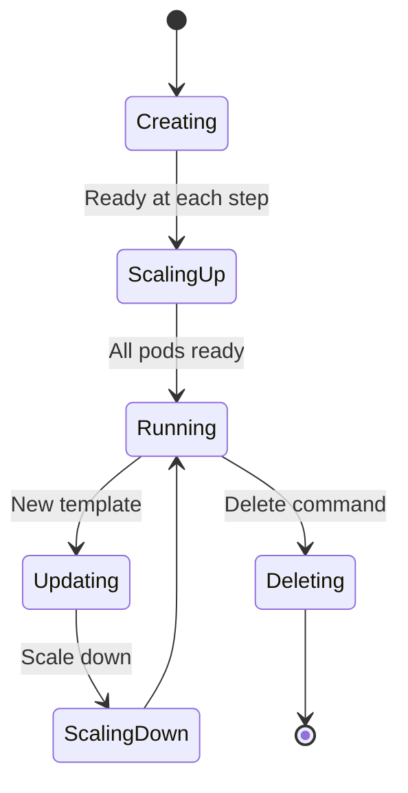

# StatefulSet

> **Category:** Workload / Stateful Applications

## What It Is

A **StatefulSet** is a Kubernetes workload API object used to **manage stateful applications** such as databases, distributed systems, and queues. It manages the **deployment and scaling** of a set of **Pods** with guarantees about **ordering**, **identity**, and **stable storage**.

## Why It Exists

Deployments are **stateless** — all Pods are equal, no naming, no ordering. But stateful apps need:
- **Stable network identity** (e.g., `redis-0.redis`)
- **Ordered, graceful scaling** (scale-down one at a time, last-to-first)
- **Persistent storage** tied to the Pod identity
- **Ordered operations** (initialize node 0 before node 1)

StatefulSets provide these guarantees.

## Architecture



## Key Guarantees

| Feature | Guarantee |
|---------|-----------|
| **Stable identity** | Pod names are deterministic: `<statefulset-name>-<ordinal>` (`web-0`, `web-1`) |
| **Network identity** | Stable DNS name: `<pod-name>.<service-name>.<namespace>.svc.cluster.local` |
| **Ordered deployment** | Pods created in order (0→1→2), deleted in reverse order |
| **Ordered scaling** | Scale up 0→1→2; scale down 2→1→0 |
| **Persistent storage** | Each Pod has its own PV (`volumeClaimTemplates`) |
| **Headless Service** | Required — provides DNS for each Pod |

## Headless Service

A StatefulSet requires a **headless Service** (`clusterIP: None`) — this gives each Pod a **stable DNS name**.

```yaml
# Headless Service
apiVersion: v1
kind: Service
metadata:
  name: web
spec:
  clusterIP: None  # Headless — no virtual IP
  selector:
    app: nginx
```

### DNS Names

| Type | Name Format |
|------|-------------|
| **Governing (headless)** | `web-0.web.default.svc.cluster.local` |
| **Set DNS** | `web-0.web.default.svc.cluster.local` (same as governing) |
| **Cluster-wide** | `web.default.svc.cluster.local` (any pod of the StatefulSet) |

## Persistent Storage

`volumeClaimTemplates` creates a **PVC per Pod**, with the PVC name including the Pod ordinal:

```
Claim: data-web-0  (bound to Pod web-0's ordinal 0)
Claim: data-web-1  (bound to Pod web-1's ordinal 1)
Claim: data-web-2  (bound to Pod web-2's ordinal 2)
```

These PVCs persist across Pod restarts and rescheduling — the same PVC is re-attached to the restarted Pod (with the same ordinal).

## StatefulSet Spec

```yaml
apiVersion: apps/v1
kind: StatefulSet
metadata:
  name: web
spec:
  serviceName: "web"          # Required — name of the headless Service
  replicas: 3
  podManagementPolicy: OrderedReady   # OrderedReady | Parallel
  selector:
    matchLabels:
      app: nginx
  template:
    metadata:
      labels:
        app: nginx
    spec:
      containers:
      - name: nginx
        image: nginx:1.25
        ports:
        - containerPort: 80
          name: web
        volumeMounts:
        - name: www          # Mounts the per-pod PVC
          mountPath: /usr/share/nginx/html
  volumeClaimTemplates:               # Templates for PVCs
  - metadata:
      name: www
    spec:
      accessModes: [ "ReadWriteOnce" ]
      storageClassName: "standard"
      resources:
        requests:
          storage: 10Gi
```

### Pod Management Policies

| Policy | Behavior |
|--------|----------|
| **OrderedReady** (default) | Pods created one by one (0→1→2), each must be Ready before the next starts |
| **Parallel** | All Pods created at once, no ordering (scales faster) |

## Commands

```bash
# Get
kubectl get sts                          # All StatefulSets
kubectl get sts web -o wide
kubectl get sts web -o yaml
kubectl get pvc -l app=nginx             # PVCs from volumeClaimTemplates

# Describe (shows stable identity, PVCs)
kubectl describe sts web

# Scale
kubectl scale sts web --replicas=5

# Rolling update
kubectl patch sts web -p '{"spec":{"updateStrategy":{"type":"RollingUpdate"}}}'
kubectl patch sts web -p '{"spec":{"template":{"spec":{"containers":[{"name":"nginx","image":"nginx:1.26"}]}}}}'

# Check stable identity (DNS)
kubectl run -i --rm --tty debug-pod --image=busybox --restart=Never -- sh -c 'nslookup web-2.web'

# Delete (ordered)
kubectl delete sts web    # Deletes in reverse order (2→1→0), keeps PVCs

# Delete with PVCs
kubectl delete sts web --cascade=foreground  # Or manually delete PVCs
kubectl delete pvc -l app=nginx

# Force delete
kubectl delete sts web --force --grace-period=0
```

## Rolling Update Strategy

```yaml
spec:
  updateStrategy:
    type: RollingUpdate           # default; partition: 0
    rollingUpdate:
      partition: 0                 # Update all; partition N = keep first N at old version
```

### Partition Updates (Canary for StatefulSets)

```yaml
spec:
  updateStrategy:
    type: RollingUpdate
    rollingUpdate:
      partition: 2  # Pods 0 and 1 keep the old image; pod 2+ get the new one
```

## Common Issues & Solutions

### PVC stays in "Pending"
```bash
kubectl get pvc
kubectl describe pvc data-web-0
# Check:
# - StorageClass exists and supports the access mode (RWO)
# - Available storage in the cluster
# - StorageClass default is set

# Fix: set a default StorageClass
kubectl patch storageclass "standard" -p '{"metadata": {"annotations":{"storageclass.kubernetes.io/is-default-class":"true"}}}'
```

### Wrong DNS name from inside a Pod
```bash
# For StatefulSet "web" in namespace "default" with Service "web":
kubectl exec web-0 -- nslookup web-0.web.default.svc.cluster.local
# NOT web-0.default.svc.cluster.local — includes the headless Service name
```

### Stuck during upgrade (Pod not ready)
```bash
# Check readiness probe and logs
kubectl describe pod web-2
kubectl logs web-2

# If the update strategy is OrderedReady, wait for web-0 before scaling web-2
```

### PVC not deleted on deletion
```bash
# volumeClaimTemplates PVCs are NOT deleted with StatefulSet by default
kubectl delete pvc -l app=nginx    # Clean up PVCs manually
# OR use --cascade=background on a newer Kubernetes
```

## StatefulSet vs Deployment

| Feature | StatefulSet | Deployment |
|---------|-------------|------------|
| **Pod names** | Stable: web-0, web-1 | Ephemeral: random-hash |
| **Networking** | Stable DNS per Pod | Via Service (no per-pod DNS) |
| **Scaling order** | Ordered & graceful | Parallel (no order guarantee) |
| **Stable storage** | ✅ (per ordinal: PVC) | ❌ (ephemeral unless PVC in template) |
| **Update strategy** | OnDelete, RollingUpdate | RollingUpdate, Recreate |
| **Use case** | Databases, Redis, Kafka, Elasticsearch | Web servers, APIs |

## Use Cases

| Application | Why StatefulSet |
|-------------|-----------------|
| **Databases** (MySQL cluster, PostgreSQL) | Stable identity, ordered init |
| **Redis cluster** | Stable DNS (`redis-0.redis`) |
| **Elasticsearch** | Ordered startup with persistence |
| **Kafka** | Per-broker storage and identity |
| **Cassandra** | Seed nodes, stable membership |
| **ZooKeeper** | Quorum members with stable IDs |

## StatefulSet Lifecycle



## Best Practices

1. **Always use a headless Service** — required for stable DNS
2. **Use `volumeClaimTemplates`** — not inline PVs (they break identity)
3. **Start with `OrderedReady`** — then switch to `Parallel` for faster scaling once debugged
4. **Use `podManagementPolicy: Parallel`** — for large StatefulSets if order doesn't matter
5. **Set anti-affinity** — for spreading across nodes
6. **Use readiness probes** — to prevent traffic before fully initialized
7. **Handle ordinal-based config carefully** — use `$(STATEFULSET_NAME)` and `$(STATEFULSET_NAMESPACE)`
8. **Backup PVCs** — for databases (snapshot or external backup)
9. **Set appropriate updateStrategy** — partition for canary rollouts

## Interview Questions

**Q: When would you use a StatefulSet instead of a Deployment?**
A: For stateful applications that need: stable network identity (DNS names), ordered deployment/scale, and persistent storage tied to the Pod identity (databases, queues, clusters).

**Q: What does a headless Service do for a StatefulSet?**
A: It provides a stable DNS name (`<pod-name>.<svc-name>.<ns>.svc`) for each Pod in the StatefulSet.

**Q: How does a StatefulSet handle storage for each Pod?**
A: Through `volumeClaimTemplates`, which dynamically creates a PVC named `<claim-name>-<statefulset-name>-<ordinal>` — persisting across Pod restarts.

**Q: What is the `partition` field in a RollingUpdate?**
A: It creates a canary rollout — Pods below the partition ordinal keep the old version; Pods at/above the partition get the new version. Setting `partition: N` updates all but the first N Pods.

**Q: Can StatefulSet Pods be on the same node?**
A: Yes, by default. Use `podAntiAffinity` to enforce spreading across nodes.

## Related Resources

- [Headless Services](../04-networking/services.md)
- [PersistentVolume & PVC](../05-storage/persistent-volumes.md)
- [Deployment](deployments.md)
- [DaemonSet](daemonsets.md)
- [Pod Disruption Budget](../01-core-concepts/pod-disruption-budgets.md)
