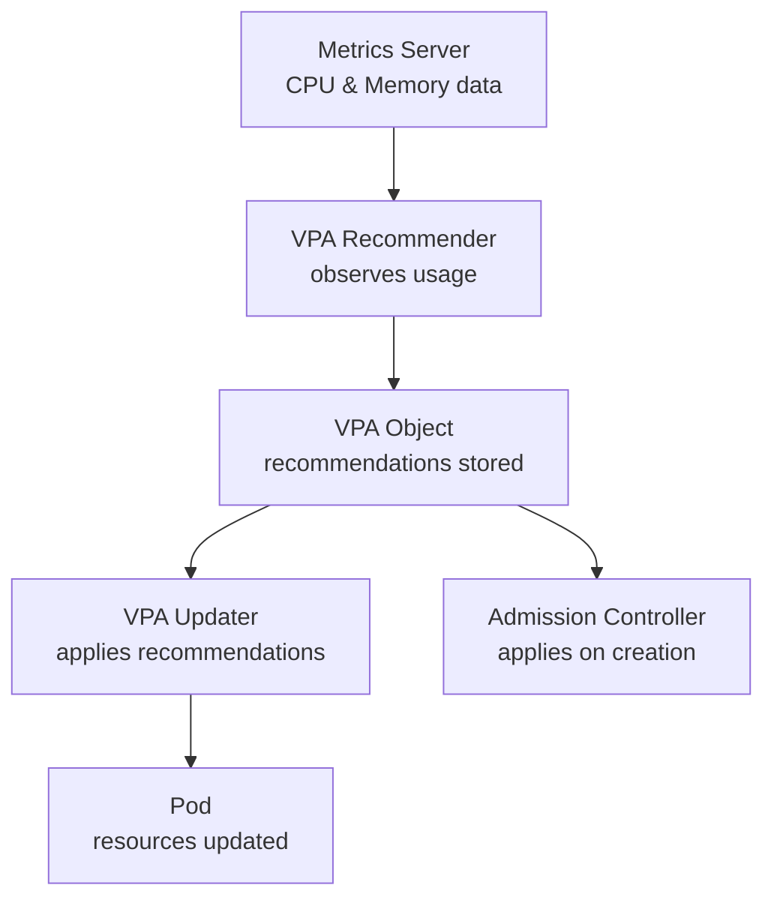

# Vertical Pod Autoscaler (VPA)

> **Category:** Workload / Autoscaling
> **Also known as:** VPA

## What It Is

The **Vertical Pod Autoscaler (VPA)** automatically **adjusts CPU and memory resource requests and limits** for containers in a Pod, based on observed resource usage. It **right-sizes workloads** so you don't over- (or under-) provision resources.

## Why It Exists

Sizing workloads is hard:
- Developers guess at CPU/memory values (over-provision to be safe)
- Workload growth isn't tracked over time
- Manual adjustment is reactive and time-consuming

VPA **recommends** or (in recommendations-only mode), **applies** optimal resource requests/lmits automatically.

## Architecture



## VPA Components

| Component | Role |
|-----------|------|
| **VPA Recommender** | Analyzes Pod metrics, generates recommendations |
| **VPA Updater** | Evicts and recreates Pods with new resource requests (when mode = "Auto") |
| **VPA Admission Controller** | Mutates Pod creation requests to use recommendations |

## VPA API

```yaml
apiVersion: autoscaling.k8s.io/v1
kind: VerticalPodAutoscaler
metadata:
  name: myapp-vpa
spec:
  targetRef:
    apiVersion: apps/v1
    kind: Deployment
    name: myapp            # The workload to scale
  updatePolicy:
    updateMode: Auto        # Off | Initial | Auto | Newpodsinitial (v1.29)
  resourcePolicy:
    containerPolicies:
    - containerName: myapp   # The container to adjust
      minAllowed:
        cpu: 10m
        memory: 128Mi
      maxAllowed:
        cpu: 2
        memory: 4Gi
    - containerName: "*"     # Wildcard (all containers)
      minAllowed:
        cpu: 50m
        memory: 64Mi
      maxAllowed:
        cpu: 4
        memory: 8Gi
  # In-cluster recommendations become available:
  # kubectl describe vpa myapp-vpa
```

## updatePolicy Modes

| Mode | Behavior | Eviction? | Use Case |
|------|----------|-----------|----------|
| **Off** | Recommendations only | ❌ | Manual review before scaling |
| **Initial** | Applies once on Pod creation | ❌ | Initial sizing only |
| **Auto** | Applies on creation **and evicts/restarts Pods** | ✅ | Fully automated — but **disruptive** |
| **NewPodAutoscaling** (NewPodsInitial) | Applies on new Pods AND uses recommendations for new replicasets | ❌ | Works with HPA (non-disruptive) |

## VPA Recommendation API

```yaml
apiVersion: autoscaling.k8s.io/v1
kind: VerticalPodAutoscaler
metadata:
  name: webapp-vpa
spec:
  targetRef:
    apiVersion: apps/v1
    kind: Deployment
    name: webapp
  updatePolicy:
    updateMode: Auto
```

### Reading Recommendations

```bash
# Check current recommendation
kubectl describe vpa webapp-vpa
# Output includes:
#   Recommended Resources:
#     Container: myapp
#       cpu: 1155m       # Current recommendation
#       memory: 697Mi
#       (target, bounds: min, max)
```

## VPA vs HPA

| Feature | HPA | VPA |
|---------|-----|-----|
| **What it adjusts** | Number of Pod replicas | Per-container CPU/memory |
| **Trigger** | CPU/memory/custom metrics | Historical usage |
| **Eviction** | ❌ No | ✅ Yes (if mode = Auto) |
| **Co-exist with HPA** | ✅ Yes | ⚠️ Conflict at scale (both change CPU) |
| **Cold start** | ✅ Yes | ❌ No (waits for metrics) |
| **Latency** | ~15 seconds | ~1 hour (uses historical data) |

> **Important**: HPA scales on **requests** (as % of CPU). If VPA changes requests, HPA's baseline shifts — this can cause a fight loop.

## Recommended VPA Setup

### For HPA + VPA Coexistence
Use `updateMode: Initial` or `NewPodAutoscaling` with VPA, so requests are set once on creation (not changing during the pod's life). HPA then scales pods based on those stable requests.

```yaml
apiVersion: autoscaling.k8s.io/v1
kind: VerticalPodAutoscaler
metadata:
  name: webapp-vpa
spec:
  targetRef:
    apiVersion: apps/v1
    kind: Deployment
    name: webapp
  updatePolicy:
    updateMode: Initial   # Only set on first Pod creation, don't evict
  resourcePolicy:
    containerPolicies:
    - containerName: "*"
      minAllowed:
        cpu: 100m
        memory: 128Mi
      maxAllowed:
        cpu: 2
        memory: 4Gi
```

## Commands

```bash
# Install VPA
kubectl apply -f https://github.com/kubernetes/autoscaler/releases/latest/download/vertical-pod-autoscaler.yaml

# Create a VPA
kubectl apply -f vpa.yaml

# Check recommendations
kubectl describe vpa <name>

# Check all VPAs
kubectl get vpa

# See recommendations for a Pod (in /spec for new pods)
kubectl describe pod <name> | grep -A 5 Requests

# Delete a VPA (stops adjustments)
kubectl delete vpa <name>
```

## Common Issues & Solutions

### VPA "targetRef" errors
```bash
# VPA requires a targetRef to a workload
kubectl describe vpa <name>
# Error: "failed to get targetRef ..."
# Make sure the Deployment/DaemonSet/ReplicaSet exists, and is in the same namespace
```

### VPA evicts pods too frequently
```yaml
# Switch to a less aggressive mode
spec:
  updatePolicy:
    updateMode: Initial  # instead of Auto
```

### VPA + HPA conflict
```bash
# If both HPA and VPA (Auto) are active:
# HPA scales on CPU%, but VPA keeps changing the request — HPA's baseline shifts

# Fix: use VPA updateMode: Initial, or use different metrics for HPA
spec:
  updatePolicy:
    updateMode: Initial
```

### VPA recommendations not appearing
```bash
# VPA needs Metrics Server
kubectl get --raw /apis/metrics.k8s.io/v1beta1/nodes
kubectl describe vpa <name>  # Check if there are errors or "No recommendations"
```

### VPA can't evict pods (PodDisruptionBudget)
```bash
# If a PDB blocks eviction:
kubectl get pdb
kubectl describe pdb <name>
# The PDB minAvailable might be too strict for VPA to evict
# Fix: loosen the PDB, or exclude pods from PDB
```

## VPA Status

| Field | Description |
|-------|-------------|
| `recommendation` | Current recommended resources |
| `recommendation.observedGenerations` | Which version of Pod spec was used |
| `recommendation.containerRecommendations` | Per-container recommendations |
| Conditions | Errors (e.g., metrics unavailable) |

## Resource Policies

```yaml
spec:
  resourcePolicy:
    containerPolicies:
    - containerName: myapp
      controlledValues: RequestsAndLimits  # RequestsAndLimits | RequestsOnly
      minAllowed:
        cpu: 100m
        memory: 128Mi
      maxAllowed:
        cpu: 2
        memory: 4Gi
```

## Best Practices

1. **Use `updateMode: Initial`** — with HPA (non-disruptive, one-time sizing)
2. **Set resource boundaries** — `minAllowed` and `maxAllowed` prevent extremes
3. **Don't use VPA Auto with StatefulSets** — it doesn't support eviction-based recreation
4. **Use VPA with HPA** — VPA sets requests, HPA scales pods
5. **Monitor recommendations** — check if CPU/memory is stable
6. **Use `Off` mode for review** — check recommendations before applying them
7. **Set a floor** — `minAllowed` to prevent pods from being too small
8. **Use `NewPodAutoscaling`** (v1.29+) — for integration with HPA on new Pods

## Interview Questions

**Q: What is the difference between HPA and VPA?**
A: HPA scales the number of Pod replicas; VPA adjusts the CPU/memory resources (requests/limits) inside each Pod.

**Q: What is the difference between `Auto`, `Initial`, and `Off` update modes?**
A: `Off` — recommendations only. `Initial` — applies on first Pod creation (no eviction). `Auto` — applies on creation and evicts/restarts Pods to apply new sizes (disruptive).

**Q: Can HPA and VPA run simultaneously?**
A: Yes, but carefully: HPA works best with `VPA updateMode: Initial` (VPA sets the request once, HPA uses it as the basis for % scaling). Avoid `Auto` with HPA (causes a fight loop).

**Q: Can VPA work for StatefulSets?**
A: No — VPA's eviction-based updating doesn't support StatefulSets (they require ordered creation).

**Q: What does the recommender do?**
A: It watches CPU/memory usage of Pods and computes a recommendation (next 24h usage, plus a buffer). It writes recommendations to the VPA object's `.status.recommendation` field.

## Related Resources

- [HPA](hpa.md)
- [Cluster Autoscaler](cluster-autoscaler.md)
- [Resource Requests & Limits](../07-scheduling-autoscaling/resources.md)
- [kubectl Cheatsheet](../cheat-sheets/kubectl.md)
