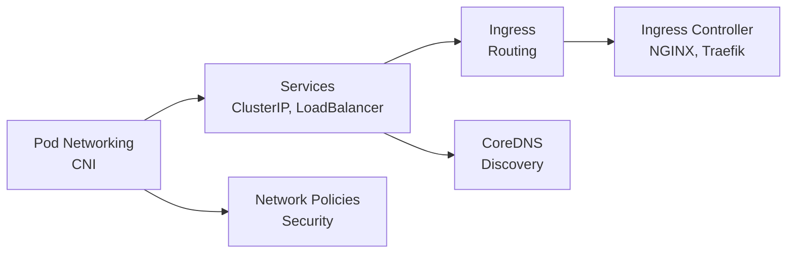

# 04. Networking

> **Category:** Networking & Service Discovery

Kubernetes networking connects pods to each other, services, and the outside world. This category covers the fundamentals (Services, DNS) and the layers of Kubernetes networking: pod-to-pod, service discovery, ingress (north-south traffic), and network policies (east-west security).

## Core Networking Concepts

| File | Topic |
|------|-------|
| [networking.md](networking.md) | Pod model, CNI, container networking |
| [services.md](services.md) | Service types: ClusterIP, NodePort, LoadBalancer, Headless |
| [coredns.md](coredns.md) | Cluster DNS for service discovery |

## Ingress & Traffic Ingestion

| File | Topic |
|------|-------|
| [ingress.md](ingress.md) | Ingress API (routing rules) |
| [ingress-controllers.md](ingress-controllers.md) | Ingress controller overview |
| [nginx-ingress.md](nginx-ingress.md) | NGINX Ingress Controller |
| [traefik-ingress.md](traefik-ingress.md) | Traefik Ingress Controller |
| [gateway-api.md](gateway-api.md) | Gateway API (GatewayClass/Gateway/HTTPRoute) - Ingress successor |

## Network Policies (East-West Security)

| File | Topic |
|------|-------|
| [network-policies.md](network-policies.md) | Allow/deny traffic between pods |

## CNI Plugins & Comparisons

| File | Topic |
|------|-------|
| [cni-plugins.md](cni-plugins.md) | Calico, Cilium, Flannel, Kube-OVN, etc. |
| [cilium.md](cilium.md) | Cilium + eBPF (identity-aware security, Hubble, kube-proxy replacement) |

## Learning Path

## Key Questions

- **How do pods talk to each other?** Pod IP, CNI, flat network
- **How do clients find services?** Services + CoreDNS
- **How do external clients get in?** Ingress + Ingress Controller
- **How do you restrict pod traffic?** Network Policies
- **What runs the networking?** CNI plugins

## Related Categories

- [01 - Core Concepts](../01-core-concepts/README.md) — Pods, labels, DNS
- [03 - Workloads](../03-workloads/README.md) — Deployments, DaemonSets
- [07 - Scheduling & Autoscaling](../07-scheduling-autoscaling/README.md) — Affinity, taints
- [08 - Cluster Operations](../08-cluster-operations/README.md) — Troubleshooting, upgrades
- [11 - Service Mesh](../12-service-mesh/README.md) — Advanced traffic management
EOF
echo "networking README.md written"