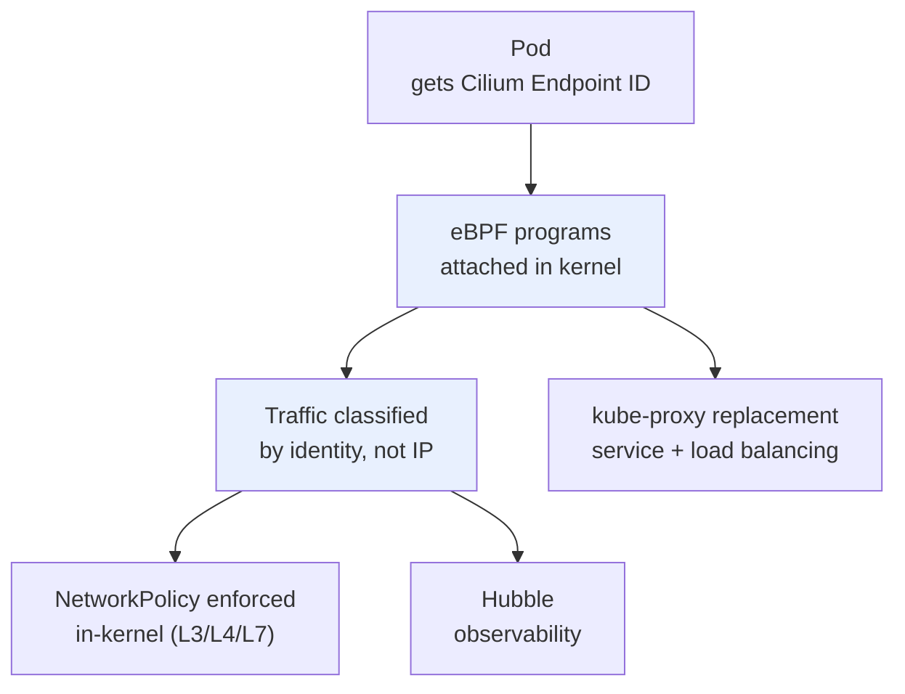

# Cilium — eBPF CNI, Security & Observability

> **Category:** Networking / Security

**Cilium** is a CNI plugin (and service mesh alternative) that uses **eBPF** attached to the Linux kernel to enforce networking, Network Policies, and L7/security observability — without iptables. It replaces kube-proxy and the traditional iptables CNI data path with in-kernel eBPF programs, giving identity-aware security and per-request observability.



## Why eBPF instead of iptables?

| Aspect | iptables/IPVS CNI | Cilium (eBPF) |
|--------|-------------------|---------------|
| Enforcement | userspace rules, O(num rules) per packet | in-kernel, O(1) lookup |
| Scale | rules explode at 1000s of Services/endpoints | scales to 10000s |
| Visibility | per-IP, coarse | per-Process/Workload identity |
| L7 policy | not first-class | native L7 (HTTP/gRPC) |
| kube-proxy | required (IPVS/iptables) | replaced (BPF LB) |
| Observability | flows from kube-proxy/IPVS | Hubble (per-request in kernel) |

## Identity-Aware Security (the big win)

Cilium assigns each Pod an **Endpoint Identity** (set of labels). Policies are enforced on **identity**, not IP:
- A Pod's IP can change across restarts; identity (labels) is stable.
- `NetworkPolicy` + Cilium `CiliumNetworkPolicy` can do L7 (block a specific HTTP path), L4, and DNS-aware policies.

### L7 HTTP policy example

```yaml
apiVersion: cilium.io/v2
kind: CiliumNetworkPolicy
metadata: { name: allow-api-only }
spec:
  endpointSelector: { matchLabels: { app: checkout } }
  ingress:
  - fromEndpoints: [{ matchLabels: { app: gateway } }]
    toPorts:
    - ports: [{ port: "80", protocol: TCP }]
      rules:
        http:
        - GET /checkout     # allow only this path
        - POST /checkout   # block everything else
```

## Hubble — Observability in the kernel

**Hubble** is Cilium's observability layer: because eBPF runs in-kernel, it sees every L7 request with identity + HTTP method + status — no sidecars needed. You get:
- Service dependency graph (which service calls which).
- DNS-aware flows (`kubectl hubble observe`).
- L7 request tracing with latency.

```bash
cilium install                              # install CNI + Hubble
cilium hubble enable --relay                # enable Hubble relay
cilium hubble observe --since 5m            # recent flows
cilium hubble observe --last 5 --tcp        # TCP-level flows
kubectl port-forward svc/hubble-relay 4245   # Hubble UI / Grafana
```

## Cilium Cluster Mesh

Multiple clusters can share identity + policy enforcement by federating their eBPF identity stores — useful for multi-cluster/migration. Each cluster runs Cilium; Mesh connects the identity allocators so a `CiliumNetworkPolicy` in cluster A applies to Pods in cluster B.

## kube-proxy Replacement (BPF LB)

Cilium can replace kube-proxy entirely: NodePort, LoadBalancer, and ClusterIP services are implemented as BPF programs. Result: no conntrack table limits, faster failover, and `externalTrafficPolicy: Local` behavior improved (Direct Server Return possible).

## Common Issues

| Symptom | Cause | Fix |
|---------|-------|-----|
| Pods stuck `ContainerCreating` | CNI not Ready / CRDs missing | `cilium status --wait` ; install CRDs with `cilium install` |
| Service traffic black-holed | BPF LB datapath mismatch | `cilium service list` ; ensure `--kube-proxy-replacement=strict` consistent |
| Hubble no flows | Hubble relay not enabled | `cilium hubble enable` |
| L7 policy not applied | CRD `CiliumClusterwideNetworkPolicy` scope wrong | check `endpointSelector` + `toPorts.rules.http` |

## Interview Questions

**Q: How does Cilium enforce NetworkPolicy without iptables?**
A: Cilium compiles policy into **eBPF programs attached to the kernel** (at the socket/cgroup and XDP/TCP hooks). Traffic is classified by **Workload identity** (Pod labels) and enforced in-kernel at connection setup — no per-packet iptables rule walk, so it's O(1) and scales to thousands of endpoints.

**Q: What is Hubble, and why is it "free"?**
A: Hubble uses the same eBPF probes already in the data path — there's no sidecar or extra agent per Pod. It reads per-request L7 events (method, path, status, latency, identity) out of the kernel, giving service-maps and dependency graphs without instrumenting apps.

**Q: When would you keep kube-proxy with Cilium, and when would you replace it?**
A: You can run Cilium with `kube-proxy` in place (eBPF for security/observability only). You'd flip `--kube-proxy-replacement=strict` to also remove kube-proxy and get BPF-based LoadBalancer/ClusterIP — but only when all Nodes run a kernel/Cilium that supports it; otherwise the hybrid mode is safer during migration.

## Related Resources
- [Networking](README.md)
- [Network Policies](network-policies.md)
- [Service Mesh](../12-service-mesh/service-mesh.md) (Cilium as a data-plane alternative)
- [CNI Plugins](cni-plugins.md)
