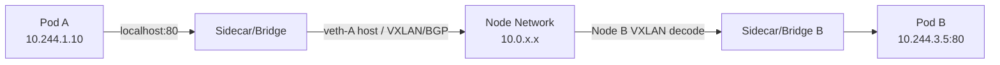

# CNI & kube-proxy

> **Category:** Networking / Under the hood

Two pieces turn Pod-to-Pod networking into something that actually routes: the **CNI plugin** (gives Pods IPs + routes) and **kube-proxy** (implements ClusterIP Services by programming IPVS/iptables rules). This doc is the "how does it actually work" companion to the high-level networking doc.

## CNI (Container Network Interface)

CNI is a **spec** for "configure the network namespace of a container when it starts, and clean it up when it stops". The kubelet calls the CNI binary at `/opt/cni/bin/` for each Pod sandbox.

### The kubelet → CNI flow

1. kubelet creates a Pod sandbox (a network namespace — the Pod's IP namespace).
2. kubelet calls the CNI binary (e.g., `calico`, `cilium`, `flannel`) with `ADD`.
3. The CNI plugin:
   - assigns a Pod IP (`ipam` step),
   - wires up a veth pair (host side + Pod side),
   - programs routes so the Pod IP is reachable from other Nodes.
4. On Pod teardown, kubelet calls CNI with `DEL` → the plugin tears down the veth + releases the IP.

### CNI config (/etc/cni/net.d/10-calico.conflist on each Node)

```jsonc
{
  "name": "k8s-pod-network",
  "cniVersion": "0.3.1",
  "plugins": [
    {
      "type": "calico",                  // who programs IPs + routes
      "log_level": "info",
      "ipam": {                          // who hands out Pod IPs
        "type": "calico-ipam",
        "assign_attrs": {
          "namespace": "K8S_POD_NAMESPACE",
          "node": "K8S_NODE_NAME"
        }
      }
    },
    { "type": "portmap" },               // optional: add HostPort mapping (DNAT to container)
    { "type": "tuning" }                 // optional: sysctl tuning inside the namespace
  ]
}
```

The kubelet passes `K8S_POD_NAMESPACE`, `K8S_POD_NAME`, `K8S_POD_INFRA_CONTAINER_ID` as env vars to every CNI ADD — that's how the plugin learns *which* Pod to assign the IP to.

### Pod IP allocation (clusterIP vs node-local)

Pod IPs come from per-node **CIDRs** (`podCIDR` / `podCIDRs` on `KubeProxyConfiguration`). Each Node owns a subnet (e.g., Node A gets `10.244.1.0/24`, Node B gets `10.244.2.0/24`). The CNI's IPAM allocates from that per-node slice. That's why two Pods on different Nodes have different second octets.

### CNI plugins compared

| Plugin | Routing model | IPAM | L7 | Overhead |
|---------|----------------|------|-----|-----------|
| Calico | BGP/vxlan/bird | Calico IPAM | via `appprotpol` / eBPF later | Moderate |
| Cilium | eBPF (replaces kube-proxy partially) | Cluster-pool/IPAM | eBPF (e.g., Cilium Hubble) | Higher (eBPF, kmalloc) |
| Flannel | UDP/VXLAN/Geneve overlay | host-local | none | Low (pure overlay) |
| Cilium + IPvlan | native + eBPF | Cilium IPAM | eBPF | Low-medium |

### Flannel (the simple overlay)

Flannel wraps Pod traffic in a **VXLAN** (UDP port 8472) or **host-gw** overlay so cross-node Pod-to-Pod IPs reach each other:

1. Each Node runs a `flannel` daemon (`flanneld`) that holds the `10.244.0.0/16` Pod CIDR.
2. A `vxlan` interface (`flannel.1`) is created on each Node.
3. When Pod A (Node 1) → Pod B (Node 3), the host kernel **encapsulates** the packet in VXLAN and sends it across the Node network (the underlay 10.x Node IPs), where Node 3 decapsulates and delivers to Pod B.

### Calico (BGP + overlay fallback)

Calico is the "real networking" default: it programs **BGP** so each node advertises its Pod CIDR into the fabric. No overlay unless cross-subnet (then it wraps in VXLAN).

```bash
# Calico: show Node-to-NodeWireguard / BGP:
calicoctl node status                 # BGP neighbors + routes
calicoctl get workload -o wide
```

### Cilium (eBPF — bypasses kube-proxy for L3/L4)

Cilium replaces iptables with eBPF programs attached to the host's network interfaces — routing, load-balancing, and (notably) **enforcing NetworkPolicies** directly in the kernel (faster + richer than iptables). It also emits **DNS + L7 visibility** via Hubble.

## kube-proxy: how ClusterIP Services work

kube-proxy turns a `Service` (with `clusterIP` + a set of Pod backing) into **load-balancing rules** on the Node — either iptables (traditional) or IPVS (newer, faster, supports more algorithms).

### iptables mode

For each Service, kube-proxy writes a **chain** of `iptables -t nat` rules:

- `KUBE-SERVICES` — matches destination IP = ClusterIP.
- `KUBE-SVC-<hash>` — a per-Service chain that **randomly DNATs** to one of the backing Pod endpoints (the rule weights are `1/Nth` so each Pod appears equally).

So a SYN to `10.100.200.1` (ClusterIP) becomes a DNAT to `10.244.2.5:8080` (a Pod IP) — in the **nat PREROUTING / OUTPUT** chain, before the routing decision, on the **receiving Node**.

### IPVS mode (kube-proxy)

IPVS replaces the nat table with the **IP Virtual Server** subsystem — a real L4 load balancer (like LVS) supporting more algorithms (`rr`, `lc`, `wlc`, `lblc`, `lblcr`, `dh`, `sh`, `sed`, `nq`).

```bash
# Check which mode the cluster is in:
kubectl -n kube-system get ds -l k8s-app=kube-proxy -o yaml | grep -A2 mode
# Or at runtime:
iptables-save | grep KUBE-SVC       # iptables mode
ipvsadm -L -n                       # IPVS mode
```

### IPVS vs iptables — the trade-off

| Aspect | iptables | IPVS |
|--------|----------|------|
| Performance | O(N) per Service lookup, nat table grows large | O(1) lookup, supports 10k+ Services |
| Sync | whole-table flush + rewrite (disruptive) | incremental diff |
| Algorithms | random/weighted round-robin | rr/lc/wlc/dh/sh/.. |
| Kernel module | always loaded | requires `ip_vs` kernel module |

For a 50-node, 500-service cluster, iptables works. For >1000 Services, switch kube-proxy to `mode: ipvs`.

## End-to-end: a Pod-to-Pod, Pod-to-Service flow

### `Pod A → Pod B` (same Namespace, cross-node)



1. App A writes to `localhost` (its own veth pair's Pod interface).
2. The packet leaves the namespace via the veth pair host side.
3. The CNI's route (or host-gw / vxlan) delivers it to Node B.
4. Node B's `veth-B` pair delivers it to Pod B's interface.

The **Pod IPs** come from the CNI's IPAM; the **delivery** uses routes the CNI programmed (Calico BGP, Flannel VXLAN, etc.).

### `Pod A → Service X` (ClusterIP, any node)

1. App A connects to `service-x.default.svc.cluster.local:80` → resolves to ClusterIP `10.96.x.x`.
2. The kernel routes the SYN to `10.96.x.x:80`.
3. kube-proxy's iptables/IPVS **DNATs** this to one endpoint Pod IP (the `SERVICE` rules).
4. From here, identical to the Pod-to-Pod path above.

### `Pod A → external IP` (NAT egress)

1. App connects to `93.184.x.x:443`.
2. No matching ClusterIP/Service → kernel routes to the default route (node eth0).
3. iptables `KUBE-MARK-MASQ` + `SNAT` rewrites the source to the Node's IP (so replies come back).

> This is why, by default, Pods egress with the **Node's IP** — not a Pod IP. Egress IP solutions (Cilium Egress, NAT Gateway) change this.

## Common Issues

### Cross-node Pod-to-Pod fails (`ping: unknown host`)

| Layer | Check |
|-------|-------|
| DNS | `kubectl run busybox -- nslookup service.ns` vs CoreDNS Pod logs |
| CNI | `kubectl -n kube-system get pods -l k8s-app=<cni>`, and check the CNI logs for `ADD failed / no IP`. |
| Routes | The Pod CIDR route for Node B is missing (Calico/BGP session down) — `ip route show` on the host. |
| MTU | VXLAN overlay needs `MTU 1450` (14 bytes VXLAN + 50 v6 = underlay ~1500). Mismatch → black-holing large packets / "connection resets". |
| Pod IP | `ip addr` inside Pod A shows a `10.244.1.X` — if it's `10.244.3.X` that belongs to Node B, the veth is wired wrong (rare, reinstall CNI should fix). |

### Service "connection refused" / "no endpoints" but Pods are up

- `kubectl get endpoints <svc>` empty → selector mismatch (check Pod labels match `Service.selector`).
- Pods exist but not **Ready** (`kubectl get pods -l app=x -o wide` shows `READY 0/1`) → readiness probe failing.
- kube-proxy `iptables -t nat -L` doesn't contain a `KUBE-SVC` chain for this ClusterIP → kube-proxy is down or the Node is cordoned.

### iptables mode too slow at scale (500+ Services)

- Symptoms: high SYN latency, `KUBE-SVC-*` chains in `iptables -t nat -L` run into the hundreds.
- Fix: migrate kube-proxy to `mode: ipvs` (the `ip_vs*` kernel modules must be loaded).

### `ipvs` modules not loaded

```bash
lsmod | grep ip_vs        # empty? → modprobe:
modprobe ip_vs
modprobe ip_vs_rr
modprobe ip_vs_wrr
modprobe ip_vs_sh
# On systemd systems: make it persistent via /etc/modules-load.d/ipvs.conf.
```
Without these, kube-proxy falls back to iptables or crashes.

## Diagnostics

```bash
# CNI side (Node):
kubectl -n kube-system get pods -l k8s-app=calico |
kubectl -n kube-system logs -l k8s-app=calico-node
ls /opt/cni/bin/                       # the binaries exist + the right versions
ls /etc/cni/net.d/10-calico.conflist
ip route show 10.244.0.0/16             # are the routes there?

# kube-proxy side (Node):
ipvsadm -L -n                          # IPVS?
iptables -t nat -L KUBE-SERVICES --line-numbers
kubectl -n kube-system get daemonset kube-proxy

# Pod side:
kubectl exec -it pod-a -- sh
ip addr                          # has the Pod an IP from the right CIDR?
ip route                         # default route → eth0?
cat /etc/resolv.conf            # DNS
ping <pod-b-ip>                 # does cross-node Pod B answer?
```

## Interview Questions

**Q: What is CNI, and what does the kubelet do with it?**
A: CNI is the spec the kubelet calls at Pod create/delete time (`ADD`/`DEL`) to set up the network namespace — assign Pod IP (via IPAM like `calico-ipam`/`host-local`), create a veth pair, and install routes/firewall so the Pod IP is routable from other Nodes. The config lives at `/etc/cni/net.d/` and the binaries at `/opt/cni/bin/` on each Node.

**Q: How does a ClusterIP Service actually work under the hood?**
A: kube-proxy watches Services and writes `iptables`/`IPVS` rules that **DNAT** the ClusterIP to one of the backing Pod IPs. So reaching a ClusterIP becomes a kernel-level `nat PREROUTING/OUTPUT` rewrite to a Pod IP — then normal Pod-to-Pod routing delivers it.

**Q: What is the difference between iptables-mode and IPVS-mode kube-proxy?**
A: Iptables chains grow O(services) and are flushed/rebuilt on every sync (disruptive at scale). IPVS uses the Linux IP Virtual Server (a real L4 LB with algorithms: rr, lc, wlc…), doing O(1) lookups via the `ip_vs` kernel module. Use IPVS if you have >1000 Services.

**Q: Why would Pod-to-Pod work on the same node but fail across nodes?**
A: That isolates it from the app (works locally) to the **routing/fabric** layer. On Flannel that's the VXLAN tunnel (`flannel.1` interface up, UDP/8472 open between Node IPs); on Calico that's the **BGP session** or the IP-in-IP/VXLAN overlay; and **MTU mismatch** on the overlay (1450 vs 1500) black-holes large packets — a classic cross-node-only failure.

**Q: What's the relationship between Pod CIDRs, the Node's `podCIDR`, and CNI routing?**
A: The scheduler/controller-manager allocates each Node a slice of the Pod CIDR (`node.spec.podCIDR`, e.g., `10.244.2.0/24`). The Node's CNI plugin is responsible (via BGP or routes) for announcing/forwarding that slice, so an incoming Pod IP is routed to that Node — then the CNI's veth pair brings it to the Pod.

## Related Resources

- [Networking Overview](../04-networking/README.md)
- [Services](../04-networking/services.md)
- [Network Policies](../04-networking/network-policies.md)
- [CNI Plugins](../04-networking/cni-plugins.md)
