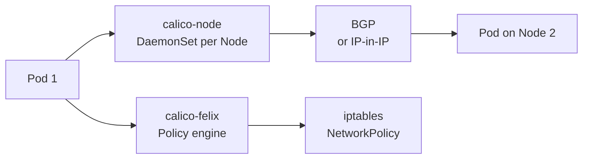

# CNI Plugins

> **Category:** Networking / Infrastructure

## What It Is

A **CNI plugin** is the software that implements the **Kubernetes Container Network Interface (CNI) spec** — giving Pods their IPs, setting up veth pairs, routing, and (optionally) NetworkPolicies. Every Kubernetes cluster must have exactly one primary CNI plugin.

The **CNI spec** is an industry-standard interface between container runtimes and networking plugins — Kubernetes calls the plugin via a binary (`ipam`, `bridge`, etc.) when a Pod is created.

## Why It Exists

Kubernetes defines the **Network Model** (one IP per pod, flat network) but doesn't ship the actual networking — the CNI plugin fulfills that contract:
- Assign an IP address to each Pod
- Connect the Pod to the Node's network
- Ensure the Pod IP is routable from other Nodes
- Optionally provide: security (NetworkPolicy), CNI chaining, overlays, IPv4/IPv6, eBPF

Without a CNI plugin, Pods stay in `ContainerCreating` and never get IPs.

## Pod Network Provisioning (How a Pod Gets an IP)

1. The `kubelet` prepares the container and calls the CNI plugin
2. The plugin creates a **veth pair**: one end in the Pod's network namespace, the other in the host
3. The plugin assigns an **IP address** (from an IPAM component)
4. The plugin configures **routes** so the Pod IP is reachable across Nodes
5. (Optional) The plugin programs **NetworkPolicy** firewall rules

## Common CNI Plugins

| Plugin | Type | Overlay? | NetworkPolicy? | Strengths |
|--------|------|----------|----------------|-----------|
| **Calico** | BGP/IP-in-IP/VXLAN | Optional (BGP native) | Yes (iptables/eBPF) | Enterprise features, security |
| **Cilium** | eBPF | Native (no overlay) | Yes (L3/L4/L7 via eBPF) | High perf, L7 policies, Hubble |
| **Flannel** | VXLAN/host-gw | Yes (default) | **No** | Simple, widely used |
| **Cilium** | eBPF | Native | Yes (L3/L4/L7) | High perf, L7 policies |
| **Kube-ovn** | OVN | Optional | Yes | Advanced features, IPv6 |
| **Weave Net** | Mesh (UDP) | Yes | Yes | Self-healing mesh |

## Calico

**Project Calico** provides **Layer 3** networking (BGP and IP-in-IP) with optional overlays (VXLAN). It uses `iptables` (or eBPF in preview) for NetworkPolicy enforcement.

- **Strengths**: Mature, enterprise-grade, BGP, global network policies
- **Use case**: Multi-tenant clusters, strict security, hybrid/multi-cloud with BGP
- **Default**: IP-in-IP overlay (BGP if the underlay supports it)

```bash
kubectl apply -f https://docs.projectcalico.org/manifests/calico.yaml
```

### Calico Architecture



- **calico-node**: Runs on each node, manages routes + iptables
- **calicoctl**: CLI for advanced management (policies, IPAM, diagnostics)
- **calico-typha**: Scales the control plane for large clusters (>100 nodes)

### Calico IPAM

Calico uses its own **IP Address Management (IPAM)**:
- Each Node gets a block (CIDR) to allocate Pod IPs from
- Configurable block sizes (`IBGP` vs `VXLan` modes)

## Cilium

**Cilium** uses **eBPF** to implement networking and security **in the Linux kernel**, without iptables.

### Key Features
- **Visibility**: Hubble provides L7 (HTTP/gRPC) observability
- **L7 Policies**: Can filter on HTTP method/path, Kafka topics, DNS names
- **No iptables**: Bypasses iptables — faster and scales better
- **Identity-based security**: Uses labels (not IPs) for policies → no "IP conflict" issues

```bash
# Install (Helm)
helm install cilium cilium/cilium --namespace kube-system
```

### Cilium Architecture

```mermaid
graph LR
    A[Pod] --> B[eBPF programs\nattached to interfaces]
    B --> C[Kernel\neBPF-based routing]
    C --> D[eBPF load balancer\n(no kube-proxy)]
    C --> E[Pod on another Node]
```

- **eBPF** runs in the kernel — very fast
- **CNI chaining**: `bridge` + `cilium` (Cilium handles L2/L3, bridge handles basic CNI)
- **Hubble**: Observability layer (L7/HTTP metrics)

## Flannel

**Flannel** is the simplest overlay CNI — just wraps traffic in **VXLAN** (or host-gw) so Pods across Nodes communicate over a flat 10.244.0.0/16 network.

- **Overlay**: Yes (UDP/VXLAN tunnel — adds headers, ~5% overhead)
- **NetworkPolicy**: **No** — use Calico/Kube-router if you need NPs
- **Strengths**: Dead simple, the "default" for `kubeadm` setups
- **Weakness**: No security features, relies on kube-proxy for Services

```bash
kubectl apply -f https://raw.githubusercontent.com/flannel-io/flannel/master/Documentation/kube-flannel.yml
```

## Other Plugins

### Weave Net
- **Mesh** tunnel mesh — self-healing, no extra dependencies
- Includes a DNS service (`weave-scope`)
- Good for on-prem, but has been less actively maintained

### Kube-OVN
- **OVN/OVS** based — advanced features (QoS, VPC, ACLs)
- Often used in **cloud/enterprise** (Alibaba Cloud ACK, etc.)

### Amazon VPC CNI
- Pods get IPs **directly from the VPC** subnet
- No overlay — native AWS networking
- Requires Security Groups for Kubernetes (SG-for-Pods) for NetworkPolicy-like isolation

## CNI Chaining

Multiple CNI plugins can run in sequence (chained):

```json
[{
  "type": "bridge",       // Basic L2 connectivity
  "type": "tuning"         // Sysctl tuning
},
{
  "type": "cilium",        // L3/L7 security / eBPF
}]
```

Common chains: `bridge` + `portmap` + `firewall` + a security plugin.

## Commands

```bash
# Install a CNI plugin
kubectl apply -f https://docs.projectcalico.org/manifests/calico.yaml
kubectl apply -f https://raw.githubusercontent.com/flannel-io/flannel/master/Documentation/kube-flannel.yml

# Check which CNI is installed
kubectl get pods -n kube-system -l k8s-app=calico-node
kubectl get pods -n kube-system -l k8s-app=kube-proxy

# Debug Pod networking
kubectl get pod <pod> -o wide
# Check: Pod IP, Node running on

kubectl exec <pod> -- ip addr show
# Should show eth0 with a Pod IP (10.x.x.x)

kubectl exec <pod> -- ip route
# Should show default via 169.254.1.1 (bridge gateway)

# Check routes from the node
ip route show table all | grep <pod-ip>
```

## CNI Troubleshooting

### Pod stuck in `ContainerCreating`
```bash
kubectl describe pod <name>
# Events include: "failed to set up network for..." — CNI issue

kubectl -n kube-system get pods -l k8s-app=calico-node
# Is the CNI DaemonSet Running?
```

### Pod has IP but can't reach other Nodes
```bash
# Check: Pod IP should be routable from other Nodes
ip route show table main | grep <pod-cidr-of-other-node>
# Check CNI mode: BGP (needs underlay), IP-in-IP (tunneled), VXLAN

calicoctl node run ...
calicoctl get nodes
calicoctl get workloadendpoints
```

### NetworkPolicy not enforced
```bash
# Is the CNI plugin capable?
kubectl get pods -n kube-system -l k8s-app=calico-node  # Calico supports NPs
# Flannel does NOT — add Kube-router or Calico if you need NPs
```

## Choosing a CNI Plugin

| Requirement | Recommended |
|-------------|-------------|
| Simplicity / getting-started | Flannel |
| Enterprise + BGP + security | Calico |
| High performance + L7 policies | Cilium |
| Cloud-native (AWS) | Amazon VPC CNI |
| Advanced (OVN, QoS) | Kube-OVN |
| Default-deny required | Calico / Cilium / Kube-router |
| L7 (HTTP) policies | Cilium |

## Related Resources

- [Networking Model](networking.md)
- [Network Policies](network-policies.md)
- [Services](services.md)
- [CoreDNS](coredns.md)
EOF
echo "cni-plugins.md written"