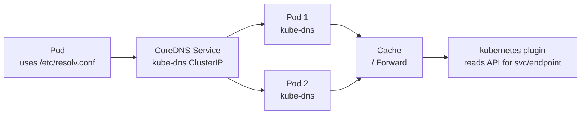

# CoreDNS

> **Category:** Networking / Service Discovery

## What It Is

**CoreDNS** is the **default DNS server** for Kubernetes (the successor to **kube-dns**). It runs as a Deployment (managed by the `kubelet` static pod manifest on control plane nodes or a regular Deployment). Every pod in the cluster uses CoreDNS for hostname resolution (configured automatically in `/etc/resolv.conf`), so services can be reached by name.

## Why It Exists

Before CoreDNS (kube-dns):
- Used a **mix** of dnsmasq + SkyDNS — complex to debug
- SkyDNS was slow on large clusters

CoreDNS provides:
- A **single Go binary** — simple and fast
- **Plugin-based architecture** — extensible (cache, forward, kubernetes, health...)
- **Better performance** and configurability

## Architecture



## CoreDNS Config (Corefile)

The main config is a `ConfigMap` named `coredns` in `kube-system`.

```yaml
# ConfigMap: coredns
apiVersion: v1
kind: ConfigMap
metadata:
  name: coredns
  namespace: kube-system
data:
  Corefile: |
    .:53 {
        errors                       # Log errors
        health {                     # Health check endpoint (:8081/health)
           lameduck 5s
        }
        ready                        # Ready probe (when CoreDNS is ready to serve)
        kubernetes cluster.local in-addr.arpa ip6.arpa {   # Kubernetes DNS
            pods insecure              # Pod names resolvable (but not by default)
            fallthrough in-addr.arpa ip6.arpa
            ttl 30
        }
        prometheus :9153             # Prometheus metrics endpoint
        forward . /etc/resolv.conf   # Forward to upstream (the node's resolver)
        cache 30                     # Cache for 30s (reduces load)
        loop                         # Prevent DNS forwarding loops
        reload                       # Reload ConfigMap automatically
        loadbalance                    # Round-robin DNS
    }
```

## Plugins

| Plugin | Role |
|--------|------|
| `errors` | Log errors |
| `health` | Health check (`lameduck` for graceful shutdown) |
| `ready` | Ready check |
| `kubernetes` | Resolves `<svc>.<ns>.svc.cluster.local` — the core plugin |
| `prometheus` | Exposes metrics on `:9153` |
| `forward` | Forward unresolved queries to upstream (e.g., `/etc/resolv.conf`) |
| `cache` | Cache responses (TTL) |
| `loop` | Detect forwarding loops |
| `reload` | Auto-reload on ConfigMap change |
| `loadbalance` | Round-robin (load balance) answers |

## How Pod DNS Resolution Works

When a Pod (e.g., `myapp`) queries `my-svc.my-namespace.svc.cluster.local`:

1. The `kubelet` configures the Pod's `/etc/resolv.conf`:
   - `nameserver: 10.96.0.10` (CoreDNS Service ClusterIP)
   - `search: my-namespace.svc.cluster.local my-namespace.svc cluster.local`
   - `options ndots:5` (treat names with <5 dots as relative)

2. CoreDNS (`kubernetes` plugin) looks up the Service + Endpoints in the API.

3. Returns the **Service ClusterIP** (or Pod IPs for headless Services).

## DNS Records

| Record | Source | Example |
|--------|--------|---------|
| `my-svc.my-namespace.svc.cluster.local` | Service | A → 10.96.x.x (ClusterIP) |
| `pod-ip-namespace.pod.my-namespace.cluster.local` | Pod | A → Pod IP |
| `my-headless-svc.my-namespace.svc.cluster.local` | Headless Service | Multiple A records → Pod IPs |

### Headless Service DNS

```bash
# Headless Service (clusterIP: None) for StatefulSet
# Returns multiple A records (one per Pod)
nslookup myapp-headless.default.svc.cluster.local
# myapp-0.myapp-headless.default.svc.cluster.local → 10.1.1.10
# myapp-1.myapp-headless.default.svc.cluster.local → 10.1.2.20
```

## Commands

```bash
# Check CoreDNS pods
kubectl -n kube-system get pods -l k8s-app=kube-dns
kubectl -n kube-system get deployment -l k8s-app=kube-dns

# View the Corefile
kubectl -n kube-system get configmap coredns -o yaml

# Edit CoreDNS config
kubectl -n kube-system edit configmap coredns
# (The `reload` plugin picks up changes, or restart pods)

# Check CoreDNS logs
kubectl -n kube-system logs -l k8s-app=kube-dns

# Test DNS from inside a Pod
kubectl run -it --rm test-pod --image=busybox:1.28 --restart=Never -- sh

# Inside the Pod:
nslookup kubernetes                    # Default service
nslookup my-svc.my-ns.svc.cluster.local  # Namespaced service
cat /etc/resolv.conf                   # See DNS config
```

## Customizing CoreDNS

### Add an upstream forwarder
```yaml
forward . 8.8.8.8 1.1.1.1   # Forward to Google DNS (before . /etc/resolv.conf)
```

### Increase cache TTL
```yaml
cache 60     # Cache queries for 60s (was 30)
```

### Add a hosts file entry
```yaml
hosts {
    10.0.0.10 my-app.local
    fallthrough
}
```

### Add a stub domain
```yaml
stubdomains.com {
    forward . 10.0.0.1       # Forward stubdomains.com queries to 10.0.0.1
}
```

## Common Issues

### High CoreDNS CPU usage
- Causes: missing `cache`, too many queries (loop or chatty apps)
- Fix: add `cache 30`, check for loops (`loop` plugin)

### `dig: connection refused`
```bash
kubectl -n kube-system get pods -l k8s-app=kube-dns
# Restart if Pending/Running with issues:
kubectl -n kube-system rollout restart deployment coredns
```

### `nslookup: can't find <svc>`
- Is the Service in the cluster? `kubectl get svc -n <ns>`
- Does the name match? It is **case-sensitive**
- Is CoreDNS up? `kubectl -n kube-system get pods -l k8s-app=kube-dns`
- Check Corefile for errors

### Pod stuck resolving external names
```bash
# Check /etc/resolv.conf inside the Pod:
cat /etc/resolv.conf
# Should point to CoreDNS Service IP (10.x) — not the node IP
# If CoreDNS Service doesn't exist: kube-dns service is missing (control plane issue)
```

## CoreDNS & High Availability

CoreDNS itself should be **replicated** and **autoscaled** (HPA):

```bash
kubectl -n kube-system get hpa kube-dns-autoscaler   # HPA scales based on qps/capacity
# It scales CoreDNS replicas based on a "qps per instance" metric
```

## CoreDNS & Network Policies

If you use **NetworkPolicies** that block DNS (port 53 UDP/TCP to kube-dns), add a rule:

```yaml
# Allow egress to DNS
- to:
  - ipBlock:
      cidr: 10.96.0.0/12   # CoreDNS Service IP / node IPs
  ports:
  - port: 53
    protocol: UDP
  - port: 53
    protocol: TCP
```

## Interview Questions

**Q: What is CoreDNS and why is it used?**
A: CoreDNS is the **default cluster DNS** for Kubernetes (the successor to kube-dns). Each Service gets a DNS name like `my-svc.my-namespace.svc.cluster.local`. Every pod automatically uses CoreDNS (`resolv.conf`), so hostname-based service discovery works — pods never need to know IPs in advance.

**Q: Where does CoreDNS store the Service→IP mapping?**
A: Nowhere. The `kubernetes` plugin **queries the Kubernetes API directly** in-memory; no separate persistent store. When the API updates a Service/Endpoints, CoreDNS answers with the new IP.

**Q: What is a stub domain?**
A: A rule telling CoreDNS to forward queries for a specific domain (e.g., `example.local`) to a specified upstream resolver (e.g., a corporate DNS server) instead of the default forwarder — useful for hybrid clouds or custom zones.

**Q: How does DNS work for a headless Service?**
A: A headless Service (`clusterIP: None`) has no virtual IP. CoreDNS returns **multiple A-records**, one per ready Pod IP. StatefulSet Pods get resolvable, ordered DNS names (`pod-0.svc.namespace.svc.cluster.local`). This is essential for database StatefulSets (e.g., Cassandra/MongoDB clusters).

**Q: What is the `cache` plugin for?**
A: It caches DNS responses (positive & negative) for a short TTL (default 30s). Without it, CoreDNS handles repeated lookups (e.g., many Pods resolving the same name) via API queries — much slower.

**Q: How do you know if CoreDNS is healthy?**
A: `kubectl -n kube-system get pods -l k8s-app=kube-dns`; run `nslookup kubernetes` from a Pod; check CoreDNS health endpoint (`http://<coredns-pod>:8081/health`).

## Related Resources

- [Services](services.md)
- [Networking Model](networking.md)
- [StatefulSets (Headless Services)](../03-workloads/statefulsets.md)
- [Network Policies](network-policies.md)
EOF
echo "coredns.md written"