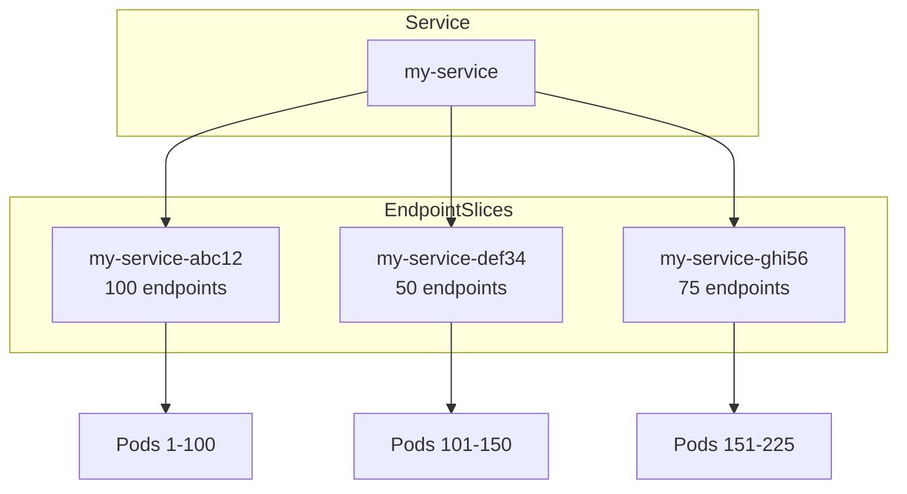

# EndpointSlices

> **Category:** Networking / Core Concept

## What It Is

**EndpointSlices** are a scalable, extensible way to track network endpoints for a Kubernetes Service. They replace the legacy `Endpoints` object with a sharded model that scales better for large clusters.

## Why It Exists

| Problem | Endpoints | EndpointSlices |
|---------|-----------|----------------|
| Scale limit | Single object, max 1000 endpoints | Sharded into multiple objects, 100 endpoints each |
| Performance | Entire list updated on any change | Only affected slice updated |
| Topology awareness | None | Topology-aware routing hints |
| Dual-stack | Limited | Full IPv4/IPv6 support |

## Architecture



## How It Works

1. **EndpointSlice controller** watches Services and Pods
2. Creates EndpointSlices (max 100 endpoints per slice)
3. **kube-proxy** watches EndpointSlices instead of Endpoints
4. Each slice contains: addresses, ports, topology hints

## Example

```yaml
apiVersion: discovery.k8s.io/v1
kind: EndpointSlice
metadata:
  name: my-service-abc12
  labels:
    kubernetes.io/service-name: my-service
addressType: IPv4
ports:
- name: http
  port: 80
  protocol: TCP
endpoints:
- addresses:
  - "10.244.0.5"
  conditions:
    ready: true
    serving: true
    terminating: false
  nodeName: node-1
  zone: us-east-1a
- addresses:
  - "10.244.1.8"
  conditions:
    ready: true
    serving: true
    terminating: false
  nodeName: node-2
  zone: us-east-1b
```

## Key Fields

| Field | Description |
|-------|-------------|
| `addressType` | IPv4 or IPv6 |
| `endpoints[].addresses` | Pod IP addresses |
| `endpoints[].conditions` | ready, serving, terminating |
| `endpoints[].nodeName` | Node hosting the Pod |
| `endpoints[].zone` | Topology zone |
| `ports[].name` | Port name (must match Service) |
| `ports[].port` | Container port number |

## Topology-Aware Routing

EndpointSlices support topology-aware routing via hints:

```yaml
endpoints:
- addresses:
  - "10.244.0.5"
  hints:
    zone: us-east-1a
```

**Traffic distribution:**
- `TopologyAwareHints` (default): Traffic prefers same-zone endpoints
- `AutoTrafficPolicy`: Distributes proportionally across zones

## Commands

```bash
# List EndpointSlices for a Service
kubectl get endpointslices -l kubernetes.io/service-name=my-service

# Describe a specific EndpointSlice
kubectl describe endpointslice my-service-abc12

# Check endpoints for a Service
kubectl get endpoints my-service

# Watch EndpointSlice changes
kubectl get endpointslices -w -l kubernetes.io/service-name=my-service
```

## Default Behavior

- **Enabled by default** since K8s 1.21 (GA in 1.21)
- EndpointSlice controller runs automatically
- kube-proxy uses EndpointSlices by default
- Max 100 endpoints per slice (configurable)

## Best Practices

1. **Don't create EndpointSlices manually** — let the controller manage them
2. **Use topology hints** for multi-zone clusters
3. **Monitor slice count** — too many slices can impact performance
4. **Label consistency** — ensure `kubernetes.io/service-name` label is correct

## Common Issues

| Symptom | Cause | Fix |
|---------|-------|-----|
| Endpoints not showing in slice | Pod not ready (readinessProbe failing) | Fix Pod readiness |
| Too many slices | Very large Service (1000+ Pods) | Normal; controller shards automatically |
| Traffic not routing to zone | Topology hints not configured | Enable `TopologyAwareHints` feature |
| kube-proxy using old Endpoints | Feature gate disabled | Ensure `EndpointSlice` is enabled |

## Related

- [Services](services.md)
- [Network Policies](network-policies.md)
- [CoreDNS](coredns.md)
- [CNI & kube-proxy](cni-kube-proxy.md)
