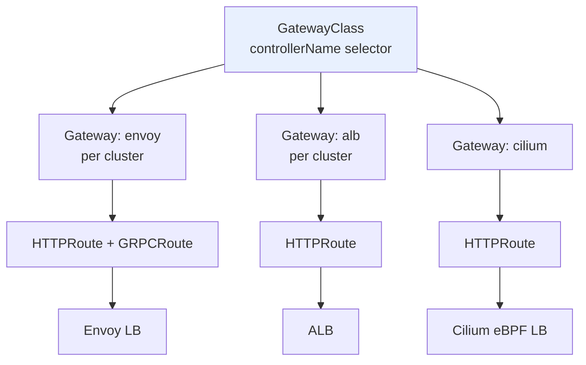

# Gateway API Implementations

> **Category:** Networking / Ingress

The **Gateway API** is just the API — it needs an **implementation** (controller) to actually provision a dataplane. Each implementation registers via `GatewayClass.spec.controllerName` (a reverse-DNS name) and reconciles `Gateway`/`Route` objects into real load balancers, Envoy config, or iptables. This is the catalog of who actually does the work behind `kind: GatewayClass`.

## The major implementations

| Implementation | controllerName | Dataplane | L4/L7 | Managed / Self-managed | Notes |
|----------------|---------------|-----------|-------|------------------------|-------|
| **Envoy Gateway** (CNCF, reference) | `io.crates.dev/gateway-controller` ... actually `gateway.envoyproxy.io/gateway-controller` | Envoy | L4 + L7 | self-managed (OSS) | CNCF reference implementation |
| **AWS ALB** | `eks.amazonaws.com/alb-gateway-controller` | ALB (cloud L7 LB) | L4 + L7 | managed (AWS) | uses the ALB controller; L4 via GWAPI too |
| **Cilium** | `cilium.io/cilium-gateway-controller` | Cilium (eBPF + Envoy) | L4 + L7 | self-managed | L7 via Envoy; L4 via BPFLB |
| **NGINX** | `k8s.ngix.org/nginx-gateway-controller` (new) / `k8s.io/ingress-nginx` (legacy Ingress) | NGINX | L7 | self-managed | the official Gateway API controller |
| **Traefik** | `traefik.io/traefik-gateway-controller` | Traefik | L4 + L7 | self-managed | also runs Ingress |
| **Istio** | `istio.io/gateway-controller` | Istio (Envoy) | L4 + L7 | self-managed | implements Gateway API over its mesh |
| **Gloo** (Edge/Mesh) | `gateway.solo.io` | Gloo/Boomerang | L4 + L7 | self-managed | strong L7 routing |
| **Avi / AKO** | `avilearn.io/avicgatewaycontroller` | AVI / SE | L4 + L7 | managed (VMware) | VMware NSX Advanced Load Balancer |



## How a `GatewayClass` binds to a controller

```yaml
apiVersion: gateway.networking.k8s.io/v1
kind: GatewayClass
metadata: { name: envoy }
spec:
  controllerName: gateway.envoyproxy.io/gateway-controller   # ONLY Envoy handles Gateways of this class
  parametersRef:
    name: envoy-config
    namespace: default
```
A `Gateway` with `spec.gatewayClassName: envoy` is only reconciled by the controller whose name matches. This is how you run **two** gateway implementations in one cluster (e.g. ALB for internet, Cilium for internal) without them fighting.

## Envoy Gateway (the reference)

```yaml
# install (Helm / Helm Gateway API):
helm install eg oci://docker.io/envoyproxy/gateway-helm --version v0.0.0-latest
# then create a GatewayClass + Gateway:
apiVersion: gateway.networking.k8s.io/v1
kind: HTTPRoute
metadata: { name: my-route }
spec:
  parentRefs:
  - name: my-gateway
    namespace: default
    sectionName: http
  hostnames: ["app.example.com"]
  rules:
  - matches:
    - path: { type: PathPrefix, value: /api }
    filters:
    - urlRewrite: { hostname: api.svc, port: 8080 }
    backendRefs:
    - name: api-svc
      port: 8080
```
Envoy Gateway is the CNCF reference, so it supports every `Route` kind (HTTPRoute, GRPCRoute, TLSRoute, etc.) at "Standard" conformance.

## AWS ALB via Gateway API

```yaml
apiVersion: gateway.networking.k8s.io/v1
kind: GatewayClass
metadata: { name: alb }
spec:
  controllerName: eks.amazonaws.com/alb-gateway-controller
---
apiVersion: gateway.networking.k8s.io/v1
kind: Gateway
metadata: { name: internet }
spec:
  gatewayClassName: alb
  listeners:
  - name: http
    port: 80
    protocol: HTTP
    hostname: "*.example.com"
```
Each `Gateway` becomes a real **ALB** (with a cloud cost — one per Gateway unless you share). Great for teams; watch the ALB-per-Gateway bill.

## Cilium Gateway (eBPF)

Cilium implements Gateway API over its Envoy side-car + eBPF dataplane. L4 (`Gateway` TCPRoute) routes through the kernel BPFLB; L7 (`HTTPRoute`) through the embedded Envoy. Because it shares the Cilium identity store, L7 policy and routing can both reference Cilium `ClusterMesh`/NetworkPolicies.

## Common Issues

| Symptom | Cause | Fix |
|---------|-------|-----|
| Gateway stuck `Pending` / `Address` empty | controller for that `controllerName` not installed | `kubectl get gatewayclasses`, install the matching controller |
| HTTPRoute `ParentStatus` not attached | `parentRef` name/section/namespace mismatch, or Gateway not Accepted | check `spec.listeners[].name` = `sectionName`; ensure Gateway `Accepted=True` |
| Two controllers fighting | two `GatewayClass`es with the same `controllerName` | `controllerName` must be unique per implementation |
| ALB billing explosion | one ALB per Gateway (AWS charge) | share Gateways via `listeners`, or consolidate routes |
| TLS cert not served | Gateway `TLS` listener missing `certificateRefs`, or secret in wrong namespace | attach the right Secret via `certificateRefs` |

## Conformance levels

- **Gateway API v1**: `GatewayClass`/`Gateway`/`HTTPRoute`/`GRPCRoute`/`TLSRoute`/`UDPRoute`/`TCPRoute`/`IPRoute` are GA.
- **Conformance**: `Core` (every implementation MUST support) vs `Extended` vs `Implementation-specific`. `HTTPRoute` is Core for HTTP; check your controller's conformance matrix.

## Interview Questions

**Q: How is a GatewayClass different from a Gateway, and why does the split matter?**
A: A `GatewayClass` is the **type/template** (which controller handles it + parameters) — written by infra/platform teams. A `Gateway` is an **instance** (listeners, addresses) — written by app teams. Two different controllers in one cluster can each handle a GatewayClass, so app teams pick a class and the right cloud dataplane is provisioned without conflict.

**Q: Which implementation should you pick — Envoy Gateway, AWS ALB, or Cilium?**
A: **Envoy Gateway** if you want a portable, CNCF reference with full Standard conformance. **AWS ALB** if you're on EKS and want a real managed L7 LB (pay per ALB). **Cilium** if you're already on Cilium and want L4+L7 + identity-aware security from one data plane. Pick by (a) where you already have a load balancer story and (b) whether you want to manage Envoy at all.

## Related Resources
- [Gateway API](gateway-api.md)
- [Ingress](ingress.md)
- [Ingress Controllers](ingress-controllers.md)
- [Cilium](cilium.md)
- [Service Mesh](../12-service-mesh/service-mesh.md)
