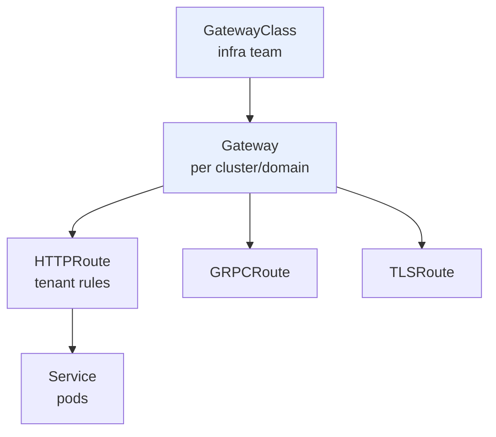
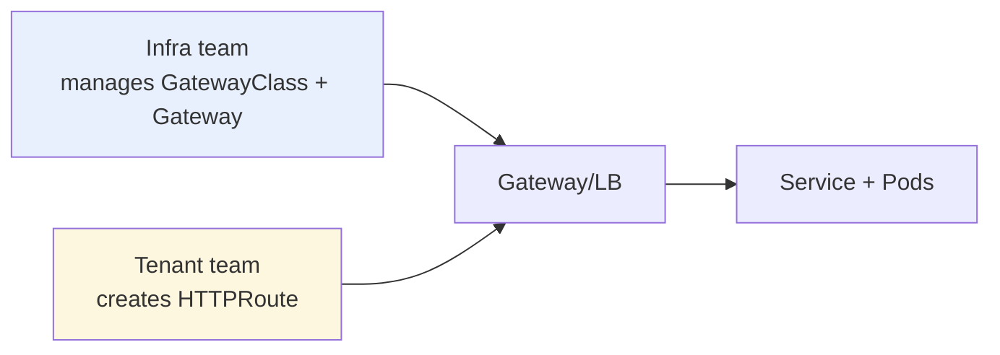

# Gateway API

> **Category:** Networking & Traffic Ingestion

The **Gateway API** is the Kubernetes community's **successor to Ingress** — a more expressive, role-oriented set of APIs for traffic routing. While Ingress is flat and Ingress-controller-specific, Gateway API splits concerns across four resources (`GatewayClass` → `Gateway` → `HTTPRoute`/`TLSRoute`/`GRPCRoute` → `Service`) and is designed for conformance across implementations (envoy-gateway, ALB, Cilium, nginx, Traefik, etc.).

## Why Gateway API (vs Ingress)?

| Concern | Ingress (v1) | Gateway API |
|---------|--------------|-------------|
| Model | flat (one Ingress = rules) | layered (Class/Gateway/Route) |
| Roles | no role split | infra (GatewayClass) vs tenant (Route) split |
| Matching | path/host only | header, query param, cookie, method, etc. |
| Protocol support | L7 HTTP(S) only | HTTP, TLS, gRPC, TCP, UDP via distinct Route kinds |
| Conformance | undefined | standardized levels: Core / Extended / Implementation-specific |
| Extensibility | controller-specific annotations | structured `parametersRef` |



## The Four Resources

1. **`GatewayClass`** (cluster-scoped) — **who** provisions Gateways (the controller + parameters). Created by platform/infra teams.
2. **`Gateway`** (namespace-scoped) — **where** traffic enters (listeners, addresses, TLS). Created by app teams; the controller reconciles an LB + IP.
3. **Route (`HTTPRoute`, `TLSRoute`, ...)** — **what** traffic is routed how (host/header matching, filters, backend Services). Created by app/tenant teams.
4. **`Service`** — the backend. `HTTPRoute` points at it; the Service points at Pods.

### Minimal example

```yaml
apiVersion: gateway.networking.k8s.io/v1
kind: GatewayClass
metadata: { name: haproxy }
spec:
  controllerName: haproxy.com/haproxy-ingress-controller   # which controller owns it
---
apiVersion: gateway.networking.k8s.io/v1
kind: Gateway
metadata: { name: my-app }
spec:
  gatewayClassName: haproxy
  listeners:
  - name: http
    port: 80
    protocol: HTTP
    hostname: "*.example.com"
---
apiVersion: gateway.networking.k8s.io/v1
kind: HTTPRoute
metadata: { name: my-route }
spec:
  parentRefs:                # which Gateway(s) attach
  - name: my-app
    namespace: default
    sectionName: http
  hostnames: ["app.example.com"]
  rules:
  - matches:                 # L7 matching (header / path)
    - path:
        type: PathPrefix
        value: /api
    backendRefs:
    - name: api-svc
      port: 80
```

## Role Split (why it matters in production)


Infra provisions the Gateway (cost, IPs, TLS termination) once; tenants create `HTTPRoute`s against it. This prevents every team from grabbing LB IPs or TLS certs — something Ingress annotations couldn't enforce cleanly.

## Implementations

| Controller | Notes |
|-----------|-------|
| **Envoy Gateway** | CNCF, reference implementation; GA. |
| **AWS ALB** | `alb.ingress.kubernetes.io` ALB via Gateway API support. |
| **Cilium** | `CiliumEnvoyHTTPRoute` (Envoy-based L7). |
| **NGINX / Traefik / HAProxy** | all ship Gateway API controllers. |

## Common Issues

| Symptom | Cause | Fix |
|---------|-------|-----|
| `HTTPRoute` stuck `Pending` | no `Gateway` is **accepted** / controller not running | `kubectl get gatewaycontroller`, check the controller deployment |
| 404 on a route | `parentRef` namespace mismatch, or `hostname` not matched | match `spec.hostnames` to the request Host |
| Route not attached | `sectionName`/`port` on the Route must match a Gateway listener | ensure listener name/port align |
| TLS not working | Gateway `TLS` listener needs a `TLSRoute` or cert ref | use `TLSRoute` or set `tls.certificateRefs` |

## Interview Questions

**Q: What's the difference between Gateway API and Ingress?**
A: Gateway API is **layered and role-oriented** — `GatewayClass` (infra) → `Gateway` (where) → `HTTPRoute` (tenant match/routes) → `Service`. Ingress is a single flat resource with controller-specific annotations. Gateway API also has structured L7 matching (headers, cookies, query params) and distinct Route kinds for TCP/UDP/gRPC/TLS, plus a **conformance** program so "Core" features work across implementations.

**Q: What is a GatewayClass, and why can't an app team create one?**
A: A `GatewayClass` declares **which controller** owns a class of Gateways (e.g. `example.com/envoy`). The infra/platform team creates it (it references controller identity + cluster-wide parameters). App teams create `Gateway`s *of* that class and the `HTTPRoute`s; they do **not** create the class — this is the role split that keeps cost/IP/TLS centrally controlled.

**Q: When would you still use Ingress instead of Gateway API?**
A: For very simple L7 routing with an existing Ingress controller, or when your controller hasn't shipped a Gateway API implementation. Otherwise, Gateway API is the direction — CKA/CKAD now test it as the standard.

## Related Resources
- [Networking](README.md)
- [Ingress](ingress.md)
- [Ingress Controllers](ingress-controllers.md)
- [Cilium](cilium.md)
- [Service Mesh](../12-service-mesh/service-mesh.md)
