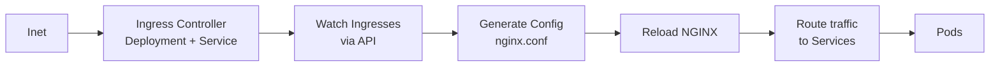

# Ingress Controllers

> **Category:** Networking / Ingress

## What It Is

An **Ingress Controller** is the **actual implementation** that fulfills an `Ingress` resource's routing rules. While `Ingress` is just a **declarative YAML rule** (host/path to Service), an Ingress Controller is a **running application** (NGINX, Traefik, Envoy, GCE) that:

1. Watches `Ingress` resources
2. Translates them into **configuration** (NGINX config, HAProxy rules, Envoy listeners)
3. **Reloads** the proxy so it routes traffic correctly

## Why It Exists

A bare `Ingress` resource does nothing without a controller. You need software to:
- Listen on port 80/443
- Match `Host` and `Path` headers
- Forward traffic to backend Services
- Terminate TLS
- Handle retries, rate-limiting, sticky sessions, etc.

## Common Ingress Controllers

| Controller | Language | Based On | Notes |
|------------|----------|----------|-------|
| **NGINX** | NGINX | NGINX | Most popular, NGINX Inc version |
| **Ingress-Nginx** | Go | NGINX | Community, Kubernetes Ingress SIG |
| **Traefik** | Go | Traefik | Auto-discovery, easy config |
| **GCE/GCLB** | Go | Google | GCP managed (built-in) |
| **HAProxy** | C | HAProxy | High performance, stable |
| **Envoy** | C++ | Envoy | Sidear-oriented, used by Istio |
| **ALB** | Go | AWS ALB | AWS Load Balancer ( Ingress) |

## How an Ingress Controller Works



## Ingress Controller vs Ingress

| Term | Definition | Type |
|------|------------|------|
| **Ingress** | A **YAML resource** declaring routing rules | Declarative (config) |
| **Ingress Controller** | The **running proxy** that implements those rules | Software (NGINX, Traefik) |

Think of `Ingress` as the **config file** and the Controller as the **NGINX binary** that reads it.

## IngressClass

An `IngressClass` tells Kubernetes which **controller** should handle a given `Ingress`:

```yaml
apiVersion: networking.k8s.io/v1
kind: IngressClass
metadata:
  name: nginx
  annotations:
    ingressclass.kubernetes.io/is-default-class: "true"   # Make default
spec:
  controller: k8s.io/ingress-nginx    # Unique identifier for NGINX
```

Every `Ingress` can reference an `IngressClass`:
```yaml
spec:
  ingressClassName: nginx   # Which controller to use
```

## Installation Overview

Each controller installs:
- A `Deployment` (the controller software)
- A `Service` (LoadBalancer or NodePort — the entry point)
- A default `Backend` (404 handler)
- An `IngressClass`

### Ingress-nginx (Community)
```bash
kubectl apply -f https://raw.githubusercontent.com/kubernetes/ingress-nginx/main/deploy/static/provider/cloud/deploy.yaml
kubectl get pods -n ingress-nginx
kubectl get svc -n ingress-nginx  # Check for external IP
```

### NGINX (NGINX Inc)
```bash
helm install my-nginx-ingress nginx/nginx-ingress --namespace nginx-ingress --create-namespace
```

### Traefik
```bash
helm install traefik traefik/traefik --namespace kube-public
kubectl get svc -n kube-public traefik  # Get load balancer IP
```

## Controller Configuration

### Ingress-nginx ConfigMap
```yaml
apiVersion: v1
kind: ConfigMap
metadata:
  name: nginx-configuration
  namespace: ingress-nginx
data:
  proxy-connect-timeout: "30s"
  hsts: "true"
  ssl-redirect: "true"
  default-ssl: "443"
  worker-processes: "auto"
  proxy-body-size: "10m"
```

### Traefik (dynamic + static config)
```yaml
entryPoints:
  web:
    address: ":80"
  websecure:
    address: ":443"
api:
  dashboard: true
providers:
  kubernetesCRD: {}
  kubernetesIngress: {}
certificatesResolvers:
  letsencrypt:
    acme:
      email: admin@example.com
      storage: acme.json
      httpChallenge:
        entryPoint: web
```

## Annotations (NGINX-specific)

Annotations configure NGINX-specific behavior (not portable):

```yaml
metadata:
  annotations:
    nginx.ingress.kubernetes.io/rewrite-target: /   # Strip prefix
    nginx.ingress.kubernetes.io/ssl-redirect: "false"  # Allow HTTP
    nginx.ingress.kubernetes.io/rate-limit: "100"  # RPM
    nginx.ingress.kubernetes.io/proxy-body-size: "10m"
    nginx.ingress.kubernetes.io/custom-http-headers: "my-headers"
    nginx.ingress.kubernetes.io/whitelist-source-range: "10.0.0.0/8"
```

## Middleware / Custom Resources

| Controller | CRD | Purpose |
|------------|-----|---------|
| Traefik | `Middleware` | Rate limit, headers, redirect, etc. |
| Traefik | `TraefikCRD` / `IngressRoute` | Advanced routing (replaces Ingress) |
| NGINX+ | `NGINXIngressControllerPolicy` | Fine-grained config |
| Contour | `HTTPProxy` | Advanced routing (replaces Ingress) |

Example Middleware (Traefik):
```yaml
apiVersion: traefik.containo.us/v1alpha1
kind: Middleware
metadata:
  name: stripprefix
spec:
  stripPrefix:
    prefixes:
      - /api
---
apiVersion: traefik.containo.us/v1alpha1
kind: IngressRoute
metadata:
  name: myroute
spec:
  entryPoints:
    - web
  routes:
  - match: Host(`example.com`)
    kind: Rule
    paths:
      - path: /api
        pathType: Prefix
        middlewares:
          - stripprefix
        services:
          - name: api-service
            port: 80
```

## Commands

```bash
# Check controller
kubectl get pods -n ingress-nginx
kubectl get svc -n ingress-nginx
kubectl describe ingress <name>         # Check controller events

# Check external IP / endpoint
kubectl get ingress <name> -o wide

# Logs
kubectl -n ingress-nginx logs -l app.kubernetes.io/name=ingress-nginx
kubectl -n ingress-nginx logs -f <pod>

# Describe IngressClass
kubectl get ingressclass

# Reload config (if needed)
kubectl -n ingress-nginx rollout restart deployment ingress-nginx-controller
```

## Common Issues

### Controller not receiving traffic (no external IP)
```bash
kubectl get svc -n ingress-nginx
# <pending> — need a LoadBalancer / MetalLB
# Fix: install MetalLB or use NodePort
```

### "default backend 404"
```bash
# Ingress doesn't match the host/path
kubectl describe ingress <name>
# Check: rules, host, paths
```

### HTTP instead of HTTPS
```yaml
# NGINX annotation to disable redirect:
nginx.ingress.kubernetes.io/ssl-redirect: "false"
```

### Annotations not working
```bash
# Annotations are NGINX-specific.
# Check the controller is NGINX — annotations for other controllers won't work.
kubectl get pods -n ingress-nginx -l app.kubernetes.io/name=ingress-nginx
```

### Reload loops / high CPU
```bash
# Too many Ingresses triggering reload
# Consider Ingress sharding or upgrading controller version
kubectl -n ingress-nginx logs -l app.kubernetes.io/name=ingress-nginx | tail -50
```

## Best Practices

1. **Use IngressClass** — not `kubernetes.io/ingress.class` annotation
2. **Enable health checks** — so the LB only routes to healthy controllers
3. **Set resource requests/limits** — controllers are busy
4. **Enable metrics** — for observability
5. **Use `cert-manager`** for automated TLS
6. **Limit Ingress count per controller** — NGINX + Ingress controller reloads are O(n)
7. **Use `externalTrafficPolicy: Local`** — to preserve client IP
8. **Set `proxy-body-size`** — via annotation or ConfigMap
9. **Monitor controller logs** — for reload or routing errors
10. **Consider Ingress sharding** — for clusters with many Ingresses

## Performance

| Controller | Max Ingresses | Notes |
|------------|---------------|-------|
| Ingress-nginx | Thousands | Reloads every config change |
| Traefik | Hundreds-Thousands | CRD-based (IngressRoute), efficient |
| GCE | Managed | Google handles scale |
| Envoy/Istio | Thousands | CRD-based, high perf |

## Interview Questions

**Q: What is the difference between an Ingress and an Ingress Controller?**
A: An **Ingress** is a declarative YAML rule (like a routing config). An **Ingress Controller** is the actual running proxy (NGINX, Traefik) that reads those rules and configures its proxy to fulfill them.

**Q: Do I need an Ingress Controller to use Ingress?**
A: Yes — without a running controller, Ingress resources do nothing (no traffic is routed). The controller is what listens on port 80/443 and fulfills the rules.

**Q: What is an IngressClass?**
A: An `IngressClass` is a cluster-scoped resource that identifies a specific Ingress Controller implementation. An Ingress references its class via `spec.ingressClassName`, so you can run multiple controllers (NGINX + Traefik) side-by-side.

**Q: Can one Ingress Controller handle Ingresses from multiple namespaces?**
A: Yes — by default most controllers (Ingress-nginx, Traefik) watch **all namespaces**. Use `--watch-namespace` to restrict scope.

**Q: Where are TLS certificates stored?**
A: In **Secrets** of type `kubernetes.io/tls` (containing `tls.crt` and `tls.key`). The Ingress references them via `spec.tls[].secretName`.

## Related Resources

- [Ingress](ingress.md)
- [Networking Model](networking.md)
- [Services](services.md)
- [NGINX Ingress](nginx-ingress.md)
- [Traefik Ingress](traefik-ingress.md)