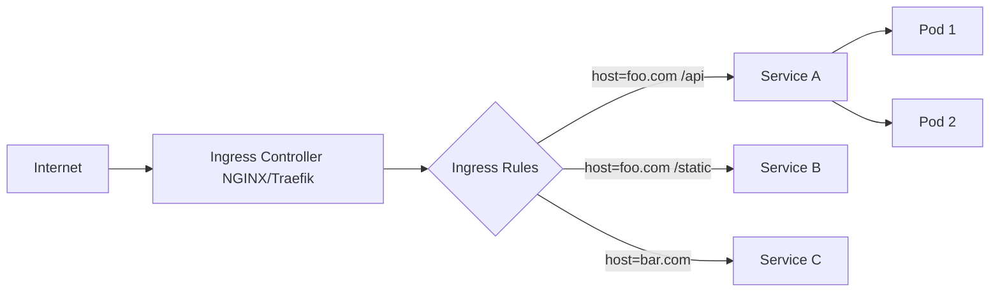

# Ingress

> **Category:** Networking / Ingress

## What It Is

An **Ingress** is a Kubernetes **resource** (an API object) that defines **HTTP/HTTPS routing rules** into the cluster. It is **not a proxy itself** — it is a **set of declarative rules** (host/path to Service) that an **Ingress Controller** (NGINX, GCE, Traefik, Envoy) **implements** and enforces.

## Why It Exists

Using a separate `LoadBalancer` Service per app is **expensive** and lacks HTTP routing features:
- Each LoadBalancer gets its own IP (costs money per hour)
- No **host-based** routing (foo.com vs bar.com)
- No **path-based** routing (api vs static)
- No **TLS termination** at the edge
- No **sticky sessions**, retries, rate-limiting

Ingress gives you a **single entry point** with **smart L7 routing** — much cheaper and more powerful than one LB per app.

## Architecture



There is **one Ingress Controller** (a Pod/Deployment) that watches the **Ingress** resources and reconfigures itself (writes NGINX config, reloads) **when Ingress rules change**.

## Core Resources

| Resource | Purpose |
|----------|---------|
| `Ingress` | Declares HTTP routing rules (host/path to Service) |
| `IngressClass` | Selects which Ingress Controller handles an Ingress |
| `ConfigMap` | Controller settings (annotations, TLS config) |
| `Secret` | TLS certificates (spec.tls. Use secretName) |

## Ingress API

```yaml
apiVersion: networking.k8s.io/v1
kind: Ingress
metadata:
  name: my-ingress
  annotations:
    nginx.ingress.kubernetes.io/rewrite-target: /
    cert-manager.io/cluster-issuer: letsencrypt-prod
spec:
  ingressClassName: nginx
  rules:
  - host: foo.example.com
    http:
      paths:
      - path: /api
        pathType: Prefix
        backend:
          service:
            name: api-service
            port:
              number: 80
      - path: /static
        pathType: Prefix
        backend:
          service:
            name: static-service
            port:
              number: 80
  tls:
  - hosts:
    - foo.example.com
    secretName: foo-tls
  - hosts:
    - bar.example.com
    secretName: bar-tls
```

## IngressClass

Selects the controller that handles the Ingress (useful when running multiple controllers):

```yaml
apiVersion: networking.k8s.io/v1
kind: IngressClass
metadata:
  name: nginx
  annotations:
    ingressclass.kubernetes.io/is-default-class: "true"
spec:
  controller: k8s.io/ingress-nginx
```

## Path Types

| Type | Behavior |
|------|----------|
| `Prefix` | Matches URL path prefix — /api matches /api, /api/users, /api/v1 |
| `Exact` | Matches the whole path exactly — /api matches /api but not /api/users |
| `ImplementationSpecific` | Up to the controller |

## TLS / HTTPS

- TLS certs are stored as `Secret` type `kubernetes.io/tls`
- The Ingress references the secret via `spec.tls[].secretName`
- The controller terminates TLS and routes to the backend Service

```bash
kubectl create secret tls my-tls --cert=tls.crt --key=tls.key
```

## Default Backend

A Service that catches all unmatched requests. Defined in the Ingress controller configmap.

## Ingress vs LoadBalancer vs NodePort

| Feature | Ingress | LoadBalancer | NodePort |
|---------|---------|--------------|----------|
| Layer | L7 (HTTP) | L4 (TCP) | L4 (TCP) |
| Host-based routing | Yes | No | No |
| Path-based routing | Yes | No | No |
| TLS termination | Yes | No | No |
| Cost | 1 IP (shared) | 1+ IP per LB | NodeIP |

## Ingress Controller Options

| Controller | Language | Notes |
|------------|----------|-------|
| NGINX | Go/C | Most popular, most annotations |
| Traefik | Go | Auto-discovery, good defaults |
| GCE/GCLB | Go | GCP managed |
| HAProxy | C/Go | High performance |
| Envoy | C++ | Sidecar-oriented, Istio |

## Commands

```bash
kubectl get ingress
kubectl describe ingress <name>
kubectl apply -f ingress.yaml
kubectl -n ingress-nginx get pods
kubectl -n ingress-nginx logs -l app.kubernetes.io/name=ingress-nginx
kubectl get ingressclass
```

## NGINX Annotations

| Annotation | Purpose |
|-----------|---------|
| `nginx.ingress.kubernetes.io/rewrite-target: /` | Strip path prefix |
| `nginx.ingress.kubernetes.io/ssl-redirect: "false"` | Allow HTTP |
| `nginx.ingress.kubernetes.io/rate-limit: "100"` | Rate limit |
| `nginx.ingress.kubernetes.io/proxy-body-size: "10m"` | Max body size |
| `nginx.ingress.kubernetes.io/upstream-hash-by: "$request_uri"` | Sticky sessions |

## Common Issues

### Ingress address is `<pending>`
```bash
kubectl get ingress
# ADDRESS: <pending>
# Cause: no cloud-controller-manager (bare metal) or LB still provisioning
# Fix: deploy Ingress Controller with a configured Service
# Bare metal: use MetalLB
```

### 404 from Ingress
```bash
# Check: Ingress `rules` host matches the request Host header
# Check: default Backend exists
kubectl describe ingress <name>
kubectl -n ingress-nginx describe configmap nginx-configuration
```

### TLS errors / "unknown certificate"
```bash
# Verify the Secret has tls.crt and tls.key:
kubectl get secret <secret-name> -o yaml
# Regenerate or mount the cert
```

### Rewrite not working
```yaml
# Use annotations correctly:
nginx.ingress.kubernetes.io/rewrite-target: /
# AND: path must match (e.g., /api), pathType: Prefix
# Also: `use-regex` for regex paths
```

## Best Practices

1. **Use ingressClassName** — not annotations (`kubernetes.io/ingress.class`)
2. **One Ingress per app is fine** — NGINX handles hundreds
3. **Use TLS secrets managed by cert-manager**
4. **Set a default backend** — so unmatched requests land somewhere
5. **Add `externalTrafficPolicy: Local`** — to preserve client IP (NGINX)
6. **Don't rely on annotations** — they are NGINX-specific (not portable)
7. **Test with `kubectl describe ingress`** — check rules + events
8. **Health checks** — ensure backend Services are healthy
9. **Rate limiting / whitelisting** via annotations (NGINX) or middleware (Traefik)
10. **Monitor NGINX metrics** (via Prometheus endpoint)

## Interview Questions

**Q: What's the difference between an Ingress and an Ingress Controller?**
A: **Ingress** is a **declarative YAML rule** (host/path + TLS → Service). An **Ingress Controller** is a running program (NGINX, Traefik, Envoy) that reads those rules and configures the actual proxy to fulfill them.

**Q: Is Ingress a proxy?**
A: No — Ingress is a **set of rules / configuration**. The Ingress Controller (NGINX, Traefik) is the actual proxy that implements those rules. Think of Ingress as a config file and the Controller as NGINX itself.

**Q: How does TLS work with Ingress?**
A: TLS certs are stored as Secrets. The Ingress `spec.tls` references the secret. The Controller terminates TLS at the edge and forwards decrypted HTTP (or re-encrypts) to backend Services.

**Q: Does Ingress scale across multiple namespaces?**
A: By default, yes — Ingress controllers watch all namespaces. (Ingress-NGINX is configured with `--watch-namespace` to limit scope.)

**Q: How do you route traffic to different backends based on URL path?**
A: Use `path` + `pathType: Prefix` (or `Exact`). E.g., `/api` to `api-service`, `/static` to `static-service`.

## Related Resources

- [Networking Model](networking.md)
- [Services](services.md)
- [Ingress Controllers](ingress-controllers.md)
- [NGINX Ingress](nginx-ingress.md)
- [Traefik Ingress](traefik-ingress.md)
- [Network Policies](network-policies.md)