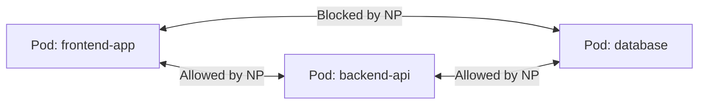

# Network Policies

> **Category:** Networking / Security

## What It Is

A **NetworkPolicy** is a Kubernetes resource that controls **network traffic between pods** (east-west traffic) at **Layer 3 and 4**. It acts as a **firewall** or allowlist — defining which pods can communicate with which other pods, on which ports/protocols.

## Why It Exists

By default, Kubernetes allows all pod-to-pod traffic. But you may want to:
- **Isolate** a namespace (e.g., dev vs prod traffic)
- **Restrict** a "frontend" pod from talking to "database" pods directly
- **Limit blast radius** if a pod is compromised
- **Compartmentalize** microservices (zero-trust network)

NetworkPolicies enforce a **default-deny** and then **allow** specific traffic.

## Architecture



## Key Concepts

| Concept | Meaning |
|---------|---------|
| **Isolation** | An `Ingress` or `Egress` policy on a pod makes it "isolated" for that direction |
| **Default** | No NetworkPolicy = all traffic allowed (default-allow) |
| **Default-Deny** | A policy exists but allows nothing = all traffic blocked |
| **Allow** | A policy selects pods, then allows specific ingress/egress |
| **Additive** | Multiple policies for the same pod can **add** allowed traffic (union) |

## NetworkPolicy API

```yaml
apiVersion: networking.k8s.io/v1
kind: NetworkPolicy
metadata:
  name: backend-allow
spec:
  podSelector:
    matchLabels:
      app: backend          # Select pods this policy applies to
  policyTypes:
  - Ingress                 # Apply to incoming traffic (egress if specified)
  ingress:                 # Allow these inbound connections
  - from:
    - podSelector:
        matchLabels:
          app: frontend    # Allow traffic from frontend pods
    ports:
    - protocol: TCP
      port: 8080
  egress:                  # Allow these outbound connections
  - {}
```

## Policy Types

| Type | Meaning |
|------|---------|
| `Ingress` | Controls incoming traffic TO the selected pods |
| `Egress` | Controls outgoing traffic FROM the selected pods |
| Both | If you specify both, it isolates both directions |

## Selector Reference

### podSelector
Selects pods **in the same namespace**:

```yaml
podSelector:
  matchLabels:
    app: backend          # Pods with app=backend (same namespace)
```

### namespaceSelector
Selects **namespaces**:

```yaml
namespaceSelector:
  matchLabels:
    kubernetes.io/metadata.name: frontend  # Kubernetes 1.21+
    # or: name: frontend (older)
```

### ipBlock
Selects by IP CIDR:

```yaml
ipBlock:
  cidr: 10.0.0.0/24
  except:
  - 10.0.0.1/30
```

## Common Patterns

### 1. Default-Deny All (Namespace-wide)

```yaml
apiVersion: networking.k8s.io/v1
kind: NetworkPolicy
metadata:
  name: default-deny-all
spec:
  podSelector: {}           # Empty = all pods
  policyTypes:
  - Ingress
  - Egress
# Now NO traffic is allowed — pods are isolated, you must opt-in (allow)
```

### 2. Allow Frontend to Talk to Backend

```yaml
apiVersion: networking.k8s.io/v1
kind: NetworkPolicy
metadata:
  name: api-allow-from-frontend
spec:
  podSelector:
    matchLabels:
      app: backend-api      # Target backend pods
  policyTypes:
  - Ingress
  ingress:
  - from:
    - podSelector:
        matchLabels:
          app: frontend     # Source frontend pods
    ports:
    - port: 8080
      protocol: TCP
```

### 3. Allow DNS Egress (to kube-dns)

```yaml
apiVersion: networking.k8s.io/v1
kind: NetworkPolicy
metadata:
  name: allow-dns
spec:
  podSelector: {}           # All pods
  policyTypes:
  - Egress
  egress:
  - to:
    - namespaceSelector:
        matchLabels:
          kubernetes.io/metadata.name: kube-system
    - podSelector:
        matchLabels:
          k8s-app: kube-dns
    ports:
    - port: 53
      protocol: UDP
```

### 4. Allow External Access (Egress)

```yaml
apiVersion: networking.k8s.io/v1
kind: NetworkPolicy
metadata:
  name: allow-internet
spec:
  podSelector: {}
  policyTypes:
  - Egress
  egress:
  - to:
    - ipBlock:
        cidr: 0.0.0.0/0    # Allow all outbound
    # OR allow specific IPs
    - ipBlock:
        cidr: 198.51.100.0/24
```

## Commands

```bash
# List
kubectl get networkpolicy
kubectl get networkpolicy -n <namespace>

# Describe
kubectl describe networkpolicy <name>

# Apply
kubectl apply -f networkpolicy.yaml

# Delete
kubectl delete networkpolicy <name>

# Test isolation
kubectl run test-pod --image=busybox --rm -it -- sh
# (try curl/wget to other pods; if default-deny, traffic will hang/fail)
```

## CNI Plugin Support

NetworkPolicies are enforced by the **CNI plugin**, not Kubernetes itself:

| CNI | NetworkPolicy Support |
|-----|----------------------|
| **Calico** | Full (uses iptables or eBPF) |
| **Cilium** | Full (eBPF — Layer 7 policies too) |
| **Kube-router** | Full (iptables-based) |
| **Weave Net** | Full |
| **Flannel** | **No** — needs a companion (e.g., Kube-router or Calico Policy) |
| **Amazon VPC CNI** | Yes (needs AWS Security Groups for Pods or Calico) |

## Common Issues

### NetworkPolicy has no effect
```bash
# Cause: CNI plugin doesn't support NetworkPolicy
kubectl get pods -n kube-system -l k8s-app=kube-proxy
# Check which CNI is installed:
kubectl get pods -n kube-system -l k8s-app=calico-node

# If Flannel (no NP support): switch to Calico/Kube-router, or add Calico policy controller
```

### Pods become unreachable (default-deny too aggressive)
```bash
# DNS egress must be explicitly allowed (see above)
# Also allow egress to kube-apiserver:
apiVersion: networking.k8s.io/v1
kind: NetworkPolicy
metadata:
  name: allow-apiserver
spec:
  podSelector: {}
  policyTypes:
  - Egress
  egress:
  - to:
    - ipBlock:
        cidr: 10.96.0.1/32   # API server IP
    ports:
    - port: 443
```

### Can't connect from namespace to namespace
```yaml
# Add namespaceSelector to allow cross-namespace:
ingress:
- from:
  - namespaceSelector:
      matchLabels:
        kubernetes.io/metadata.name: frontend
    podSelector:
      matchLabels:
        app: frontend
```

### Policy doesn't select the right pods
```bash
kubectl get pods -l app=backend --show-labels
# The label keys/values must EXACTLY match the policy's podSelector
```

## Best Practices

1. **Start with default-deny** — isolate the namespace, then opt-in traffic
2. **Use `podSelector`** for fine-grained pod-to-pod control (same namespace)
3. **Use `namespaceSelector`** for namespace-to-namespace rules
4. **Allow DNS egress explicitly** — every pod needs to talk to kube-dns
5. **Layer 3 (CIDR) for external** — use `ipBlock` for known external IPs
6. **Use descriptive names** — e.g., `allow-backend-from-frontend`
7. **Test with `kubectl exec`** — spin up a busybox pod and test connectivity
8. **Layer 7 for HTTP routing** — use Ingress/controller or a Service Mesh for path-based rules (NetworkPolicy is L4 only)
9. **Document policies** — especially the "why" and "what's allowed"
10. **Gradual rollout** — apply to one namespace at a time, don't break prod

## Interview Questions

**Q: Is the default Kubernetes pod network allow-all or deny-all?**
A: **Allow-all** — without any NetworkPolicy, all pods can talk to all pods. NetworkPolicies create "islands of isolation" (deny-by-default) only when explicitly applied.

**Q: What happens when two NetworkPolicies both select the same Pod?**
A: Their allowed traffic is combined (union) — a pod is isolated only if **any** policy selects it, and the combined allow-list governs permitted traffic. If **both** allow a connection, it's allowed. If **neither** does, it's denied (when the pod is isolated).

**Q: What types of selectors does NetworkPolicy support?**
A: Three: `podSelector` (same-namespace pods), `namespaceSelector` (whole namespaces), and `ipBlock` (CIDR-based IP ranges). You can combine them in `from` or `to` lists.

**Q: What is a "default-deny" policy?**
A: A policy with `podSelector: {}` (selects all pods) and **no allow rules** (or `ingress: []`, `egress: []`). It doesn't explicitly deny — it just provides no allowed paths, effectively blocking all traffic to/from those pods. New pods in that namespace inherit this isolation.

**Q: How does NetworkPolicy handle cross-namespace traffic?**
A: `podSelector` only matches pods in the **same namespace**. To allow cross-namespace traffic, use `namespaceSelector` (which selects namespaces, not pods) — combined with a `podSelector` inside it.

**Q: Does NetworkPolicy support L7 (HTTP path) rules?**
A: **No** — NetworkPolicy is strictly L3/L4 (IP/ports). For HTTP routing/paths, use an Ingress Controller or a Service Mesh (Istio, Linkerd).

## Related Resources

- [Networking Model](networking.md)
- [Services](services.md)
- [CNI Plugins](cni-plugins.md)
- [Calico](cni-plugins.md#calico)
- [Cilium](cni-plugins.md#cilium)