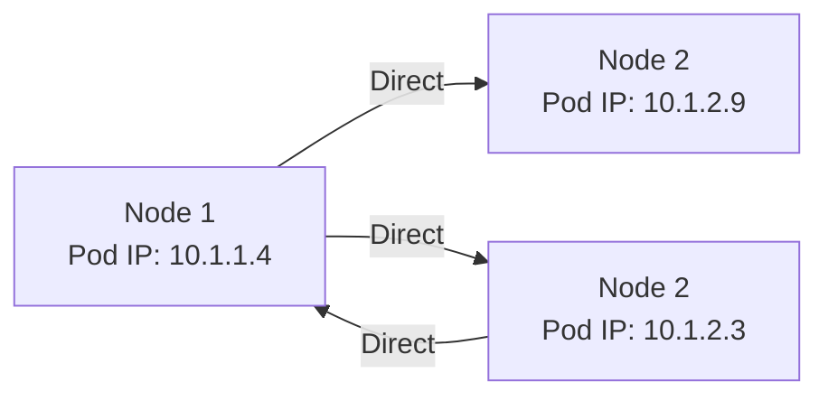
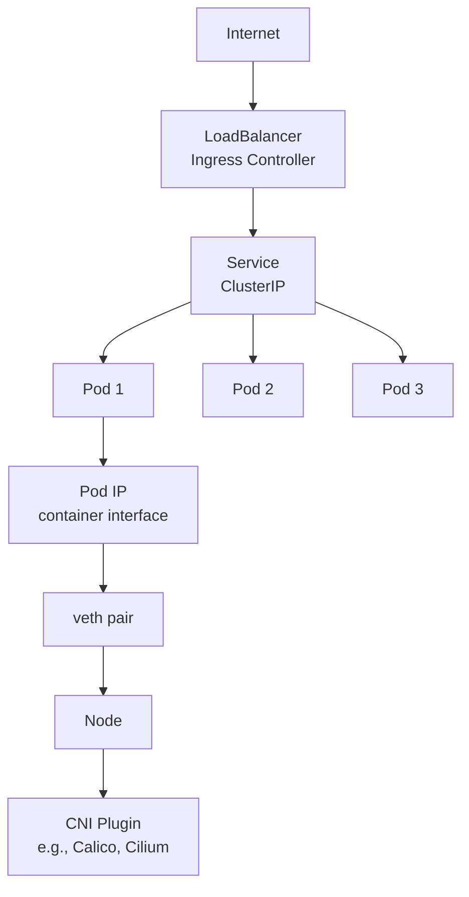
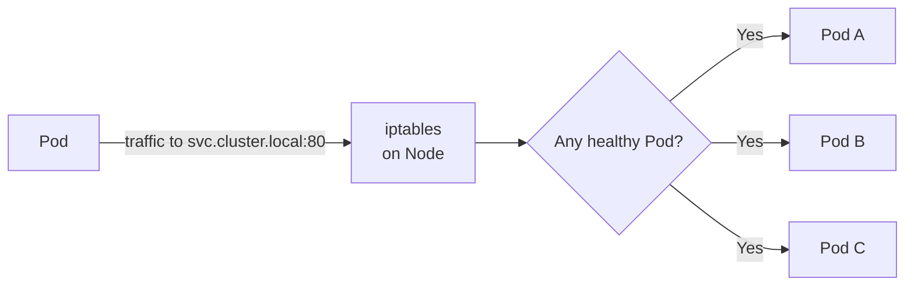
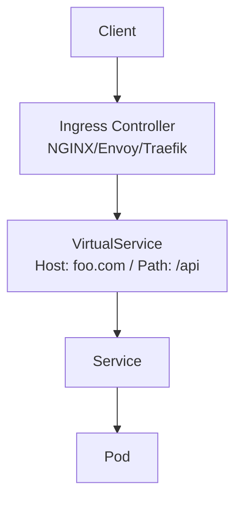

# Kubernetes Networking Model

> **Category:** Networking

## What It Is

Kubernetes defines a **networking model** with specific requirements that every conformant CNI plugin must implement. It's built on the **pod IP model** — every pod gets a unique IP address, and pods can communicate directly (no NAT) unless a NetworkPolicy restricts them.

## Why It Exists

Before Kubernetes:
- Container networking was inconsistent (Docker bridge mode, custom overlays)
- Apps assumed `localhost` networking or complex port-mapping
- No standard way to route between containers across hosts

The K8s networking model provides a **flat, routable, consistent** network for all containers.

## Core Principles (The "Networking Model")

Kubernetes requires:
1. **All Pods can communicate directly** with all other Pods (no NAT between them)
2. **All Nodes can communicate** with all Pods (and vice versa)
3. **Pods have their own IP** (no port mapping needed)

This is summarized as: **"One IP per Pod, flat network"**

### Pod-to-Pod Communication



## CNI (Container Network Interface)

**CNI** is the standard that all Kubernetes networking plugins implement. It defines how containers get network interfaces and IP addresses.

### CNI Responsibilities

| Task | How |
|------|-----|
| **Assign IP** to a Pod | Plugin allocates from a subnet |
| **Set up network** | veth pair: one end in Pod, one in host network |
| **Enable routing** | Configure routes so Pod IPs are reachable |
| **Apply firewall** | (via NetworkPolicy) eBPF, iptables, or kernel policies |

### CNI Plugin Categories

| Plugin | Type | Overlay? | Example Use |
|--------|------|----------|-------------|
| **Calico** | BGP / VXLAN | Optional (BGP native, VXLAN optional) | Security + ECMP |
| **Cilium** | eBPF | Native (no iptables) | High-perf, L7 policies |
| **Flannel** | VXLAN / host-gw | Yes (default) | Simple, stable |
| **Weave Net** | Mesh | Yes | Auto-healing mesh |
| **Kube-OVN** | OVN / Geneve | Yes | Advanced, enterprise |
| **Cilium** | eBPF | No | High-performance, L7 |

## Pod IP Allocation

- Each Pod gets an IP address from a **CIDR block** assigned to its Node
- The range is communicated via `--cluster-cidr` (on controller) and `--node-cidr-mask-size`

```yaml
# kubelet config
KubeletConfiguration:
  ...
  networking:
    podCIDNumber: 24           # Each node gets ~256 IPs
```

### Dual-Stack (IPv4 + IPv6)

Modern K8s supports dual-stack:

```yaml
apiVersion: kubeadm.k8s.io/v1beta3
kind: ClusterConfiguration
networking:
  podSubnet: "192.168.0.0/16,fd00:10:0:0/16"
  serviceSubnet: "10.96.0.0/12,fd00:10:1:0/16"
  dhcp:  # ...
```

## Networking Layers



## Service Networking (ClusterIP)

### How Services Work

A Service uses `iptables` (or `ipvs`) rules to **redirect traffic** to backend Pods. Each Service gets a virtual IP (`ClusterIP`) in the Service CIDR.



### IPVS vs iptables

| Feature | `iptables` (legacy) | `ipvs` (modern) |
|---------|--------------------|-----------------|
| Backend selection | Random/per-hash | Any algorithm (rr, lc, lblc, etc.) |
| Performance | O(n) — linear scan | O(1) — hash |
| Sync | Full rebuild | Incremental sync |
| Default | ✅ Yes | ❌ No (must opt-in) |

## Ingress Networking (North-South)

Ingress provides **HTTP/HTTPS routing** into the cluster via rules:



## Network Policies (East-West)

Network Policies are a **firewall** for pod-to-pod traffic:

```yaml
apiVersion: networking.k8s.io/v1
kind: NetworkPolicy
metadata:
  name: allow-frontend
spec:
  podSelector:
    matchLabels:
      app: backend          # Select backend pods
  ingress:
  - from:
    - podSelector:          # Only allow from frontend
        matchLabels:
          app: frontend
    ports:
    - port: 80
      protocol: TCP
  policyTypes:
  - Ingress
```

## Key Endpoints

| Component | Port / Protocol | Purpose |
|-----------|------------------|---------|
| `kubelet` | 10250/tcp | CNI calls, logs, exec |
| `kube-proxy` | 8472/udp (UDP), 10256/tcp | Service proxy, healthcheck |
| `coredns` | 53/udp,tcp | Cluster DNS |
| `apiserver` | 6443/tcp | Control plane API |

## CNI Installation

Most CNI plugins install via a **DaemonSet**:

```bash
# Calico
kubectl apply -f https://docs.projectcalico.org/manifests/calico.yaml

# Flannel
kubectl apply -f https://raw.githubusercontent.com/coreos/flannel/master/Documentation/kube-flannel.yml

# Cilium
helm install cilium cilium/cilium --namespace kube-system
```

## CNI vs Ingress vs NetworkPolicy

| Layer | Component | Purpose |
|-------|-----------|---------|
| **L3** | CNI | Pod networking (IPs, routing) |
| **L4** | Service + kube-proxy | Load balancing, forwarding |
| **L7** | Ingress Controller | HTTP routing, TLS termination |
| **L3/L4** | NetworkPolicy | Pod-level firewall rules |

## Dual Networking Modes

| Mode | Description |
|------|-------------|
| **Native** | Pods use the host's network namespace (rare) |
| **Overlay** | VXLAN/Geneve tunnel between nodes (slower, more portable) |
| **Native (no overlay)** | BGP routes announce Pod CIDRs (faster, needs BGP support) |

## Common Issues

### Pod can't reach Service IP (`10.x.x.x`)
```bash
# Check DNS
nslookup <service-name>          # Does it resolve?
curl http://<service-name>:<port>   # Can other pods curl it?
# Check kube-proxy / IPVS
ipvsadm -Ln -t <cluster-ip>      # On the node
```

### Pod can reach external IP but not Service IP
- Check `kube-proxy` is running: `kubectl -n kube-system get pods`
- Check iptables/ipvs rules: `iptables -t nat -L` (iptables) or `ipvsadm -L`

### NetworkPolicy blocks all traffic
- By default, pods are **open** (allow all)
- Once a `NetworkPolicy` exists selecting a pod, the pod only accepts traffic allowed by policies

### Pod-to-Pod across Nodes failing
- Check CNI plugin logs: `kubectl -n kube-system logs <cni-ds>`
- Check Node network routes: `ip route`
- Check firewall/security groups (cloud)

## Interview Questions

**Q: What are the three required Kubernetes networking rules?**
A: (1) All Pods can communicate with all other Pods (without NAT), (2) all Nodes can communicate with all Pods (and vice versa), (3) Pods have their own IP (no port mapping).

**Q: What is CNI?**
A: The Container Network Interface — a Linux Foundation standard defining how containers get networked. It's how Kubernetes plugins like Calico, Cilium, and Flannel integrate.

**Q: How does Service routing work?**
A: Each Service gets a virtual ClusterIP. `kube-proxy` (using iptables/ipvs) on each node redirects traffic destined for the ClusterIP to endpoints of healthy backend Pods.

**Q: What is the difference between Ingress and a Service?**
A: A Service operates at **Layer 4** (TCP/UDP) and load-balances to pods. Ingress operates at **Layer 7** (HTTP) and routes based on host/path — requiring an Ingress Controller.

**Q: How do pods get IP addresses?**
A: The CNI plugin allocates an IP from the Pod CIDR per Node. The `kubelet` requests the container's network at creation via the CNI plugin.

## Related Resources

- [Services](services.md)
- [Ingress](ingress.md)
- [Network Policies](network-policies.md)
- [CNI Plugins](cni-plugins.md)
- [CoreDNS](coredns.md)