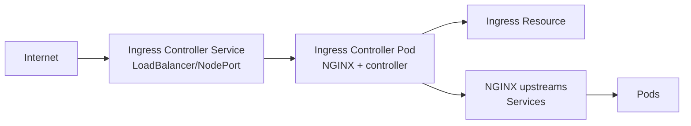

# NGINX Ingress Controller

> **Category:** Networking / Ingress / Controller

## What It Is

The **NGINX Ingress Controller** (NIC) is an Ingress Controller that uses **NGINX (or NGINX Plus)** as the underlying reverse proxy. It watches Kubernetes `Ingress` resources and generates/reloads NGINX configuration.

There are **two** official NGINX ingress controllers:
- **Ingress-nginx** (community — Kubernetes SIG) — uses open-source NGINX
- **NGINX Ingress Controller** (NGINX Inc) — uses NGINX Plus, commercial support

## Why Use NGINX Ingress

- Most popular Ingress controller on Kubernetes
- Huge ecosystem of **annotations** for advanced behavior
- Mature, production-tested
- Works on bare metal, cloud, and on-prem

## Installation

### Ingress-nginx (Community)

```bash
# Default (deploys into ingress-nginx namespace)
kubectl apply -f https://raw.githubusercontent.com/kubernetes/ingress-nginx/main/deploy/static/provider/cloud/deploy.yaml

# Or via Helm (recommended)
helm repo add ingress-nginx https://kubernetes.github.io/ingress-nginx
helm install ingress-nginx ingress-nginx/ingress-nginx
```

### NGINX Ingress Controller (NGINX Inc)

```bash
helm repo add nginx-stable https://kubernetes.github.io/nginx-ingress
helm install my-ingress nginx-stable/nginx-ingress
```

### Bare Metal (no cloud LB)

```bash
# Use the bare-metal manifest (NodePort)
kubectl apply -f https://raw.githubusercontent.com/kubernetes/ingress-nginx/main/deploy/static/provider/baremetal/deploy.yaml

# Then use MetalLB for an external IP:
helm install metallb metallb/metallb
```

## Architecture



The controller:
1. **Watches** `Ingress` + `Service` + `ConfigMap` + `Secret` resources
2. **Generates** an `nginx.conf` with server blocks, upstreams, TLS certs
3. **Reloads** NGINX gracefully (uses `nginx -s reload`)
4. Routes **traffic** from port 80/463 to backend Services

## NGINX Configuration

### Default ConfigMap

```yaml
apiVersion: v1
kind: ConfigMap
metadata:
  name: nginx-configuration
  namespace: ingress-nginx
data:
  proxy-connect-timeout: "30s"
  proxy-read-timeout: "60s"
  proxy-body-size: "1m"
  ssl-redirect: "true"
  hsts: "true"
  hsts-max-age: "31536000"
  worker-processes: "auto"
  worker-connections: "1024"
  enable-modsecurity: "true"      # ModSecurity WAF (optional)
  enable-owasp-modsecurity-policy-snippet: "true"
```

### Default Backend

When no Ingress matches, traffic goes to the default 404 backend. You can customize it:

```yaml
defaultBackend:
  enabled: true
  service:
    type: ConfigMap
```

## NGINX Annotations

> Note: annotations are **NGINX-specific** (Ingress-nginx). They don’t work on other controllers.

### Routing & Rewrites

```yaml
metadata:
  name: my-ingress
  annotations:
    # Strip /api prefix before sending to service
    nginx.ingress.kubernetes.io/rewrite-target: /

    # Use a regex path
    nginx.ingress.kubernetes.io/use-regex: "true"
    nginx.ingress.kubernetes.io/rewrite-target: /index.html
```

### TLS / Redirect

```yaml
annotations:
  # Disable HTTP→HTTPS redirect
  nginx.ingress.kubernetes.io/ssl-redirect: "false"
```

### Security

```yaml
annotations:
  nginx.ingress.kubernetes.io/whitelist-source-range: "10.0.0.0/8"
  nginx.ingress.kubernetes.io/server-snippet: |
    add_header X-Frame-Options "DENY";
    add_header X-Content-Type-Options "nosniff";
```

### Rate Limiting

```yaml
annotations:
  nginx.ingress.kubernetes.io/limit-rps: "10"        # Requests per second
  nginx.ingress.kubernetes.io/limit-connections: "100"
  nginx.ingress.kubernetes.io/limit-rps-status-code: "429"
```

### Load Balancing

```yaml
annotations:
  # Least connections (instead of round-robin)
  nginx.ingress.kubernetes.io/least-connections: "true"

  # Session affinity (sticky sessions)
  nginx.ingress.kubernetes.io/affinity: "ip_hash"
```

### Proxy Settings

```yaml
annotations:
  nginx.ingress.kubernetes.io/proxy-body-size: "10m"
  nginx.ingress.kubernetes.io/proxy-connect-timeout: "30s"
  nginx.ingress.kubernetes.io/proxy-read-timeout: "60s"
  nginx.ingress.kubernetes.io/proxy-send-timeout: "60s"
```

### Upstream Selection

```yaml
annotations:
  # Use a specific service port
  nginx.ingress.kubernetes.io/backend-protocol: "HTTPS"  # HTTP, HTTPS, GRPC
  nginx.ingress.kubernetes.io/proxy-next-upstream: "error timeout http_500"
```

### Snippets

```yaml
annotations:
  nginx.ingress.kubernetes.io/server-snippet: |
    # Add to server block
    add_header Strict-Transport-Security "max-age=31536000";

  nginx.ingress.kubernetes.io/configuration-snippet: |
    # Add to location block
    proxy_set_header X-Forwarded-Proto https;
```

## Configuration Snippets (Server / Location)

| Annotation | Adds config to |
|-----------|----------------|
| `nginx.ingress.kubernetes.io/configuration-snippet` | Inside `location {}` block |
| `nginx.ingress.kubernetes.io/server-snippet` | Inside `server {}` block |
| `nginx.ingress.kubernetes.io/http-snippet` | At `http {}` level |
| `nginx.ingress.kubernetes.io/upstream-snippet` | In `upstream {}` block |

## Services & Backends

- NGINX connects to Services using the Service `ClusterIP` + port
- It does **not** connect to Pod IPs directly (unless using `externalName`)
- **Readiness probes** on backend Services matter — NGINX removes unhealthy endpoints
- Use `serviceName` for SNI in TLS to upstreams:

```yaml
nginx.ingress.kubernetes.io/server-snippet: |
  proxy_ssl_server_name on;
  proxy_ssl_name $host;
```

## Canary Deployments (Ingress-nginx)

Canary is built-in — **no extra CRD**:

```yaml
apiVersion: networking.k8s.io/v1
kind: Ingress
metadata:
  name: myapp
  annotations:
    nginx.ingress.kubernetes.io/canary: "true"
    nginx.ingress.kubernetes.io/canary-weight: "20"    # 20% to canary
    nginx.ingress.kubernetes.io/canary-by-header: "X-Canary"   # Header-based
    nginx.ingress.kubernetes.io/canary-by-header-value: "always"
spec:
  # Canary Ingress — must match the stable Ingress's rules
  rules:
  - host: myapp.example.com
    http:
      paths:
      - path: /
        pathType: Prefix
        backend:
          service:
            name: myapp-v2-canary
            port:
              number: 80
```

- `canary-weight`: % of traffic (0–100)
- `canary-by-header`: header must equal `always` to get canary traffic
- The **last** canary Ingress (with same host/path) takes precedence

## Commands

```bash
# Install
helm install ingress-nginx ingress-nginx/ingress-nginx -n ingress-nginx --create-namespace

# Check status
kubectl get pods -n ingress-nginx
kubectl get svc -n ingress-nginx    # External IP

# Describe to debug
kubectl -n ingress-nginx describe ingress <name>

# View generated config
kubectl -n ingress-nginx exec <controller-pod> -- cat /etc/nginx/nginx.conf

# Reload (trigger config change — usually automatic)
kubectl -n ingress-nginx rollout restart deployment ingress-nginx-controller

# View logs
kubectl -n ingress-nginx logs -f <controller-pod>

# Test
curl -H "Host: myapp.example.com" http://<external-ip>/
```

## NGINX Plus (Commercial)

| Feature | NGINX OSS (ingress-nginx) | NGINX Plus |
|---------|---------------------------|-------------|
| Config via annotations | ✅ | ✅ |
| NGINX App Protect (WAF) | ❌ | ✅ |
| Active health checks | ❌ | ✅ |
| Rate limiting | ✅ (basic) | ✅ (advanced) |
| Dashboard/API | ❌ | ✅ |
| Support | Community | NGINX Inc |

## Common Issues

### "default backend - 404"
```bash
# Ingress doesn't match host/path
kubectl describe ingress <name>
# Check: rules.host, http.paths[0].path, pathType
```

### External IP stuck `<pending>`
```bash
kubectl get svc -n ingress-nginx
# Bare metal: install MetalLB
# GKE/GCP: ensure GCE L7 load balancer is configured
```

### SSL redirect loop
```yaml
# If behind another proxy, disable redirect:
nginx.ingress.kubernetes.io/ssl-redirect: "false"
```

### Too many 502s (Bad Gateway)
```bash
# Check: backend Service exists and is healthy
kubectl describe svc <service>
kubectl get endpoints <service>   # Are there ready endpoints?
# Check: Pod readiness probes passing
```

### Annotations not applying
```bash
# Ensure correct prefix: nginx.ingress.kubernetes.io/...
# Ensure the right controller (ingress-nginx, not NGINX Inc)
```

## Performance Tuning

- **worker_processes auto** (one per CPU)
- **worker_connections** raised in ConfigMap
- Use **NGINX 1.25+** with http3 / quic (newer images)
- **Sharding Ingresses** across controllers for large deployments
- **Disable ssl-passthrough** if unused (saves resources)
- Monitor `worker_rlimit_nofile`
- Avoid **server-snippet** (forces reload per config change)

## NGINX Ingress vs Traefik

| Feature | NGINX Ingress | Traefik |
|---------|---------------|---------|
| Annotations | Many (NGINX-specific) | CRDs (`Middlewares`, `IngressRoute`) |
| Canary | Built-in annotation | `TraefikTraffic` + mirror |
| Reload | Full reload (~seconds) | Efficient hot config |
| WAF / ModSecurity | Via annotation | Via plugins |
| Ease of use | Medium | High |
| Observability | Requires Prometheus | Built-in dashboard |

## Interview Questions

**Q: How do you do a canary deployment with NGINX Ingress?**
A: Use `nginx.ingress.kubernetes.io/canary: "true"` on a second Ingress (matching the host/path). Control via `canary-weight` (%) or `canary-by-header`.

**Q: How can you customize NGINX behavior beyond the Ingress API?**
A: Use annotations (`nginx.ingress.kubernetes.io/...`), the controller ConfigMap, or snippets (`configuration-snippet`, `server-snippet`).

**Q: How does Ingress-nginx reload when rules change?**
A: It writes `nginx.conf` from the Go templates and reloads NGINX gracefully (`nginx -s reload`) whenever an Ingress/Service/ConfigMap changes.

**Q: What is `proxy-body-size`?**
A: Max request body size. Default is `1m`. Set via annotation `nginx.ingress.kubernetes.io/proxy-body-size: "50m"`.

**Q: How do you debug a routing issue?**
A: (1) `kubectl describe ingress <name>` to check rules/events, (2) `kubectl exec <ing-pod> -- cat /etc/nginx/nginx.conf` to verify generated config, (3) `kubectl -n ingress-nginx logs <pod>` for errors.

## Related Resources

- [Ingress](ingress.md)
- [Ingress Controllers](ingress-controllers.md)
- [Traefik Ingress](traefik-ingress.md)
- [Networking Model](networking.md)
- [Services](services.md)