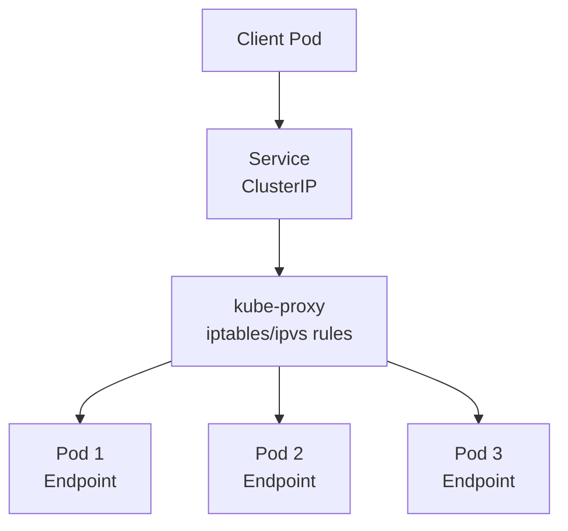
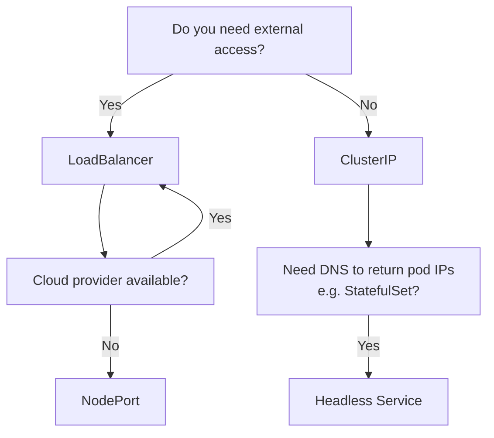

# Services

> **Category:** Networking

## What It Is

A **Service** is a logical abstraction over a set of Pods, providing a **stable endpoint** (IP + DNS name) that load-balances traffic to backend Pods. Services decouple the *where* (Pod IPs) from the *what* (stable name/IP).

## Why It Exists

Pods are **ephemeral** — they come and go:
- Pod IPs change on restart
- Pods are created/destroyed by Deployments
- No fixed address → hard for apps to find services

Services give you a **stable IP** (ClusterIP) and **virtual DNS name** that always routes to current healthy Pods.

## Architecture



## Service Types

| Type | Purpose |
|------|---------|
| `ClusterIP` | Internal cluster-only IP (default) |
| `NodePort` | Exposes Pod on each NodeIP:30000-32767 |
| `LoadBalancer` | Provisions external LB (cloud provider) |
| `ExternalName` | Maps Service to an external DNS (CNAME) |
| `Headless` | No virtual IP — returns Pod IPs directly |

### ClusterIP (default)

```yaml
apiVersion: v1
kind: Service
metadata:
  name: myapp-service
spec:
  type: ClusterIP      # Default — internal only
  selector:
    app: myapp
  ports:
  - port: 80           # Service port
    targetPort: 8080   # Pod port (target)
```

### NodePort

Exposes the Service on a static port on every NodeIP (`30000-32767`).

```yaml
apiVersion: v1
kind: Service
metadata:
  name: myapp-nodeport
spec:
  type: NodePort
  selector:
    app: myapp
  ports:
  - port: 80
    targetPort: 8080
    nodePort: 30080    # Optional — defaults to random in 30000-32767
```

### LoadBalancer

Provisions an external load balancer via the cloud provider. **Only works on cloud-managed clusters.**

```yaml
apiVersion: v1
kind: Service
metadata:
  name: myapp-lb
  annotations:
    service.beta.kubernetes.io/aws-load-balancer-type: "nlb"   # AWS example
spec:
  type: LoadBalancer
  selector:
    app: myapp
  ports:
  - port: 80
    targetPort: 8080
```

### ExternalName

Maps a Service to a DNS name (CNAME).

```yaml
apiVersion: v1
kind: Service
metadata:
  name: external-db
spec:
  type: ExternalName
  externalName: my-database.example.com
```

### Headless Service (`ClusterIP: None`)

No virtual IP or load-balancing — DNS resolves Pod IPs directly.

```yaml
apiVersion: v1
kind: Service
metadata:
  name: myapp-headless
spec:
  clusterIP: None       # Headless
  selector:
    app: myapp
  ports:
  - port: 80
    targetPort: 8080
# A records: <pod-name>.<svc>.<ns>.svc.cluster.local → Pod IP
```

## Service vs Headless vs Ingress

| Type | IP | DNS | Load Balancing | Use Case |
|------|----|-----|----------------|----------|
| `ClusterIP` | Virtual | One | ✅ Yes | Internal communication |
| `Headless` | Pod IPs | Many | ❌ No | Stateful apps (StatefulSets) |
| `NodePort` | NodeIP + port | Yes | ✅ Yes | Exposing outside (manual) |
| `LoadBalancer` | External VIP | Yes | ✅ Yes | Cloud-provisioned front door |
| `ExternalName` | None | CNAME | ❌ No | Proxy to external DNS |

## Service Discovery

### DNS

Services are reachable at:
```
<svc-name>.<ns>.svc.cluster.local   # Fully qualified
<svc-name>.<ns>.svc                  # Cluster-scoped
<svc-name>.<ns>                      # Namespace-scoped
<svc-name>                           # Namespace-scoped (intra-service)
```

```bash
# From a Pod:
nslookup myapp-service            # Resolves to ClusterIP
curl http://myapp-service:80
# Headless:
nslookup myapp-headless.service   # Returns multiple A records (Pod IPs)
```

## Endpoints

The set of Pods backing a Service is tracked in an `Endpoints` object:

```bash
kubectl get endpoints myapp-service
# Shows: 10.1.1.4:8080, 10.1.2.8:8080 ...
```

- The Service only routes to **Ready** endpoints
- Use `externalName` for external endpoints
- Pod labels must match the Service `selector` for inclusion

### No Selector (Manual Endpoints)

```yaml
apiVersion: v1
kind: Service
metadata:
  name: my-service
spec:
  ports:
    - port: 80
      targetPort: 80
---
apiVersion: v1
kind: Endpoints
metadata:
  name: my-service   # Must match the Service name
subsets:
  - addresses:
      - ip: 203.0.113.10   # External IP
    ports:
      - port: 80
        name: http
```

## kube-proxy

`kube-proxy` runs on each node and maintains the **iptables or IPVS** rules that make Services work.

### Modes

| Mode | Mechanism | Performance |
|------|-----------|-------------|
| `iptables` | `iptables` NAT rules | O(n) per lookup |
| `ipvs` | IPVS (in-kernel) | O(1) — hash |

```bash
# On a node:
iptables -t nat -L                 # See iptables rules (iptables mode)
ipvsadm -Ln                        # See IPVS rules (ipvs mode)
```

## Commands

```bash
# List
kubectl get svc
kubectl get svc -n <namespace>
kubectl get svc <name> -o wide     # Shows ClusterIP, ports, endpoints

# Describe (shows endpoints)
kubectl describe svc <name>

# Create
kubectl apply -f service.yaml
kubectl expose deployment myapp --port 80 --target-port 8080

# Delete
kubectl delete svc <name>

# Get endpoints
kubectl get endpoints <name>

# Port-forward (debug / temporary)
kubectl port-forward svc/myapp 8080:80
# Or for a pod:
kubectl port-forward pod/myapp 8080:8080

# View iptables/ipvs rules (on node)
iptables -t nat -L -n -v
ipvsadm -Ln
```

## Service Types Decision



## Common Issues

### `no endpoints` after creating a Service
```bash
kubectl get svc <name>,endpoints
# endpoints: <none>
# Fix: Service selector must match Pod labels
kubectl get pods --show-labels
# Or check for `no endpoints` in describe:
kubectl describe svc <name>
```

### LoadBalancer pending
```bash
kubectl get svc <lb-service>
# STATUS: <pending>
# Cause: no cloud-controller-manager (bare metal) or quota exceeded
# Bare metal: use MetalLB — https://metallb.unconfigure.io
kubectl apply -f https://raw.githubusercontent.com/metallb/metallb/.../manifests/Namespace.yaml
```

### NodePort not working externally
```bash
# Check: NodeIP:nodePort reachable from outside?
# Cause: Node firewall / cloud security group blocks port
# Fix: open port 30000-32767 in firewall/security group
```

### Service proxy `iptables`/`ipvs` not syncing
```bash
kubectl -n kube-system logs -l k8s-app=kube-proxy
# Check kube-proxy is Running
kubectl -n kube-system get pods -l k8s-app=kube-proxy
```

### Service not resolving (DNS)
```bash
# Inside a Pod:
nslookup myapp-service       # Does it resolve to ClusterIP?
# Is CoreDNS running?
kubectl -n kube-system get pods -l k8s-app=kube-dns
```

## Best Practices

1. **Always use Services** for intra-pod communication (even internal) — never use raw Pod IPs
2. **Use named ports** in Services/Pods for readability and stability
3. **Set `targetPort`** — explicit is better than relying on `port`
4. **Use `externalTrafficPolicy: Local`** — preserves client IP, but can cause uneven load
5. **Use `sessionAffinity`** only for sticky-session cases (breaks load balancing)
6. **Avoid `hostNetwork`** unless needed — bypasses Service entirely
7. **Headless Services** for StatefulSets — DNS returns Pod IPs, enabling peer discovery
8. **LoadBalancer + Internal** — use `service.beta.kubernetes.io/azure-load-balancer-internal: "true"` for internal-only LBs
9. **Don't overload Services** — max ~5000 endpoints per Service for iptables mode
10. **Use readiness probes** — so unhealthy pods are removed from endpoints

## Interview Questions

**Q: How does a Service route traffic to Pods?**
A: `kube-proxy` on each Node maintains iptables/ipvs rules. When traffic hits a Service's virtual IP, the rules redirect it to one healthy backend Pod (chosen by round-robin, hash, or other algorithm).

**Q: What is a ClusterIP?**
A: A virtual IP assigned to a Service by Kubernetes — only routable **within** the cluster. It's used as the service's address for internal pod-to-service communication.

**Q: What's the difference between a Service and Ingress?**
A: A Service operates at Layer 4 (TCP/UDP) and load-balances to pods. Ingress is Layer 7 (HTTP/HTTPS) — it's a set of routing rules (host/path) that an Ingress Controller fulfills. An Ingress usually routes to Services.

**Q: When do you use a Headless Service?**
A: For StatefulSets — DNS (SRV records) returns individual Pod IPs instead of a virtual IP. Pods get predictable names/DNS for peer discovery (e.g., database clusters).

**Q: What happens when I curl a NodePort from a node?**
A: `localhost:<nodePort>` — kube-proxy (or the host's rules) redirects to a backend Pod on *any* node (could be a Pod on a different node). `NodeIP:<nodePort>` works the same way.

## Related Resources

- [Networking Model](networking.md)
- [Ingress](ingress.md)
- [Network Policies](network-policies.md)
- [CoreDNS](coredns.md)
- [CNI Plugins](cni-plugins.md)